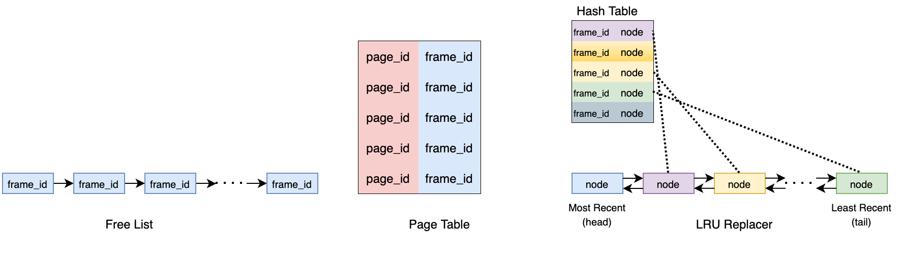

### Project 1 Buffer Pool

#### LRU Replacer

这个就是LeetCode LRU的升级版。更进一步地，需要考虑并发的情况。最简单的方案就是在每个函数前加上互斥锁(`std::mutex`)。


#### Buffer Pool Manager


这里的frame代表是内存中的存储(或者叫buffer pool page)，page代表数据库文件中的存储。

* Free List：空闲的frame
* Page Table: 缓存池，跟踪现在在内存中的存储，page与frame之间的映射
* LRU Replacer: 暂时没有用到的frame

另外DiskManager负责从数据库文件中读取某一个page的数据到frame，或者将内存中的frame写入到数据库文件中的page。


内存中的buffer pool page使用`Page`对象表示。每个`Page`对象包含元数据以及对应的数据库文件中的数据。bufferpoolmanager会重复使用这些page，也就是说这些page对象可以对应不同的数据库文件中的page。


参考 https://www.bilibili.com/read/cv5973395

##### FetchPage

```cpp
//Fetch the requested page from the buffer pool.
Page *FetchPageImpl(page_id_t page_id);
```

抓取某个数据库文件中的page到内存中的某个frame。如果page已经存在buffer pool中，则直接返回。否则去找内存中空闲的frame。如果还找不到，则去replacer中找一个最不常使用的。replacer中的frame很可能是脏的，在写入数据前，需要把frame中的数据写入到数据库文件中。因为replacer中原先是有数据的，对应一定的page，所以要把旧的page从buffer pool中移除。接下来就是把数据库中的对应page加载到找到的frame中，然后返回page。


##### NewPage

```cpp
// Creates a new page in the buffer pool.
Page *NewPageImpl(page_id_t *page_id);
```

在数据库文件中创建新的page，对应到内存中的frame中。首先肯定是从freelist和replacer中寻找可以使用的frame。因为是全新的page，所以先使用diskmanager分配一个page，当然既然是全新的，肯定要把frame清空。最后返回page。


##### UnpinPage

```cpp
// Unpin the target page from the buffer pool.
bool UnpinPageImpl(page_id_t page_id, bool is_dirty);
```

当某个page不再使用时，unpin这个page，并给出这个page是否修改过的信息。当然默认这个page应该是在缓存池当中的。如果这个page本来就没被使用，那么直接返回。如果被使用了，则对应的pinCount需要减1。然后检查pinCount是否已经等于0了(此时没被使用了)，如果是的话，则加入到lru replacer中。


##### FlushPage

```cpp
// Flushes the target page to disk.
bool FlushPageImpl(page_id_t page_id);
```

将某个page刷到磁盘中。首先检查page_id是有效的并且是加载在内存中的。随后将page中的数据写入到磁盘中


##### DeletePage

  ```cpp
   // Deletes a page from the buffer pool.
   // return false if the page exists but could not be deleted,
   // true if the page didn't exist or deletion succeeded
  bool DeletePageImpl(page_id_t page_id);
  ```

##### FlushAllPages

```cpp
  // Flushes all the pages in the buffer pool to disk.
  
  void FlushAllPagesImpl();
  ```
