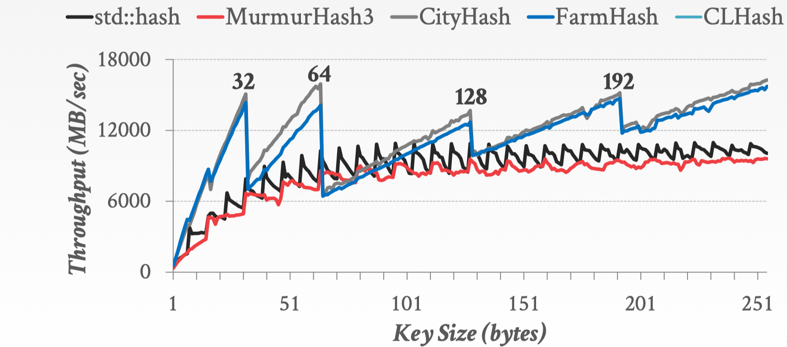
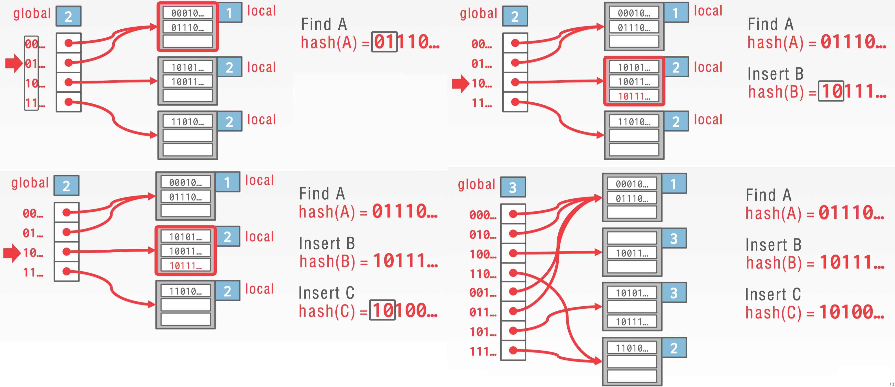
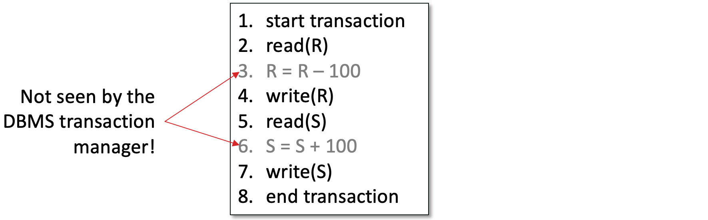
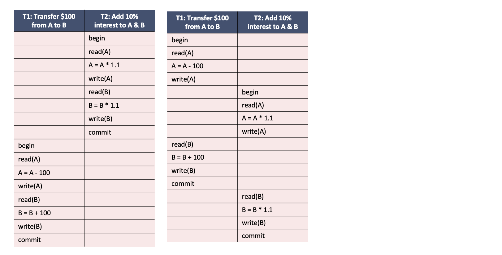

<!--### 1 Introduction


A `database-management system` (DBMS，数据库管理系统) is a collection of interrelated data and a set of programs to access those data.  The collection of data, usually referred to as the `database`. The primary goal of a DBMS is to provide a way to store and retrieve database information that is both `convenient` and `efficient`.

#### Purpose of Database System

Keeping organizational information in a file-processing system has a number of major disadvantages:

* Data redundancy and inconsistency
    * Users of one program may be unaware of potentially useful data held by other programs.
* Difficulty in accessing data
    * Programs are written to satisfy particular functions.  
    * Any new requirement needs a new program.
* Data isolation
    * Same data is held by different programs 
    * Each program maintains its own set of data
* Integrity problems
* Atomicity problems
* Concurrent-access anomalies
* Security problems

### View of data

##### Data Abstraction
The need for efficiency has led designers to use complex data structures to represent data in the database.

* `Physical level`. The lowest level of abstraction *how* the data are actually stored
* `Logical level`. The next-higher level of abstraction describes *what* data are stored in the database, and what relationships exist among those data. Each record is described by a type definition, and the interrelationship of these record types is defined as well.
* `View level`. The highest level of abstraction describes only part of the entire data. The system may provide many views for the same database. Computer users see a set of application programs that hide details of the data types.


##### Instances and Schemas

* `Instance`: the collection of information stored in the database at a particular moment
* `schema`: the overall design of the database.

Database systems have several schemas, partitioned according to the levels of abstraction. The `Physical schema` describes the database design at the physical level, while the `logical schema` describes the database design at the logical level.

Applications programs are said to exhibit `physical data independence` if they do not depend on the `physical schema`, and thus need not be rewritten if the physical schema changes.

###### Data Models

`Data Model`(数据库): a collection of conceptual tools for describing data, data relationships, data semantics, and consistency constraints.

* `Relational Model`(关系数据库)
* `Entity-Relationship Model` (实体对象模型)
* `Object-Based Data Model` (基于对象的数据模型)
* `Semistructed Data Model`

##### Database Language

A database system provides a `data-definition language`(DDL) to specify the database schema and a `data-manipulation language`(DML) to express database queries and updates.

##### Data Storage and Querying

A database system is partitioned into modules that deal with each of the responsibilities of the overall system. The functional components of a database system can be broadly divided into the `storage manager` and the `query processor`

The `storage manager` is the component of a database system that provides the interface between the low-level data stored in the database and the application programs and queries submitted to the system. it is responsible for storing, retrieving, and updating data in the database. The storage manager translates the various DML statement into low-level file-system commands.

The `query processor` includes:

* `DDL interpreter`, which interprets DDL statements and records the definitions in the data dictionary.
* `DML compiler`, which translates DML statements in a query language into an evaluation plan consisting of low-level instructions that the query evaluation engine understands.
* `Query evaluation engine`, which executes low-level instructions generated by the DML compiler.

####  Transaction management

`Transaction management` ensures that the database remains in a consistent (correct) state despite system failures. The transaction manager ensures that concurrent transaction executions proceed without conflicting.

#### Database Architecture

The architecture of a database system is greatly influenced by the underlying computer system on which the database system runs. Database system can be centralized, or client-server, where one server machine executes work on behalf of multiple client machines.


-->

### 0 Intro


A **database** is a large, organized collection of data.
A **database management system**(DBMS) is a software that *stores*, *manages*, and facilitates *access* to data.

Traditionally DBMS referred to relational databases: Oracle, SQL Server, PostgreSQL, SQLite.


[^1]


### 1 Architecture


#### Parsing & Optimization

Purpose: Parse, check, verify the SQL and translate SQL into an efficient relational query plan.


```sql
SELECT S.sid, S.sname, R.bid
FROM Sailors R, Reserves R
WHERE S.sid = R.sid and S.age > 30GROUP BY age
```


#### Relational Operators

Purpose: Execute a dataflow by operating on records and files


#### Files and Index Management

Purpose: Organize tables and  Records as groups of pages in a logical file


#### Buffer Management

Purpose: Provide the illusion of operating in memory


#### Disk Space Management

Purpose: Translate page requests into physical bytes on one or more device(s)


### 2 Data Storage Structures


#### Disk Space Management

* Lowest layer of DBMS, manages space on disk
* Purpose:
    * Map pages to locations on disk
    * Load pages from disk to memory
    * Save pages back to disk & ensuring writes
* Higher levels call upon this layer to:
    * Read/write a page
    * Allocate/de-allocate logical pages


Implementation

* Proposal 1: Take to the storage device directly
    * Could be very fast if you knew the device well
    * What happens when devices change?
* Proposal 2: **Run over filesystem**(FS)
    * Allocate single large "contiguous" file on a nice empty disk, and assume sequential/nearby byte access are fast
    * Most FS optimize disk layout for sequential access
    * DBMS “file” may span multiple FS files on multiple disks/machines


#### DATABASE FILES


Table: stored as logical files --> files: consisting of pages --> pages: consisting of records.


**DB FILE**: A collection of pages, each containing a collection of records.

There are two main types of database files: *Heap Files* and *Sorted Files*. The database chooses which file type to use for a relation based on the I/O cost associated with the relation’s access pattern. Other types of database files includes *Index Files* (B+ trees, Linear Hashing).


##### Heap Files

A **heap file** is a file type with no particular ordering of pages or records on pages and has two main implementations: Linked List Implementation, Page Directory Implementation.


In the **linked list** implementation, each ^^data page^^ contains *records*, a *free space tracker*, and *pointers* (byte offsets) to the next and previous page. There is one ^^header page^^ that serves as the start of the file and is used to separate the data pages into full pages and free pages. 

* When space is needed, empty pages are allocated and appended to the free pages portion of the list. 
* When free data pages becomes full, they are moved from the free space portion to the front of the full pages portion of the list. We move it to the front so we don’t have to traverse the entire list. 

In the **Page Directory** implementation, Each header page contains a pointer (byte offset) to the next header page along with entries that contain both a *pointer to a data page* and *information about the free space* within that page. Since data pages only store records, they no longer need to track pointers to neighboring pages.

The main advantage of Page Directories over Linked Lists is that ^^inserting records is often faster^^. Instead of performing I/Os to read each data page to determine whether there is enough space to insert, only header pages need to be read in order to make that decision.


##### Sorted Files

Problem: Searching for records within heap files requires a full scan every time. Every record on every page must be looked at because records are unordered, resulting in a linear cost of $N$ I/Os for every search operation.


A **sorted file** is a file type where pages are ordered and records on pages are sorted by key(s). These files are implemented using Page Directories and enforce an ordering upon data pages based on how records are sorted.

* Searching through sorted files takes $\log N$ I/Os where N = # of pages as binary search can be used to find the page containing the record. 
* Insertion, in the average case, takes $\log N + N$ I/Os as binary search is needed to find the page to write to and that inserted record could potentially cause all later records to be pushed back by one.

|                  | Heap File   | Sorted File       |
|------------------|-------------|-------------------|
| Scan all records | $B*D$         | $B*D$               |
| Equality Search  | $0.5*B*D$     | $(\log_2B)*D$         |
| Range Search     | $B*D$         | $((\log_2B)+\text{pages})*D$ |
| Insert           | $2*D$         | $((\log_2B)+B)*D$     |
| Delete           | $(0.5*B+1)*D$ | $((\log_2B)+B)*D$     |

* $B$: The number of data blocks
* $D$: Average time to read/write disk block

#### PAGE LAYOUT

Record types are completely determined by the relation’s schema and come in 2 types: 

* **Fixed Length Records**(FLRs): only contain fixed length fields (integer, boolean, date, etc.)
    * FLRs with the same schema consist of the same number of bytes.
* **Variable Length Records** (VLR): contain both fixed length and variable length fields (varchar), resulting in each VLR of the same schema having a potentially different number of bytes. 
    * store all fixed length fields before variable length fields
    * use a record header that contains pointers to the end of the variable length fields.


Options for page layouts depends on:

* Record length: fixed or variable
* Page packing: packed or unpacked


| Fixed Length Records, Packed | Fixed Length Records: Unpacked |
| --- | --- |
| Pack records densely | Bitmap denotes “slots” with records |
| Record id = (pageId, record number in page) | Record id = (pageId, record number in page) |
| Insert: just append | Insert: find first empty slot |
| Delete: re-arrange, pointers need to updated | Delete: Clear bit |


Variable Length Records:

* Introduce slot directory in footer: Pointer to free space, Length + Pointer to beginning of record(reverse order)
* Record ID: location in slot table (from right)
* Delete: set slot directory pointer to null
* Insert: 
    1. Place record in free space on page, 
    2. Create pointer/length pair in next open slot in slot directory, 
    3. Update the free space pointer


#### RECORD LAYOUT


#### System Catalogs

Catalog relations store information about relations, indexes and views. Catalogs are themselves stored as relation!

* For each relation:
    * name, file location, file structure (e.g., Heap file)
    * attribute name and type, for each attribute
    * index name, for each index
    * integrity constraints
* For each index: structure (e.g., B+ tree) and search key fields
* For each view: view name and definition
* Plus statistics, authorization, buffer pool size, etc


### 3 Indexing

An **index** is data structure that enables fast *lookup* and *modification* of *data entries* by *search key*.

* *Lookup*: may support many different operations, e.g. Equality, 1-d range, 2-d region
* *Search Key*: any subset of columns in the relation
* *Data Entries*: items stored in the index
* *Modification*: support fast insert and delete 

Many Types of indexes exist: B+Tree, Hash, R-Tree, GiST, ...


#### Hash Indexes

<!--The simplest possible indexing strategy is this:

* keep an in-memory hash map where every key is mapped to a byte offset in the data file - the location at which the value can be found.
* Insert: append a new key-value pair to the file, and update the hash map to reflect the offset of the data 
* Lookup: use the hash map to find the offset in the data file, seek to that location, and read the value
* Application: Bitcask(the default storage engine in Riak)


Pros and Cons:

* Pro: well suited to situations where the value for each key is updated frequently
* Cons: 
    * require all the keys fit in the available RAM
    * efficient range queries: have to look up every key


PROBLEM: what if eventually running out of disk space?

SOLUTION:

* break the log into segments of a certain size by closing a segment file when it reaches a certain size, and making subsequent writes to a new segment file
* perform *compaction* on these segments: throwing away duplicate keys in the log, and keeping only the most recent update for each key.
* *merge* several segments together at the same time as performing the compaction. After the merging process is complete, read requests are switched to new merged segment - and then the old segment files simply be deleted.


-->

A hash table implements an associative array abstract data type that maps keys to values. A hash table implementation is comprised of two parts:

* **Hash Function**: How to map a large key space into a smaller domain. This is used to compute an index into an array of buckets or slots. Need to consider the trade-off between fast execution vs. collision rate.
* **Hashing Scheme**: How to handle key collisions after hashing. Need to consider the trade-off between the need to allocate a large hash table to reduce collusions vs. executing additional instructions to find/insert keys.

##### hash function



##### hash scheme

STATIC HASHING SCHEMES

* Linear Probe Hashing: Resolve collisions by linearly searching for the next free slot in the table.
* Robin Hood Hashing: Variant of linear probe hashing that steals slots from "rich" keys and give them to "poor" keys.
* Cuckoo Hashing: Use multiple hash tables with different hash functions.

DYNAMIC HASHING SCHEMES

* Extendible Hashing
* Linear Hashing


##### Extendible Hashing



https://www.geeksforgeeks.org/extendible-hashing-dynamic-approach-to-dbms/

#### B+ Trees

B+tree is a B-tree that stores data entries in leaves.


<small>image: a node of an order d=2 tree</small>

A B+ tree is a search tree with the following properties:

* always balanced
* support efficient insertion & deletion: grows at root not leaves!
* occupancy invariant: Each interior node (with the exception of the root node) is at least partially full:
    * $d$ <= #entries($x$) <= $2d$
    * $d$ is order of a B+ tree(max fanout = 2$d$+1)
* The entries of the node must be sorted.
* The keys in the children to the left of an entry  $\lt$ entry
* The keys in the children to the right of an entry  $\ge$ entry
* Data pages at bottom need not be stored in logical order
    * Next and prev pointers

B+ Trees in Practice:

* Typical order: $d=1600$ 
* Typical fill-factor: 67%
* Average fan-out = 2144
* Typical capacities: Height 2: $2144^2$ = 9,855,401,984 records

##### Search


Find key

* Find split on each node (Binary Search)
* Follow pointer to next node

##### Insert

To insert an entry into the B+ tree:

1. Find the leaf node $L$ in which you will insert your value. You can do this by traversing down the tree. Add the key and the record to the leaf node in order.
2. If $L$ overflows ($L$ has more than 2$d$ entries)...
    * Split into $L_1$ and $L_2$. Keep $d$ entries in $L_1$  (this means $d + 1$ entries will go in $L_2$).
    * If L was a leaf node, COPY $L_2$ ’s first entry into the parent. If $L$ was not a leaf node, MOVE $L_2$ ’s first entry into the parent.
    * Adjust pointers.
3. If the parent overflows, then recurse on it by doing step 2 on the parent.

<video width="700" height="450" controls>
  <source src="../figures/b+tree_insert.mov" type="video/mp4">
Your browser does not support the video tag.
</video>

##### Deletion

In practice, occupancy invariant often not enforced. To delete a value, just find the appropriate leaf and delete the unwanted value from that leaf.

Reminder: We never delete inner node keys because they are only there for search and not to hold data.


##### Bulk loading

PROBLEM: Suppose we want to build an index on a large table,  Would it be efficient to just call insert repeatedly?


* Leaves and internal nodes mostly half-empty
* traverse the tree each time when insert --> new poor cache efficiency

SOLUTION: bulkloading 

1. Sort the data on the key the index will be built on.
2. Fill leaf pages until some fill factor $f$.
3. Add pointer from parent to leaf page. If the parent overflows, we will follow a procedure similar to insertion. We will split the parent into two nodes:
    * Keep d entries in $L_1$ (this means $d + 1$ entries will go in $L_2$ ).
    * Since a parent node overflowed, we will MOVE $L_2$ ’s first entry into the parent.
4. Adjust pointers.

<video width="700" height="450" controls>
  <source src="../figures/bulkloading.mov" type="video/mp4">
Your browser does not support the video tag.
</video>

##### Cost Model

|                  | Heap File | Sorted File | Clustered Index |
|------------------|-----------|-------------|-----------------|
| Scan all records | O(B)      | $O(B)$        | $O(B)$            |
| Equality Search  | O(B)      | $O(\log_2B)$    | $O(\log_FB$)        |
| Range Search     | O(B)      | $O(\log_2B)$    | $O(\log_FB$)        |
| Insert           | O(1)      | $O(B)$        | $O(\log_FB$)        |
| Delete           | O(B)      | $O(B)$        | $O(\log_FB$)        |

* B: The number of data blocks
* F: Average internal node fanout


#### Refinement of B+ Tree
##### Secondary Index

The leaf nodes for secondary indexes don’t store row data as the Primary Key B+Tree did, instead they simply store Primary Key values which serve as "pointers" to the row data[^8]:


This typically means when utilizing a secondary index, Database will first use the B+Tree of the secondary index to retrieve the Primary Key values of the applicable rows, and then after use these values in conjunction with the Primary Key B+Tree to fetch the row data!


##### Composite Keys

A **composite search key** on columns $(k_1, k_2, …, k_n)$ "matches" a query if:

* The query is a *conjunction* of $m >= 0$ equality clauses of the form:	$k_1 = <val_1>$ AND $k_2 = <val_2>$ AND .. AND $k_m = <val_m>$
* At most 1 additional *range* clause of the form: AND $k_{m+1}$ op <val>, where op is one of {$<, >$}

 Composite Keys: more than one column

##### Representation of data entries


Three basic alternatives for data entries in any index

* Alternative1: By Value: <key>
* Alternative2: By Reference: <key, rids of matching data record> (rid = record id)
* Alternative3: By List of references: <k, list of rids of matching data records>


By-reference Index (Alternative2,3) is required to support multiple indexes per table

* Otherwise we would be replicating entire tuples
* Replicating data leads to complexity when doing updates, so it’s something we want to avoid


##### Clustered vs. Unclustered Index

By-reference indexes (Alternative2,3) can be *clustered* or *unclustered*. 

**Clustered index**: Heap file records are kept mostly **ordered** according to *search keys* in index.

* Heap file order need not be perfect: this is just a performance hint
* To build a clustered index, first sort the heap file
    * Leave some free space on each block for future inserts
* Blocks at end of file may be needed for inserts
    * Order of data records is “close to”, but not identical to, the sort order
* Pros:
    * Efficient for range searches
    * Potential locality benefits
* Cons:
    * More expensive to maintain
        * Need to periodically update heap file order
        * Solution: on the fly or “lazily” via reorganizations
    * Heap file usually only packed to 2/3 to accommodate inserts


#### LSM Tree

History of LSM Tree[^5]:


The key idea of the **log-structured merge tree**(LSM tree, 日志结构合并树) is to replace random I/O operations with a smaller number of sequential I/O operations, by removing the need to perform dispersed, update-in-place operations.

A gulf exists between sequential/random I/Os, regardless of whether the disk is magnetic or solid state or even main memory[^2].
 
 


The simplest idea for large write throughput is to simply append data to a file(logging, journaling). But reading arbitrary data from a log will be far more time consuming than writing to it, involving a reverse chronological scan, until the required key is found[^2].

##### SSTable

> A **SSTable**(String Sorted Table, 排序字符串表) provides a **persistent**, **ordered** immutable map from keys to values, where both keys and values are arbitrary byte strings. Operations are provided to look up the value associated with a specified key, and to iterate over all key/value pairs in a specified key range. Internally, each SSTable contains a sequence of blocks (typically each block is 64KB in size, but this is configurable). A block index (stored at the end of the SSTable) is used to locate blocks; the index is loaded into memory when the SSTable is opened. A lookup can be performed with a single disk seek: we first find the appropriate block by *performing a binary search in the in-memory index*, and then reading the appropriate block from disk. Optionally, an SSTable can be completely mapped into memory, which allows us to perform lookups and scans without touching disk[^3].


##### Example: LevelDB

LevelDB Data Structures[^4]:

* Log file
* Memtable: in-memory sorted skiplists
* Immutable Memtable: in-memory sorted skiplists
* SSTable (file): The size of all files in each level is limited and increases by a factor of 10 with the level number.
* Manifest file: records smallest and largest key


* Insert: insert into memtable
* Delete: insert a delete marker to the memtable; delete value during compaction
* Lookup: memtable --> immutable memtable --> SSTables; using manifest file to locate all the overlapping SSTables.

**Compaction**

Minor Compaction: dump immutable into SSTable files.

Major Compaction: choose one file from $L_i$, merge sort with all the overlapped files of $L_{i+1}$, and generate new $L_{i+1}$ SSTable files. The Compaction continues until all levels are within their size limits. During compaction, LevelDB ensures that all files in a particular level(except $L_0$) do not overlap in their key ranges.


##### Write Amplification

Write and read amplification are major problems in LSM-trees such as LevelDB[^6]. Write (read) amplification is defined as the ratio between the amount of data written to (read from) the underlying storage device and the amount of data requested by the user.


### 4 Buffer Management

The **buffer manager** is responsible for managing pages in memory and receives page requests from the file and index manager. When pages are evicted from memory or new pages are read into memory, the buffer manager communicates with the disk space manager to perform the required disk operations.


#### Dirty Pages

Handling dirty pages

* How will the buffer manager find out? Dirty bit on page
* What to do with a dirty page? Write back via disk manager

Memory is converted into a buffer pool by partitioning the space into **frames** that pages can be placed in. A buffer frame can hold the same amount of data as a page can (so a page fits perfectly into a frame). To efficiently track frames, the buffer manager allocates additional space in memory for a metadata table.

Buffer Manager metadata: Smallish array in memory, malloc’ed at DBMS server boot time


When a Page is Requested:

* If requested page is not in pool:
    * Choose an un-pinned (pin_count = 0) frame for replacement.
    * If frame “dirty”, write current page to disk, mark “clean”
    * Read requested page into frame
* Pin the page and return its address

After Requestor Finishes:

* Requestor of page must:
    * set dirty bit if page was modified
    * unpin the page (preferably soon!) 
* Page in pool may be requested many times
    * a pin count is used.
    * To pin a page: pin_count++
    * A page is a candidate for replacement iff pin_count == 0 (“unpinned”)
* CC & recovery may do additional I/Os upon replacement
    * Write Ahead Log protocol; more later!


#### Page Replacement Policy 

Page is chosen for replacement by a replacement policy:

* Least-recently-used (LRU)
* Most-recently-used (MRU)


### 5  Relational Algebra


* SQL: A declarative expression of the query result
    * Declarative: Say ^^what^^ you want, not ^^how^^ to get it

* Relational Algebra(关系代数): Operational description of a computation.
    * Algebra on sets
    * Systems execute relational algebra query plan.

!!! note "Logical v.s. Physical Plan"

    * Relational algebra expression is also called the "logical query plan"
    * A physical query plan is a logical query plan annotated with physical implementation details

#### Codd’s Theorem


Established equivalence in expressivity between:

* Relational Calculus (Basis for SQL)
* Relational Algebra (Algebra on sets)

--> we can compile SQL into relational algebra


#### Operators

Binary Operators: on pairs of relations

* Union($\cup$): Tuples in r1 or in r2.
* Set-difference($-$): Tuples in r1, but not in r2.
* Cross-product($\times$): Allows us to combine two relations.

Compound Operators: common "macros" for the above

* Intersection($\cap$): Tuples in r1 and r2.
* Joins($\Join_{\theta}, \Join$): Combine relations that satisfy predicates


##### Projection

Projection($\pi$)

* Corresponds to the SELECT list in SQL
* Schema determined by schema of attribute list


##### Selection

Selection($\sigma$)

* Corresponds to the WHERE clause in SQL
* Output schema same as input
* Duplicate Elimination? Not needed
* Selects a subset of rows (horizontal)


##### Union

Union($\cup$)

* Corresponds to UNION in SQL
* Two input relations, must be *compatible*:
    * Same number of fields
    * Fields in corresponding positions have same type


##### Set Difference

Set Difference ($−$)

* SQL Expression: EXCEPT
* Same as with union, both input relations must be compatible.


##### Cross-Product

Cross-Product ($\times$)

* $R1 \times S1$: Each row of $R1$ paired with each row of $S1$


##### Renaming

Renaming ($\rho$)

* Renames relations and their attributes:
* Note that relational algebra doesn’t require names. 


##### Intersection

Compound Operator: Intersection ($\cap$)

* Same as with union, both input relations must be compatible.
* SQL Expression: INTERSECT


##### Join

Compound Operator: Join($\Join$), generally, $\sigma_\theta (R\times S)$

Hierarchy of common kinds:

Theta Join($\Join_\theta$): join on logical expression $\theta$<br/>
  Equi-Join: theta join with theta being a conjunction<br/>
    Natural Join($\theta$): equi-join on all matching column names <br/>

Theta Join($\Join_\theta$):


Natural Join($\theta$): Special case of equi-join in which equalities are specified for all matching fields and duplicate fields are projected away 

$$R\Join S = \pi_{\text{unique fld.}}\sigma_{\text{eq. matching fld.}}(R\times S)$$

* Compute $R \times S$
* Select rows where fields appearing in both relations have equal values
* Project onto the set of all unique fields.

##### Group By / Aggregation Operator 

Group By / Aggregation Operator ($\gamma$):

* $\gamma_{\text{age,AVG(rating)}}$(Sailors)
* With selection (HAVING clause):
    * $\gamma_{\text{age,AVG(rating), COUNT(*)>2}}$(Sailors)


### 6 Query Processing && Optimization


The basic steps of processing a query are:

1. Parsing and translation
2. Optimization
    * Each SQL query can itself be translated into a relational-algebra expression in one of several ways.
    * Each relational-algebra operation can be executed by one of several different algorithms.
3. Evaluation
    * materialized evaluation: the results of each intermediate operation are created (materialized) and then are used for evaluation of the next-level operations
    * pipelined evaluation: combining several relational operations into a pipeline of operations, in which the results of one operation are passed along to the next operation in the pipeline

#### Measures of Query Cost

There are multiple possible evaluation plans for a query, and it is important to be able to compare the alternatives in terms of their (estimated) cost, and choose the best plan. The cost of query evaluation can be measured in terms of a number of different resources, including disk accesses, CPU time to execute a query, and, in parallel and distributed database systems, the cost of communication.

* large databases reside on magnetic disk: I/O cost (mainly)
* databases reside in-memory or on SSD: CPU cost (mainly) + I/O cost

<!--#### Selection-->


#### External Sort

Problem: sort 100GB of data with 1GB of RAM.

All of the traditional sorting algorithms (i.e. quick sort, insertion sort, etc.) rely on us being able to store all of the data in memory. This is a luxury we do not have when developing a database. In fact, most of the time our d*ata will be an order of magnitude larger than the memory* available to us.

##### Two-Way External Merge Sort

1. conquer: two lists sorted first.
2. sorted runs: merging the pages together using the merge algorithm from merge sort.

The rest of the algorithm will simply be to continue merging these sorted runs until we have only one sorted run remaining.


Analysis:

* $\lceil \log_2(N)\rceil$ merging passes
* $1 + \lceil \log_2(N)  \rceil$ passes in total
* each pass over the data: $2 * N$ I/Os (read, write back after modifying)
* final: $2 N *(1 + \lceil \log_2(N)  \rceil)$ I/Os


##### Full External Sort

Compared to Two-Way External Merge Sort, Full External Sort:

* Rather than just sorting individual pages, load $B$ pages and sort them all at once.
* Merge more than 2 sorted runs together at a time.


To sort a file with $N$ pages using $B$ buffer pages:

* Pass 0: use $B$ buffer pages. Produce $\lceil N/B\rceil$ sorted runs of $B$ pages each.
* Pass 1,2,...,etc.: merge $B-1$ runs at a time.

[:fontawesome-regular-file-code: ](https://github.com/techlarry/berkeley-cs186-database-sp20/blob/master/src/main/java/edu/berkeley/cs186/database/query/SortOperator.java)


Cost of External Merge Sort:

* Number of passes: $1+\lceil \log_{B-1} \lceil N/B\rceil \rceil$
* Cost = $2 N \times$ (# of passes)

Memory Requirement for External Sorting

* Each "sorted run" after Phase 0 is of size $B$
* Can merge up to $B-1$ sorted runs in Phase 1
* Sort $N$ pages of data in about $B=\sqrt{N}$ space
* Memory Usage: $B(B-1)$


#### External Hashing

External hashing:

1. Streaming Partition (divide): Use a hash function $h_p$ to stream records to disk partitions
    * All matches rendezvous in the same partition.
    * Each partition a mix of values
    * Streaming alg to create partitions on disk: 
        * “Spill” partitions to disk via output buffers
2. ReHash (conquer): 
    * Read partitions into RAM hash table one at a time, using hash fucntion $h_r$
    * Each bucket contains a small number of distinct values
    * Then read out the RAM hash table buckets and write to disk
    * Ensuring that duplicate values are contiguous


Memory Requirement

* $B-1$ "partitions" result from Pass 1
* Each should be no more than B pages in size
* Memory Requirement: $B(B-1)$
* Hash $N$ pages of data in about $B=\sqrt{N}$ space

#### Iterators


Each operator instance:

* Implements iterator interface
* Efficiently executes operator logic forwarding tuples to next operator


The relational operators implemented as subclasses of the class Iterator:

```java
abstract class iterator {    // Invoked when “wiring” dataflow
 	void setup(List<Iterator> inputs);
	void init(args); // Invoked before calling next
	tuple next(); // Invoked repeatedly
	void close(); // Invoked when finished
}
```


#### Joins
##### simple nested loop join

**Simple nested loop join** (SNLJ): take each record in $R$, search for all its matches in $S$, and then write each match to disk.

[:fontawesome-regular-file-code: ](https://github.com/techlarry/berkeley-cs186-database-sp20/blob/master/src/main/java/edu/berkeley/cs186/database/query/SNLJOperator.java)

for each record $r_i$ in $R$: </br>
  for each record $s_j$ in $S$: </br>
    if $\theta(r_i, s_j)$:</br>
      yield $<r_i, s_j>$</br>


I/O Cost: $[R] + |R|[S]$

* $[R]$: the number of pages in $R$
* $|R|$: the number of records in $R$

##### page nested loop join

page nested loop join (PNLJ): for a page of $R$, take all the records and match them against each record in $S$, and do this for every page of $R$.


for each page $p_r$ in $R$: </br>
  for each page $p_s$ in $S$: </br>
    for each record $r_i$ in $p_r$: </br>
      for each record $s_j$ in $p_s$: </br>
        if $\theta(r_i, s_j)$:</br>
          yield $<r_i, s_j>$</br>


I/O Cost: $[R] + [R][S]$

##### blocked nested loop join

block nested loop join: utilize $B$ buffer  to reduce the I/O cost, for each chunk of $R$, match all the records in $S$ against all the records in the chunk.

for each block of $B-2$ pages $B_r$ in $R$: </br>
  for each page $p_s$ in $S$: </br>
    for each record $r_i$ in $B_r$: </br>
      for each record $s_j$ in $p_s$: </br>
        if $\theta(r_i, s_j)$:  </br>
          yield $<r_i, s_j>$ </br>


I/O Cost: $[R] + \frac{|R|}{|B|-2}[S]$

[:fontawesome-regular-file-code: ](https://github.com/techlarry/berkeley-cs186-database-sp20/blob/master/src/main/java/edu/berkeley/cs186/database/query/BNLJOperator.java)


##### Index Nested Loop Join

index nested loop join: look up matches of $r_i$ in $S$ by an index on $S$ 


for each record $r_i$ in $R$: </br>
  for each record $s_j$ in $S$ where $\theta(r_i, s_j)$ == true:</br>
    yield $<r_i, s_j>$</br>

##### Sort-Merge Join


<video width="700" height="450" controls>
  <source src="../figures/sort-merge-join.mp4" type="video/mp4">
Your browser does not support the video tag.
</video>


[:fontawesome-regular-file-code: ](https://github.com/techlarry/berkeley-cs186-database-sp20/blob/master/src/main/java/edu/berkeley/cs186/database/query/SortMergeOperator.java)

=== "Sort Merge Join"

    ```java
    full-external-sort(R)
    full-external-sort(S)
    do {
        if (!mark) {
            while (r < s) { advance r }
            while (r > s) { advance s }
            // mark start of “block” of S
            mark = s
        }
        if (r == s) {
            result = <r, s>
            advance s
            return result
        }
        else {
            reset s to mark
            advance r
            mark = NULL
        }
    }
    ```
    
    
##### Naive Hash Join

Naive Hash Join:

* construct a hash table that is $B-2$ pages big on the records of $R$, fit it into memory
* read in each record of $S$ and look it up in R’s hash table to see if we can find any matches on it. 


Cost: 

* I/Os: $[R] + [S]$
* Memory requirements: $R < B - 2$ (Impossible)

[:fontawesome-regular-file-code: ](https://github.com/techlarry/berkeley-cs186-database-sp20/blob/master/src/main/java/edu/berkeley/cs186/database/query/NaiveHashJoin.java)

##### Grace Hash Join

Problem: tables for hash join don't fit in memory --> Grace Hash Join:

* *repeatedly* hash $R$ and $S$ into $B-1$ buffers so that fit them into memory 
* load *smaller* partition into memory and perform a Naive Hash Join


[:fontawesome-regular-file-code: ](https://github.com/techlarry/berkeley-cs186-database-sp20/blob/master/src/main/java/edu/berkeley/cs186/database/query/GraceHashJoin.java)

```python
# partitioning phase (divide)
for Cur in {R, S}
    for page in Cur
        Read page into input buffer
        for tup on page
            Place tup in output buf hashp(tup.joinkey)
            if output buf full then flush to disk partition
    Flush output bufs to disk partitions
# build & probe phase (conquer)
for i in [0..(B-1))
    for page in Ri
        for tup on page
            Build tup into memory hashr(tup.joinkey)
    for page in Si
        Read page into input buffer
        for tup on page
            Probe memory hashr(tup.joinkey) for matches
            Send all matches to output buffer
            Flush output buffer if full
```


Cost:

* partitioning phase: read + write both relations --> $2([R] + [S])$ I/Os
* matching phase: read both relations, forward output --> $[R] + [S]$ I/Os
* total cost of 2-pass hash join --> $3([R] + [S])$ I/Os
* memory requirement: $R < B^2$, no constraint on size of $S$


#### Query Optimization Overview


Query Parsing & Optimization:


Query parser

* Checks correctness, authorization
* Generates a parse tree
* Straightforward

Query rewriter

* Converts queries to canonical form
    * flatten views
    * subqueries into fewer query blocks
* weak spot in many open-source DBMSs


"Cost-based" Query Optimizer

* Optimizes 1 query block at a time
    * Select, Project, Join
    * GroupBy/Agg
    * Order By
* Uses catalog stats to find least-"cost" plan per query block
* "Soft underbelly" of every DBMS
    * Sometimes not truly "optimal"


Three beautifully orthogonal concerns for query optimization:

* Plan space:  for a given query, what plans are considered?
* Cost estimation: how is the cost of a plan estimated?
* Search strategy:  how do we “search” in the “plan space”?

Optimization goal:

* Ideally: Find the plan with least actual cost.
* Reality: Find the plan with least estimated cost.


#### Plan Space

#### Parallel Query Processing


### 7 DB Design
### 8 Transaction

**Transaction** is A sequence of multiple actions to be executed as an atomic unit. Transaction Manager controls execution of transactions. The DBMS only sees data read/written from/to the DB.

Transaction to transfer $100 from account R to account S:



ACID: High-Level Properties of Transactions

* Atomicity: All actions in the Transaction happen, or none happen.
* Consistency: If the DB starts out consistent, it ends up consistent at the end of the Transaction
* Isolation: Execution of each Transaction is isolated from that of others
* Durability: If a Transaction commits, its effects persist.

#### Concurrency Control

A **schedule**(调度) is a sequence of actions on data from one or more transactions. 

* Actions: Begin, Read, Write, Commit and Abort. 
* e.g. R1(A) W1(A) R1(B) W1(B) R2(A) W2(A) R2(B) W2(B)


**Serial schedule**(串行调度): Each transaction runs from start to finish without any intervening actions from other transactions

2 schedules are **equivalent** if they:

* They involve the same transactions
* Operations are ordered the same way within the individual transactions
* both schedules leave the DB in the same final state

Definition: Schedule S is **serializable**(可串行化) if S is equivalent to some serial schedule.

!!! example "Serialiable"
    
    * Schedule 1: T1's operations run completely before T2 runs, hence a serial schedule
    * Schedule 2: actions of T1 and T2 are interleaved, hence not a serial schedule, but the result is the same, and operations are ordered the same way within T1 and T2 for two schedule. So two schedule are equivalent, and schedule 2 is serialiable

    


Now the question is: how do we ensure that two schedules leave the database in the same final state without running through the entire schedule to see what the result is? We can do this by looking for confiliting operations.

Definition: Two operations conflict if they:

* Are by different transactions,
* Are on the same object,
* At least one of them is a write.


The order of non-conflicting operations has no effect on the final state of the database!

Definition: Two schedules are **conflict equivalent** if:

* They involve the same actions of the same transactions, and
* Every pair of conflicting actions is ordered the same way

Definition: Schedule S is **conflict serializable**(冲突可串行化调度) if:

* S is conflict equivalent to some serial schedule
* Implies S is also Serializable


A schedule S is conflict serializable if

* You are able to transform S into a serial schedule by swapping consecutive non-conflicting operations of different transactions

Theorem: Schedule is conflict serializable if and only if its dependency graph is acyclic.

#### Two Phase Locking

For around 30 years, there was only one widely used algorithm for serializability in databases: **two-phase locking** (2PL, 两阶段锁)：each transaction issue lock and unlock requests in two phases:

1. Growing phase: A transaction may obtain locks, but may not release any lock.
2. Shrinking phase: A transaction may release locks, but may not obtain any new locks.


Initially, a transaction is in the growing phase. The transaction acquires locks as needed. Once the transaction releases a lock, it enters the shrinking phase, and it can issue no more lock requests.

* The most common scheme for enforcing conflict serializability.
* Transaction must obtain a S (shared) lock before reading, and an X (exclusive) lock before writing.
* Transaction cannot get new locks after releasing any locks.

##### Strict two phase locking

PROBLEM: Cascading rollback may occur under two-phase locking: failure of $T_5$ after the `read(A)` step of $T_7$ leads to cascading rollback(级联回滚) of $T_6$ and $T_7$.


SOLUTION: **Strict Two Phase Locking**: Same as 2PL, except all locks released together when transaction completes.

Which schedules does Strict 2PL allow? (pink area in the figure below)


##### Predicate locks

**Predicate lock**(谓词锁) works similarly to the shared/exclusive lock, but rather than belonging to a particular object (e.g., one row in a table), it belongs to all objects that *match some search condition*, such as:

```sql
SELECT * FROM bookings
    WHERE room_id = 123 AND
        end_time > '2018-01-01 12:00' AND
        start_time < '2018-01-01 13:00';
```

* If transaction A wants to read objects matching some condition, like in that SELECT query, it must acquire a shared-mode predicate lock on the conditions of the query. If another transaction B currently has an exclusive lock on any object matching those conditions, A must wait until B releases its lock before it is allowed to make its query.
* If transaction A wants to insert, update, or delete any object, it must first check whether either the old or the new value matches any existing predicate lock. If there is a matching predicate lock held by transaction B, then A must wait until B has committed or aborted before it can continue.

Predicate locking is rarely used in practice since it is more expensive to implement than the index-locking protocol and does not give significant additional benefits.

##### Next-Key Locking

Most databases with 2PL implement **next-key locking**(间隙锁, also index-range locking, 索引区间锁): a simplified approximation of predicate locking.

!!! example "MySQL"
    MySQL uses Next Key locks which consist of index lock on *matching records* and *gap* that precedes the index.
    
    


#### Lock Management

Lock Manager keeps an entry for each currently held lock, Entry contains

* Granted set: Set of transactions currently granted access to the lock
* Lock mode: Type of lock held (shared or exclusive)
* Wait Queue: Queue of lock requests


#### Lock Granularity

In addition to S and X lock modes, there are three additional lock modes with multiple granularity:

* intention-shared (IS): indicates explicit locking at a lower level of the tree but only with shared locks.
* intention-exclusive (IX): indicates explicit locking at a lower level with exclusive or shared locks
* shared and intention-exclusive (SIX): the subtree rooted by that node is locked explicitly in shared mode and explicit locking is being done at a lower level with exclusive-mode locks.

Intention locks allow a higher level node to be locked in S or X mode without having to check all descendent nodes.


!!! note "SIX"
    When you are reading data you take a shared lock on the row (or page depending on the database system and table configuration). Many users can hold a shared lock on the same row - hence ‘shared’. If you might be updating that row (say you added the FOR UPDATE clause to your SELECT statement) then the lock on the currently fetched row is an ‘intent exclusive’ shared lock because you “intend” to acquire an exclusive lock on the same entity if you decide to update it. [^9]


### 9 Recovery

#### Steal/No-force

* Force policy: when a transaction finish, force all modified data pages to disk before the transaction commits.
* No-Force policy: write back to disk when the page needs to be evicted from the buffer pool.
* No-steal policy: pages cannot be evicted from memory (and thus written to disk) until the transaction commits.
* Steal policy: allows modified pages to be written to disk before a transaction finished.

Preferred Policy: Steal/No-Force


#### Log

A **log** is a sequence of log records that describe the operations that the database has done. Each write operation (SQL insert/delete/update) will get its own log UPDATE record. An UPDATE log record looks like this:

<XID, pageID, offset, length, old data, new data>

* XID(transaction ID): tells us which transaction did this operation
* pageID: what page has been modified
* offset: where on the page the data started changing
* length: how much data was changed
* old data: what the data was originally (used for undo operations)
* new data: what the data has been updated to (used for redo operations)

Some other record types are:

* COMMIT: signifies that a transaction is starting the commit process
* ABORT: signifies that a transaction is starting the aborting process
* END: signifies that a transaction is finished (usually means that it finished committing or aborting)
* CLRs(Compensation Log Records): logs the UNDOs
* CHECKPOINT

##### WAL

**Write Ahead Logging**(WAL)

* Atomicity: Log records must be on disk before the data page gets written to disk.
* Durability: All log records must be written to disk when a transaction commits.

Each log record has a unique and increasing **Log Sequence Number**(LSN). 
 
* Each data page contains a **pageLSN**: the LSN of the most recent log record that updated that page
* System keeps track of **flushedLSN**: max LSN flushed to stable storage.


[^10]


Before page $i$ is flushed to DB, log must satisfy: 

* pageLSN$_i\le$ flushedLSN


##### ARIES Logging


* **prevLSN** is the LSN of the previous log record written by this XID
So records of an transactions form a linked list backwards in time
* **Dirty Page Table**: One entry per dirty page currently in buffer pool.
    * recLSN: LSN of the log record which *first* caused the page to be dirty.
* **Transaction Table**: one entry per currently active transaction,
    * contains transaction ID, Status(running, committing, aborting), lastLSN(most recent LSN written by transaction)
    


Normal Execution[^10]:


* Update transaction table on transaction start/end
* For each update:
    * Create log record with LSN $l$= ++MaxLSN and prevLSN=XTable[XID].lastLSN
    * Update XTable[XID].lastLSN= $l$
    * If modified page not in dirty page table, add it with recLSN = $l$
* If the buffer manager steals a dirty page, remove its entry from the dirty page table

Transaction Commit[^10]:

* Write COMMIT record to log
* Flush the log tail up to transaction's commit to disk
* Remove entry from the XTable
* Write END record to log

Transaction Abort (no crash)[^10]:

* Write ABORT log record before starting rollback
* Play back” undoing all updates
    * Get lastLSN of Xact from the TransTable
    * Follow chain of log records via prevLSN
    * For each update encountered
        * Write a CLR for each undone operation with undoNextLSN = prevLSN of record being undone 
        * Undo the operation (using the before-image of the log record)
* Remove entry from the TransTable
* Write END record to log

#### Checkpoint

Periodically, the DBMS creates a **checkpoint** to minimize recovery time after crash.  Write to log:

* begin_checkpoint record:  indicates when checkpoint began.
* end_checkpoint record: contains current transactions table, dirty page table

A "fuzzy checkpoint": Other transactions continue to run; So all we know is that these tables are after the time of the begin_checkpoint record. Store LSN of the most recent checkpoint record in a safe place 
(master record, often block 0 of the log file).

#### Crash Recovery


* Start from a checkpoint - found via master record.
* Three phases.  Need to do:
    * Analysis - Figure out which transactions committed since checkpoint, which failed.
    * REDO all actions. (repeat history)
    * UNDO failed Xacts


### 10 Distributed Transactions

#### 2-Phase Commit(2PC)

* Phase 1: “do you take this man/woman...”
    * Coordinator tells participants to “prepare”
    * Participants respond with yes/no votes
    * Unanimity required for yes!
* Phase 2: “I now pronounce you...”
    * Coordinator disseminates result of the vote
    * Participants respond with Ack


1. Given an operation (i.e. PUT or DELETE), the leader (a.k.a. the global coordinator) will use a PREPARE phase where it asks every follower if it agrees to the operation.
2. Each of the followers can respond with a vote, which is either COMMIT (yes) or ABORT (no). The leader blocks until it has received a vote from every follower. If a follower does not respond within a timeout, the leader automatically assumes that the follower votes ABORT.
3. When the leader has received the vote from every follower, it will enter the COMMIT phase and send either a global COMMIT (if every follower voted to commit) or a global ABORT (if even a single follower voted no) to all of the followers.
4. The followers then execute the global command and respond with an ACK to acknowledge to the leader that it has completed the operation.
5. Only after the leader has received an ACK from every follower does it consider the operation complete and becomes available to handle the next command. If a follower does not respond within a timeout, the leader retransmits the global command until it does.

Two phase commit is implemented as a state machine, where communications between the leader and the followers result in state transitions[^11].

State diagram for a 2PC Leader:


State diagram for a 2PC Follower:


[^1]: https://db-engines.com/en/ranking
[^2]: http://www.benstopford.com/2015/02/14/log-structured-merge-trees/
[^3]: http://static.googleusercontent.com/media/research.google.com/en//archive/bigtable-osdi06.pdf
[^4]: https://slideplayer.com/slide/16490495/
[^5]: https://www.slideshare.net/ssuser7e134a/log-structured-merge-tree
[^6]: https://dl.acm.org/doi/10.1145/3033273
[^7]: Designing Data-Intensive Applications, Martin Kleppmann
[^8]: https://medium.com/@stormanning/mysql-indexing-101-660f3193dde1
[^9]: https://www.quora.com/What-is-shared-and-intention-exclusive-lock-in-database-Is-it-share-plus-intention-exclusive-lock-What-s-its-usage
[^10]: https://courses.cs.washington.edu/courses/cse444/11wi/lectures/lecture11-12.pdf
[^11]: https://cs162.eecs.berkeley.edu/static/hw/hw6.pdf