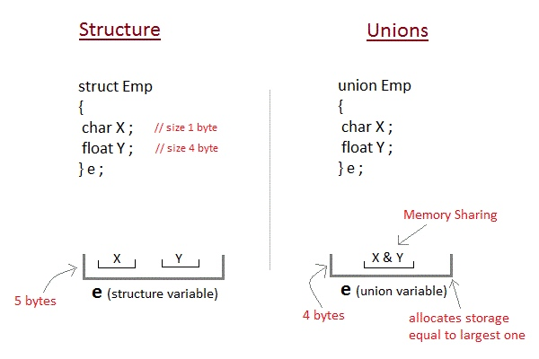
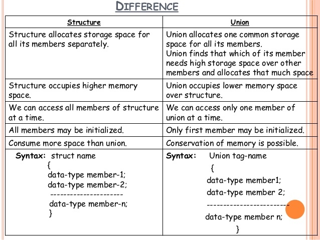
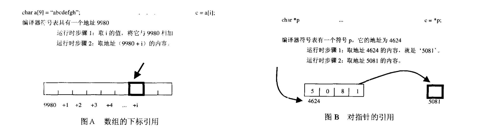
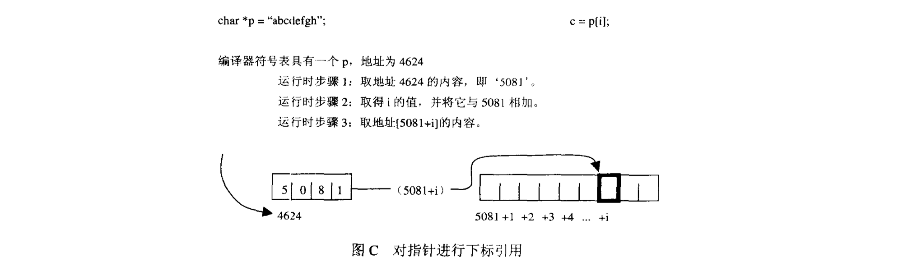

### 0 基础

#### struct和union

`struct`中所有变量是"共存"的，可以保存每一个变量；`union`中各变量是"互斥"的，分配的内存大小取决于所有变量中占据最大内存的那个变量。所以`union`的内存使用更加精细灵活。

https://splearnings.weebly.com/structure--union-difference-in-c.html






例如你需要表示一个数`Value`，可以是多个类型`ValueType`中的一种，其对应的值`as`可以是`bool`, 也可以是`double`。使用`union`有效的节省了内存。

```c
typedef struct {
    ValueType type;
    union {
        bool boolean;
        double number;
    } as;
} Value;
```


#### 位域

在结构体内声明位域(Bit fields)的形式如下：

```c
struct {
     type [member_name]: width;
}
```

| 元素 | 描述 |
| --- | --- |
| type | 只能为int，unsigned int，signed int三种类型 |
| member_name | 位域的名称。 |
| width | 位域中位的数量。宽度必须小于或等于指定类型的位宽度。 |

```cpp
 struct Disk_Register {
  unsigned int  ready:1 ;         // 1 bit field named "ready"
  unsigned int  error:1 ;         // 1 bit field named "error"
  unsigned int  wr_prot:1 ;    
  unsigned int  dsk_spinning:1 ;  
  unsigned int  command:4 ;       // 4 bits field named "command"
  unsigned int  error_code:8 ;
  unsigned int  sector_no:16 ;
};

int main( int argc, char* argv[]) {
  struct Disk_Register  r;
  printf( "sizeof(r) = %d\n", sizeof(r) );    // 4 bytes (32 bits)
  int* p = (int *) &r;      // Access r as in int through pointer p       
  *p = 0;                   // Clear all 32 bits in r !
  r.error = 1;              // Set the error bit (bit #30)    
  printBits( *p );          // Call the printBits() function
  putchar('\n');

  r.dsk_spinning = 1;       // Set the dsk_spinning bit (bit #28)
  printBits( *p );          // Call the printBits() function
  putchar('\n');
}
```


[^2]

#### NULL, '\0'

`NULL`是一个宏，在`stddef.h`中定义为

```
# define NULL ((void*)0)
```

NULL表示一个null指针(null pointer)。null指针其实就是字面量0。因此确认一个null指针有以下方法：

```c
if (!pointer)
if (pointer == NULL)
if (pointer == 0)
```

`\0`被定义为null字符(null character)或者null terminator，用来表示一个字符串的结束。可以用以下方式确认一个字符串指针是否指向null字符。

```c
if (*string_pointer)
```

除此之外，`\0`被视为等同于整数常量`0`。也就是说以下两种定义是等价的：

```c
char a = 0;
char b = '\0';
```

null字符在使用字符串初始化字符数组时会自动添加到末尾, 以下定义的`sizeof str`是6(包含了null字符)，`strlen(str)`是5(不包含)。

```c
// 以下方式等价
char str[] = "hello";
char str[6] = {'h', 'e', 'l', 'l', 'o', '\0'};
```


### 1 指针和数组


在C语言中，指针和数组非常相似，但是它们并不相同。对数组的引用总是可以写成对指针的引用，但这只是数组的一种极为普通的用法，并非所有情况下都是如此。例如下面的使用方法就是一个典型的错误[^1]：

```c
//file1.c
int mango[100];

// file2.c
extern int *mango;
```

编译器为每个变量分配一个地址，每个符号的地址在编译时可知。所以，对于数组，可以直接进行操作，并不需要增加指令首先取得具体的地址。相反，对于指针，必须首先在运行时取得它当前值(需要增加一次额外的提取)，然后才能对它进行解除引用操作。



对指针进行下标引用时，其实质上是图A和图B访问方式的组合：

1. 取得符号表中p的地址，提取存储于此处的指针。
2. 把下标所表示的偏移量与指针的值相加，产生一个地址。
3. 访问上面这个地址，取得字符。




| 指针 | 数组 |
| --- | --- |
| 保存数组的地址 | 保存数据 |
| 间接访问数据，首先取得指针的内容，把它作为地址，然后从这个地址提取数据。如果指针有一个下标[I]，就把指针的内容加上I作为地址，从中提取数据 | 直接访问数据，a[I]只是简单地以a+I为地址取得数据 |
| 通常用于动态数据结构 | 通常用于存储固定数据且数据类型相同的元素 |
| 相关的函数为`malloc()`, `free()` | 隐式分配和删除 |
| 通常指向匿名数据 | 自身即为数据名 |


```c
char* argv[10];
char buf[20];
argv[0] = buf;
```


什么时候数组和指针是相同的[^1]：

1. 表达式中的数组名就是指针
2. 数组下标作为指针的偏移量
3. 作为函数参数的数组名等同于指针


```c
int a[10], *p, i = 2;
// 表达式中的数组名
p = a;
// 数组下标作为偏移量
for (int i = 0; i < 10; i++) {
  // 以下等价
  p[i] = 0;
  *(p + i) = 0;
}
// 作为函数参数的数组名
// 以下等价
my_function(int *turnip);
my_function(int turnip[]);
my_function(int turnip[200]);
```

### 2 static

#### 静态局部变量

局部变量使用`static`关键字修饰后成为静态局部变量。函数内定义的普通局部变量存放在堆栈空间内。而静态局部变量存放在数据段[链接](7 链接.md)中，其生命周期和程序一样长，当定义该变量的函数退出时，该变量的值依然能保持。当该函数下一次进入时，该值依然有效。静态局部变量即使在声明时未赋值，编译器也会把它自动初始化为0。


```c
void fn(void) {
    int n = 10; // 普通局部变量
    printf("n=%d\n", n);
    n++;
}

void fn_static(void) {
    static int n = 10;  // 静态局部变量
    printf("n=%d\n", n);
    n++;
}


int main() {
    fn(); // 10
    fn(); // 10
    fn_static(); // 10
    fn_static(); // 11
}
```

#### 静态函数

在普通函数的返回类型前加上`static`关键字，即为静态函数。其特性为：

* 静态函数只能在声明它的文件中可见，其他文件不能引用该函数
* 不同的文件可以使用相同名字的静态函数，互不影响

```c
// main.c
static void fun(void) {
    printf("hello from fun.\n");
}

extern void genericFun();
extern void staticFun();

int main() {
    fun();
    genericFun();
    staticFun(); // Undefined symbols _staticFun
}

// file2.c
static void staticFun(void) {
    printf("hello from static staticFun.\n");
}

void genericFun(void) {
    printf("hello from genericFun.\n");
}
```

所以只用于本文件的函数全部使用`static`关键字声明，这是一个良好的编码风格。

### 3 动态内存分配


#### malloc/free

C函数库提供了两个基本函数`malloc`和`free`分别用于执行动态内存分配和释放[^2]。

```c
void* malloc(size_t size);
void free(void *pointer);
```

`malloc`函数从内存池中提取一块**连续**的、**未初始化**的内存，并返回一个指向这块内存的指针。`malloc`的参数就是需要分配的内存字节数。如果操作系统无法向`malloc`提供给定的内存，`malloc`就返回一个NULL指针。`malloc`并不知道所请求的内存是存储何种数据(整数、浮点、结构等)，所以它返回一个`void *`类型的指针。

`free`函数的参数要么是NULL(没有任何效果)，要么是先前从`malloc`, `calloc`或`realloc`返回的值。

#### calloc/realloc

```c
void* calloc(size_t num_elements, size_t element_size);
void* realloc(void* ptr, size_t new_size);
```


`calloc`和`malloc`之间的主要区别是`calloc`在返回指向内存的指针之前把它初始化为0.

`realloc`函数用于修改一个原先已经分配的内存块的大小。

* 如果它用于扩大一个内存块，那么这块内存原先的内容依然保留，新增加的内存添加到原先内存块的后面，新内存并未以任何方式进行初始化。
    * 如果内存空间不够，将分配另一块正确大小的内存，并把原来那块内存的内容复制到新的块上，并返回新的指向新内存的指针。
* 如果它用于缩小一个内存块，该内存块尾部的部分内存便被拿掉，剩余部分内存的原先内容依然保留。


[^1]: Expert C Programming, Peter Van Der Linden, 1994.
[^2]: Pointers on C, Kenneth A. Reek,
[^3]: http://www.mathcs.emory.edu/~cheung/Courses/255/Syllabus/2-C-adv-data/bit-field.html
