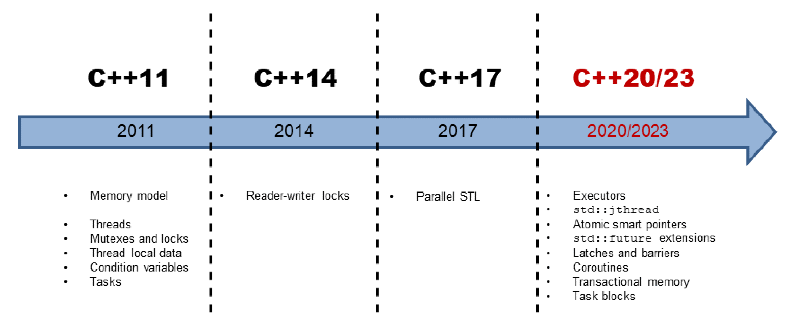

### 0 基础
#### struct/class

在C++中，`struct`和`class`基本相同，除了两点：

* 默认继承权限：`class`默认的是`private`，`struct`默认的是`public`
* 默认访问权限：`class`默认的是`private`，`struct`默认的是`public`

#### this

`this`属于关键字，是一个`const`指针。它指向当前对象，通过它可以访问当前对象的所有成员。

#### explicit

关键字`explicit`主要是用来修饰类的构造函数，被修饰的构造函数的类，不能发生相应的隐式类型转换，只能以显式的方式进行类型转换。当构造函数只有一个参数时，会自动的进行隐式转换。

例如调用`f(10)`时，会自动把`10`隐式转换成`String(10)`。如果不希望这种隐式转换，那么在构造函数之前加上`explict`关键字即可。这个时候调用`f(10)`，编译器就会提示`error: no matching function for call to 'f'`, 必须使用`f(String(10))`才可以。

```cpp
class String{
private:
    const char * s_;
public:
    String(int n) {
        printf("constructor String(int n)\n");
        s_ = std::to_string(n).c_str();
    };
};
static void f(String s) {}
int main() {
    f(10); // constructor String(int n)
    f('a'); // constructor String(int n)
    String s = 10;  // constructor String(int n)
}
```

#### const


`const`可以修饰一般常量，数组以及指针和引用[^4][^5]：

```cpp
const int a = 10;
const int array[3] = {1,2,3};

char str[]="hello world";
char *p1(str);              // 指向非常量的非常量指针   指向数据：非常量 指针：非常量
const char *p2(str);        // 指向常量的非常量指针     指向数据：常量 指针：非常量
char const *p3(str);        // 指向常量的非常量指针     指向数据：常量 指针：非常量
char * const p4(str);       // 指向非常量的常量指针     指向数据：非常量 指针：常量
const char * const p5(str); // 指向常量的常量指针       指向数据：常量 指针：常量、

const int &c = a;
```

`const`关键字放在类型说明符前后是等价的(例如`const int a = 10`和`int const a = 10`等价)。如果`const`位于`*`的左侧，则`const`就是用来修饰指针所指向的变量，即指针指向为常量；如果`const`位于`*`的右侧，`const`就是修饰指针本身，即指针本身是常量。

`const`还可以修饰函数，函数的参数和返回值可以是`const`，分别表示参数是不变的，返回值不能赋值。

```cpp
void fun(const A* a) // 指针内容不能改变
void fun(const A& a) // 引用对象不能改变

const Rational operator+(const Operator& a, const Operator& b);
Rational a, b, c;
(a * b) = c; // 错误
```


如果是非静态成员函数后加`const`，表示在该成员函数中，任何修改它所在的类的成员的操作都是不允许的。


```cpp
char St::getData() const {
    return this->letter;
}
```

也

`const`可以定义常量对象，它只能调用`const`修饰的成员函数。

```cpp
class Obj {
public:
    Obj(int x):c_(x){}
    void set(int x) { c_ = x;}
    int get() const{
        return c_;
    }
private:
    int c_;
};

const Obj obj(1); // 定义一个常量对象
obj.set(4); // error
obj.get();
```


#### 引用


```cpp
type &name = data;
```

引用可以看作是变量的别名，这个别名和原来的变量名都指向相同的数据。引用本身不是一种数据类型，不占任何内存。引用必须在定义的同时初始化，并且以后也要从一而终，不能再引用其它数据，这有点类似于`const`变量。

引用常常用于函数参数传递，具有以下特点：

1. 传递引用给函数与传递指针的效果是一样的。这时，被调函数的形参就成为原来主调函数中的实参变量或对象的一个别名来使用，所以在被调函数中对形参变量的操作就是对其相应的目标对象（在主调函数中）的操作。
2. 用引用传递函数的参数，在内存中并没有产生实参的副本，它是直接对实参操作；而使用一般变量传递函数的参数，当发生函数调用时，需要给形参分配存储单元，形参变量是实参变量的副本；如果传递的是对象，还将调用拷贝构造函数。因此，当参数传递的数据较大时，用引用比用一般变量传递参数的效率和所占空间都好。
3. 使用指针作为函数的参数虽然也能达到与使用引用的效果，但是，在被调函数中同样要给形参分配存储单元，且需要重复使用"*指针变量名"的形式进行运算，这很容易产生错误且程序的阅读性较差；另一方面，在主调函数的调用点处，必须用变量的地址作为实参。而引用更容易使用，更清晰。

 程序在编译时分别将指 针和引用添加到符号表上，符号表上记录的是变量名及变量所对应地址。指针变量在符号表上对应的地址值为指针变量的地址值，而引用在符号表上对应的地址值为 引用对象的地址值。符号表生成后就不会再改，因此指针可以改变其指向的对象（指针变量中的值可以改），而引用对象则不能修改。


进一步： https://blog.csdn.net/weikangc/article/details/49762929

#### 整型提升

> A character, a short integer, or an integer bit-field, all either signed or not, or an object of enumeration type, may be used in an expression wherever an integer may be used. If an int can represent all the values of the original type, then the value is converted to int; otherwise the value is converted to unsigned int. This process is called integral promotion. [^3]

#### 内联函数


```cpp
inline int functionName(int first, int second,...);
```

内联函数在编译时，编译器会在调用内联函数的地方直接把内联函数展开，省去了函数的调用开销。但如果内联函数过大，编译器会把这个函数转换成普通函数而不展开。

内联函数可以起到宏的效果，但具有真正的函数特性，所以比宏多了类型检查、自动类型转换。

#### 虚函数

C++多态(polymorphism)是通过虚函数(virtual function)来实现的，虚函数允许子类重新定义成员函数。 使用虚函数的方法是在普通成员函数前加上`virtual`关键字。除此之外，继承关系中必须有同名的虚函数，并且他们是覆盖(`override`)关系(函数原型相同)。

当调用虚函数时，基类指针可以调用基类对象的成员函数，也可以调用派生类对象的成员函数。

基类的析构函数往往是虚函数，否则派生类的析构函数不用用到，造成内存泄漏。

纯虚函数把函数的实现交给子类。使用方法是在虚函数后加`=0`: `virtual int A() = 0;`。带有纯虚函数的类称为抽象类，不能生成对象。

每个含有虚函数的类(不是每一个对象都拥有)有一张虚函数表(virtual table)，表中的每一项是一个虚函数的地址。虚函数表的指针占4个字节大小，存在于对象实例中最前面的位置。我们通过对象实例的地址得到这张虚函数表，然后就可以遍历其中的函数指针，并调用相应的函数。


虚函数表详解： https://www.cnblogs.com/zhxmdefj/p/11594459.html


#### 拷贝构造函数

**拷贝构造函数**(copy constructor)用途是将其它对象的数据来初始化新对象的内存。下面几个表达式都用到了拷贝构造函数：

```cpp
string s1 = "http://c.biancheng.net";
string s2(s1);
string s3 = s1;
s2 = s1; // 没有用到拷贝构造函数，而是用到了拷贝赋值运算符(=), 因为这里对象已经完成初始化，是对象的赋值
```

如果一个类没有定义拷贝构造函数，那么编译器会生成一个默认的拷贝构造函数：它将老对象的成员变量对新对象的成员变量一一赋值。但是，当类中持有动态分配的内存、指向其他数据的指针时，默认的拷贝构造函数就不适用了。

例如，定义一个变长数组类，其中包含指向数组的一个指针。如果不使用拷贝构造函数，那么生成的默认拷贝构造函数会使得两个类都指向相同的内存地址，即同一个数组。这显然不是我们想要的。正确的方法是，自定义一个拷贝构造函数，在函数中分配新的内存并拷贝所有数组元素。

```cpp
//变长数组类
class Array {
public:
    explicit Array(int len) : m_len(len) {
        m_p = (int *) calloc(len, sizeof(int));
    }

    Array(const Array &arr) {  //拷贝构造函数
        this->m_len = arr.m_len;
        this->m_p = static_cast<int *>(calloc(this->m_len, sizeof(int)));
        memcpy(this->m_p, arr.m_p, m_len * sizeof(int));
    }
    ~Array() {
        free(m_p);
    }
public:
    int operator[](int i) const { return m_p[i]; }  //获取元素（读取）
    int &operator[](int i) { return m_p[i]; }       //获取元素（写入）
    int length() const { return m_len; }
private:
    int m_len;
    int *m_p;
};
```


#### 拷贝赋值运算符

https://en.cppreference.com/w/cpp/language/copy_assignment

当给一个对象赋值时，会调用该对象所属类的拷贝赋值运算符。当没有显示地提供时，编译器会自动生成一个默认的拷贝赋值运算符。

```cpp
class_name & class_name :: operator= ( class_name )
```

注意，下面的这个例子，虽然重载了赋值运算符，但是并没有提供拷贝赋值运算符，所以编译器还是会自动生成一个默认的。

```cpp
class Data {
private:
    char* data_;
public:
    Data() {printf("default constructor\n"); }
    Data(const char* data) {
        printf("constructor (%s)\n", data);
        data_ =  new char[strlen(data) + 1];
        strcpy(data_, data);
    }
    Data &operator=(const char* data) {
        printf("assignment operator=\n");
        free(data_);
        data_ = new char[strlen(data) + 1];
        strcpy(data_, data);
        return *this;
    }
    const char* get() {
        return data_;
    }

    ~Data() {
        free(data_);
    }
};
int main() {
    Data data1("I");  // constructor (I)
    Data data2, data3; // default constructor, default constructor
    data2 = "love"; // assignment operator=
    data2 = data2; // nothing
    return 0;
}
```

默认的拷贝赋值运算符只是简单的拷贝指针，并不会重新分配内存(浅拷贝)。


一般地，需要注意几点：

* 拷贝赋值运算符的参数是该类的`const`引用, 因为我们不希望对赋值的"原值"做任何修改;
* 返回值是被赋值者的引用，即`this*`，可以避免返回时的拷贝，并且可以支持连续赋值(类似`a=b=c`);
* 避免自赋值：赋值之前，检查一下是不是自己给自己赋值。因为如果类的成员变量含有指针$p$，在赋值之前需要释放掉该指针指向的内存空间以防止内存泄漏，然后再将赋值者的指针$p_1$指向的内容拷贝到$p$所指的空间。但是如果是自赋值$p=p_1$，$p$指向的内存空间释放后，赋值给$p$的内容就是空的。

```cpp
Data &operator=(const Data& another) {
    printf("assignment operator = Data\n");
    if (this == &another) { return *this; } // 避免自赋值
    free(data_);  // 避免内存泄漏
    data_ = new char[strlen(another.data_) + 1];
    strcpy(data_, another.data_);
    return *this;
}

```


#### 模版

在C++中，模版分为函数模版和类模版两种。函数模版(Function Template)使用一个虚拟的类型来代替所用到的类型，等函数被调用时，再根据传入的实参来推导出真正的类型。

```cpp
template<typename T> void Swap(T *a, T *b){
    T temp = *a;
    *a = *b;
    *b = temp;
}
```

`template`是定义函数模板的关键字，它后面紧跟尖括号`<>`，尖括号包围的是类型参数（也可以说是虚拟的类型，或者说是类型占位符）。`typename`是另外一个关键字，用来声明具体的类型参数，这里的类型参数就是`T`。

与函数模版类似，类模版(Class Template)可以用在类声明和类实现中。

```cpp
template<typename T1, typename T2> class Point {
public:
  Point(T1 x, T2 y): m_x(x), m_y(y) {}
  ...
}

```


#### 值类别
https://www.cnblogs.com/zpcdbky/p/5275959.html

在C++11以后，表达式可以属于:

* 左值(left value, lvalue):  能够用`&`取地址的表达式，例如函数名、变量名、前置自增运算符连接的表达式(++i/--i)、解引用表达式(*p),
* 纯右值(pure right value, pralue)：
    * 字面值，例如`5`，`3.5`，`false`
    * 求值结果相当于字面值或是一个不具名的临时对象，例如`2+5`, 取地址表达式`&a`(当于`unsigned int`型的字面值)
* 将亡值(expiring value, xvalue):
    * 返回右值引用的函数调用表达式: 例如`std::move(val)`
    * cast为右值引用的表达式: `static_cast<T&&>(val)`, `(T&&)val`

在C++11之前，右值和纯右值是等价的。之后，右值是纯右值和将亡值的统称。当右值完成初始化或赋值时，它的资源已经移动给了被初始化者或者被赋值者，同时该右值也将会马上被销毁，所以该右值已经"将亡"了，取名为"将亡值"。

https://zhuanlan.zhihu.com/p/55229582

#### cast

```cpp
static_cast< new_type >(expression)
dynamic_cast< new_type >(expression)
```


`static_cast`相当于传统的C语言里的强制转换，该运算符把expression转换为new_type类型，属于编译时类型检查，没有运行时类型检查来保证转换的安全性。它主要有如下几种用法：

* 基本数据类型之间的转换：把`int`转换为`char`，这种转换的安全性需要开发者自己保证，如果把`int`转换为`char`时，如果char没有足够的比特位来存放`int`的值(int>127或者int<-127)时，那么`static_cast`所做的只是简单的截断，把int的低8位复制到char的8位中，并直接抛弃高位
* 空指针转换成目标类型的空指针
* 任何类型的表达式类型转换成`void`类型
* 父类和子类之间指针和引用的转换。上行转换(upcast, 子类到父类)是安全的，因为子类总是包含父类的所有数据成员和函数成员。下行转换(downcast, 父类到子类)是不安全的，因为`static_cast`并没有运行时的类型检查。


`dynamic_cast`主要用于父类和子类之间指针和引用的转换，可以保证下行转换的安全性，如果转换失败，则返回NULL，而不是抛出错误。https://en.cppreference.com/w/cpp/language/dynamic_cast


#### containers

https://en.cppreference.com/w/cpp/container
https://blog.csdn.net/y109y/article/details/82669620

### 1 C++11 新特性

#### for range

```cpp
// 遍历字符串
std::string str = "hello world!";
for (auto ch : str) { std::cout << ch; }
std::cout << std::endl;
// 遍历数组
int arr[] = {1,2,3};
for (auto i : arr) { std::cout << i << ","; }
std::cout << std::endl;
// 遍历stl容器
std::vector<std::string> str_vec = {"i", "like", "cpp"};
for (const auto& it : str_vec) { std::cout << it << " "; }
std::cout << std::endl;
// 遍历map容器
std::unordered_map<int, std::string> map = {{1,"me"}, {2,"like"}, {3,"cpp"}};
for (const auto& it : map) { std::cout << it.second << " "; }
```
#### 类型推导

C++ 11提供了`atuo`和`decltype`自动推导类型。

当不想写出或者忘记完整类型的时候，使用`auto`非常方便。由于`auto`实际上是在编译时对变量进行了类型推导，所以并不会影响程序的运行效率。

```cpp
for (vector<int>::const_iterator it = v.begin(); it != v.end(); ++it);
for (auto it = v.begin(); it != v.end(); ++it);
```

#### lambda表达式

lambda表达式是匿名函数，语法规则为 `[外部变量格式](参数区){函数体};`。

`[外部变量格式]`指明了lambda函数的函数体中可以使用哪些变量。这一块的规则为

|  外部变量格式 |  功能 |
| --- | --- |
|
|  [] |  空方括号表示当前lambda匿名函数中不导入任何外部变量。 |
|  [=] |  只有一个 = 等号，表示以值传递的方式导入所有外部变量； |
|  [&] |  只有一个 & 符号，表示以引用传递的方式导入所有外部变量； |
|  [val1,val2,...] |  表示以值传递的方式导入 val1、val2 等指定的外部变量，同时多个变量之间没有先后次序； |
|  [&val1,&val2,...] |  表示以引用传递的方式导入 val1、val2等指定的外部变量，多个变量之间没有前后次序； |
|  [val,&val2,...] |  以上 2 种方式还可以混合使用，变量之间没有前后次序。 |
|  [=,&val1,...] |  表示除 val1 以引用传递的方式导入外，其它外部变量都以值传递的方式导入。 |
|  [this] |  表示以值传递的方式导入当前的 this 指针。 |

```cpp
int num[4] = {4, 2, 3, 1};
//对 a 数组中的元素进行排序
std::sort(num, num+4, [](int x, int y) -> bool{ return x < y; } );
for(int n : num) std::cout << n << " ";
```

#### nullptr

在C++和C中， NULL的规定是不同的。对于C++来说，NULL就是整数0。

```c
#define NULL 0 // C++
#define NULL ((void *) 0) // C
```

但是C++支持函数重载，考虑下面这种情况，`foo(NULL)`会调用`foo(int i)`，但是C++又有`void *`的隐式类型转换，那么到底该调用哪一个函数呢？编译器会给出`call to 'foo' is ambiguous`的错误。

```cpp
// 考虑下面两个重载函数  
void foo(int i);  
void foo(char* p)  
foo(NULL); // 调用哪一个？？
```

`nullptr`消除了这个问题，它总是一个指针，只能赋值给一个指针。

```cpp
char *str = NULL; // Implicit conversion from void * to char *
int i = NULL;     // OK, but `i` is not pointer type

char *str = nullptr;  // nullptr
int i = nullptr; // error - not an integer convertible value
```
#### noexcept

关键字`noexcept`紧跟在函数的参数的参数列表后面，用以标识该函数不会抛出异常。声明`noexcept`之后，如果函数抛出异常，则直接直接调用`std::terminate()`函数终止程序的运行，不会抛出异常信息。

```cpp
void recoup(int) noexcept;  // 不会抛出异常
void alloc(int);            // 可能会抛出异常
```


`noexcept`函数不需要记录exception handler，所以编译器可以生成更高效的二进制码。`noexcept`经常使用在移动构造函数和移动赋值函数中。因为在移动构造或者移动赋值函数中发生异常，非常难恢复回去，所以不能抛出异常。

#### enum

C++11之前的`enum`并不是类型安全的，因为它会自动转换成`int`或者`unsigned int`。

```cpp
enum colorA { redA, };
enum colorB {redB, };
void test(int data) {
    std::cout << "test called" << std::endl;
}
int main() {
    colorA ca(redA);
    colorB cb(redB);

    bool res(ca < cb); //OK
    test(ca); //OK
    return 0;
}
```

除此之外，`enum`还存在以下问题：

* 无法定义同名的枚举成员
* 不能指定底层所使用的数据类型

C++11提供了`enum class`，很好的解决了以上问题。

```cpp
enum class color {red, green, yellow, cyan};
enum class shape: unsigned char {circle, rectangle, triangle}; // 指定数据类型
enum class favoriteColor {red, pink, orange}; // 可以定义重名的成员

int usage_enum_class() {
    color c(color::red);
}
```


#### lock

C++11提供了`std::lock_guard`, `std::unique_lock`, 其使用了RAII(Resource Acquisition Is Initialization，资源获取即初始化)机制。

`lock_guard`简化了`std::mutex`的使用：在其生命周期内，它管理的锁一直保持上锁；生命周期之后，它管理的锁会自动释放。主要是为了防止忘记释放锁后造成的死锁现象。

`unique_lock`比`lock_guard`提供更多的功能：`lock`, `try_lock`, `try_lock_for`，但同时会牺牲一些性能。并且在生命周期之后，也会自动释放锁。

```cpp
for (int i = 0; i < 1000; i++) {
    // lock_guard<mutex> guard(my_mutex);   // 构造时自动lock
    unique_lock<mutex> my_lock(my_mutex);   // 构造时自动lock
    ilst.push_back(i);
    my_lock.unlock();   //在生命周期结束前提前unlock,为其他线程执行争取时间
    cout << "加入数据：" << i << endl;
    my_lock.lock();     //在需要时又重新上锁
    //do something with my_mutex
}  //生命周期结束，自动在析构函数中unlock
```

#### 移动语义

移动语义解决的是对象的资源所有权问题。C++11之前，为了实现对资源的移动操作，往往需要定义一个拷贝赋值函数：释放原来的内存，分配新内存，拷贝资源；或定义一个拷贝构造函数：分配新内存，拷贝资源。

```cpp
class String {
public:
    // 构造函数
    explicit String(const char *cstr) {
        m_data = new char[strlen(cstr) + 1];
        strcpy(m_data, cstr);
    }

    // 拷贝构造函数
    String(const String &str) {
        m_data = new char[strlen(str.m_data) + 1];
        strcpy(m_data, str.m_data);
    }

    // 拷贝赋值函数重载
    String &operator=(const String &str) {
        if (this == &str) { return *this; }// 避免自我赋值!!
        delete[] m_data;
        m_data = new char[strlen(str.m_data) + 1];
        strcpy(m_data, str.m_data);
        return *this;
    }

    // 析构函数
    ~String() {
        delete[] m_data;
    }
}
int main() {
    String c("c"); // constructor(c)
    String c = String("d") // constructor(d), Assignment Operator(d), destructor(d)
}
```

大多数情况下，右值都是可以被安全的移动的。也就是说，左值中的指针可以直接指向右值中指针指向的内存，省去了分配新内存的过程。要实现移动语义，需要在类中增加移动构造函数(move constructor)和移动赋值构造函数(move assignment constructor)。注意，一般要在移动构造和移动赋值函数的参数列表后面加`noexcept`关键字。需要重视的是，千万不要忘了，把右值的指针设置为`nullptr`，不然右值在析构的时候，由于左值和右值指向的内存一致，会把左值指向的内存释放了。   

```cpp
class String {
public:
    ...
    // 移动构造函数
    String(String &&str) noexcept: m_data(str.m_data)  {
       str.m_data = nullptr; // 不再指向之前的资源了
    }

    // 移动赋值函数重载
    String& operator=(String &&str) noexcept {
        if (this == &str) { return *this;  } // 避免自我赋值!!
        delete[] m_data;
        m_data = str.m_data;
        str.m_data = nullptr; // 不再指向之前的资源了
        return *this;
    }
}
```

这样，右值就可以直接移动。也可以使用`std::move`将参数转换成右值引用。

```cpp
std::vector<String> a;      
a.emplace_back(String("a")); // constructor(a), move constructor(a)
String c("c"), d("d");       // constructor(c), constructor(c)
d = std::move(c);            // Move Assignment Operator (c to d)
d = String("d");             // Move Assignment Operator (d to c)
```

#### thread_local

`thread_local`关键字修饰的变量具有线程周期(thread duration)，在线程开始的时候被分配(allocated)，在线程结束的时候被销毁(deallocated)。下面这些变量可以被声明为`thread_local`:

* 命名空间下的全局变量
* 类的`static`成员变量
* 本地变量


```cpp
thread_local int x; // a thread-local variable at namespace scope
class X {
    static thread_local std::strings s; // a thread-local static class data member
}
static thread_local std::string X::s;  // the definition of X::s is required

void foo() {
    thread_local std::vector<int> v;   // a thread-local local variable
}
```

#### constexpr

`constexpr`修饰的变量或函数在编译期就可以计算出来，当然有个前提是它的依赖也是在编译期可以计算出来的。

```cpp
constexpr int foo(int i) { return i + 5; }
int main() {
    int i = 10;
    std::array<int, foo(5)> arr; // ok
    foo(i);   // ok
    std::array<int, foo(i)> arr1; // error
}
```

例如`foo(i)`中的`i`是普通变量，就不能在编译期计算出来。如果`i`定义为`constexpr int i = 10`，那么`std::array<int, foo(i)> arr1`就是正确的。

`const`关键字一方面有「常量」语义，另一方面也有「只读」语义[^6]。

```cpp
template<int N> class C{};

constexpr int FivePlus(int x) { return 5 + x; }

void f(const int x) {
    C<x> c1; // Error: x is not compile-time evaluable.
    C<FivePlus(6)> c2; // OK
}

void g() {
    const int x = 5;
    C<x> c1; // OK!!! 此处用x的「常量」语义
    *(int *)(&x) = 6; // Still OK! 只处用x的「只读」语义，去除const后可写
    C<x> c2; // Still OK! c2是C<5>类型（不是C<6>！）
    C<FivePlus(x)> c3; // Still OK! c3是C<10>类型（不是C<11>！）

    printf("%d\n", x); // 此处绝大多数（所有？）C++编译器会输出5！！
                       // （然而，如果用一个C编译器来编译类似代码，一定输出6）
    const int* p = &x;
    printf("%d\n", *p); // 此处，大多数C++编译器输出6
}
```

可以看到，f和g都有一个`const int x`，但它们的行为却不同。原因在于：f 的`const int x`只是「一个只读的变量」；而 g 的`const int x`既是「一个只读的变量」，又是「一个值为5的常量」，变得飘忽不定。在C++11以后，建议凡是「常量」语义的场景都使用`constexpr`，只对「只读」语义使用`const`。

#### 可变参数模板

可变参数模板(variadic templates)可以接收任意数量的模板参数。

```cpp
// 定义
template<typename ...T> class Tuple {};
// 可以用任意数量的类型来实例化Tuple
Tuple<> t0;
Tuple<int> t1;
Tuple<int, std::string> t2;
// 定义
template<typename ...T> void f(T...args);
```

上面的参数`args`前面有省略号，所以他就是一个可变模板参数，也称为参数包，因为它包含了多个模板参数。我们无法直接获取参数包`args`中的每个参数的，只能通过展开参数包的方式来获取参数包中的每个参数。

```cpp
template <class ...T> void f(T... args) {
    cout << sizeof...(args) << endl;
f(); // 0
f(1,2); //2
f(1, 2.4, ""); //3
```
https://www.cnblogs.com/qicosmos/p/4325949.html


[..to be continued]

### 2 动态内存分配

#### new/delete

C++可以直接通过`new`和`delete`来直接管理内存。 不用`new`也可以生成对象，对象自动分配空间在栈上，函数结束后自动释放空间。相对应的，使用`new`生成的对象保存在堆上，使用完后需要手动释放空间。

* `new`：分配空间，并返回一个指向该对象的指针
* `delete`：销毁对象，释放关联的内存


下面使用`new`和`delete`来演示二维数组的内存分配和释放。

```cpp
int row = 4;
int col = 4;
int** array = new int* [row];
for (int i = 0; i < row; i++)
    array[i] = new int[col];
for (int i = 0; i < row; i++)
    delete[] array[i];
delete[] array;
```


**空悬指针**(dangling pointer)：指针仍然保存着已经释放了的动态内存的地址。可以在离开其作用于之前释放掉它所关联的内存，或者赋予`nullptr`值。

```cpp
void dangling_pointer() {
    int *p = nullptr;
    {
        int x = 5;
        p = &x;
        std::cout << *p;
    }
    std::cout << *p;  // 局部变量x已经出栈被销毁, 但是运行没问题
}
```


C++ 支持动态分配对象。
程序使用动态内存处于以下三种原因之一：

* 程序不知道自己需要使用多少对象
* 程序不知道所需对象的准确类型
* 程序需要在多个对象间共享数据

#### 智能指针

动态内存的使用非常容易出现问题，C++11引入了**智能指针**(smart pointer)来管理动态对象(定义在memory头文件中)：

* `shared_ptr`: 允许多个指针指向同一个对象
* `unique_ptr`: 独占所指向的对象
* `weak_ptr`: 指向`shared_ptr`所管理的对象的弱引用

`shared_ptr`使用引用计数，多个`shared_ptr`可以指向同一个对象。当指向对象的最后一个`shared_ptr`被摧毁或者被赋值给其他指针时，这个对象就会自动摧毁。


```cpp
shared_ptr<int> p3 = make_shared<int>(42);
```

http://c.biancheng.net/view/430.html

### 3 设计模式

#### 单例

与[Java类似](5 Singleton Pattern.md)。既然是单例，首先肯定不能有constructor, copy assignment operator, 所以简单的方法就是声明为`=delete`或者`private`。

```cpp
class Singleton {
private:
    Singleton() {}
    ~Singleton() {};
    Singleton(const Singleton&);
    Singleton& operator=(const Singleton&);
public:
    static Singleton* getInstance();
}
```

使用双重校验锁(double checked locking)保证线程安全：

```cpp
static Singleton* getInstance() {
    if (instance == NULL) {
        lock_guard<mutex> guard(my_mutex);
        if (instance == NULL)
            instance = new Singleton();
    }
}
```

最优雅的方式是使用local static来保证对象的唯一：

```cpp
static Singleton* getInstance() {
    static Singleton instance;
    return instance;
}
```

因为C++11规定，在一个线程开始local static对象的初始化后到完成初始化前，其他线程执行到这个local static对象的初始化语句就会等待，直到该local static 对象初始化完成。


### 4 并发



* C++11引入多线程，包括两个部分：良好的内存模型和标准化的线程接口。C++14为C++的多线程功能增加了读写锁。
* C++17: 标准模板库算法的并行[^7]

#### 线程管理

线程在`std::thread`对象创建时启动，可以使用函数，或者有函数操作符类型的实例，进行构造：

```cpp
void do_some_work(); // 函数
std::thread my_thread(do_some_work);
class background_task { // 有函数操作符类型的实例
public:
    void operator()() const {
        do_something();
        do_something_else();
    }
}
background_task f;
std::thread my_thread2(f);
```

使用`thread.join()`等待线程完成。使用`thread.detach()`分离线程，使之成为守护线程(daemon threads)在后台运行。

#### 内存模型

https://www.codedump.info/post/20191214-cxx11-memory-model-2/


[^1]: [When is std:weak_ptr useful?](https://stackoverflow.com/questions/12030650/when-is-stdweak-ptr-useful)
[^2]: [Difference between std::uninitialized_copy & std::copy?](https://stackoverflow.com/questions/30158192/difference-between-stduninitialized-copy-stdcopy)
[^3]:  K&R, C Programming Language, 2nd Ed. p. 174
[^4]: https://stackoverflow.com/questions/9834067/difference-between-char-and-const-char
[^5]: https://blog.csdn.net/sanoseiichirou/article/details/50045145
[^6]: https://www.zhihu.com/question/35614219
[^7]: Concurrency with modern C++
