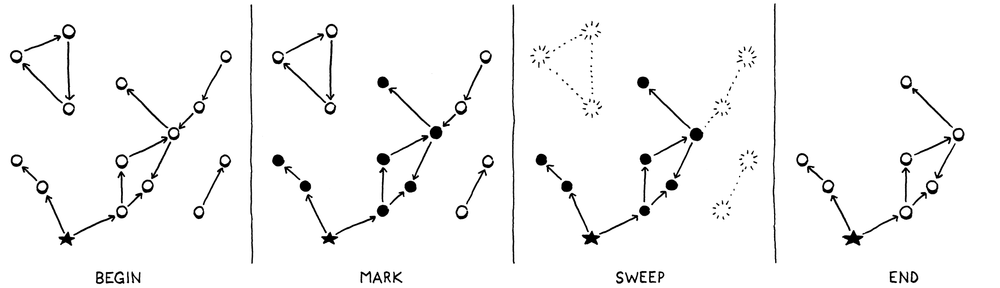

#### garbage collection

A value is **reachable** if there is some way for a user program to reference it. A **root** is any object that the VM can reach directly without going through a reference in some other object. Most roots are global variables or on the stack.

reachability:

* All roots are reachable.
* Any object referred to from a reachable object is itself reachable.

Mark-Sweep Garbage Collection works in two phases:

* Marking – We start with the roots and traverse or trace through all of the objects those roots refer to.
* Sweeping – go through all the unmarked objects and free each one.

