### 1 简介

Go语言的主要目标是将静态语言的安全性和高效性与动态语言的易开发性进行有机结合，达到完美平衡，从而使编程变得更加有乐趣，而不是在艰难抉择中痛苦前行。Go语言的另一个目标是对于网络通信、并发和并行编程的极佳支持，从而更好地利用大量的分布式和多核的计算机。

#### Go环境变量

* `GOROOT` 表示 Go 在你的电脑上的安装位置，它的值一般都是 `$HOME/go`，当然，你也可以安装在别的地方。
* GOPATH环境变量
    * 默认在～/go(unix, linux)
    * 推荐：所有项目和第三方库都放在同一个GOPATH下
    * 也可以将每个项目放在不同的GOPATH

在IntelliJ IDEA中设置GOPATH, 注意不要包含src目录。

#### Go runtime

尽管Go编译器产生的是本地可执行代码，这些代码仍旧运行在Go的runtime(运行时)当中。这个runtime类似 Java 和 .NET 语言所用到的虚拟机，它负责管理包括内存分配、垃圾回收、栈处理、goroutine、channel、切片（slice）、map 和反射（reflection）等等。

#### 格式化代码

go fmt（gofmt）可以将源代码格式化成符合官方统一标准的风格，属于语法风格层面上的小型重构。在IntelliJ IDEA中安装File Watchers插件，并添加go fmt。


#### 基本结构和要素


##### 函数

```go
func functionName(parameter_list) (return_value_list) {
   …
}
```

##### 注释
 单行注释是最常见的注释形式，你可以在任何地方使用以 `//` 开头的单行注释。多行注释也叫块注释，均已以 `/*`开头，并以`*/`结尾，且不可以嵌套使用，多行注释一般用于包的文档描述或注释成块的代码片段。

```go
import "fmt" // Package implementing formatted I/O.

/* 
 */
```

##### 类型

* 基本类型，如：int、float、bool、string；
* 结构化的（复合的）类型，如：struct、array、slice、map、channel；
* 只描述类型的行为的类型，如：interface。

类型转换：Go 语言不存在隐式类型转换，因此所有的转换都必须显式说明，就像调用一个函数一样（类型在这里的作用可以看作是一种函数）：

```go
valueOfTypeB = typeB(valueOfTypeA)
```

> Those sequences represent Unicode code points, called runes. [^16]
> Rune is an alias for int32 and is equivalent to int32 in all ways. It is used, by convention, to distinguish character values from integer values.


```go
var str = "hello 你好"
//golang中string底层是通过byte数组实现的，使用len 实际是在按字节长度计算  所以一个汉字占3个字节算了3个长度
fmt.Println("len(str):", len(str)) //12
//通过rune类型处理unicode字符
fmt.Println("rune:", len([]rune(str))) // 8
```


##### 常量

常量的定义格式：`const identifier [type] = value`，例如： `const Pi = 3.14159`

##### 变量

声明变量的一般形式是使用 var 关键字：`var identifier type`。

#### 基础语法

##### if

```go

if v > 100 { // 不需要括号
    return 100
} else if v < 0 {
    return 0
} else {
    return v
}

// if 的条件里可以赋值
// if 的条件里赋值的变量作用域就在这个 if 语句里
if contents, err := ioutil.ReadFile(filename); err != nil {
	fmt.Println(err)
}else{
	fmt.Printf("%s\n", contents)
}
```

##### switch

```go
func eval(a, b int, op string) int {
	var result int
	switch op {
	case "+":
		result = a + b
	case "-":
		result = a - b
	case "*":
		result = a * b
	case "/":
		result = a / b
	default:
		panic("unsupported operator:" + op)
	}
	return result
}
```

* `switch`会自动`break`，除非使用`fallthrough`
* `switch`后可以没有表达式


##### for

```go
//for 初始化语句; 条件语句; 修饰语句 {}
for i := 0; i < 5; i++ {
    fmt.Printf("This is the %d iteration\n", i)
}
// for ix, val := range coll { }
str := "Go is a beautiful language!"
fmt.Printf("The length of str is: %d\n", len(str))
for pos, char := range str {
	fmt.Printf("Character on position %d is: %c \n", pos, char)
}
```
	


### 2 内建容器

#### array


数组是一个由固定长度的特定类型元素组成的序列，一个数组可以由零个或多个元素组成。 因为数组的长度是固定的，因此在Go语言中很少直接使用数组。和数组对应的类型是slice(切片)，它是可以增长和收缩动态序列。

```go
// 创建
var a [3]int
// 初始化
var q [3]int = [3]int{1,2,3}
var r [3]int = [3]int{1,2}
symbol := [...]string{0: "$", 1: "€", 2: "￡", 3: "￥"}
// 遍历
for i, v := range a {
    fmt.Println(a)
}
```


#### slice

```go

// 创建
make([]T, len, cap)
make([]T, cap)[:len]
// 获取长度 
len(a)
// 获取容量 
cap(a)
```

`...`: uppack a slice

```go
// uppack a slice
rf.log = append(rf.log, entries...)
append([]int{1,2}, []int{3,4}...)
// function declare:
func append(slice []Type, elems ...Type) []Type
```


#### map

```go
// 创建map
c := make(map[int]string)
// 把某个值放入map中
c[5] = "hello"
// 判断map包含某个值
if value, ok = c[6]; ok {
    // do something
}
```


### 3 面向对象
go 语言仅支持封装，不支持继承和多态.go语言没有 class，只有 struct
#### 结构体

<!-- 结构的创建
 
* 不论地址还是结构体本身，一律使用.来访问成员
* 使用自定义工厂函数
* 注意返回了局部变量的地址

结构定义方法

* 显示定义和命名方法接受者

使用指针作为方法的接受者

* 只有使用指针才可以改变结构体内容
* nil指针也可以调用方法

值接受者vs指针接受者

* 要改变内容必须使用指针接受者
* 结构过大也考虑使用指针接受者
* 一致性：如有指针接受者，最好都是指针接受者
* 值接受者是go语言特有
* 值/指针接受者均可接收值/指针
-->

结构体是一种聚合的数据类型，是由零个或多个任意类型的值聚合成的实体。每个值称为结构体的成员。结构体变量的成员可以通过点操作符访问。


```go
type TreeNode struct {
	Left, Right *TreeNode
	Value int
}
```

#### 方法

在函数声明时，在其名字之前放上一个变量，即是一个方法。这个附加的参数会将该函数附加到这种类型上，即相当于为这种类型定义了一个独占的方法。


```go
func (t *TreeNode) traverse() {
	if t == nil {
		return
	}
	t.Left.traverse()
	fmt.Print(t.Value, " ")
	t.Right.traverse()
}
```

上面代码里附加的参数`t`叫做方法的接收器(receiver)，建议使用其类型的第一个字母。


Go不支持构造函数，可以用工厂函数来生成对象:

* 结构创建在堆上还是栈上？不需要知道

```go
func createNode(value int) *TreeNode {
   // 注意返回了局部变量的地址！
	return &TreeNode{Value: value}
}
var x = createNode(3)
}
```

为结构定义方法

* 传值：Go语言中所有方法的参数都是传值的

```go
// 注意没有*，不是func (root *TreeNode) print()
func (root TreeNode) print() {
	fmt.Print(root.Value, " ")
}
// 用法： root.print()

// 错误：值接收者，由于是参数是传值的，所以原来的TreeNode根本没改
func (root TreeNode) setValue(value int) {
    root.Value = value
}
// 正确： 指针接收者
func (root *TreeNode) setValue(value int) {
    root.Value = value
}
```

* 只有使用指针才可以改变结构内容
* nil指针也可以调用方法

```go
// 注意nil的情形, 否则返回SIGSEGV错误
func (root *TreeNode) traverse() {
	if root == nil {
		return
	}
	root.Left.traverse()
	fmt.Print(root.Value, " ")
	root.Right.traverse()
}
```

!!! note "值接收者v.s. 指针接收者"
    
    * 要改变内容必须使用指针接收者
    * 结构过大也考虑使用指针接收者
    * 一致性：如有指针接收者，最好都是指针接收者
    * 值接收者是go语言特有
    * 值/指针接收者均可接收值/指针
    

#### 包和封装

封装

* 名字一般使用 CamelCase
* 首字母大写: public
* 首字母小写: private

包

* 每个目录一个包(包名可以和目录名不同)
* main包包含可执行入口
* 为结构定义的方法必须放在同一个包内


!!! note "包的导入"

    例如有下面的项目，GOPATH为`~/Documents/codes/go_demo/src`，`node.go`内容为`package tree`下的`struct node`。
    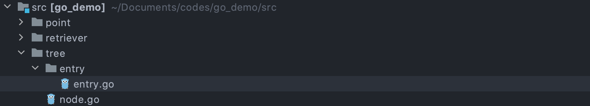

    如果`entry.go`需要使用`struct Node`，有两种方法：
    
    ```go
    // 绝对路径，加载GOPATH/tree模块
    import "tree"
    
    // 相对路径  
    import "../../tree"
    ```

#### 包的扩展

GO语言是不支持继承的，那么如何扩充系统类型或者别人的类型

* 定义别名
* 使用组合

=== "Node"
    ```go
    package main
    
    import "fmt"
    import "tree"
    
    
    type myTreeNode struct {
    	node *tree.Node
    }
    
    func (myNode *myTreeNode) postOrder() {
    	if myNode == nil || myNode.node == nil {
    		return
    	}
    	left := myTreeNode{myNode.node.Left}
    	left.postOrder()
    	right := myTreeNode{myNode.node.Right}
    	right.postOrder()
    	myNode.node.Print()
    }
    
    func main() {
    	var root = tree.Node{Value: 3}
    	root.Left = &tree.Node{Value: 2}
    	root.Right = new(tree.Node)
    	
    	node := myTreeNode{&root}
    	node.postOrder()
    }
    ```

=== "Queue"
    ```go
    type Queue []int
    
    func (q *Queue) Push(v int) {
    	*q = append(*q, v)
    }
    
    func (q *Queue) Pop() int {
    	head := (*q) [0]
    	*q = (*q)[1:]
    	return head
    }
    
    func (q *Queue) IsEmpty() bool{
    	return len(*q) == 0
    }
    ```


### 4 面向接口

```
type Traversal interface {
    Traverse()
}
 
func main() {
    traversal := getTraversal()
    traversal.Traverse()
}
```

#### duck typing

* 描述事物的外部行为而非内部结构
* 严格说 go 属于结构化类型系统，类似 duck typing

Go 语言的 duck typing

* 同时具有 Python, C++的 duck typing 的灵活性
* 又具有 Java 的类型检查

#### 接口的定义和实现

接口由使用者定义

=== "Interface"
    ```go
    type Retriever interface {
    	Get(url string) string // 不用加func
    }
    
    func download(r Retriever) string {
    	return r.Get("www.imooc.com")
    }
    
    func main() {
    	var r = retriever.Retriever{Contents: "e32"}
    	fmt.Println(download(r))
    }
    ```

=== "Retriever"
    ```go
    import (
    	"net/http"
    	"time"
    	"net/http/httputil"
    )
    
    type Retriever struct {
    	UserAgent string
    	TimeOut time.Duration
    	Contents string
    }
    
    // 实现Retriever Interface
    func (r Retriever) Get(url string) string {
    	resp, err := http.Get(url)
    	if err != nil {
    		panic(err)
    	}
    	result ,err := httputil.DumpResponse(resp, true)
    
    	if err != nil {
    		panic(err)
    	}
    	return string(result)
    }
    ```

#### 类型断言

可以使用`t, ok = r.(T)`来获取实现了某个接口对象的具体类型：该语句断言接口值`r`保存了具体类型`T`，并将其底层类型为`T`的值赋予变量`t`, 否则`ok`将为false，而`t`将为`T`类型的零值。如果使用`t=r.(type)`而`r`并未保存`T`类型的值，该语句该会panic[^5]。

```go
var i interface{} = "hello"

s := i.(string)
fmt.Println(s) // hello

s, ok := i.(string)
fmt.Println(s, ok) // hello true

f, ok := i.(float64)
fmt.Println(f, ok) // 0 false

f = i.(float64) // 报错(panic)
fmt.Println(f)
```

接口的组合

```go
type ReaderWriter interface {
	Reader
	Writer
}
```

#### 常用的系统接口

* String
* Reader
* Writer

#### interface{}

`interface{}`类型(空接口)是一个没有任何方法的接口。由于所有类型至少实现了零个方法，所有类型都满足空接口。这意味着，如果你写了一个以`interface{}`作为入参类型的函数，该函数可以接收任意值。

```go
func myfunction(any interface{}) {
    ...
}
```

`any`不是任何类型，它是`interface{}`类型。可以使用type assertion将接口

#### 接口值


Go有方法表，但是在运行时计算的(与Java和C++不同)。接口值(interface value)在内存中以两个字表示，一个是指向存储在接口中的类型的信息的指针，一个是指向相关数据的指针[^14]。

```go
type Binary uint64
type Stringer interface {
	String() string
}
func (i Binary) String() string {
	return strconv.FormatInt(i.Get(), 2)
}
func (i Binary) Get() int64 {
	return int64(i)
}
func main() {
	b := Binary(200)
	s := Stringer(b)
	fmt.Println(s) //11001000
}
```

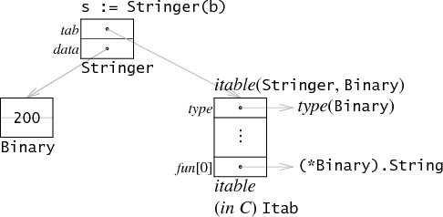


接口的第一个字指向了interface table(itable)。itable开头是一个存储了类型相关的元数据信息，接下来就是一个由函数指针组成的列表。注意：itable和接口类型相对应，而不是和动态类型。就我们的例子而言：Stringer中的itable只是为了Stringer而建立，只关联了Stringer中定义的String方法，而像Binary中定义的Get方法则不在其范围内。


如果我们想要调用`s.String()`，Go编译器会产生和C语言中`s.tab->fun[0](s.data)`表达式等效的代码。它会从itable中找到并调用对应的函数指针，然后将data中存储的数据作为第一个参数传递过去(仅仅是在本例中)。需要注意的是：Go编译器传递到itable中的是data中的值(32位)而不是该值所对应的Binary(64位)。通常负责执行接口调用的组件并不知道这个字表示啥，也不知道这个指针指向了多大的数据，相反的，接口代码安排itable中的函数接收接口的datada这个32位长的指向原始数据的指针的形式来作为参数传递。因此，本例中的函数指针是`(*Binary).String`而不是`Binary.String`[^14]。


### 5 函数式编程

函数式编程 vs. 函数指针

* 函数是一等公民：参数、变量、返回值都可以是函数
* 高阶函数
* 函数 $\rightarrow$ 闭包


=== "Adder"
    ```go
    func adder() func(value int) int {
    	sum := 0
    	return func(value int) int {
    		sum += value
    		return sum
    	}
    }
    
    func main() {
    	adder := adder()
    	for i := 0; i < 10; i++ {
    		fmt.Println(adder(i))
    	}
    }
    ```
=== "Fibonacci"
    ```go
    func fibonacci() func() int {
    	a, b := 0, 1
    	return func() int {
    		a, b = b, a+b
    		return a
    	}
    }
    
    func main() {
    	f := fibonacci()
    	for i := 0; i < 10; i++ {
    		fmt.Print(f(), " ")
    	}
    }
    ```

### 7 Groutine与通道
#### goroutine

Go语言中的并发程序可以用两种手段来实现，CSP(Goroutine与通道channel)和共享内存。在Go语言中，每一个并发的执行单元叫作一个goroutine。当一个程序启动时，其主函数即在一个单独的goroutine中运行，我们叫它main goroutine。新的goroutine会用go语句来创建: 一个普通的函数或方法调用前加上关键字go。


```go
f()// call f(); wait for it to return
go f() // create a new goroutine that calls f(); don't wait
```

主函数返回时，所有的goroutine都会被直接打断，程序退出。
> Program execution begins by initializing the main package and then invoking the function main. When that function invocation returns, the program exits. It does not wait for other (non-main) goroutines to complete.[15]


<!--协程：

* 轻量级”线程“
* 非抢占式多任务处理，由协程主动交出控制权
* 编译器/解释器/虚拟机层面的多任务
* 多个协程可能在一个或多个线程上运行


子程序是特殊的协程

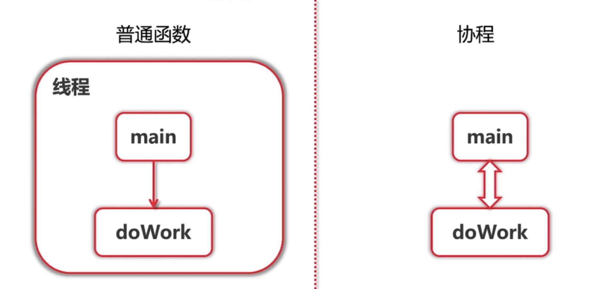

```go
func main() {
	var a [10]int

	for i := 0; i < 9; i++ {
		go func(i int) {
			a[i]++
		}(i)
	}
	time.Sleep(time.Millisecond)
	fmt.Println(a)
}

```


goroutines指的是Go语言中的协程。它与一般的协程有以下区别：

* Go协程意味着并行，协程一般来说不是这样的
* Go协程通过通道来通信，协程通过让出和恢复操作来通信

-->


必须设置GOMAXPROCS为一个大于默认值1的数值来允许运行时支持使用多于1个线程。

```go
runtime.GOMAXPROCS(4)
```

一个goroutine会以一个很小的栈开始其生命周期，一般只需要2KB。一个goroutine的栈大小并不是固定的；栈的大小会根据需要动态地伸缩。

#### channel

在go中，`chan`关键字用于定义一个channel。`make`关键字用于创建`channel`，创建时指定`channel`传递的数据类型。`channel`默认都是同步`channel`，也就是说，一条数据被放入`channel`后必须被取走才能再放置另一条数据。


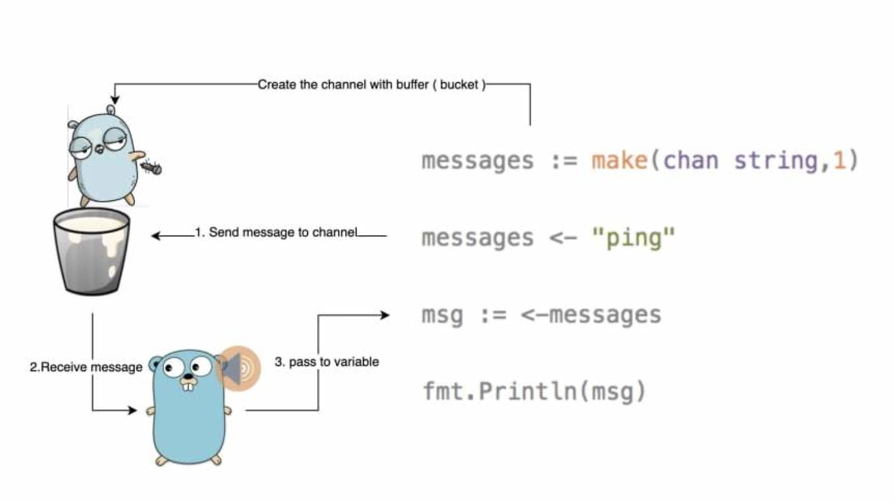


```go
func main() {
    // Create the channel that can send and receive a string
    messages := make(chan string)

    // run a go routine to send the message
    go func() { messages <- "ping" }()

    // when you receive the message store it in msg variable
    msg := <-messages

    // print received message
    fmt.Println(msg)
}
```


`channel`可以是带缓冲的，将缓冲长度作为第二个参数提供给`make`来初始化一个带缓冲的`channel`

```go
ch := make(chan int, 100)
```

##### buffered channel

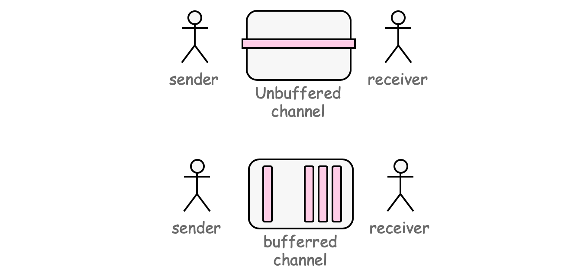


##### range

数据接受者总是面临这样的问题：何时停止等待数据？还会有更多的数据么，还是所有内容都完成了？我应该继续等待还是该做别的了？

对于该问题，一个可选的方式是，持续的访问数据源并检查`channel`是否已经关闭，但是这并不是高效的解决方式。

Go提供了`range`关键字，会自动等待`channel`的动作一直到`channel`被关闭。


```go
ch = make(chan [] string)
// 需要知道数据多少，需要手动关闭
for i := 1; i <= count; i++ {
    url := <- ch
}
close(ch)

// 使用range，自动关闭
for urls := range ch {
    ...
}
```


##### select


select类似轮询，

```go
select {
    case u := <- ch1:
        ...
    case v := <- ch2:
        ...
    default: // no value ready to be received
        ...
        

}
```
### 7 同步
#### sync.Mutex

```go
mu := sync.Mutex
mu.Lock()
mu.unLock()
```
Mutex不需要初始化[^12]


#### sync.WaitGroup

https://www.jianshu.com/p/4c2c80076094

`WaitGroup`对象内部有一个计数器，最初从0开始，它有三个方法：`Add()`, `Done()`, `Wait()`用来控制计数器的数量。`Add(n)`把计数器设置为`n` ，`Done()` 每次把计数器-1 ，`wait()` 会阻塞代码的运行，直到计数器地值减为0。


```go
package main

import (
    "sync"
)

type httpPkg struct{}

func (httpPkg) Get(url string) {}

var http httpPkg

func main() {
    var wg sync.WaitGroup
    var urls = []string{
        "http://www.golang.org/",
        "http://www.google.com/",
        "http://www.somestupidname.com/",
    }
    for _, url := range urls {
        // Increment the WaitGroup counter.
        wg.Add(1)
        // Launch a goroutine to fetch the URL.
        go func(url string) {
            // Decrement the counter when the goroutine completes.
            defer wg.Done()
            // Fetch the URL.
            http.Get(url)
        }(url)
    }
    // Wait for all HTTP fetches to complete.
    wg.Wait()
}
```

#### Sync.Once

Sync.Once使方法只执行一次， Once.Do()确保被调用函数只被调用一次

```go
var loadIconsOnce sync.Once
var icons map[string]image.Image
// Concurrency-safe.
func Icon(name string) image.Image {
    // 确保loadIcons只被调用一次
    loadIconsOnce.Do(loadIcons)
    return icons[name]
}

func loadIcons() {
    icons = make(map[string]image.Image)
    icons["spades.png"] = loadIcon("spades.png")
    icons["hearts.png"] = loadIcon("hearts.png")
    icons["diamonds.png"] = loadIcon("diamonds.png")
    icons["clubs.png"] = loadIcon("clubs.png")
}
```
#### sync.Cond

```go
count := 0
finished := 0
var mu sync.Mutex
cond := sync.NewCond(&mu)

for i := 0; i < 10; i++ {
	go func() {
		vote := requestVote()
		mu.Lock()
		defer mu.Unlock()
		if vote {
			count++
		}
		finished++
		cond.Broadcast()
	}()
}

mu.Lock()
for count < 5 && finished != 10 {
	cond.Wait()
}
if count >= 5 {
	println("received 5+ votes!")
} else {
	println("lost")
}
mu.Unlock()
```

#### 调试 

1. 可以使用`-race`选项找出可能的data race： 竞争检查器(the race detector)会寻找在哪一个goroutine中出现了这样的case，例如其读或者 写了一个共享变量，这个共享变量是被另一个goroutine在没有进行干预同步操作便直接写入 的。
2. 在GoLand中可以使用goroutine标签： https://blog.jetbrains.com/go/2020/03/03/how-to-find-goroutines-during-debugging/

### 6 错误处理和资源管理

#### defer
defer调用

* 确保调用在函数结束时发生
* 参数在defer语句时计算
* defer列表为后进先出

```go
func tryDefer() {
	defer fmt.Println(1)
	defer fmt.Println(2)
	fmt.Println(3)
}

func main() {
	tryDefer() // output: 3 2 1
}
```

何时使用 defer 调用

* Open/Close
* Lock/Unlock
* PrintHeader/PrintFooter

```go
func writeFile(filename string) {
	file, err := os.Create(filename)
	if err != nil {
		panic(err)
	}
	defer file.Close()

	writer := bufio.NewWriter(file)
	defer writer.Flush()
	
	f := fib.Fibonacci()
	for i := 0; i < 20; i++ {
		fmt.Fprintln(writer, f())
	}
}

func main() {
	filename := "/tmp/fib.txt"
	writeFile(filename)
}
```


错误处理

```go
file, err := os.Open("abc.txt")
if err != nil {
	if pathError, ok := err.(*os.PathError); ok {
		fmt.Println(pathError.Err)
	} else {
		fmt.Println("unknown error", err)
	}
	return 
}
```

#### panic

panic

* 停止当前函数执行
* 一直向上返回，执行每一层的defer
* 如果没有遇见recover，程序退出

recover

* 仅在defer调用中使用

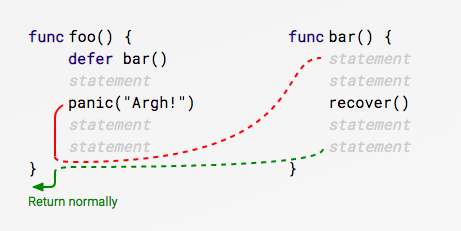

```go
func foo() {
	fmt.Println("foo()")
	defer bar()
	panic("Argh")
}

func bar() {
	fmt.Println("bar()")
	err := recover() // recover返回调用panic()的参数，这里是Argh
	fmt.Printf("err = %+v", err)
}

func main() {
	foo()
}
```


!!! note "error vs panic"

    > panics are always fatal to your program. In panicing you never assume that your caller can solve the problem. Hence panic is only used in exceptional circumstances, ones where it is not possible for your code, or anyone integrating your code to continue. [^11]

### 7 测试

测试程序必须属于被测试的包，并且文件名满足这种形式 `*_test.go`，所以测试代码和包中的业务代码是分开的。`_test`程序不会被普通的 Go 编译器编译，所以当放应用部署到生产环境时它们不会被部署；只有 gotest 会编译所有的程序：普通程序和测试程序。

测试文件中必须导入 "testing" 包，并写一些名字以 TestZzz 打头的全局函数，这里的 Zzz 是被测试函数的字母描述，如 TestFmtInterface，TestPayEmployees 等。
    

```go
import testing
func TestName(t *testing.T) {

// ...

}
```
    
#### 多次测试

https://stackoverflow.com/questions/24375966/does-go-test-run-unit-tests-concurrently

However, tests do not run in parallel by default as pointed out by @jacobsa. To enable parallel execution you would have to call t.Parallel() in your test case and set GOMAXPROCS appropriately or supply -parallel N.


### 7 数据在内存中的表示

数据在内存中的表示参考Go Data Structures[^12]

#### 基本类型

`int`在内存中是以单个32位的字表示的(即使在64位机器上)。指针是以64位表示的。

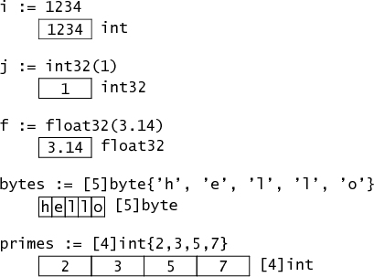

#### 结构体和指针

`type Point struct {X, Y int}`定义了一个简单的结构题类型叫做`Point`，在内存中以两个相邻`int`表示。

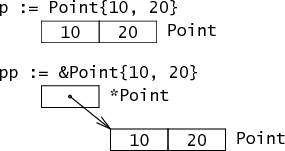


复合字面量(composite literals)`Point{10, 20}`代表一个初始化的`Point`。符合字面量的地址表示一个指向新分配和初始化的`Point`的指针。


结构体中的字段在内存中是肩并肩排列的：

```go
type Rect1 struct {Min, Max Point}
type Rect2 struct {Min, Max *Point}
```

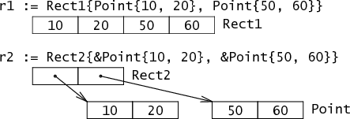


#### 字符串

`string`在内存中是以双字结构表示的，包含指向一个字符串数据的指针和一个字符串长度。由于`string`是不可变的，所以切片会产生新的双字结构。也就是说不用分配和拷贝，字符串切片就像传递下标一样有效。

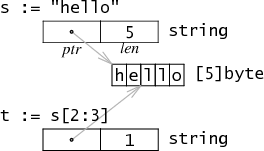


#### 切片


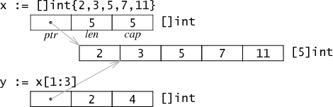

切片是数组一部分的引用。在内存中，它是一个3个字长的结构，包含指向第一个元素的指针，切片的长度和容量。就像字符串切片一样，数组的切片并不拷贝，仅仅产生一个新的包含指针，长度和容量的结构


#### New和Make

Go有两个创建数据结构的函数: `new`, `make`。它们的基本区别是

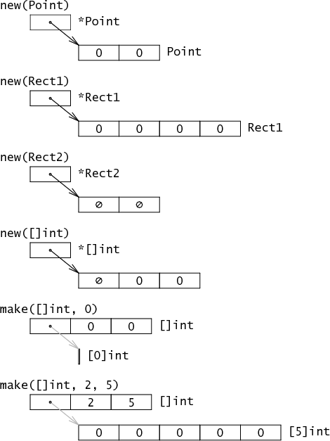

* `new(T)`： 返回`*T`，一个Go程序可以隐式的间接引用的指针(上图黑色箭头)， `make(T, args)`: 返回`T`, 不是指针，通常它内部包含一些隐式指针
* `new(T)`： 返回一个零值内存的指针， `make(T, args)`: 返回一个复杂的结构


    
### 8 调度

https://learnku.com/articles/41728
    

    
    
[^1]: Go语言圣经, https://yar999.gitbook.io/gopl-zh/
[^2]: Go入门指南, https://github.com/unknwon/the-way-to-go_ZH_CN
[^3]: Google资深工程师深度讲解Go语言, https://coding.imooc.com/class/180.html
[^4]: Go 语言设计与实现, https://draveness.me/golang/
[^5]: A tour of go, https://tour.go-zh.org/welcome/1
[^11]: https://stackoverflow.com/questions/44504354/should-i-use-panic-or-return-error
[^12]: https://stackoverflow.com/questions/45744165/do-mutexes-need-initialization-in-go
[^13]: Go Data Structures. https://research.swtch.com/godata
[^14]: https://research.swtch.com/interfaces
[^15]: https://golang.org/ref/spec#Program_execution
[^16]: https://blog.golang.org/strings