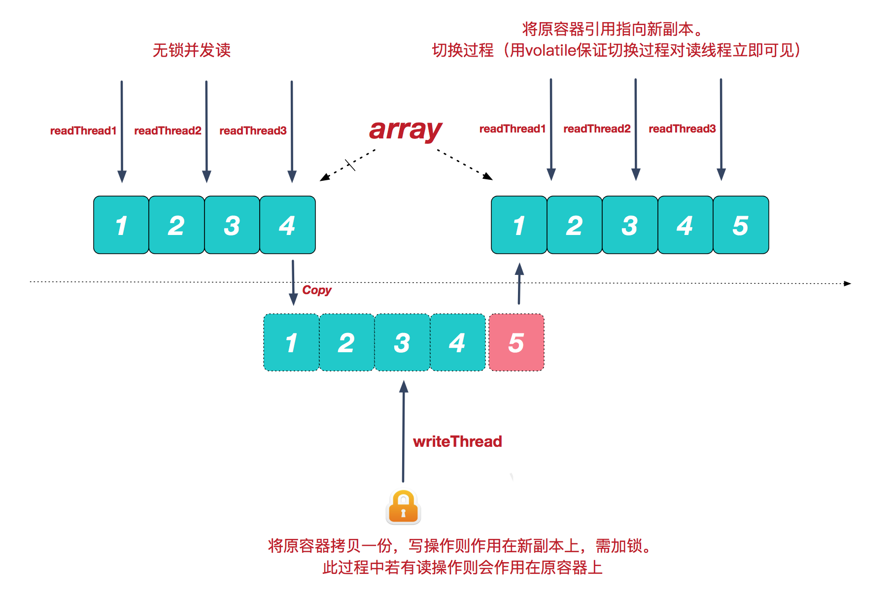
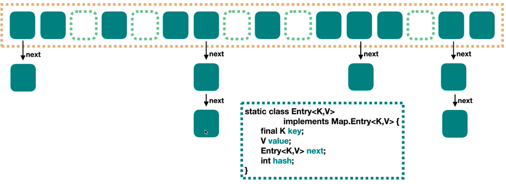
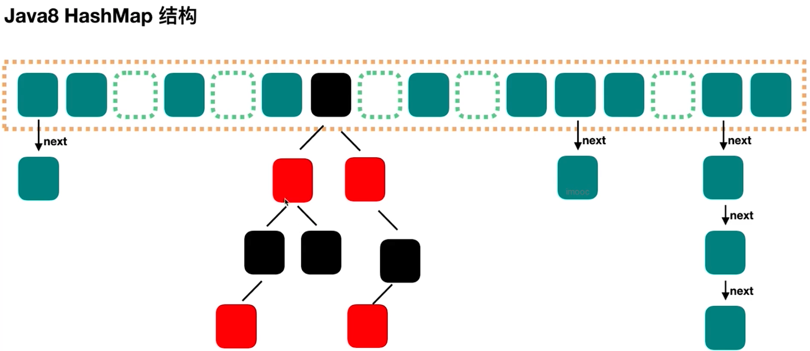
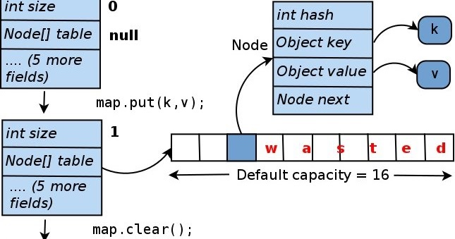
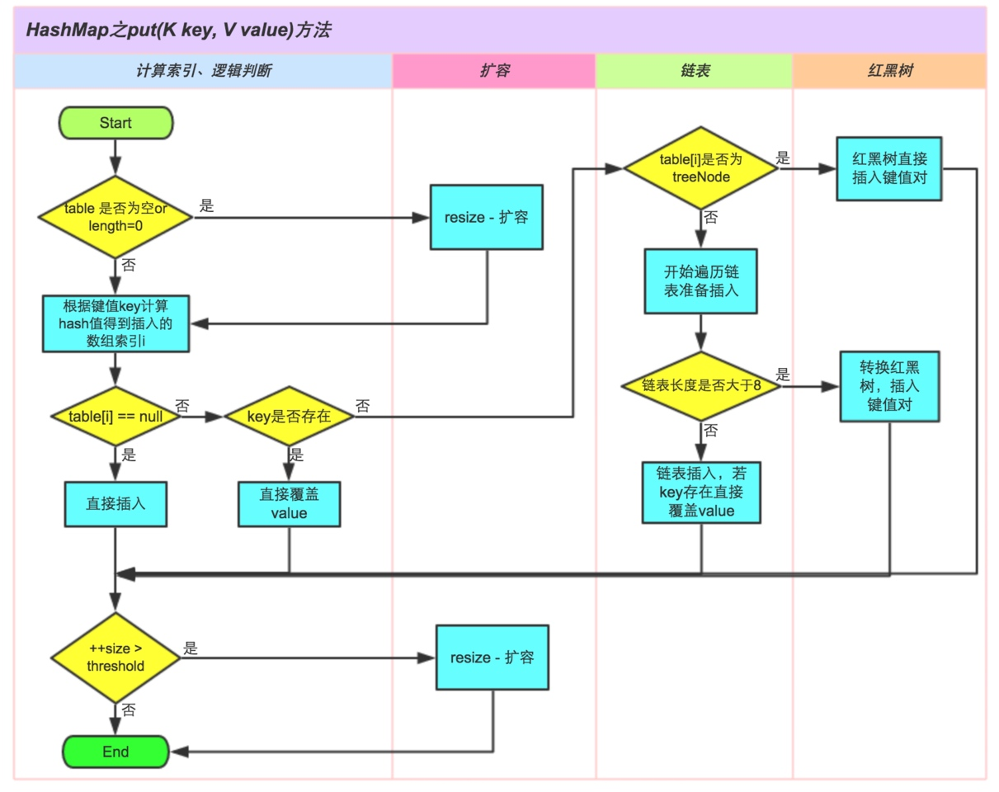
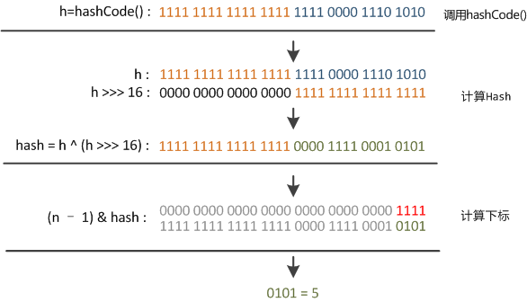
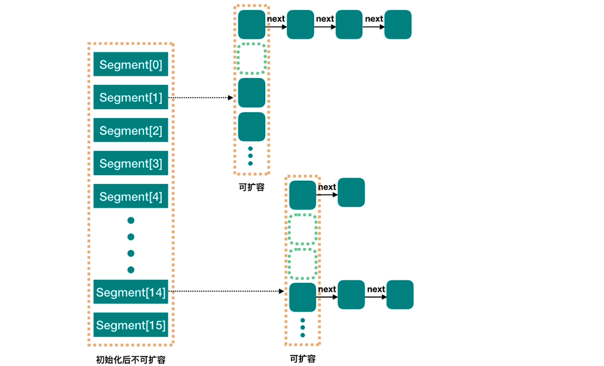
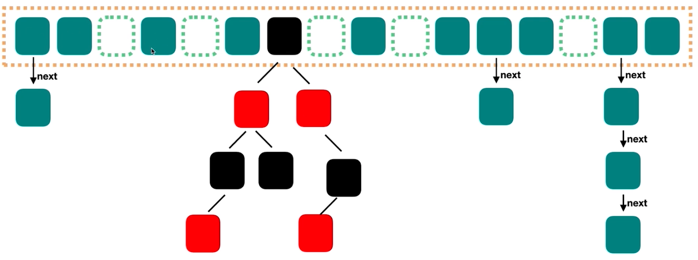
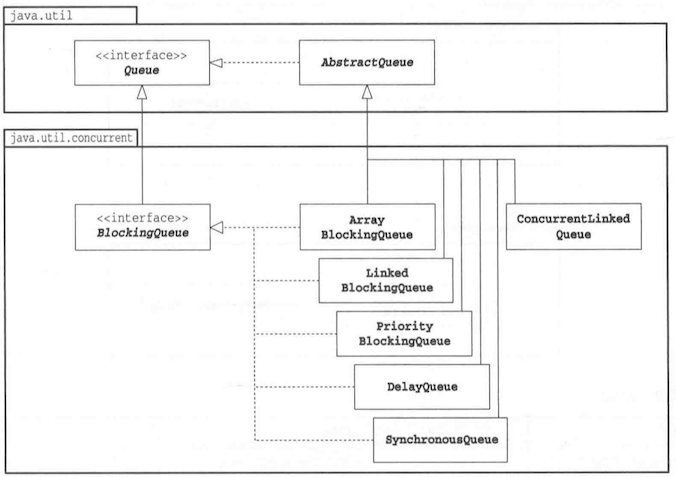

### 1 List

#### CopyOnWriteArrayList

`CopyOnWriteArrayList`允许并发读，读操作是无锁的，性能较高。至于写操作，比如向容器中添加一个元素，则首先将当前容器复制一份，然后在新副本上执行写操作，结束之后再将原容器的引用指向新容器[^2]。




```java
// Appends the specified element to the end of this list.
public boolean add(E e) {
    final ReentrantLock lock = this.lock;     //重入锁
    lock.lock();                              //加锁
    try {
        Object[] elements = getArray();
        int len = elements.length;
        //拷贝原容器，长度为原容器长度加一
        Object[] newElements = Arrays.copyOf(elements, len + 1);
        //在新副本上执行添加操作
        newElements[len] = e;
        //将原容器引用指向新副本
        setArray(newElements);
        return true;
    } finally {
        lock.unlock();//解锁啦
    }
}
```

### 2 Map


`Map`作为一个接口，主要有`HashMap`, `HashTable`, `LinkedHashMap`, `TreeMap`等实现

* `HashTable`是历史遗留类，线程安全
* `LinkedHashMap`保存了插入顺序
* `TreeMap`可以排序


#### HashMap

HashMap在JDK8之前由数组+链表组成，其最坏时间复杂度是$O(n)$



`HashMap`在JDK8之后由数组+链表+红黑树组成，最坏时间复杂度为$O(\log n)$




```java
//创建HashMap时未指定初始容量情况下的默认容量   
static final int DEFAULT_INITIAL_CAPACITY = 1 << 4; 
 
//HashMap的最大容量
static final int MAXIMUM_CAPACITY = 1 << 30;
 
//HashMap默认的装载因子,当HashMap中元素数量超过 容量*装载因子 时，进行resize()操作
static final float DEFAULT_LOAD_FACTOR = 0.75f;
  
//用来确定何时将解决 hash 冲突的链表转变为红黑树
static final int TREEIFY_THRESHOLD = 8;
 
// 用来确定何时将解决 hash 冲突的红黑树转变为链表
static final int UNTREEIFY_THRESHOLD = 6;

// 当需要将解决 hash 冲突的链表转变为红黑树时，需要判断下此时数组容量
// 若是由于数组容量太小（小于MIN_TREEIFY_CAPACITY）导致的 hash 冲突太多
// 则不进行链表转变为红黑树操作，转为利用　resize() 函数对　hashMap 扩容
static final int MIN_TREEIFY_CAPACITY = 64;

//保存Node<K,V>节点的数组
transient Node<K,V>[] table;
 
//由hashMap中Node<K,V>节点构成的set
transient Set<Map.Entry<K,V>> entrySet;

//记录 hashMap 当前存储的元素的数量
transient int size;

//记录　hashMap 发生结构性变化的次数（注意　value 的覆盖不属于结构性变化）
transient int modCount;

//threshold的值应等于 table.length * loadFactor, size 超过这个值时进行　resize()扩容
int threshold;

//记录 hashMap 装载因子
final float loadFactor;
```




```java
static class Node<K,V> implements Map.Entry<K,V> {
    final int hash;  // 哈希值
    final K key;     // 键
    V value;         // 值
    Node<K,V> next;  // 下一个节点
}
```


##### put

`put`方法的逻辑

* 如果`HashMap`未被初始化，则初始化
* 对Key求Hash值，然后再计算下标
* 如果没有碰撞，直接放入桶中
* 如果碰撞了，以链表的方式链接到后面
* 如果链表长度超过阈值，就把链表转成红黑树
* 如果链表长度低于6，就把红黑树转回链表
* 如果节点已经存在就替换旧值
* 如果桶满了，那就扩容



```java
final V putVal(int hash, K key, V value, boolean onlyIfAbsent,
               boolean evict) {
    Node<K,V>[] tab; Node<K,V> p; int n, i;
    if ((tab = table) == null || (n = tab.length) == 0) // hashmap为空
        n = (tab = resize()).length;
    if ((p = tab[i = (n - 1) & hash]) == null)  // 该位置上没有元素
        tab[i] = newNode(hash, key, value, null);
    else {
        Node<K,V> e; K k;
        // 已经存在，直接替换
        if (p.hash == hash &&
            ((k = p.key) == key || (key != null && key.equals(k))))
            e = p;
        // 当前数组位置是红黑树
        else if (p instanceof TreeNode)
            e = ((TreeNode<K,V>)p).putTreeVal(this, tab, hash, key, value);
        else {
            //  在链表中添加元素
            for (int binCount = 0; ; ++binCount) {
                if ((e = p.next) == null) {
                    // 添加载链表末尾
                    p.next = newNode(hash, key, value, null);
                    if (binCount >= TREEIFY_THRESHOLD - 1) // -1 for 1st
                        treeifyBin(tab, hash);
                    break;
                }
                if (e.hash == hash &&
                    ((k = e.key) == key || (key != null && key.equals(k))))
                    // 相同key
                    break;
                p = e;
            }
        }
        // 替换原来的值
        if (e != null) { // existing mapping for key
            V oldValue = e.value;
            if (!onlyIfAbsent || oldValue == null)
                e.value = value;
            afterNodeAccess(e);
            return oldValue;
        }
    }
    ++modCount;
    if (++size > threshold)
        resize();
    afterNodeInsertion(evict);
    return null;
}
```


##### get

```java
final Node<K,V> getNode(int hash, Object key) {
    Node<K,V>[] tab; Node<K,V> first, e; int n; K k;
    if ((tab = table) != null && (n = tab.length) > 0 &&
        (first = tab[(n - 1) & hash]) != null) {
        if (first.hash == hash && // always check first node
            ((k = first.key) == key || (key != null && key.equals(k))))
            return first;
        if ((e = first.next) != null) {
            // 在红黑树中寻找
            if (first instanceof TreeNode)
                return ((TreeNode<K,V>)first).getTreeNode(hash, key);
            // 在链表中寻找
            do {
                if (e.hash == hash &&
                    ((k = e.key) == key || (key != null && key.equals(k))))
                    return e;
            } while ((e = e.next) != null);
        }
    }
    return null;
}
```

##### hashcode




```java
// 高16bit不变，低16bit和高16bit做了一个异或。
static final int hash(Object key) {
    int h;
    return (key == null) ? 0 : (h = key.hashCode()) ^ (h >>> 16);
}

// 返回数组下标
static int indexFor(int h, int length) {
    return h & (length-1);
}
```


##### resize

当`put`时，如果发现目前的桶占用程度已经超过了`Load Factor`所希望的比例，那么就会发生扩容(`resize`)。在`resize`的过程，简单的说就是把`bucket`扩充为2倍，之后重新计算`index`，把节点再放到新的`bucket`中。`resize`的注释是这样描述的：

> Initializes or doubles table size. If null, allocates in accord with initial capacity target held in field threshold. Otherwise, because we are using power-of-two expansion, the elements from each bin must either stay at same index, or move with a power of two offset in the new table.

```java
// 扩容
void resize(int newCapacity) {   //传入新的容量
     Entry[] oldTable = table;    //引用扩容前的Entry数组
     int oldCapacity = oldTable.length;         
     if (oldCapacity == MAXIMUM_CAPACITY) {  //扩容前的数组大小如果已经达到最大(2^30)了
         threshold = Integer.MAX_VALUE; //修改阈值为int的最大值(2^31-1)，这样以后就不会扩容了
         return;
     }
  
     Entry[] newTable = new Entry[newCapacity];  //初始化一个新的Entry数组
     transfer(newTable);                         //将数据转移到新的Entry数组里
     table = newTable;                           //HashMap的table属性引用新的Entry数组
     threshold = (int)(newCapacity * loadFactor);//修改阈值
}

// 将原有Entry数组的元素拷贝到新的Entry数组里。
void transfer(Entry[] newTable) {
    Entry[] src = table;                   //src引用了旧的Entry数组
    int newCapacity = newTable.length;
    for (int j = 0; j < src.length; j++) { //遍历旧的Entry数组
        Entry e = src[j];       //取得旧Entry数组的每个元素
        if (e != null) {
            //释放旧Entry数组的对象引用（for循环后，旧的Entry数组不再引用任何对象）
            src[j] = null;
            do {
                Entry next = e.next;
                //！！重新计算每个元素在数组中的位置
                int i = indexFor(e.hash, newCapacity);
                e.next = newTable[i]; //标记[1]
                newTable[i] = e;      //将元素放在数组上
                e = next;             //访问下一个Entry链上的元素
           } while (e != null);
       }
   }
} 
```


然而又因为我们使用的是2次幂的扩展(指长度扩为原来2倍)，所以，元素的位置要么是在原位置，要么是在原位置再移动2次幂的位置。例如我们从16扩展为32时，具体的变化如下所示[^1]：


因此元素在重新计算 hash 之后，因为n变为2倍，那么 n-1 的 mask 范围在高位多1bit(红色)，因此新的index就会发生这样的变化：


因此，我们在扩充HashMap的时候，不需要重新计算hash，只需要看看原来的hash值新增的那个bit是1还是0就好了，是0的话索引没变，是1的话索引变成“`原索引+oldCap`”。可以看看下图为16扩充为32的resize示意图：


这个设计确实非常的巧妙，既省去了重新计算hash值的时间，而且同时，由于新增的1bit是0还是1可以认为是随机的，因此resize的过程，均匀的把之前的冲突的节点分散到新的bucket了。

##### 线程不安全

HashMap是线程不安全的。

* 同时put碰撞导致数据丢失
* 同时put扩容导致数据丢失: 链表的死循环 https://coolshell.cn/articles/9606.html
* 死循环造成的CPU 100% (仅存在于JDK7及之前)

#### HashTable

#### SynchronizedMap

<!--* ConcurrentHashMap 线程安全的HashMap
* CopyOnWriteArrayList 线程安全的List
* BlockingQueue 接口，表示阻塞队列，非常适合用于作为数据共享的通道
* ConcurrentLinkedQueue 高效的非阻塞并发队列，使用链表实现，可以看作一个线程安全的LinkedList
* ConcurrentSkipListMap 是一个Map，使用跳表的数据结构进行快速查找

-->


`ArrayList`和`HashMap`虽然不是线程安全的，但是可以用`Collections.synchronizedList(new ArrayList<E>())`和`Collections.synchronizedMap(new HashMap<K, V>())`可以使它们变成线程安全的类。原理是通过给原来的方法加上`synchronized`代码块。

```java
private final Map<K,V> m;     // Backing Map
final Object mutex;     // Object on which to synchronize
public V get(Object key) {
    synchronized (mutex) {return m.get(key);}
}
public V put(K key, V value) {
    synchronized (mutex) {return m.put(key, value);}
}
```


`ConcurrentHashMap`和`CopyOnWriteArrayList`用来取代同步的`HashMap`和同步的`ArrayList`。绝大多数并发情况下，`ConcurrentHashMap`和`CopyOnWriteArrayList`的性能都更好。


#### ConcurrentHashMap


JDK7的`ConcurrentHashMap`最外层是多个`Segment`，每个`Segment`的底层数据结构与`HashMap`类似，仍然使用拉链法。每个`Segment`独立上ReentrantLock锁，每个`Segment`之间互不影响，提高了效率。




在JDK8中对`ConcurrentHashmap`进行了改进。取消segments字段，直接采用`transient volatile Node<K,V>[] table
`保存数据，在`table`数组元素上加锁，从而实现了对每个桶进行加锁，进一步减少并发冲突的概率。并且采用了类似于对`HashMap`的改进，当链表长度大于阈值(`TREEIFY_THRESHOLD`)时，会转化为红黑树。




```java
final V putVal(K key, V value, boolean onlyIfAbsent) {
    if (key == null || value == null) throw new NullPointerException();
    int hash = spread(key.hashCode());
    int binCount = 0;
    for (Node<K,V>[] tab = table;;) {
        Node<K,V> f; int n, i, fh;
        // 如果数组"空"，进行数组初始化
        if (tab == null || (n = tab.length) == 0)
            tab = initTable();
        // 找该 hash 值对应的数组下标为空
        else if ((f = tabAt(tab, i = (n - 1) & hash)) == null) {
            // 用一次 CAS 操作将这个新值放入其中
            if (casTabAt(tab, i, null, new Node<K,V>(hash, key, value, null)))
                break;                   // no lock when adding to empty bin
        }
        // hash等于 MOVED， 需要扩容
        else if ((fh = f.hash) == MOVED)
            // 帮助数据迁移
            tab = helpTransfer(tab, f);
        else {
            V oldVal = null;
             // 使用synchronzied锁写入数据
            synchronized (f) {
                if (tabAt(tab, i) == f) {
                    if (fh >= 0) { // 头结点的 hash 值大于 0，说明是链表
                        binCount = 1;
                        for (Node<K,V> e = f;; ++binCount) {
                            K ek;
                            // 如果发现了"相等"的 key，判断是否要进行值覆盖
                            if (e.hash == hash &&
                                ((ek = e.key) == key ||
                                 (ek != null && key.equals(ek)))) {
                                oldVal = e.val;
                                if (!onlyIfAbsent)
                                    e.val = value;
                                break;
                            }
                            // 到了链表的最末端，将这个新值放到链表的最后面
                            Node<K,V> pred = e;
                            if ((e = e.next) == null) {
                                pred.next = new Node<K,V>(hash, key,
                                                          value, null);
                                break;
                            }
                        }
                    }
                    else if (f instanceof TreeBin) { // 红黑树
                        Node<K,V> p;
                        binCount = 2;
                        // 插入新节点
                        if ((p = ((TreeBin<K,V>)f).putTreeVal(hash,key,value)) != null) {
                            oldVal = p.val;
                            if (!onlyIfAbsent)
                                p.val = value;
                        }
                    }
                }
            }
            if (binCount != 0) {
                // 判断是否要将链表转换为红黑树，临界值和 HashMap 一样，也是 8
                if (binCount >= TREEIFY_THRESHOLD)
                    treeifyBin(tab, i);
                if (oldVal != null)
                    return oldVal;
                break;
            }
        }
    }
    addCount(1L, binCount);
    return null;
}
```


###  3 Queue

[^3]



| 类 | 解释 |
| --- | --- |
| `BlockingQueue<E>` | 添加和取出元素时发生阻塞的队列 |
| `ArrayBlockingQueue<E>` | 以数组为基础的`BlockingQueue` |
| `LinkedBlockingQueue<E>` | 以链表为基础的`BlockingQueue` |
| `PriorityBlockingQueue<E>` | 带有优先级的`BlockingQueue` |
| `ConcurrentLinkedQueue<E>` | 元素数量没有上限的线程安全的`Queue` |


#### Blocking Queue
[解读 java 并发队列 BlockingQueue](https://javadoop.com/post/java-concurrent-queue)

BlockingQueue是一个先进先出的队列（Queue），为什么说是阻塞（Blocking）的呢？是因为 BlockingQueue 支持当获取队列元素但是队列为空时，会阻塞等待队列中有元素再返回；也支持添加元素时，如果队列已满，那么等到队列可以放入新元素时再放入。


BlockingQueue 对插入操作、移除操作、获取元素操作提供了四种不同的方法用于不同的场景中使用：1、抛出异常；2、返回特殊值（null 或 true/false，取决于具体的操作）；3、阻塞等待此操作，直到这个操作成功；4、阻塞等待此操作，直到成功或者超时指定时间。总结如下：

|         | _Throws exception_ | _Special value_ | _Blocks_         | _Times out_          |
| ------- | ------------------ | --------------- | ---------------- | -------------------- |
| Insert  | add(e)             | offer(e)        | put(e)           | offer(e, time, unit) |
| Remove  | remove()           | poll()          | take()           | poll(time, unit)     |
| Examine | element()          | peek()          | _not applicable_ | _not applicable_     |

对于 BlockingQueue，我们的关注点应该在 put(e) 和 take() 这两个方法，因为这两个方法是带阻塞的。BlockingQueue 是设计用来实现生产者-消费者队列的，它的实现都是线程安全的。


#### ArrayBlockingQueue


`ArrayBlockingQueue` 是底层由数组存储的有界队列。遵循FIFO，所以在队首的元素是在队列中等待时间最长的，而在队尾的则是最短时间的元素。新元素被插入到队尾，队列的取出 操作队首元素。

这是一个经典的有界缓存，由一个长度确定的数组持有所有由生产者插入、由消费者取出的元素。一旦创建，整个队列的容量将不会改变。尝试向一个已满的队列 `put` 将会导致调用被阻塞，同样的向一个空队列 `take` 也会阻塞。

该队列支持队等待的生产者和消费者实施可选的公平策略。默认情况下，是非公平策略。可以通过构造函数来指定是否进行公平策略。一般情况下公平策略会减小吞吐量，但是也会降低可变性以及防止饥饿效应。


`ArrayBlockingQueue` 内部使用了 `ReentrantLock` 以及两个 `Condition` 来实现。

```java
/** Main lock guarding all access */
final ReentrantLock lock;
/** Condition for waiting takes */
private final Condition notEmpty;
/** Condition for waiting puts */
private final Condition notFull;
```

`PUT` 方法也很简单，就是 `Condition` 的应用。

```java
public void put(E e) throws InterruptedException {
    checkNotNull(e);
    final ReentrantLock lock = this.lock;
    lock.lockInterruptibly();
    try {
        //队列已满，wait 在 condition 上
        while (count == items.length)
            notFull.await();
        enqueue(e);
    } finally {
        lock.unlock();
    }
}

private void enqueue(E x) {
    // assert lock.getHoldCount() == 1;
    // assert items[putIndex] == null;
    final Object[] items = this.items;
    items[putIndex] = x;
    if (++putIndex == items.length)
        putIndex = 0;
    count++;
    notEmpty.signal();
}
```

`take` 方法也同样的。

```java
public E take() throws InterruptedException {
    final ReentrantLock lock = this.lock;
    lock.lockInterruptibly();
    try {
      //队列为空，wait 在 condition 上
        while (count == 0)
            notEmpty.await();
        return dequeue();
    } finally {
        lock.unlock();
    }
}

private E dequeue() {
    // assert lock.getHoldCount() == 1;
    // assert items[takeIndex] != null;
    final Object[] items = this.items;
    @SuppressWarnings("unchecked")
    E x = (E) items[takeIndex];
    items[takeIndex] = null;
    if (++takeIndex == items.length)
        takeIndex = 0;
    count--;
    if (itrs != null)
        itrs.elementDequeued();
    notFull.signal();
    return x;
}
```


#### LinkedBlockingQueue

LinkedBlockingQueue是基于单向链表实现的阻塞队列。

```java
// 队列容量
private final int capacity;

// 队列中的元素数量
private final AtomicInteger count = new AtomicInteger(0);

// 队头
private transient Node<E> head;

// 队尾
private transient Node<E> last;

// take, poll, peek 等读操作的方法需要获取到这个锁
private final ReentrantLock takeLock = new ReentrantLock();

// 如果读操作的时候队列是空的，那么等待 notEmpty 条件
private final Condition notEmpty = takeLock.newCondition();

// put, offer 等写操作的方法需要获取到这个锁
private final ReentrantLock putLock = new ReentrantLock();

// 如果写操作的时候队列是满的，那么等待 notFull 条件
private final Condition notFull = putLock.newCondition();
```


`LinkedBlockingQueue.take`使用了原子类型`AtomicInteger`和重入锁`ReentrantLock`来保证线程安全：

```Java
public E take() throws InterruptedException {
    E x;    // 定义x
    int c = -1;
    final AtomicInteger count = this.count; // 队列大小
    final ReentrantLock takeLock = this.takeLock; // 获取出队锁
    takeLock.lockInterruptibly();  // lock
    try {
        // 如果没有元素，一直阻塞
        while (count.get() == 0) {
            // 加入等待队列， 一直等待条件notEmpty（即被其他线程唤醒）
            // 唤醒其实就是，有线程将一个元素入队了，
            // 然后调用notEmpty.signal()唤醒其他等待这个条件的线程，同时队列也不空了
            notEmpty.await();
        }
        x = dequeue(); //出队
        c = count.getAndDecrement(); // 队列大小 -1
        if (c > 1) // 通知队列非空
            notEmpty.signal();
    } finally { //unlock
        takeLock.unlock();
    }
    if (c == capacity)
        signalNotFull();
    return x;
}
```

#### SynchronousQueue

Synchronous指的就是读线程和写线程需要同步：当一个线程往队列中写入一个元素时，写入操作不会立即返回，需要等待另一个线程来将这个元素拿走；同理，当一个读线程做读操作的时候，同样需要一个相匹配的写线程的写操作。

https://www.javarticles.com/2016/06/java-synchronousqueue-example.html

[^1]: https://tech.meituan.com/2016/06/24/java-hashmap.html
[^2]: https://www.cnblogs.com/chengxiao/p/6881974.html
[^3]: 图解Java多线程设计模式