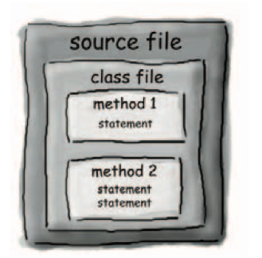

Java has friendly syntax, object-oriented features, memory management, and best of all - the **promise of probability** ( _write-one/run-anywhere_ ).


You type a source code file(`.java`). compile it using the `javac` compiler, then run(`java`) the compiled bytecode(`.class`) on a java virtual machine.



#### main method

Every Java application has to have at least one class, and at least one `main` method.

The `main` method is where your program starts running.

```Java
public static void main(String[] args){
    //your code goes here
}
```
#### Looping

Java has three standard looping constructs: `while`, `do-while`, and `for`.

```Java
while ( ) {

}
```

A boolean and an integer are not **compatible** types in Java.

```Java
int x=1;
while (x) {} //wrong
```

#### Conditional branching

```Java
if (conditional test) {
} else {
}
```

!!! note

    `System.out.println` inserts a newline,  `System.out.print` keeps           printing to the same line.

#### Strongly-typed language

Java is a **strongly typed language**(强类型语言) and that means I can't allow variables to hold data of the wrong type.

#### Dynamic Binding

However, There are some datatype exceptions that can emerge at runtime, but some of those have to be allowed to support one of Java's other important features -- **dynamic binding**(动态绑定).


Here are a few important differences between **static** and **dynamic** binding in Java [[ref](https://stackoverflow.com/questions/19017258/static-vs-dynamic-binding-in-java)]:

1. Static binding in Java occurs during **compile** time while dynamic binding occurs during **runtime**.
2. `private`, `final` and `static` methods and variables use static binding and are bonded by compiler while virtual methods are bonded during runtime based upon runtime object.
3. Static binding uses Type (class in Java) information for binding while dynamic binding uses object to resolve binding.
4. Overloaded methods are bonded using static binding while overridden methods are bonded using dynamic binding at runtime.

Static Binding Example in Java:

```Java
public class StaticBindingTest {  
    public static void main(String args[]) {
        Collection c = new HashSet();
        StaticBindingTest et = new StaticBindingTest();
        et.sort(c);
    }
    //overloaded method takes Collection argument
    public Collection sort(Collection c) {
        System.out.println("Inside Collection sort method");
        return c;
    }
    //another overloaded method which takes HashSet argument which is sub class
    public Collection sort(HashSet hs) {
        System.out.println("Inside HashSet sort method");
        return hs;
    }
}
```

Example of Dynamic Binding in Java:

```Java
public class DynamicBindingTest {   
    public static void main(String args[]) {
        Vehicle vehicle = new Car(); //here Type is vehicle but object will be Car
        vehicle.start(); //Car's start called because start() is overridden method
    }
}

class Vehicle {
    public void start() {
        System.out.println("Inside start method of Vehicle");
    }
}

class Car extends Vehicle {
    @Override
    public void start() {
        System.out.println("Inside start method of Car");
    }
}
```