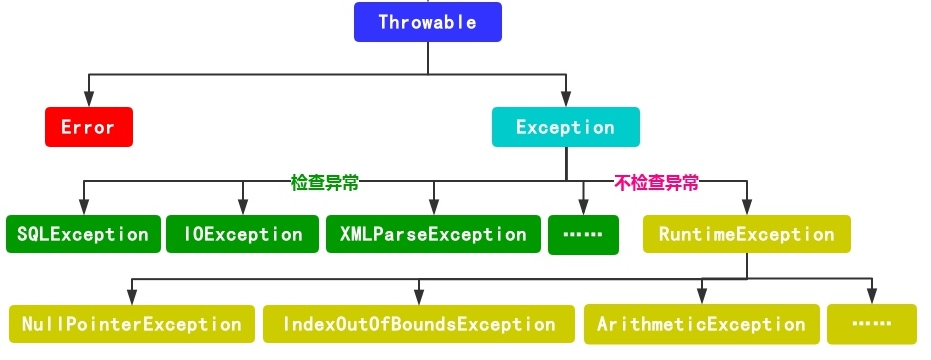
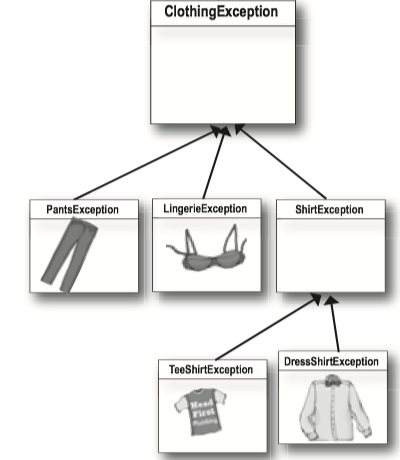

### 1 Exception
**Methods in Java use exceptions to tell the calling code, "Something Bad Happened. I failed."**

* If a method can fail at runtime, a method has to declare the exceptions it might throw. 
* You may find a **throws** clause in the risky(exception-throwing) method's declaration. 
*  _It's the risky method that *throws* the exception to *you*._

```Java
public static Sequencer getSequencer() throws MidiUnavailableException
```

#### try/catch

If you wrap the risky code in something called a **try/catch**, the compiler will relax.

A **try/catch** block tells the compiler that you *know* an exceptional thing could happen in the method you're calling, and that you're prepared to handle it.

An exception is an object of type `Exception`.

```Java
try {
    // do risky thing
} catch(Exception ex) { // its just like declaring a method argument
    // try to recover
    // This code only runs if an Exception is throw
}
```


#### Checked and unchecked exceptions

The compiler checks for everything except **RuntimeExceptions**.



* Error表示系统错误或资源耗尽，例如VirtualMachineError, OutOfMemeoryError, StackOverflowError。
* `RuntimeException`不受编译器检查，所以也叫**unchecked exceptions**(非检查型异常)。
    * `RuntimeException`能够在任何地方被抛出，可以使用也可以不使用throw语句或try/catch块。
    * 大多数`RuntimeException`来自于代码逻辑中的问题，而不是来自你不可预测或阻止的在运行时失败的情形。
    * 例如你不能保证文件就在那里，但是你可以确保你的索引不超过数组末尾。
* 其他不是 `RuntimeException`的异常受编译器检查，因此叫做"**checked exceptions**"(检查型异常).
    * 检查异常要求程序员进行处理，否则会有编译错误。

#### Flow control in try/catch blocks

* If the try *succeeds*, the code below the catch runs.
* If the try *fails*, it throws an exception and the rest of the try block doesn't run. And the catch block runs.

#### Finally block

**A finally block is where you put code that must run regardless of an exception.**

* If the try block fails (an exception), flow control immediately moves to the catch block. When the catch block completes, the finally block runs.
* If the try block succeeds (no exception), flow control skips over the catch block and moves to the finally block.
* If the try or catch block has a return statement, finally block will still run! Flow jumps to the finally, then back to the return.

```Java
// You have to turn off the oven no matter what!
try {
    turnOvenOn(); 
    x.bake();
} catch (BakingException ex) {
    ex.printStackTrace(); 
} finally {
    turnOvenOff(); 
}
```

#### Multiple exceptions

A method can throw **multiple exceptions** if it needs to. But a method's declaration must declare *all* the checked exceptions it can throw.

Stack the *catch* blocks under the *try*, one after the other.

```Java
public class Laundry {
    public void doLaundry() throws PantsException, LingerieException{ 
        // code that could throw either exception 
    }
}

public class Foo {
    public void go() { 
        Laundry laundry = new Laundry();
        try {
            laundry.doLaundry();
        } catch(PantsException pex) {
            // recovery code
        } catch(LingerieException lex) {
            // recovery code
        }
    }
}
```




**Multiple catch blocks must be ordered from smallest to biggest.**

* The higher up the inheritance tree, the bigger the catch "basket". (e.g. ClothingExceptions will catch TeeShirtException and ShirtException)
* With catch blocks, the JVM simply starts at the first one and works its way down until it finds a catch that's *broad enough *to handle the exception.
    * If your first catch block is `catch(Exception ex), the compiler knows there's no point in adding any others -- they'll never be reached.  


#### Polymorphic Exception

Exceptions are objects. The benefit for it is that a method doesn't have to explicitly declare *every* possible exception it might throw; it can declare a *superclass* of the exceptions.

 **You can DECLARE exceptions using a supertype of the exceptions you throw.**
 
```Java
public void doLaundry() throws ClothingException {  }
```


Same thing with catch blocks. You don't have to write a catch for each possible exception as long as the catch (or catches) you have can handle any exception throw.

**You can CATCH exceptions using a supertype of the exception thrown.**

```Java
try {
    laundry.doLaundry();
} catch(ClothingException cex) { // can catch any clothingException subclass.
    // recovery code
}
```

The mother of all catch arguments is type **Exception**; it will catch *any* exception, including runtime (unchecked) exceptions, so you probably won't use it outside of testing.

#### Duck exception

If you don't want to handle an exception, you can **duck** it by **declaring** it.

```Java
// You don't REALLY throw it, but since you don't have a try/catch
// for the risky method you call, you are now the risky method.

public void foo() throws ReallyBadException { 
    // call risky method without a try/catch    
    laundry.doLaundry(); 
    }
```
Ducking (by declaring) only delays the inevitable. Sooner or later, somebody has to deal with it.

But what if `main()` ducks the exception? 

* The exception is thrown back to JVM and the JVM shuts down.

```Java
import java.io.FileReader;
import java.io.IOException;

public class test {
    public void go() throws IOException {
        try {
            String fileName = "imdonotexist.file";
            FileReader writer = new FileReader(fileName);

        } catch (IOException ioexcept) {
            ioexcept.printStackTrace();
        }
        finally {
            System.out.println("Finally....");

        }
    }


    public static void main(String[] args) throws IOException {
        test test1 = new test();
        test1.go();
        System.out.println("I'm in main.");
    }
}

```


### 2 MIDI Music Player

**JavaSound** is a collection of classes and interfaces added to Java starting with version 1.3. JavaSound is split into two parts: MIDI and Sampled. **MIDI** stands for **Musical Instrument Digital Interface**, and is a standard protocol for getting different kinds of electronic sound equipment to communicate.

MIDI data doesn't actually include any *sound*, but it does include the *instructions* that a MIDI-reading instrument can play back.

#### Making actual sound

How it works in JavaSound:


* **Sequencer**: It takes all the MIDI data and sends it to the right instruments. It's the thing that *plays* the music. Think of it like a **music CD player**.
* **Sequence**: It is the Song, the musical piece that the Sequencer will play.
* **Track**: The part of the Sequence that holds the actual information.
* **MIDI Event**: It is a message that the Sequence can understand.

And you need FOUR steps:

1. Get a **Sequencer** and open it: `:::Java Sequencer player = MidiSystem.getSequencer(); player.open();`
2. Make a new **Sequence**: `:::Java Sequence seq = new Sequence(timing, 4);`
3. Get a new **Track** from the Sequence: `:::Java Track t= seq.createTrack();`
4. Fill the Track with **MidiEvents** and give the Sequence to the Sequencer: `:::Java t.add(myMidiEvent1); player.setSequence(seq);`

<small>

```Java
import javax.sound.midi.*;

public class MiniMiniMusicApp {   // this is the first one
       
     public static void main(String[] args) {
        MiniMiniMusicApp mini = new MiniMiniMusicApp();
        mini.play();
     }

    public void play() {
      try {
         // make (and open) a sequencer, make a sequence and track

         Sequencer sequencer = MidiSystem.getSequencer();         
         sequencer.open();
        
         Sequence seq = new Sequence(Sequence.PPQ, 4);
         Track track = seq.createTrack();     

         // now make two midi events (containing a midi message)
         MidiEvent event = null;
         
         // first make the message
         // then stick the message into a midi event 
         // and add the event to the track
          ShortMessage a = new ShortMessage();
          a.setMessage(144, 1, 44, 100);
          MidiEvent noteOn = new MidiEvent(a, 1);//means at tick one, the above event happens
          track.add(noteOn);

          ShortMessage b = new ShortMessage();
          b.setMessage(128, 1, 44, 100);
          MidiEvent noteOff = new MidiEvent(b, 16);//means at tick one, the above event happens
          track.add(noteOff);
        
         // add the events to the track
            
          // add the sequence to the sequencer, set timing, and start
          sequencer.setSequence(seq);
         
          sequencer.start();
          // new
          Thread.sleep(1000);
          sequencer.close();
          System.exit(0);
      } catch (Exception ex) {ex.printStackTrace();}
  } // close play

} // close class
```
</small>

#### MidiEvent

**A MidiEvent says what to do and when to do it.**

```Java
ShortMessage a = new ShortMessage();
a.setMessage(144, 1, 44, 100);
MidiEvent noteOn = new MidiEvent(a, 1);
track.add(noteon);
```

Explanation for the code above:

The instructions are in the message, but the MidiEvent adds the moment in time when the instruction should be triggered. This MidiEvent says to trigger message "a" at the first beat (beat 1).
