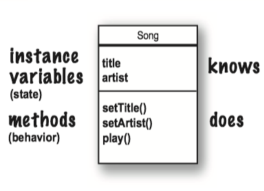
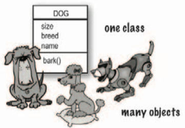

#### Object Oriented 
What do you like about OO? Some people say...

* It helps me design in a more natural way. Things have a way of evolving.
* Not messing around with the code I've already tested, just to add a new feature.
* Reusing code in other applications. When I write a new class, I can make it flexible enough to be used in something new, later

#### Class

A class describes what an object **knows**(instance variables, 实例变量) and what an object **does**(methods).

What's the **difference** between a class and an object?

* A class is **not** an object. 
* A class is the **blueprint** for an object. 
* A class tells the JVM *how* to make an object of that particular type. 
* Each object made from that class have its *own* values for the instance variables of that class.

#### main method

The two uses of `main` method:

* to ***test*** your real class
* to ***launch/start*** your Java application.
