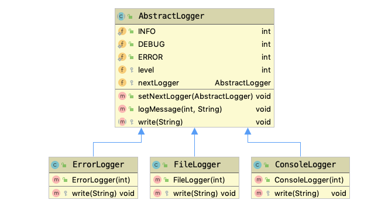

> 通过**责任链**(Chain Of Responsibility)模式，你可以为某个请求创建一个对象链。每个对象依序检查此请求，并对其进行处理，或者将它传给链中的下一个对象。

!!! example "Logger"
    
    我们创建抽象类`AbstractLogger`，带有详细的日志记录级别。然后我们创建三种类型的记录器，都扩展了`AbstractLogger`。每个记录器消息的级别是否属于自己的级别，如果是则相应地打印出来，否则将不打印并把消息传给下一个记录器。
    
    ```java tab="AbstractLogger"
    public abstract class AbstractLogger {
       public static int INFO = 1;
       public static int DEBUG = 2;
       public static int ERROR = 3;
     
       protected int level;
     
       //责任链中的下一个元素
       protected AbstractLogger nextLogger;
     
       public void setNextLogger(AbstractLogger nextLogger){
          this.nextLogger = nextLogger;
       }
     
       public void logMessage(int level, String message){
          if(this.level <= level){
             write(message);
          }
          if(nextLogger !=null){
             nextLogger.logMessage(level, message);
          }
       }
     
       abstract protected void write(String message);
       
    }
    ```
    
    ``` java tab="ConsoleLogger"
    public class ConsoleLogger extends AbstractLogger {
     
       public ConsoleLogger(int level){
          this.level = level;
       }
     
       @Override
       protected void write(String message) {    
          System.out.println("Standard Console::Logger: "
                       + message);
       }
    }
    ```
    
    
    ```java tab="ErrorLogger.java"
    public class ErrorLogger extends AbstractLogger {
     
       public ErrorLogger(int level){
          this.level = level;
       }
     
       @Override
       protected void write(String message) {    
          System.out.println("Error Console::Logger: " + message);
       }
    }
    ```
    
    ```java tab="FileLogger.java"
    public class FileLogger extends AbstractLogger {
     
       public FileLogger(int level){
          this.level = level;
       }
     
       @Override
       protected void write(String message) {    
          System.out.println("File::Logger: " + message);
       }
    }
    ```
    
    ```java tab="ChainPatternDemo.java"
    public class ChainPatternDemo {
       
       private static AbstractLogger getChainOfLoggers(){
     
          AbstractLogger errorLogger = new 
                ErrorLogger(AbstractLogger.ERROR);
          AbstractLogger fileLogger = new 
                FileLogger(AbstractLogger.DEBUG);
          AbstractLogger consoleLogger = new 
                ConsoleLogger(AbstractLogger.INFO);
     
          errorLogger.setNextLogger(fileLogger);
          fileLogger.setNextLogger(consoleLogger);
     
          return errorLogger;  
       }
     
       public static void main(String[] args) {
          AbstractLogger loggerChain = getChainOfLoggers();
     
          loggerChain.logMessage(AbstractLogger.INFO, 
                "This is an information.");
     
          loggerChain.logMessage(AbstractLogger.DEBUG, 
             "This is a debug level information.");
     
          loggerChain.logMessage(AbstractLogger.ERROR, 
             "This is an error information.");
       }
    }
    ```
    
    

dsaf