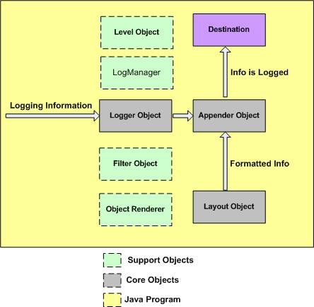
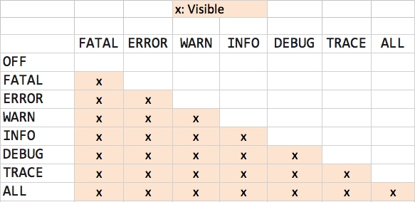

### 1 介绍

[Log4j](http://logging.apache.org/log4j/1.2/)是一个功能强大的日志框架，提供方便的日志记录。

Log4j中有三个主要组成部分：

* loggers: 负责捕获记录信息。
* appenders: 负责发布日志信息，以不同的首选目的地。
* layouts: 负责格式化不同风格的日志信息。



### 2 配置

slf4j(Simple Logging Facade for Java)，是日志底层接口的实现，类似于中间件，一边对应底层的接口，一边可以根据偏好接入不同的日志系统(log4j)。

Log4J的Maven配置。

```xml
<dependency>  
    <groupId>org.slf4j</groupId>  
    <artifactId>slf4j-log4j12</artifactId>  
    <version>1.7.25</version>  
</dependency>  
```


`log4j.properties`文件是一个键 - 值对保存log4j 配置属性文件。默认情况下，日志管理在CLASSPATH 查找一个名为 `log4j.properties`的文件。

!!! example "log4j.properties示例"

    ```xml
    ## set log levels ###
    log4j.rootLogger = INFO, console, debugFile, errorFile
    
    ### 输出到控制台 ###
    log4j.appender.console = org.apache.log4j.ConsoleAppender
    ##这个不指定默认是System.out,指定输出控制台
    log4j.appender.console.Target = System.out
    ##输出INFO级别以上的日志
    log4j.appender.console.Threshold = INFO
    ##布局模式，自己灵活指定
    log4j.appender.console.layout = org.apache.log4j.PatternLayout
    log4j.appender.console.layout.ConversionPattern = [framework][%d{ABSOLUTE}-%l][%p]:%m %n
    
    ### 保存日志内容到具体文件 ###
    ##输出到每天一个独立文件
    log4j.appender.debugFile = org.apache.log4j.DailyRollingFileAppender
    ##输出DEBUG级别以上的日志
    log4j.appender.debugFile.Threshold = DEBUG
    ##异常日志文件路径,文件名称方案
    log4j.appender.debugFile.File = logs/log.log
    log4j.appender.debugFile.DatePattern = '.'yyyy-MM-dd-HH
    ##设定信息是增加而不是覆盖
    log4j.appender.debugFile.Append=true
    #信息输出格式
    log4j.appender.debugFile.layout = org.apache.log4j.PatternLayout
    log4j.appender.debugFile.layout.ConversionPattern = [framework][%d{ABSOLUTE}-%l][%p]:%m %n
    
    ### 保存异常信息到具体文件 ###
    ##输出到每天一个独立文件
    log4j.appender.errorFile = org.apache.log4j.DailyRollingFileAppender
    ##只输出ERROR级别以上的日志内容
    log4j.appender.errorFile.Threshold = ERROR
    ##异常日志文件路径,文件名称方案
    log4j.appender.errorFile.File = logs/error.log
    log4j.appender.errorFile.DatePattern = '.'yyyy-MM-dd-HH
    ##设定信息是增加而不是覆盖
    log4j.appender.errorFile.Append=true
    #信息输出格式
    log4j.appender.errorFile.layout = org.apache.log4j.PatternLayout
    log4j.appender.errorFile.layout.ConversionPattern = [framework][%d{ABSOLUTE}-%l][%p]:%m %n
    ```

在Java程序中使用Log4J

!!! example "Log4j使用"

    ```java
    private static final Logger logger = 
        LoggerFactory.getLogger(TestSpringController.class); 
    
    logger.debug();
    logger.info();
    logger.debug();
    ```
    
#### 3 Level

 `log4j.rootLogger = [ level ] , appenderName1, appenderName2, …`中的level是日志记录的优先级：

* **Trace** - Only when I would be "tracing" the code and trying to find one part of a function specifically.
* **Debug** - Information that is diagnostically helpful to people more than just developers (IT, sysadmins, etc.).
* **Info** - Generally useful information to log (service start/stop, configuration assumptions, etc). Info I want to always have available but usually don't care about under normal circumstances. This is my out-of-the-box config level.
* **Warn** - Anything that can potentially cause application oddities, but for which I am automatically recovering. (Such as switching from a primary to backup server, retrying an operation, missing secondary data, etc.)
* **Error** - Any error which is fatal to the operation, but not the service or application (can't open a required file, missing data, etc.). These errors will force user (administrator, or direct user) intervention. These are usually reserved (in my apps) for incorrect connection strings, missing services, etc.
* **Fatal** - Any error that is forcing a shutdown of the service or application to prevent data loss (or further data loss). I reserve these only for the most heinous errors and situations where there is guaranteed to have been data corruption or loss.    
    

