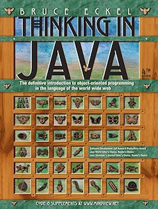
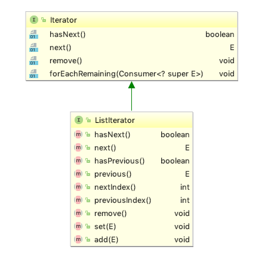
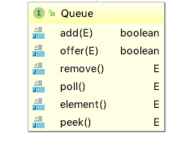
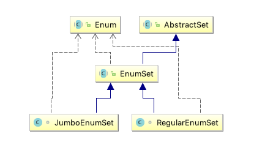

###  1 简介


略
###  2 对象导论


略
###  3 Everything is an Object


...to be continued
###  4 Operators


...to be continued

###  5 Controlling Execution


...to be continued
###  6 初始化和管理


#### Enumerated types

The <C>enum</C> keyword, makes much easier to group together and to use a set of *enumerated types*. Since instances of enumerate types are constants,  they are in all capital letters by convention.

In fact, <C>enum</C>s are classes and have their own methods. The compiler automatically adds useful methods(<C>toString()</C>, <C>ordinal</C>, <C>values()</C> when you create an <C>enum</C>. The <C>ordinal()</C> method indicates the declaration order of a particular  <C>enum</C> constant, and a static <C>values()</C> method that produces an array of values of the  <C>enum</C> constants in the order that they were declared.

An especially nice feature is the way that <C>enum</C>s can be used inside <C>switch</C> statements.

```Java
public enum Spiciness {
  NOT, MILD, MEDIUM, HOT, FLAMING
}
public class Burrito {
  Spiciness degree;
  public Burrito(Spiciness degree) { this.degree = degree;}
  public void describe() {
    System.out.print("This burrito is ");
    switch(degree) {
      case NOT:    System.out.println("not spicy at all.");
                   break;
      case MILD:
      case MEDIUM: System.out.println("a little hot.");
                   break;
      case HOT:
      case FLAMING:
      default:     System.out.println("maybe too hot.");
    }
  }
}
```
###  7 Access Control


...to be continued
###  8 复用类


...to be continued

###  9 多态


...to be continued

###  10 接口


...to be continued


###  11 内部类


内部类：将定义放在一个类的定义内部
Inner Class: Place a class definition within another class definition.

When you create an inner class, an object of that inner class has a *link* to *the enclosing object that made it*, and so it can access the members of that enclosing object - without any special qualifications.

##### 使用`.this`和`.new`

在普通内部类中，通过`this`引用可以链接到其外部对象。

```java
public class Outer {
    private List<Integer> ints = new ArrayList<>();
    public class Inner {
        public Outer getOuter() {
            // 直接使用this，将会得到Inner's this
            return Outer.this;
        }

        public boolean exists(Integer int) {
            // 使用Outer.this.ints得到外部类的字段
            if (Outer.this.ints.contains(int) return true;
            return false;
        }

    }

    public Inner getInner() {
        return new Inner();
    }

    public void getInfo() {
        System.out.println("I'm Outer");
    }

    public static void main(String[] args) {
        Outer outer = new Outer();
        Outer.Inner inner = outer.getInner();
        inner.getOuter().getInfo();
    }
}
```

创建内部类可以使用`.new`语法。例如上面这个例子可以不使用`getInner()`：

```java
//其他代码与上面的Outer相同
public static void main(String[] args) {
    Outer outer = new Outer();
    Outer.Inner inner = outer.new Inner();
    inner.getOuter().getInfo();
}
```


##### 匿名内部类

Anonymous inner classes(匿名内部类)

```java
public class Parcel7 {
    public Contents contents() {
        return new Contents() { // Insert a class definition
            private int i = 11;
            public int value() { return i; }
        }; // Semicolon required in this case
    }
    public static void main(String[] args) {
        Parcel7 p = new Parcel7();
        Contents c = p.contents();
}

} ///:~
```

The `contents()` method combines the creation of the return value with the definition of the class that represents that return value! In addition, the class is *anonymous*;

##### 静态内部类

静态内部类(Static nested classes): 内部类声明为`static`。

非静态内部类对象隐式地保存了一个引用，指向创建它的外围类对象。当内部类声明为`static`时：

* 要创建静态内部类的对象时，并不需要外围类的对象；
* 不能从静态内部类的对象中访问非静态的外围类对象。

在非`static`内部类中，通过`this`引用可以链接到其外围类对象。类似于`static`方法，静态内部类没有`this`引用。


##### 为什么需要内部类

如果只是需要一个对接口的引用，可以满足需求的话，直接通过外围类实现接口，而不需要使用内部类。

使用内部类最吸引人的原因是：*每个内部类都能独立地继承一个接口的实现，所以无论外部类是否已经继承了某个接口类的实现，对于内部类都没有影响。*

###  12 Holding Your Objects


...to be continued

The <C>java.util</C> library has a reasonably complete set of container classes, the basic types of which are <C>List</C>, <C>Set</C>, <C>Queue</C>, and <C>Map</C>.

##### Generics and type-safe containers

One of the problems of using pre-Java SE5 containers was that the compiler allowed you to insert an incorrect type into a container.

```Java
public class ApplesAndOrangesWithoutGenerics {
  @SuppressWarnings("unchecked")
  public static void main(String[] args) {
    ArrayList apples = new ArrayList();
    for(int i = 0; i < 3; i++)
      apples.add(new Apple());
    // Not prevented from adding an Orange to apples:
    apples.add(new Orange());
    for(int i = 0; i < apples.size(); i++)
      ((Apple)apples.get(i)).id();
      // Orange is detected only at run time
  }
}

//output: Exception in thread "main"
java.lang.ClassCastException: holding.Orange cannot be cast to holding.Apple
```

With generics, you're prevented, at **compile** time, from putting the wrong type of object into a container. Now the compiler will prevent you from putting an Orange into apples, so it becomes a compile-time error rather than a runtime error.


##### Basic concepts

The Java container library takes the idea of "holding your objects" and divides it into two distinct concepts, expressed as the basic interfaces of the library:

* <C>Collection</C>: a sequence of individual elements with one or more rules applied to them.
    * <C>List</C>, <C>Set</C>, <C>Queue</C>
    * The <C>Collection</C> interface generalizes the idea of a *sequence*—a way of holding a group of objects.
* <C>Map</C>: a group of key-value object pairs, allowing you to look up a value using a key.


##### Adding groups of elements

* <C>Arrays.asList()</C> takes either an array or a comma-separated list of elements (using varargs) and turns it into a <C>List</C> object.
* <C>Collections.addAll()</C> takes a <C>Collection</C> object and either an array or a comma-separated list and adds the elements to the <C>Collection</C>.


```Java
public class Arrays {
...
    public static <T> List<T> asList(T... a) {
        return new ArrayList<>(a);
    }
...
```

##### Printing containers

You must use <C>Arrays.toString()</C> to produce a printable representation of an array, but the containers print nicely without any help.

##### List

Lists promise to maintain elements in a particular sequence. The <C>List</C> interface adds a number of methods to <C>Collection</C> that allow insertion and removal of elements in the middle of a <C>List</C>.

There are two types of <C>List</C>:

* The basic <C>ArrayList</C>, which excels at randomly accessing elements, but is slower when inserting and removing elements in the middle of a List.
* The <C>LinkedList</C>, which provides optimal sequential access, with inexpensive insertions and deletions from the middle of the List. A <C>LinkedList</C> is relatively slow for random access, but it has a larger feature set than the <C>ArrayList</C>.


##### ListIterator

The <C>ListIterator</C> is a more powerful subtype of <C>Iterator</C> that is produced only by <C>List</C> classes. While <C>Iterator</C> can only move forward, <C>ListIterator</C> is bidirectional.




A <C>ListIterator</C> has no current element; its <I>cursor position</I> always lies between the element that would be returned by a call to <C>previous()</C> and the element that would be returned by a call to <C>next()</C>. An iterator for a list of length n has n+1 possible
cursor positions, as illustrated by the carets (^ ) below:

```
                     Element(0)   Element(1)   Element(2)   ... Element(n-1)
cursor positions:  ^            ^            ^            ^      
```


An example:

```Java
public class ListIteration {
  public static void main(String[] args) {
    List<Pet> pets = Pets.arrayList(8);
    ListIterator<Pet> it = pets.listIterator();
    while(it.hasNext())
      System.out.print(it.next() + ", " + it.nextIndex() +
        ", " + it.previousIndex() + "; ");
    }
  }
}
// Output:
// Rat, 1, 0; Manx, 2, 1; Cymric, 3, 2; Mutt, 4, 3; Pug, 5, 4;
// Cymric, 6, 5; Pug, 7, 6; Manx, 8, 7;
```

##### Set

* <C>TreeSet</C> keeps elements sorted into a red-black tree data structure.
* <C>HashSet</C> uses the hashing function.
* <C>LinkedHashSet</C> also uses hashing for lookup speed, but appears to maintain elements in insertion order using a linked list.

If you want the results to be sorted, one approach is to use a <C>TreeSet</C> instead of a <C>HashSet</C>.

##### Map

The <C>HashMap</C> class is roughly equivalent to <C>Hashtable</C>, except:

* <C>HashMap</C> is **unsynchronized**, <C>HashTable</C> is **synchronized**.
* <C>HashMap</C> **permits** nulls, <C>HashTable</C> does **NOT** permite nulls.


1. 继承不同。
    * public class Hashtable extends Dictionary implements Map
    * public class HashMap extends AbstractMap implements Map
2. Hashtable中的方法是同步的，而HashMap中的方法在缺省情况下是非同步的。在多线程并发的环境下，可以直接使用Hashtable，但是要使用HashMap的话就要自己增加同步处理了。
3. Hashtable中，key和value都不允许出现null值。在HashMap中，null可以作为键，这样的键只有一个；可以有一个或多个键所对应的值为null。当get()方法返回null值时，即可以表示 HashMap中没有该键，也可以表示该键所对应的值为null。因此，在HashMap中不能由get()方法来判断HashMap中是否存在某个键， 而应该用containsKey()方法来判断。
4. 两个遍历方式的内部实现上不同。Hashtable、HashMap都使用了 Iterator。而由于历史原因，Hashtable还使用了Enumeration的方式 。
5. 哈希值的使用不同，HashTable直接使用对象的hashCode。而HashMap重新计算hash值。
6. Hashtable和HashMap它们两个内部实现方式的数组的初始大小和扩容的方式。HashTable中hash数组默认大小是11，增加的方式是 old*2+1。HashMap中hash数组的默认大小是16，而且一定是2的指数

##### Queue

<C>LinkedList</C> has methods to support queue behavior and it implements the <C>Queue</C> interface, so a <C>LinkedList</C> can be used as a <C>Queue</C> implementation by upcasting a <C>LinkedList</C> to a <C>Queue</C>.

```Java
public class LinkedList<E>
    extends AbstractSequentialList<E>
    implements List<E>, Deque<E>, Cloneable, java.io.Serializable
```

Interface <C>Queue</C>:




<C>offer()</C> inserts an element at the tail of the queue if it can, or returns false. Both <C>peek()</C> and <C>element()</C> return the head of the queue without removing it, but <C>peek()</C> returns null if the queue is empty and <C>element()</C> throws <C>NoSuchElementException</C>. Both <C>poll()</C> and <C>remove()</C> remove and return the head of the queue, but <C>poll()</C> returns null if the queue is empty, while <C>remove()</C>throws<C>NoSuchElementException</C>.

```Java
public class QueueDemo {
  public static void printQ(Queue queue) {
    while(queue.peek() != null)
      System.out.print(queue.remove() + " ");
    System.out.println();
  }
  public static void main(String[] args) {
    Queue<Integer> queue = new LinkedList<Integer>();
    Random rand = new Random(47);
    for(int i = 0; i < 10; i++)
      queue.offer(rand.nextInt(i + 10));
    printQ(queue);
    Queue<Character> qc = new LinkedList<Character>();
    for(char c : "Brontosaurus".toCharArray())
      qc.offer(c);
    printQ(qc);
  }
} /* Output:
8 1 1 1 5 14 3 1 0 1
B r o n t o s a u r u s
*///:~
```

##### PriorityQueue

The elements of the priority queue are ordered according to their <C>Comparable</C> natural ordering, or by a <C>Comparator</C> provided at queue construction time, depending on which constructor is used.

```Java
// natural order
PriorityQueue<Integer> priorityQueue = new PriorityQueue<Integer>();
// reverse natural order
priorityQueue = new PriorityQueue<Integer>(ints.size(), Collections.reverseOrder());
```

##### Foreach and iterators

Java SE5 introduced a new interface called <C>Iterable</C> which contains an <C>iterator()</C> method to produce an <C>Iterator</C>, and the <C>Iterable</C> interface is what foreach uses to move through a sequence. So if you create any class that implements <C>Iterable</C>, you can use it in a foreach statement.

From Java SE5, a number of classes have been made <C>Iterable</C>, primarily all <C>Collection</C> classes (but not <C>Maps</C>).


<C>Map.entrySet()</C> produces a <C>Set</C> of <C>Map.Entry</C> elements, and a <C>Set</C> is <C>Iterable</C> so it can be used in a foreach loop.

```Java
HashMap<String, HashMap> selects = new HashMap<String, HashMap>();
for(Map.Entry<String, HashMap> entry : selects.entrySet()) {
    String key = entry.getKey();
    HashMap value = entry.getValue();

    // do what you have to do here
    // In your case, another loop.
}
```
###  13 通过异常处理错误


...to be continued
###  14 String


...to be continued
###  15 类型信息


> 运行时类型信息(RunTime Type Information, RTTI)使得你可以在程序运行时发现和使用类型信息。


##### 为什么需要RTTI

* Java的多态需要RTTI识别出对象的类型。由RTTI确保类型转换的正确性，如果执行了一个错误的类型转换。就会抛出异常。
* 通过查询Class对象获取运行时所需的信息。


##### Class对象

`Class`对象包含了类型信息。Java使用Class对象来执行RTTI。每个类都有一个Class对象。JVM使用类加载器(Class Loader)生成类的对象([详见深入理解Java虚拟机](深入理解Java虚拟机.md))。

Class的常见方法：

* `forName()`: 返回Class对象的引用
* `getSimpleName()`/`getConnicalName()`: 返回不包含包名/全限定的类名
* `getInterfaces()`：返回对象中所包含的接口
* `newInstance()`：返回新建的类


类字面常量，是Class对象的引用。与`forName()`方法相比，更简单，更安全(编译时检查)，更高效(不用调用函数)。但是不会初始化Class对象。

**泛化的Class引用**

Class引用表示它所指向的对象的确切类型。并允许对Class引用所指向的类型进行限定：

```java
Class intClass = int.class;   // 普通的类引用
Class<Integer> genericIntClass = int.class; //使用泛型进行限定
```
使用泛型语法，可以让编译器强制执行额外的类型检查。


!!! note "Class<?>"

    使用`Class<?>`优于`Class`，即使它们等价。使用`Class<?>`的好处是它表示你并非是由于疏忽而使用了一个非具体的类引用，而是你选择的非具体的版本。


##### 类型转换前先做检查

RTTI还有第三种形式，就是关键字`instanceof`。它的返回值是布尔类型，返回对象是不是给定类的实例。

```java
if (x instanceof Dog) //检查对象是不是Dog类型
    ((Dog) x).bark();
```

在类型检查时，`instanceof`和`isInstance()`等价，`equals()`和`==`也等价。但是`instanceof`保持了类型的概念，它指的是"你是这个类吗，或者你是这个类的派生类吗?"。而`==`比较的是确切的类型。

```java
Object x = Derived;
x instanceof Base //true
x instanceof Derived //true
Base.isInstance(x) //true
Derived.isInstance(x) //true
x.getClass() == Base.class //false
x.getClass() == Derived.class //true
x.getClass().equals(Base.class)) //false
x.getClass().equals(Derived.class)) //true
```

##### 反射

利用RTTI有个前提，就是对象类型在编译时是已知的。

假设你从网络连接中获取了一串子节，这些子节代表一个类。例如方程方法调用RMI，那怎么办呢？

RTTI和反射机制差不多。真正的区别是

* 对RTTI来说，编译器在编译时打开和检查`.class`文件。
* 对反射来说，`.class`文件在编译时是不可取的，而是在运行时打开和检查`.class`文件。


##### 动态代理

##### 空对象
#### 接口和类型信息

###  16 泛型


...to be continued
###  17 Arrays


...to be continued
###  18 Containers in Depth


...to be continued
###  19 IO


...to be continued
###  20 枚举类型


When you create an `enum`, an associated class is produced for you by the compiler. This class is automatically **inherited** from `java.lang.Enum`.

```Java
public abstract class Enum< E extends Enum<E>>
        implements Comparable< E >, Serializable {
  private final String name;
  public  final String name() { ... }
  private final int ordinal;
  public  final int ordinal() { ... }

  protected Enum(String name, int ordinal) { ... }

  public String           toString() { ... }
  public final boolean    equals(Object other) { ... }
  public final int        hashCode() { ... }
  protected final Object  clone() throws CloneNotSupportedException { ... }
  public final int        compareTo( E o) { ... }

  public final Class< E > getDeclaringClass() { ... }
  public static <T extends Enum<T>> T valueOf(Class<T> enumType,
        String name) { ... }
}
```

The definition means that the type argument for `enum` has to derive from an `enum` which itself has the same type argument.  So if I've got an `enum` called `StatusCode`, it would be equivalent to [[ref](https://stackoverflow.com/questions/211143/java-enum-definition)]:

```Java
public class StatusCode extends Enum<StatusCode>
```


!!! note "why Enum<E extends Enum<E>>"

    [[ref](http://www.angelikalanger.com/GenericsFAQ/FAQSections/TypeParameters.html#FAQ106)]

    *As a type that can only be instantiation for its subtypes, and those subtypes will inherit some useful methods, some of which take subtype arguments (or otherwise depend on the subtype).*

    First, there is the fact that the type parameter bound is the type itself: `Enum <E extends Enum <E>> `. It makes sure that only subtypes of type `Enum` are permitted as type arguments.

    Second, there is the fact that the type parameter bound is the parameterized type `Enum <E>`,  which uses the type parameter `E` as the type argument of the bound. This declaration makes sure that the inheritance relationship between a subtype and an instantiation of `Enum` is of the form `X extends Enum<X>`. A subtype such as `X extends Enum<Y>` cannot be declared because the type argument Y would not be within bounds; only subtypes of `Enum<X>` are within bounds.

    Third, there is the fact that `Enum` is generic in the first place.  It means that some of the methods of class `Enum` take an argument or return a value of an unknown type (or otherwise depend on an unknown type). As we already know, this unknown type will later be a subtype X of `Enum<X>` .  Hence, in the parameterized type `Enum<X>` , these methods involve the subtype X , and they are inherited into the subtype X.  The compareTo method is an example of such a method; it is inherited from the superclass into each subclass and has a subclass specific signature in each case.

    To sum it up, the declaration `Enum<E extends Enum<E>> ` can be deciphered as: `Enum` is a generic type that can only be instantiated for its subtypes, and those subtypes will inherit some useful methods, some of which take subtype specific arguments (or otherwise depend on the subtype).  


##### Using static imports with enums

The `static` import brings all the `enum` instance identifiers into the local namespace, so they don’t need to be qualified.

```Java
// Spiciness.java
public enum Spiciness {
  NOT, MILD, MEDIUM, HOT, FLAMING
}
// Burrito.java
import static Spiciness.*;
public class Burrito {
    Spiciness degree;
    public Burrito(Spiciness degree) { this.degree = degree;}
    public String toString() { return "Burrito is "+ degree;}
    public static void main(String[] args) {
        System.out.println(new Burrito(NOT));
        System.out.println(new Burrito(HOT));
    }
}
```

##### Adding methods to an enum

Except for the fact that you can’t inherit from it, an `enum` can be treated much like a regular class. This means that you can add methods to an  `enum` . It’s even possible for an  `enum`  to have a `main()`. Notice that if you are going to define methods you must end the sequence of `enum` instances with a semicolon.

```Java
public enum OzWitch {
    // Instances must be defined first, before methods:
    WEST("Miss Gulch, aka the Wicked Witch of the West"),
    SOUTH("Good by inference, but missing");  // end with a ;
    private String description;
    // Constructor must be package or private access:
    // 定义构造器，初始化OzWitch(description)
    private OzWitch(String description) {
        this.description = description;
    }
    public String getDescription() { return description; }
    public static void main(String[] args) {
        for (OzWitch witch : OzWitch.values())
        print(witch + ": " + witch.getDescription());
    }
}
```

Also you can overriding `enum` methods.


##### The mystery of values()

The method `values()` is a static method that is added by the compiler.

> The compiler automatically adds some special methods when it creates an enum. For example, they have a static `values()` method that returns an array containing all of the values of the enum in the order they are declared. This method is commonly used in combination with the `for-each` construct to iterate over the values of an enum type. [[Java Tutorials - Enum Type](https://docs.oracle.com/javase/tutorial/java/javaOO/enum.html)]


##### Implements, not inherits

All `enum`s extend `java.lang.Enum`. Since Java does not support multiple inheritance, this means that you cannot create an `enum` via inheritance. However, it is possible to create an `enum` that implements one or more interfaces.


##### Using EnumSet instead of flags

The `EnumSet` was added to Java SE5 to work in concert with `enum`s to create a replacement for traditional `int`-based "bit flags." The `EnumSet` is designed for speed, because it must compete effectively with bit flags. Internally, it is represented by (if possible) a **single** `long` that is treated as a bit-vector, so it’s extremely fast and efficient.


```Java
package java.util;
public abstract class EnumSet<E extends Enum<E>> extends AbstractSet<E>
    implements Cloneable, java.io.Serializable
```

`EnumSet`s are built on top of `long`s, a `long` is 64 bits, and each `enum` instance requires one bit to indicate presence or absence. This means you can have an `EnumSet`  for an `enum` of up to 64 elements without going beyond the use of a single `long`.

`EnumSet`是一个抽象类，不能直接通过`new`新建，不过提供了若干静态工厂方法<!--([参见Effective Java Item 1](2 Creating and Destroying Objects.md))-->(`noneof()`, `allof()`等)。

当`EnumSet`大于64个时，其内部采用`JumboEnumSet`，否则采用`RegularEnumSet`:
（jumbo/'dʒʌmbo/是巨大的意思)

```Java
// Java JDK 10 源代码
// The class of all the elements of this set.
final Class<E> elementType;
// All of the values comprising T.  (Cached for performance.)
final Enum<?>[] universe;
// Creates an empty enum set with the specified element type.
// 静态工厂方法
public static <E extends Enum<E>> EnumSet<E> noneOf(Class<E> elementType) {
    Enum<?>[] universe = getUniverse(elementType);
    if (universe == null)
        throw new ClassCastException(elementType + " not an enum");
    if (universe.length <= 64)
        return new RegularEnumSet<>(elementType, universe);
    else
        return new JumboEnumSet<>(elementType, universe);
}
```



对于`RegularEnumSet`，它用一个`long`类型表示位向量;对于`JumboEnumSet`，它用一个`long`数组表示。

```Java
// RegularEnumSet.java
// Bit vector representation of this set.  
// The 2^k bit indicates the presence of universe[k] in this set.
private long elements = 0L;

// JumboEnumSet.java
// Bit vector representation of this set.  The ith bit of the jth
// element of this array represents the  presence of universe[64*j +i]
// in this set.
private long elements[];
```


##### Using EnumMap

An `EnumMap` is a specialized `Map` that requires that its keys be from a single `enum`. Because of the constraints on an `enum`, an `EnumMap` can be implemented internally as an array. Thus they are extremely fast, so you can freely use `EnumMaps` for enum-based lookups.

```Java
public class EnumMap<K extends Enum<K>, V> extends AbstractMap<K, V>
    implements java.io.Serializable, Cloneable
private final Class<K> keyType;
// Array representation of this map.
private transient Object[] vals;
```

`key`其实就是`Enum.ordinal()`(返回枚举项在枚举类中出现的序号)，所以实际上`EnumMaps`就是一个数组，如果要查询某个`key`是否存在：

```Java
public boolean containsKey(Object key) {
    return isValidKey(key) && vals[((Enum<?>)key).ordinal()] != null;
}
```

再来看看`put()`方法：

```Java
public V put(K key, V value) {
    typeCheck(key);

    int index = key.ordinal();
    Object oldValue = vals[index];
    vals[index] = maskNull(value);
    if (oldValue == null)
        size++;
    return unmaskNull(oldValue);
}
```
###  21 注解


> Annotations (注解, also known as *metadata*) provide a formalized way to add information to your code so that you can easily use that data at some later point.

The syntax of annotations is reasonably simple and consists mainly of the addition of the `@symbol` to the language. Java SE5 contains three general purpose built-in annotations, defined in <C>java.lang</C>:

* @**Override**, to indicate that a method definition is intended to override a method in the base class. This generates a compiler error if you accidentally misspell the method name or give an improper signature.
* @**Deprecated**, to produce a compiler warning if this element is used.
* @**SuppressWarnings**, to turn off inappropriate compiler warnings.

#### 1 Basic syntax


##### Defining annotations

Annotation definitions look a lot like interface definitions. In fact, they compile to class files like any other Java interface:

```Java
@Target(ElementType.METHOD)
@Retention(RetentionPolicy.RUNTIME)
public @interface Test {} //注意在interface之前有@符号
```

An annotation definition also requires the meta-annotations <C>@Target</C> and <C>@Retention</C>. <C>@Target</C> defines where you can apply this annotation (a method or a field, for example). <C>@Retention</C> defines whether the annotations are available in the source code, in the class files, or at run time.


Annotations will usually contain elements to specify values in your annotations. An annotation without any elements, such as <C>@Test</C> above, is called a **marker annotation**.


Here is a simple annotation that tracks use cases in a project. <C>id</C> and <C>description</C> are elements, which resemble method declarations.

```Java
@Target(ElementType.METHOD) // 注解的目标
@Retention(RetentionPolicy.RUNTIME)  // 注解信息保留到什么时候
public @interface UseCase {
    public int id();
    public String description() default "no description";
}
```

Here is a class with three methods annotated as use cases:

```Java
public class PasswordUtils {
  @UseCase(id = 47, description =
  "Passwords must contain at least one numeric")
  public boolean validatePassword(String password) {
    return (password.matches("\\w*\\d\\w*"));
  }
  @UseCase(id = 48)
  public String encryptPassword(String password) {
   return new StringBuilder(password).reverse().toString();
  }
  @UseCase(id = 49, description =
  "New passwords can't equal previously used ones")
  public boolean checkForNewPassword(
    List<String> prevPasswords, String password) {
    return !prevPasswords.contains(password);
  }
}
```

Note that values of the annotation elements are expressed as name-value pairs in parentheses.


!!! note "@Override注解"

    ```java
    @Target(ElementType.METHOD)
    @Retention(RetentionPolicy.SOURCE)
    public @interface Override {
    }
    ```


##### Meta-annotations

There are currently only three standard annotations (described earlier) and four **meta-annotations**(元注解) defined in the Java language. The meta-annotations are for annotating annotations:


* <C>@Target</C>: Where this annotation can be applied. The possible <C>ElementType</C> arguments are:
    * <C>CONSTRUCTOR</C>: Constructor declaration
    * <C>FIELD</C>: Field declaration (includes <C>enum</C> constants)
    * <C>LOCAL_VARIABLE</C>: Local variable declaration
    * <C>METHOD</C>: Method declaration
    * <C>PACKAGE</C>: Package declaration
    * <C>PARAMETER</C>: Parameter declaration
    * <C>TYPE</C>: Class, interface (including annotation type), or enum declaration
* <C>@Retention</C>: How long the annotation information is kept. The possible <C>RetentionPolicy</C> arguments are:
    * <C>SOURCE</C>: Annotations are discarded by the compiler.
    * <C>CLASS</C>: Annotations are available in the class file by the compiler but can be discarded by the VM.
    * <C>RUNTIME</C>: Annotations are retained by the VM at run time, so they may be read reflectively.
* <C>@Documented</C>: Include this annotation in the Javadocs.
* <C>@Inherited</C>: Allow subclasses to inherit parent annotations.


#### 2 Writing annotation processors


##### 查看注解信息

当@Retention为`RetentionPolicy.RUNTIME`时，利用反射机制在运行时可以查看注解信息。

```java
// 获取所有的注解
public Annotation[] getAnnotations()
// 获取所有本元素上直接声明的注解，忽略继承来的
public Annotation[] getDeclaredAnnoations()
// 获取制定类型的注解，没有返回null
public <A extends Annotation> A getAnnotation(Class<A> annotationClass)
// 判断是否有指定类型的注解
public boolean isAnnotationPresent(
        Class<? extends Annotation> annotationClass)
```

其中`Annotation`是一个接口，表示注解：

```java
public interface Annotation {
    boolean equals(Object obj);
    int hashCode();
    String toString();
    // Returns the annotation type of this annotation.
    Class<? extends Annotation> annotationType();
}
```

Here is a very simple annotation processor(注解处理器) that reads the annotated <C>PasswordUtils</C> class and uses reflection to look for <C>@UseCase</C> tags. Given a list of <C>id</C> values, it lists the use cases it finds and reports any that are missing:

```Java
public class UseCaseTracker {
  public static void trackUseCases(List<Integer> useCases, Class<?> cl) {
    for(Method m : cl.getDeclaredMethods()) {
      UseCase uc = m.getAnnotation(UseCase.class);
      if(uc != null) {
        System.out.println("Found Use Case:" + uc.id() +
          " " + uc.description());
        useCases.remove(new Integer(uc.id()));
      }
    }
    for(int i : useCases) {
      System.out.println("Warning: Missing use case-" + i);
    }
  }
  public static void main(String[] args) {
    List<Integer> useCases = new ArrayList<Integer>();
    Collections.addAll(useCases, 47, 48, 49, 50);
    trackUseCases(useCases, PasswordUtils.class);
  }
}
```
###  22 并发


...to be continued

#### The many faces of concurrency
### Basic Threading
#### Sharing resources
###  23 Graphical User Interfaces


...to be continued
