### 1 线程的基本操作

Java语言将"正在执行程序的主体"称之为线程。

#### 线程启动(start)

`Thread.start()`用于启动新的线程。`Thead.run()`可以调用，但是并不会启动新的线程，它只会在当前线程中，串行执行`run()`方法。

`Thread.start()`主要执行以下操作：

* 启动新线程
* 调用`run()`方法

!!! note "`Thread.start()`JDK源码"

    ```Java
    public synchronized void start() {
        // threadStatus = 0 表示新建线程
        if (threadStatus!=0) throw new IllegalThreadStateException();
        // 通知线程组，线程已经启动, 把线程加入线程组
        group.add(this);
        boolean started = false; // 已经启动了吗？
        try {
            start0();  // native方法，启动线程
            started = true;  // 已经启动
        } finally {
            try { // 启动失败
                if (!started) group.threadStartFailed(this);
            } catch (Throwable ignore) { // do nothing here}
        }
    }
    ```

线程启动有以下三种方法：

* 利用`Thread`类的子类的实例来启动线程
* 利用`Runnable`接口的实现类的实例启动线程
* `ThreadFactory`中的线程创建

前两种方法比较普遍，这里不再叙述。`ThreadFactory`是个接口:

```Java
public interface ThreadFactory {
     // Constructs a new Thread  Implementations may also initialize
     // priority, name, daemon status, {@code ThreadGroup}, etc.
    Thread newThread(Runnable r);
}
```

利用该接口，可以将`Runnable`作为传入参数，并通过`new`创建`Thread`实例。

```Java
public class SimpleThreadFactory implements ThreadFactory {
    public Thread newThread(Runnable r) {
        return new Thread(r);
    }
}
```

#### 线程中断(Interrupt)

线程中断并不会使线程⽴即退出，⽽是给线程发送⼀个通知，告知⽬标线程，希望线程退出。⾄于⽬标线程接到通知后如何处理，则完全由⽬标线程⾃⾏决定。

```java
public void Thread.interrupt() // 中断线程
public boolean Thread.isInterrupted()  // 判断是否被中断
public static boolean Thread.interrupted()   // 判断是否被中断，并清除当前中断状态
```


`Thread.sleep()`方法会让当前线程休眠若⼲时间，会抛出`InterruptedException`异常。当线程在`sleep()`休眠时，如果被中断，这个异常就会产⽣。

```Java
public static native void sleep(long millis) 
                    throws InterruptedException;
```


#### 等待(wait)和通知(notify)

为了⽀持多线程之间的协作，JDK提供了等待`wait()`⽅法和通知`notify()/notifyAll()`⽅法。这些⽅法并不属于`Thread`类，⽽是属于`Object`类。这也意味着任何对象都可以调⽤这两个⽅法。

```java
public final void wait() throws InterruptedException
public final native void notify()
public final native void notifyAll();
```


当在⼀个对象实例上调⽤`wait()`⽅法后，当前线程就会在这个对象上等待。线程会⼀直等到其他线程调⽤了`notify()/notifyAll()`⽅法为⽌。这⾥还需要强调⼀点，`Object.wait()`⽅法并不是可以随便调⽤的 --- 它必须包含在对应的`synchronzied`语句中，⽆论是`wait()`或者`notify()`都需要⾸先获得⽬标对象的⼀个监视器。

!!! example "wait/notify"
    
    下图显⽰了`wait()`和`notify()`的⼯作流程细节。其中T1和T2表⽰两个线程。T1在正确执⾏`wait()`⽅法前，⾸先必须获得object对象的监视器。⽽`wait()`⽅法在执⾏后，会释放这个监视器。这样做的⽬的是使得其他等待在object对象上的线程不⾄于因为T1的休眠⽽全部⽆法正常执⾏。
    
    


监视器、等待队列的原理参见[操作系统概念](7 Synchronization Examples.md)

所有实例都拥有一个等待队列WaitSet，它是在实例的`wait()`方法执行后停止操作的线程的队列。在执行`wait()`后，线程便会暂停操作，进入等待队列WaitSet，直到下列任意一种情况发生：

* 有其他线程的`notify()`方法来唤醒线程
* 有其他线程的`notifyAll()`方法来唤醒线程
* 有其他线程的`interrupt()`方法来唤醒线程
* `wait()`方法超时


实例方法中的`wait()`和`this.wait()`含义相同，执行了`wait()`的线程将会进入`this`的等待队列中，这时可以说"线程正在`this`上wait".

若要执行`wait()`方法，线程必须持有锁。但如果线程进入等待队列，便会释放其实例的锁。

如果未持有锁的线程调用`wait()`,`notify()`,`notifyAll()`，异常 `IllegalMonitorStateException`就会抛出。

!!! note "notify v.s. notifyAll"

    * `notify()`方法会将等待队列WaitSet中的一个线程取出。假如在执行`notify()`方法时，正在等待队列中等待的线程不止一个，对于”这时该如何来选择线程”这个问题规范中并没有做出规定，取决于Java平台运行环境。
    * `notifyAll()`方法会将等待队列WaitSet中的所有线程都取出来。
    
    该使用`notify()`方法还是`notifyAll()`方法呢？由于`notify()`唤醒一个线程，所以比较快，但如果处理不好，程序便可能会停止。一般来说使用`notifyAll()`的代码比使用`notify()`时更为健壮。


#### 等待线程结束(join)和谦让(yield)

有时候，⼀个线程的输⼊可能⾮常依赖于另外⼀个或者多个线程的输出，此时，这个线程就需要等待依赖线程执⾏完毕，才能继续执⾏。`join`方法可以实现该功能。

```java
public final void join() throws InterruptedException 
public final synchronized void join(long millis) throws InterruptedException
```

第⼀个`join()`⽅法表⽰⽆限等待，它会⼀直阻塞当前线程，直到⽬标线程执⾏完毕。第⼆个⽅法给出了⼀个最⼤等待时间，如果超过给定时间⽬标线程还在执⾏，当前线程也会因为“等不及了”，⽽继续往下执⾏。

`join()`的本质是让调⽤线程`wait()`在当前线程对象实例上。它让调⽤线程在当前线程对象上进⾏等待。当线程执⾏完成后，被等待的线程会在退出前调⽤`notifyAll()`通知所有的等待线程继续执⾏。

`Thread.yield()`⼀个静态⽅法，⼀旦执⾏，它会使当前线程让出CPU。但要注意，让出CPU并不表⽰当前线程不执⾏了。当前线程在让出CPU后，还会进⾏CPU资源的争夺，但是是否能够再次被分配到，就不⼀定了。

#### synchronized关键字和代码块

保证线程安全的基本方法是使用`synchronized`关键字。关键字`synchronized`可以有多种⽤法：

* `synchronzied`代码块：对给定对象加锁，进⼊同步代码前要获得给定对象的锁。 
* `synchronzied`实例⽅法：声明一个实例方法时，在前面加上关键字 `synchronized`，相当于对当前实例加锁，进⼊同步代码前要获得当前实例的锁。 
* `synchronzied`静态⽅法：声明一个静态方法时，在前面加上关键字 `synchronized`，相当于对当前类加锁，进⼊同步代码前要获得当前类的锁。


如果只是想让方法中的某一部分由一个线程运行，而非整个方法，可使用`synchronized`代码块：

```Java
synchronized (expression) {
    ...
}
```

其中的"expression"为获取锁的实例。


如下`synchronized`实例方法和`synchronize`d代码块是等效的：

```Java hl_lines="1 6"
synchronized void method() {
    ...
}

void method() {
    synchronized (this) {
        ...
    }
}
```

也就是说，`synchronized`实例方法是使用`this`的锁来执行线程的。


`synchronized`静态方法和`synchronized`实例方法使用的锁是不一样的。`synchronized`静态方法相当于以下`synchronized`代码块:

```Java hl_lines="3 8"
class Something {
    // synchronized静态方法
    static synchronized void method() {
    ...
    }
    // synchronized代码块
    void method() {
        synchronized (Something.class) {
            ...
        }
    }
}
```

也就是说，synchronized静态方法是使用该类的*类对象*的锁来执行线程的互斥处理的。 例如`Something.class`是`Something`类对应的`java.long.class`类的实例。


#### 线程的状态State

线程状态由`Thread.State`定义：

```Java
public enum State {
     //Thread state for a thread which has not yet started.
    NEW,
    // Thread state for a runnable thread. A thread in the runnable
    // state is executing in the Java virtual machine but it may
    // be waiting for other resources from the operating system
    // such as processor.
    RUNNABLE,
    // Thread state for a thread blocked waiting for a monitor lock.
    BLOCKED,
    // Thread state for a waiting thread.
    WAITING,
    // Thread state for a waiting thread with a specified waiting time.
    TIMED_WAITING,
    // Thread state for a terminated thread.
    TERMINATED;
}
```


#### 线程组ThreadGroup

A thread group represents a set of threads. In addition, a thread group can also include other thread groups. The thread groups form a tree in which every thread group except the initial thread group has a parent.


#### 守护线程Daemon

守护线程一般在后台默默地完成⼀些系统性的服务，⽐如垃圾回收线程、JIT线程。如果⽤户线程全部结束，这也意味着这个程序实际上⽆事可做了。守护线程要守护的对象已经不存在了，那么整个应⽤程序就⾃然应该结束。因此，当⼀个Java应⽤内，只有守护线程时，Java虚拟机就会⾃然退出。

可以使用`Thread.setDaemon()`将线程设置为守护线程daemon。

```java
public class DaemonDemo {

    public static class Daemon implements  Runnable {
        @Override
        public void run() {
            while(true) {
                System.out.println("I am alive");
                try {
                    Thread.sleep(1000);
                } catch (Exception e) {
                    e.printStackTrace();
                }
            }
        }
    }

    public static void main(String[] args) throws  InterruptedException {
        Thread t = new Thread(new Daemon());
        t.setDaemon(true); // 需要在start方法调用之前使用
        t.start();
        Thread.sleep(2000);
    }
}
// 结果是打印两次"I am alive"
```

#### 线程优先级PRIORITY

在Java中，使⽤1到10表⽰线程优先级，数字越⼤则优先级越⾼。⼀般可以使⽤内置的三个静态字段表⽰：

```
public final static int MIN_PRIORITY = 1;
public final static int NORM_PRIORITY = 5; 
public final static int MAX_PRIORITY = 10;
```


### 2 多线程程序的评价标准

#### 安全性——不损坏对象

所谓**安全性**(safety)就是不损坏对象，这是程序正常运行的必要条件之一。对象损坏是指对象的状态和设计者的原意不一致，通常是指对象的字段的值并非预期值。

例如，由于设计不合理导致银行账户的可用余额变成了负数，而设计者此前并没有设想它会变成负数，这时可以说，表示银行账户的对象”损坏“了。

如果一个类即使被多个线程同时使用，也可确保安全性，那么这个类就称为**线程安全**(thread-safe)类。

!!! Note
    
    `ArrayList`虽然是非线程安全的，但通过执行适当的互斥处理，也可以安全地使用，称之为线程兼容(thread-compatible).

#### 生存性——必要的处理能够被执行

**生存性**(liveness，或者活性)是指无论什么时候，必要的处理都一定能够被执行。

即使对象没有损坏，也不代表程序就一定好。例如程序运行过程中突然停止，这时由于处理已经停止，对象的状态就不会发生变化了，所以对象状态也就不会异常。虽然符合“安全性”条件，但无法运行的程序根本没有意义。

有时候安全性和生存性会相互制约。例如，有时只重视安全性，生存性就会下降。最典型的事例就是死锁。

#### 可复用性——类可重复利用

**可复用性**(reusability)是指类能够重复利用。这虽然不是程序正常运行的必要条件，但确实提高程序质量的必要条件。类如果能够作为组件从正常运行的软件中分割出来，那么就说明这个类有很高的复用性。在编写多线程程序中，如果能够巧妙地将线程的互斥机制和方针隐藏到类中，那这就是一个可复用性高的程序，例如`java.util.concurrent`包中的多线程编程的类。


#### 性能——能快速、大批量地执行处理

**性能**(performance)是指能快速、大批量地执行处理。这也不是程序正常运行的必要条件，但确实提高程序质量时以ing改考虑的条件。


#### 评价标准总结

安全性和生存性是必须遵守的标准。重要的是，还要在满足这两个必要条件的基础上，考虑如果提高可复用性和性能。


### 3 线程池

为了避免频繁的创建和销毁线程，可以让创建的线程进行复用。在使⽤线程池后，创建线程变成了从线程池获得空闲线程，关闭线程变成了向线程池归还线程。

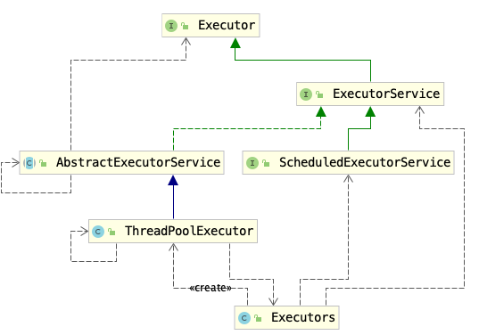

| class | description |
| --- | --- |
| `Executor` | An object that executes submitted  `Runnable` tasks. |
| `ExecutorService` |  An  `Executor` that provides methods to manage termination and methods that can produce a  `Future` for tracking progress of one or more asynchronous tasks. |
| `ThreadPoolExecutor` |  An link` ExecutorService` that executes each submitted task using one of possibly several pooled threads, normally configured using `Executors` factory methods. |
| `Executors` | Factory and utility methods for `Executor`, `ExecutorService` |


`ThreadPoolExecutor`表示一个线程池。`Executors`类则扮演着线程工厂的角色，通过`Executors`可以取得一个拥有特定功能的线程池。在提交完成后，调⽤`shutdown()`⽅法关闭线程池。这是⼀个⽐较安全的⽅法，如果当前正有线程在执⾏， `shutdown()`⽅法并不会⽴即暴⼒地终⽌所有任务，它会等待所有任务执⾏完成后，再关闭线程池。

#### 线程池构造函数

线程池构造函数的参数：

| 参数名 | 类型 | 含义 |
| --- | --- | --- |
| corePoolSize | int | 核心线程数 |
| maxPoolSize | int | 最大线程数 |
| keepAliveTime | long | 保存存活时间 |
| workQueue | BlockingQueue | 任务队列 |
| threadFactory | ThreadFactory | 当线程池需要新的线程的时候，用来生成新的线程 |
| Handler | RejectedExecutionHandler | 由于线程池无法接收提交的任务的拒绝策略 |

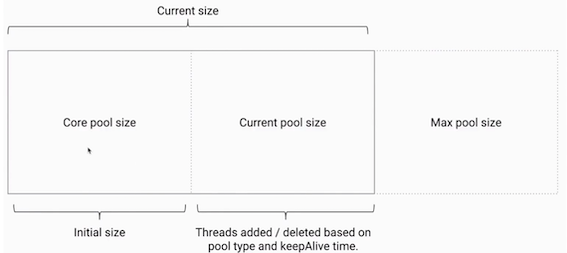


* corePoolSize指的是核心线程数：线程池在完成初始化后，默认情况下，线程池中并没有任何线程，线程池会等待有任务到来时，再创建新线程去执行任务。线程池有可能会在核心线程数的基础上，额外增加一些线程，但是这些新增加的线程数有一个上线，这就是最大量maxPoolSize
    * 如果线程数小于corePoolSize，即使其他工作线程处于空闲状态，也会创建一个新线程来运行新任务。 
    * 如果线程数等于或大于corePoolSize但少于maximumPoolSize，则将任务放入队列。
    * 如果队列已满，并且线程数小于maxPoolSize，则创建一个新线程来运行任务。
    * 如果队列已满，并且线程数大于或等于maxPoolSize，则拒绝该任务。
* keepAliveTime：如果线程池当前的线程数多于corePoolSize，那么如果多余的线程空闲时间超过keepAliveTime，它们就会被终止。
* threadFactory: 默认使用Executors.defaultThreadFactory()，创建出来的线程都在同一个线程组，拥有同样的NORM_PRIORITY优先级并且都不是守护线程。
* workQueue：有3种最常见的队列类型：
    * 直接交接：SynchronousQueue
    * 无界队列：LinkedBlockingQueue
    * 有界队列：ArrayBlockingQueue


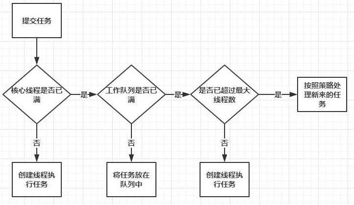


#### 线程池种类


| Parameter |  FixedThreadPool | CachedThreadPool | ScheduledThreadPool | SingleThreaded |
| --- | --- | --- | --- | --- |
| corePoolSize | constructor-arg | 0 | constructor-arg | 1 |
| maxPoolSize | same as corePoolSize | Integer.MAX_VALUE | Integer.MAX_VALUE | 1 |
| keepAliveTime | 0 seconds | 60 seconds | 60 seconds | 0 seconds |
| workQueue | LinkedBlockingQueue | SynchronousQueue | DelayedWorkQueue | LinkedBlockingQueue |


* FixedThreadPool: 任何时间点，最多有corePoolSize个线程会处于活动状态执行任务。如果当所有线程都是活动时，有多的任务被提交过来，那么它会一致在队列中等待直到有线程可用。如果任何线程在执行过程中因为错误而中止，新的线程会替代它的位置来执行后续的任务。所有线程都会一致存于线程池中，
* Cachedthreadpool:对于任务可以比较快速地完成的情况有比较好的性能。如果线程空闲了60秒都没有任务，那么将关闭此线程并从线程池中移除。所以如果线程池空闲了很长时间也不会有问题，因为随着所有的线程都会被关闭，整个线程池不会占用任何的系统资源。


线程池里的线程数量设定为多少比较合适？

* CPU密集型：最佳线程数为CPU核心数的1-2倍左右
* IO密集型：线程数 = CPU核心数*(1+ 平均等待时间/平均工作时间)


#### 停止线程池


停止线程池的正确方法是使用`shutdown`方法。

* `shutdown()`: 开始按提交顺序停止现有执行线程，不接受新的线程
* `isShutdown()`：线程池是否停止
* `isTerminated()`：所有线程是不是停止
* `awaitTermination(long timeout, TimeUnit unit)`：等到既定时间后，所有线程是不是都停止
* `shutdownNow()`: 立刻停止所有正在执行线程，终止等待的线程 


#### 线程复用

线程池实现线程复用的原理： 相同线程执行不同任务


```java
public void execute(Runnable command) {
    if (command == null)
        throw new NullPointerException();
    /*
     * Proceed in 3 steps:
     *
     * 1. If fewer than corePoolSize threads are running, try to
     * start a new thread with the given command as its first
     * task.  The call to addWorker atomically checks runState and
     * workerCount, and so prevents false alarms that would add
     * threads when it shouldn't, by returning false.
     *
     * 2. If a task can be successfully queued, then we still need
     * to double-check whether we should have added a thread
     * (because existing ones died since last checking) or that
     * the pool shut down since entry into this method. So we
     * recheck state and if necessary roll back the enqueuing if
     * stopped, or start a new thread if there are none.
     *
     * 3. If we cannot queue task, then we try to add a new
     * thread.  If it fails, we know we are shut down or saturated
     * and so reject the task.
     */
    int c = ctl.get();
    if (workerCountOf(c) < corePoolSize) {
        if (addWorker(command, true))
            return;
        c = ctl.get();
    }
    if (isRunning(c) && workQueue.offer(command)) {
        int recheck = ctl.get();
        if (! isRunning(recheck) && remove(command))
            reject(command);
        else if (workerCountOf(recheck) == 0)
            addWorker(null, false);
    }
    else if (!addWorker(command, false))
        reject(command);
}
```

其他 https://javadoop.com/post/java-thread-pool

### 4 ThreadLocal

两大使用场景 -- Threadlocal的用途

* 典型场景1： 每个线程需要一个独享的对象(通常是工具类, 典型需要使用的类有`SimpleDateFormat`和`Random`)
    * 每个Thread内有自己的实例副本，不共享
* 典型场景2: 每个线程内需要保存全局变量(例如在拦截器中获取用户信息)，可以让不同方法直接使用，避免参数传递的麻烦。


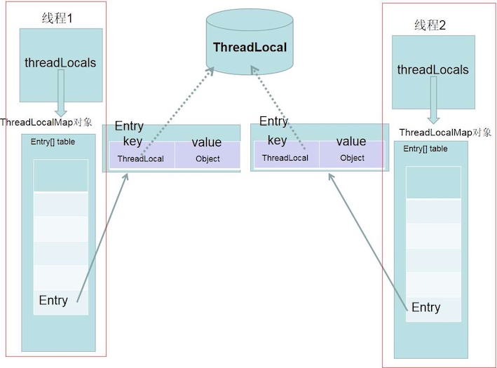

每个Thread对象中都持有一个ThreadLocalMap成员变量：

```java
// Thread.java
ThreadLocal.ThreadLocalMap threadLocals = null;
```

ThreadLocal类定义如下。ThreadLocal通过threadLocalHashCode来标识每一个ThreadLocal的唯一性。threadLocalHashCode通过CAS操作进行更新，每次hash操作的增量为0x61c88647。ThreadLocalMap是ThreadLocal的静态内部类。


```java
public class ThreadLocal<T> {

    private final int threadLocalHashCode = nextHashCode();

    private static AtomicInteger nextHashCode =
        new AtomicInteger();

    private static final int HASH_INCREMENT = 0x61c88647;

    private static int nextHashCode() {
        return nextHashCode.getAndAdd(HASH_INCREMENT);
    }
    
    public ThreadLocal() {
    }
    
    static class ThreadLocalMap {

        static class Entry extends WeakReference<ThreadLocal> {
            /** The value associated with this ThreadLocal. */
            Object value;

            Entry(ThreadLocal k, Object v) {
                super(k);
                value = v;
            }
            ...
        }
        ...
    }
    ...
}
```

ThreadLocal的set方法通过Thread.currentThread()方法获取了当前的线程引用，并传给了getMap(Thread)方法获取一个ThreadLocalMap的实例。getMap(Thread)方法直接返回Thread实例的成员变量threadLocals。获取了ThreadLocalMap实例以后，如果它不为空则调用ThreadLocalMap.ThreadLocalMap的set方法设值；若为空则调用ThreadLocal的createMap方法new一个ThreadLocalMap实例并赋给Thread.threadLocals。


```java
public void set(T value) {
    Thread t = Thread.currentThread();
    ThreadLocalMap map = getMap(t);
    if (map != null)
        map.set(this, value);
    else
        createMap(t, value);
}
ThreadLocalMap getMap(Thread t) {
    //t.threadLocals是ThreadLocal.ThreadLocalMap类型
    return t.threadLocals;   
}

void createMap(Thread t, T firstValue) {
    t.threadLocals = new ThreadLocalMap(this, firstValue);
}
```


ThreadLocal 的 get 方法通过Thread.currentThread()方法获取了当前的线程引用，并传给了getMap(Thread)方法获取一个ThreadLocalMap的实例。如果ThreadLocalMap为空，则调用 initialValue()方法来初始化。

```java
public T get() {
//先确定调用我的线程
    Thread t = Thread.currentThread(); 
    //根据调用我的线程，找到这个线程的ThreadLocalMap对象
    ThreadLocalMap map = getMap(t); 
    if (map != null) {
        //以ThreadLocal对象为key，找到对应Entry
        ThreadLocalMap.Entry e = map.getEntry(this); 
        if (e != null) {
            @SuppressWarnings("unchecked")
            T result = (T)e.value; //将对应的value返回
            return result;
        }
    }
    return setInitialValue();
}

private T setInitialValue() {
    T value = initialValue();
    Thread t = Thread.currentThread();
    ThreadLocalMap map = getMap(t);
    if (map != null)
        map.set(this, value);
    else
        createMap(t, value);
    return value;
}
void createMap(Thread t, T firstValue) {
    t.threadLocals = new ThreadLocalMap(this, firstValue);
}
```


#### ThreadLocalMap

```java
public class ThreadLocal<T> {
    static class ThreadLocalMap {
        static class Entry extends WeakReference<ThreadLocal> {
            /** The value associated with this ThreadLocal. */
            Object value;
            Entry(ThreadLocal k, Object v) {
                super(k);
                value = v;
            }
        }
        // The initial capacity -- MUST be a power of two.
        private static final int INITIAL_CAPACITY = 16;
        // The table, resized as necessary.
        // table.length MUST always be a power of two.
        private Entry[] table;
        // The number of entries in the table.
        private int size = 0;
        // The next size value at which to resize.
        private int threshold; // Default to 0

        ThreadLocalMap(ThreadLocal firstKey, Object firstValue) {
            table = new Entry[INITIAL_CAPACITY];
            int i = firstKey.threadLocalHashCode & (INITIAL_CAPACITY - 1);
            table[i] = new Entry(firstKey, firstValue);
            size = 1;
            setThreshold(INITIAL_CAPACITY);
        }
    }
}
```

ThreadLocalMap是ThreadLocal的静态内部类。其中INITIAL_CAPACITY代表这个Map的初始容量；table是一个Entry类型的数组，用于存储数据；size代表table中的存储数目；threshold代表需要扩容时对应size的阈值。 Entry类继承了WeakReference<ThreadLocal<?>>，即每个Entry对象都有一个ThreadLocal的弱引用，ThreadLocalMap的每个Entry都是一个对key的弱引用，同时每个Entry都包含了一个对value的强引用。

弱引用的特点是如果这个对象只被弱引用关联，那么这个对象就可以被回收。正常情况下，当线程终止，保存在ThreadLocal里的value会被垃圾回收，因为没有任何强引用了。

但是如果线程不终止(线程池复用线程)，那么key对应的value就不能被回收，因为有以下的调用链：`Thread -> ThreadLocalMap -> Entry(key为null) -> value`。JDK已经考虑到了这个问题，所以在set，remove，rehash方法中会扫描key为null的Entry，并把对应的value设置为null，这样value对象就可以被回收。但是如果一个ThreadLocal不被使用，那么实际上set，remove，rehash方法也不会被调用，如果同时线程又不停止，那么调用链就一直存在，那么就导致了value的内存泄漏。

解决方法：在使用完ThreadLocal之后，调用remove方法。


### 5 锁

锁是一种工具，用于控制对共享资源的访问。`Lock`和`synchronized`，这两个是最常见的锁，它们都可以达到线程安全的目的，但是在使用上和功能上又有较大的不同。

#### synchronized

针对`synchronized`获取锁的方式，JVM使用了锁升级的优化方式，就是先使用*偏向锁*优先同一线程然后再次获取锁，如果失败，就升级为*CAS轻量级锁*，如果失败就会短暂自旋，防止线程被系统挂起。最后如果以上都失败就升级为*重量级锁*。[锁优化](13 线程安全与锁优化.md)

`synchronized`同步语句块的实现使用的是`monitorenter`和`monitorexit`指令，其中 `monitorenter`指令指向同步代码块的开始位置，`monitorexit`指令则指明同步代码块的结束位置。 当执行`monitorenter` 指令时，线程试图获取锁也就是获取`monitor`(`monitor`对象存在于每个Java对象的对象头中，`synchronized`锁便是通过这种方式获取锁的，也是为什么Java中任意对象可以作为锁的原因) 的持有权.当计数器为0则可以成功获取，获取后将锁计数器设为1也就是加1。相应的在执行`monitorexit`指令后，将锁计数器设为0，表明锁被释放。如果获取对象锁失败，那当前线程就要阻塞等待，直到锁被另外一个线程释放为止。


#### Lock接口

`Lock`并不是用来代替`synchronized`的，而是当使用`synchronized`不合适或不足以满足要求的时候，来提供高级功能的。`Lock`接口最常见的实现类是`ReentantLock`。

为什么`synchronized`不够用？

* 效率低：锁的释放情况少，试图获得锁时不能设定超时，不能中断一个正在试图获得锁的线程
* 不够灵活(读写锁更灵活): 加锁和释放的时机单一，每个锁仅有单一的条件，可能是不够的
* 不知道是否成功获取到锁


`Lock`接口的主要方法

```java
public interface Lock {
    # Acquires the lock.
    void lock();
    # Acquires the lock unless the current thread is interrupted
    void lockInterruptibly() throws InterruptedException;
    boolean tryLock();
    boolean tryLock(long time, TimeUnit unit) throws InterruptedException;
    void unlock();
    Condition newCondition();
}
```

`Lock.lock()`就是最普通的获取锁的方法。如果锁已被其他线程获取，则进行等待。`lock()`不会像`synchronized`一样在异常时自动释放锁。因此最佳实践是，在`finally`中释放锁，以保证发生异常时锁一定被释放。

```java
lock.lock();
try{
    //获取本锁保护的资源
    System.out.println(Thread.currentThread().getName()+"开始执行任务");
}finally {
    lock.unlock();
}
```

`lock()`方法不能被中断，这会带来很大的隐患：一旦陷入死锁，`lock()`就会陷入永久等待。所以可以用`tryLock()`来尝试获取锁，如果当前锁没有被其他线程占用，则获取成功，返回true，否则获取失败，返回false。相比于`lock()`，`tryLock()`可以根据是否能获取锁来决定后续程序的行为。`tryLock()`方法在拿不到锁时不会等待。`tryLock(long time, TimeUnit unit)`则会等待指定的时间。

```java
Lock lock = ...;
if (lock.tryLock()) {
    try {
        // manipulate protected state
    } finally {
        lock.unlock();
    }
else {
        // perform alternative actions
}}
```

可见性：`Lock`的加解锁和`synchronized`有同样的内存语义，也就是说，下一个线程加锁后可以看到所有前一个线程解锁前发生的所有操作

`synchronized`可见性

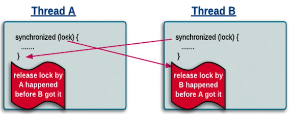

Lock的可见性

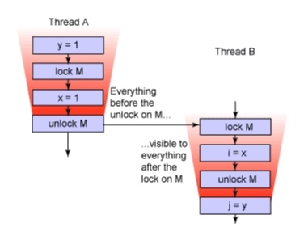


#### 锁的分类


#### 乐观锁和悲观锁


悲观锁：为了确保结果的正确性，会在每次读取并修改数据时，把数据锁住，让别人无法访问该数据，来确保数据内容万无一失

* 例子：`synchronized`和`Lock`相关类
* 悲观锁（互斥同步锁）的劣势
    * 阻塞和唤醒带来的性能劣势
    * 永久阻塞：如果持有锁的线程被永久阻塞，比如遇到了无限循环、死锁等活跃性问题，那么等待该线程释放锁的那几个悲催的线程，将永远也得不到执行
    * 优先级反转

乐观锁：认为在处理操作的时候不会有其他线程来干扰，所以并不会锁住被操作对象。在更新的时候，去对比在修改的期间数据有没有被其他人改变过：如果没被改变过，就说明真的是只有我自己在操作，那我就正常去修改数据。如果数据和一开始拿到的不一样，说明其他人在这段时间内改过数据，那就会选择放弃、报错、重试等策略。

* 例子：一般用CAS算法实现，例如原子类、并发容器等


对于数据库来说，`select for update`就是悲观锁，用版本控制就是乐观锁


#### 使用场景

悲观锁适合并发写入多的情况，适用于临界区持锁时间比较长的情况，悲观锁可以避免大量的无用自旋等消耗，典型情况：

* 临界区有IO操作
* 临界区代码复杂或者循环量大
* 临界区竞争非常激烈

乐观锁适合并发写入少，大部分是读取的场景，不加锁的能让读取性能大幅提高。


#### 可重入锁和非可重入锁


可重入就是说某个线程已经获得某个锁，可以再次获取锁。Java中`ReentrantLock`和`synchronized`都是可重入锁，可重入锁的一个优点是可一定程度避免死锁。


```java
public class RecursionDemo {

    private static ReentrantLock lock = new ReentrantLock();
    private static void accessResource() {
        lock.lock();
        try {
            System.out.println("已经对资源进行了处理");
            if (lock.getHoldCount()<5) {
                System.out.println(lock.getHoldCount());
                accessResource();
                System.out.println(lock.getHoldCount());
            }
        } finally {
            lock.unlock();
        }
    }
    public static void main(String[] args) {
        accessResource();
    }
}
```


源码对比：可重入锁`ReentrantLock`以及非可重入锁`ThreadPoolExecutor`的`Worker`类：


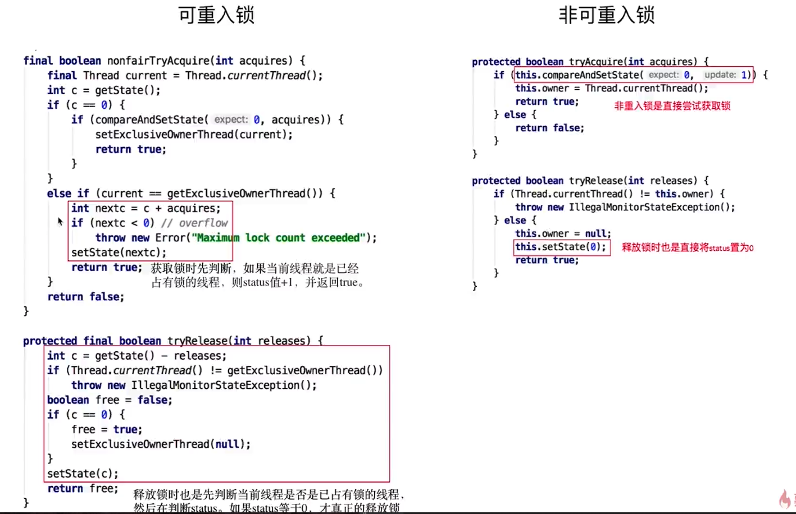


#### 公平锁和非公平锁


* 公平锁指的是按照线程请求的顺序，来分配锁；
* 非公平锁指的是，不完全按照请求的顺序，在一定情况下，可以插队。
    * 注意：非公平也同样不提倡“插队”行为，这里的非公平，指的是“在合适的时机”插队，而不是盲目插队。

非公平锁是为了避免唤醒带来的空档期，可以提高效率：

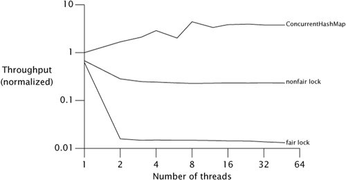


!!! note "tryLock()"
    
    `tryLock()`方法不遵守设定的公平规则，当有线程执行`tryLock()`的时候，一旦有线程释放了锁，那么这个正在`tryLock()`的线程就能获取到锁，即使在它之前已经有其它线程在等待队列里了。


| | 优势 | 劣势 |
| --- | --- | --- |
| 公平锁 | 各线程公平平等，每个线程在等待一段时间后，总有执行的机会 | 更慢，吞吐量更小 |
| 不公平锁 | 更快，吞吐量更大 | 有可能产生线程饥饿，也就是某些线程在长时间内，始终得不到执行 |


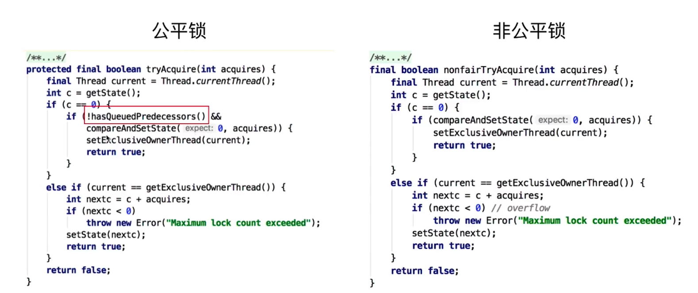


#### 共享锁和排它锁

读写锁：在读的地方使用读锁，在写的地方使用写锁，灵活控制，如果没有写锁的情况下，读是无阻塞的，提高了程序的执行效率。

读写锁的规则：

* 多个线程只申请读锁，都可以申请到
* 如果有一个线程已经占用了读锁，则此时其他线程如果要申请写锁，则申请写锁的线程会一直等待释放读锁。
* 如果有一个线程已经占用了写锁，则此时其他线程如果申请写锁或者读锁，则申请的线程会一直等待释放写锁。
* 总结就是：要么多读，要么一写


`ReentrantReadWriteLock`的读锁插队策略：

* 非公平：假设线程2和线程4正在同时读取，线程3想要写入，拿不到锁，于是进入等待队列，线程5不在队列里，现在过来想要读取。此时有两种策略：
    * 策略1: 5读取。读可以插队，效率高，但是容易造成饥饿
    * 策略2: 5进入等待队列。避免饥饿
* 策略的选择取决于具体锁，ReentrantReadWriteLock选择了策略2


公平锁只看队列里面有没有在排队

```java
static final class FairSync extends Sync {
    private static final long serialVersionUID = -2274990926593161451L;
    final boolean writerShouldBlock() {
        return hasQueuedPredecessors();
    }
    final boolean readerShouldBlock() {
        return hasQueuedPredecessors();
    }
}
```

非公平锁，写锁永远不需要等待：`writerShouldBlock`永远返回false。读锁仅在等待队列头结不是想获取写锁的线程的时候可以插队


```java
static final class NonfairSync extends Sync {
    private static final long serialVersionUID = -8159625535654395037L;
    final boolean writerShouldBlock() {
        return false; // writers can always barge
    }
    final boolean readerShouldBlock() {
        /* As a heuristic to avoid indefinite writer starvation,
         * block if the thread that momentarily appears to be head
         * of queue, if one exists, is a waiting writer.  This is
         * only a probabilistic effect since a new reader will not
         * block if there is a waiting writer behind other enabled
         * readers that have not yet drained from the queue.
         */
        return apparentlyFirstQueuedIsExclusive();
    }
}
```


锁的升降级：支持锁的降级，不支持升级


```java
private static void writeDowngrading() {
    writeLock.lock();
    try {
        System.out.println(Thread.currentThread().getName() + "得到了写锁，正在写入");
        Thread.sleep(1000);
        readLock.lock();
        System.out.println("在不释放写锁的情况下，直接获取读锁，成功降级");
    } catch (InterruptedException e) {
        e.printStackTrace();
    } finally {
        readLock.unlock();
        System.out.println(Thread.currentThread().getName() + "释放写锁");
        writeLock.unlock();
    }
}
```
为什么不支持锁的升级？  死锁


#### 自旋锁和阻塞锁

阻塞或唤醒一个Java线程需要操作系统切换CPU状态来完成，这种状态转换需要耗费CPU时间。如果同步代码块中的内容过于简单，状态转换消费的时间有可能比用户代码执行的时间还要长。在许多场景中，同步资源的锁定时间很短，为了这一小段时间去切换线程，线程挂起和恢复现场的花费可能会让系统得不偿失。

如果物理机器有多个处理器，能够让两个或以上线程同时并行执行，就可以让后面那个请求锁的线程不放弃CPU执行时间，看看持有锁的线程是否很快会释放锁。而为了让当前线程“稍等一下”，我们需让当前线程进行自旋，如果在自旋完成后前面锁定同步资源的线程已经释放了锁，那么当前线程就可以不必阻塞而是直接获取同步资源，从而避免切换线程的开销。这就是自旋锁。

阻塞锁和自旋锁相反，阻塞锁如果遇到没拿到锁的情况，会直接把线程阻塞，直到被唤醒。

如果锁被占用的时间很长，那么自旋的线程只会白浪费处理器资源。在自旋的过程中，一直消耗CPU，所以虽然自旋锁的起始开销低于悲观锁，但是随着自旋时间的增长，开销也是线性增长的。

java.util.concurrent.atomic包下的类基本都是自旋锁的实现。

AtomicInteger的实现：自旋锁的实现原理是CAS，AtomicInteger中调用unsafe进行自增操作的源码中的do-while循环就是一个自旋操作。如果修改过程中遇到其他线程竞争导致没修改成功，就在while里死循环，直至修改成功。


```java
// AtomicInteger
public final int getAndAddInt(Object var1, long var2, int var4) {
    int var5;
    do {
        var5 = this.getIntVolatile(var1, var2);
    } while(!this.compareAndSwapInt(var1, var2, var5, var5 + var4));

    return var5;
}
```


#### 可中断锁


如果某一线程A正在执行锁中的代码，另一线程B正在等待获取该锁，可能由于等待时间长，线程B不想等待了，想先处理其他事情，我们可以中断它，这种就是可中断锁。

在Java中，synchronized就是不可中断锁，而Lock是可中断锁。因为tryLock(time)和lockInterruptibly都能响应中断


#### 锁优化

[](13 线程安全与锁优化.md)

1. 缩小同步代码块
2. 尽量不要锁住方法
3. 减少请求锁的次数
4. 避免人为制造“热点”
5. 锁中尽量不要再包含锁
6. 选择合适的锁类型或合适的工具类


### 6 Atomic

原子类的作用和锁类似，是为了保证并发情况下线程安全。原子类相比于锁，有一定的优势：

* 粒度更细：原子变量可以把竞争范围缩小到变量级别，这是可以获得的最细粒度，通常锁的粒度都要大于原子变量的粒度
* 效率更高：通常原子类的效率会比使用锁的效率更高，除了高度竞争的情况。

 

| 类型 | 例子 |
| --- | --- |
| Atomic* 基本类型原子类  | `AtomicInteger`, `AtomicLong`, `AtomicBoolean` |
| Atomic*Array 数组类型原子类 | `AtomicIntegerArray`, `AtomicLongArray`, `AtomicRefereceArray` |
| Atomic*Reference 引用类型原子类 | `AtomicReference`, `AtomicStampedReference`, `AtomicMarkableReference` |
| Atomic*FieldUpdater 升级类型原子类 | `AtomicIntegerFieldUpdater`, `AtomicLongFieldUpdater`, `AtomicReferenceFieldUpdater` |
| Addr 累加器 | `LongAddr`, `DoubleAddr` |
| Accumulator 累加器 | `LongAccumulator`, `DoubleAccumulator` |


#### AtomicInteger

`AtomicInteger`常用方法

```java
public final int get() //获取当前的值
public final int getAndSet(int newValue) //获取当前的值，并设置新的值
public final int getAndIncrement() //获取当前的值，并自增
public final int getAndDecrement() //获取当前的值，并自减
public final int getAndAdd(int delta) // 获取当前的值，并加上预期的值
boolean compareAndSet(int expect, int update) // 如果输入的数值等于预期值，
                                        // 则以原子方式将该值设置为输入值
```


几个例子


```java
/* AtomicInteger */
private final AtomicInteger atomicInteger = new AtomicInteger();
atomicInteger.getAndAdd(2);
/* AtomicIntegerArray" */
AtomicIntegerArray atomicIntegerArray = new AtomicIntegerArray(1000);
array.getAndDecrement(i);
```


#### AtomicReference

`AtomicReference`类的作用，和`AtomicInteger`并没有本质区别，`AtomicInteger`可以让一个整数保证原子性，而 `AtomicReference`可以让一个对象保证原子性。当然`AtomicReference`的功能明显比`AtomicInteger`强，因为一个对象里可以包含很多属性。用法和`AtomicInteger`类似。

#### AtomicIntegerFieldUpdater

`AtomicIntegerFieldUpdater`对普通变量进行升级，使用场景：偶尔需要一个原子get-set操作

```java
public static class Candidate {
    volatile int score;
}
public static AtomicIntegerFieldUpdater<Candidate> scoreUpdater = 
    AtomicIntegerFieldUpdater.newUpdater(Candidate.class, "score");
tom=new Candidate();
scoreUpdater.getAndIncrement(tom);
```

#### LongAddr

高并发下`LongAddr`比`AtomicLong`效率高，不过本质是空间换时间。竞争激烈的时候，`LongAddr`把不同线程对应到不同的Cell上进行修改，降低了冲突的概率，是**多段锁**的概念，提高了并发性。


* `AtomicLong`每一次加法都要flush和refresh，导致很耗费资源


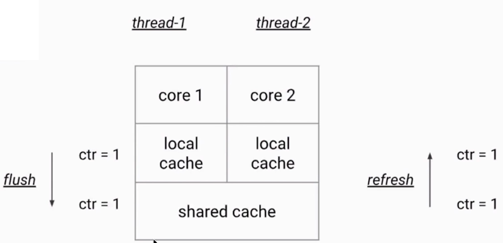


在内部，这个`LongAddr`的实现原理和刚才的AtomicLong是不同的，刚才的AtomicLong的实现原理是，每一次加法都需要做同步，所以在高并发的时候会导致冲突比较多，也就降低了效率。而`LongAddr`，每个线程会有自己的一个计数器，仅用来在自己线程内计数，这样依赖就不会和其他线程的计数器干扰。

`LongAddr`引入了分段累加的概念，内部有一个base变量和一个Cell[]数组共同参与计数：

* base变量：竞争不激烈，直接累加到该变量上
* Cell[]数组：竞争激烈，各个线程分散累加到自己的槽Cell[i]中


```java
public long sum() {
    Cell[] as = cells; Cell a;
    long sum = base;
    if (as != null) {
        for (int i = 0; i < as.length; ++i) {
            if ((a = as[i]) != null)
                sum += a.value;
        }
    }
    return sum;
}
```


在低竞争下，`AtomicLong`和`LongAddr`这两个类具有相似的特征。但是在竞争激烈的情况下，`LongAddr`的预期吞吐量要高得多，但要消耗更多的空间。`LongAddr`适合的场景是统计求和计数的场景，而且`LongAddr`基本只提供了add方法，而`AtomicLong`还具有cas方法。


#### LongAccumulator

`LongAccumulator`和`LongAddr`非常相似，`LongAccumulator`就是一个更通用版本的`LongAddr`。

```java
LongAccumulator accumulator = new LongAccumulator((x, y) -> 2 + x * y, 1);
ExecutorService executor = Executors.newFixedThreadPool(8);
IntStream.range(1, 10).forEach(i -> executor.submit(() -> accumulator.accumulate(i)));
```

### 7 CAS

CAS(compare and swap)有三个操作数：内存值V，旧的预期值A，准备设置的新值B。当且仅当预期值A和内存值V相同时，才将内存值V修改为B，否则什么都不做，最后返回现在的内存值V。CAS的等价代码：

```java
// 模拟CAS操作，等价代码
public class SimulatedCAS {
    private volatile int value;
    public synchronized int compareAndSwap(int expectedValue, int newValue) {
        int oldValue = value;
        if (oldValue == expectedValue) {
            value = newValue;
        }
        return oldValue;
    }
}
```

CAS依靠硬件指令集，在x86指令集中用`cmpxchg`指令完成。Java使用`jdk.internal.misc.Unsafe`来实现CAS底层操作，它提供了硬件级别的原子操作(`compareAndSwapInt()`等方法)。编译出来的结果就是一条平台相关的处理器CAS指令。J.U.C包里面的原子类，其中的`compareAndSet()`和`getAndIncrement()`等方法都使用了`Unsafe`类的CAS操作来实现。


#### 存在的问题

CAS也有不好的地方：

* ABA问题：假设当前值为A，如果另一个线程先将A修改成B，再修改回成A，当前线程的CAS操作无法分辨当前值发生过变化。
* 自旋时间过长


### 8 控制并发流程


控制并发流程的工具类，作用就是帮助程序员更容易地让线程之间合作。让线程之间相互配合，来满足业务逻辑。比如让线程A等待线程B执行完毕后再执行等合作策略。

| 类 | 作用 | 说明 |
| --- | --- | --- |
| `Semaphore` | 信号量，可以通过控制“许可证”的数量，来保证线程之间的配合 | 线程只有在拿到“许可证”后才能继续运行 |
| `CyclicBarrier` | 线程会等待，直到足够多线程达到了事先规定的数目。一旦达到触发条件，就可以进行下一步的动作 | 适用于线程之间相互等待处理结果就绪的场景 |
| `CountDownLatch` | 和`CyclicBarrier`类似，数量递减到0时，触发动作 | 不可重复使用 |
| `Condition` | 可以控制线程的“等待”和“唤醒” | 是`Object.wait()`的升级版 |


#### Semaphore


**Semaphore**(信号量): 控制某个资源可被同时访问的线程个数

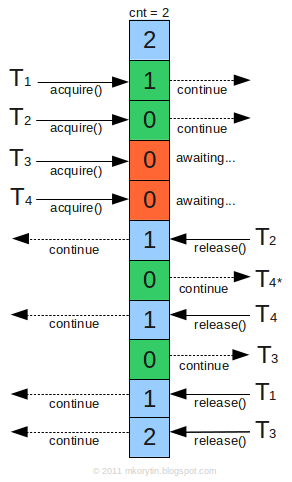


无论是`synchronized`还是`ReentrantLock`，一次都只允许一个线程访问一个资源。而信号量却可以指定多个线程，同时访问某一个资源。信号量主要提供了以下构造函数：

```java
public Semaphore(int permits)
public Semaphore(int permits, boolean fair) //第二个参数可以指定是否公平
```

`Semaphore(int permits, boolan fair)`可以设置是否要使用公平策略，如果传入true，那么`Semaphore`会把之前等待的线程放到FIFO的队列里，当有了新的许可证时会分发给之前等了最长时间的线程。

`Semaphore`的主要方法

```java
public void acquire()
public void acquireUninterruptibly() 
public boolean tryAcquire() 
public boolean tryAcquire(long timeout, TimeUnit unit) 
public void release()
```

`Semaphore`示例

```java
public class SemaphoreDemo {
    static Semaphore semaphore = new Semaphore(5, true);
    public static void main(String[] args) {
        ExecutorService service = Executors.newFixedThreadPool(50);
        for (int i = 0; i < 100; i++)
            service.submit(new Task());
        service.shutdown();
    }

    static class Task implements Runnable {
        @Override
        public void run()  {
            try { // 每次要3个许可证
                semaphore.acquire(3);
            } catch (InterruptedException e) {
                e.printStackTrace();
            }
            System.out.println(Thread.currentThread().getName() 
                            + "拿到了许可证");
            try {
                Thread.sleep(2000);
            } catch (InterruptedException e) {
                e.printStackTrace();
            }
            System.out.println(Thread.currentThread().getName()
                             + "释放了许可证");
            semaphore.release(3); // 每次释放3个许可证
        }
    }
}
```


#### Condition

`Condition`(条件变量)与可重入锁相关联。利用`Condition`对象，就可以让线程在合适的时间等待，或者在某一个特定的时刻得到通知，继续执行。`Condition`与`ReentrantLock`的关系类似于`Object`和监视器的关系。


| 对比项 | Object监视器 | Condition |
| --- | --- | --- |
| 前置条件 | 获取对象的锁 | 调用`Lock.lock()`获取锁，调用`Lock.newCondition()`获取`Condition`对象 |
| 调用方式 | 直接调用，比如`object.wait()` | 直接调用，比如`condition.await()` |
| 等待队列的个数 | 一个 | 多个 |
| 当前线程释放锁进入等待状态 | 支持 | 支持 |
| 当前线程释放锁进入等待状态，在等待状态中不响应中断 | 不支持 | 支持 |
| 当前线程释放锁并进入超时等待状态 | 支持 | 支持 |
| 当前线程释放锁并进入等待状态直到将来的某个时间 | 不支持 | 支持 |
| 唤醒等待队列中的一个线程 | 支持 | 支持 |
| 唤醒等待队列中的全部线程 | 支持 | 支持 |


```Java
void await() throws InterruptedException; 
void awaitUninterruptibly(); 
long awaitNanos(long nanosTimeout) throws InterruptedException; 
boolean await(long time, TimeUnit unit) throws InterruptedException; 
boolean awaitUntil(Date deadline) throws InterruptedException;
void signal(); 
void signalAll();
```

* `await()`⽅法会使当前线程等待，同时释放当前锁，当其他线程中使⽤`signal()`或者`signalAll()`⽅法时，线程会重新获得锁并继续执⾏。或者当线程被中断时，也能跳出等待。这和`Object.wait()`⽅法很相似。 
* `awaitUninterruptibly()`⽅法与`await()`⽅法基本相同，但是它并不会在等待过程中响应中断。 
* `singal()`⽅法⽤于唤醒⼀个在等待中的线程（唤醒等待时间最长的线程）。 这和`Object.nofity()`方法很类似
* `singalAll()`⽅法会唤醒所有在等待中的线程。这和 `Obejct.notifyAll()`⽅法很类似。


和`Object.wait()`和`notify()`⽅法⼀样，当线程使⽤`Condition.await()`时，要求线程持有相关的重⼊锁，在`Condition.await()`调⽤后，这个线程会释放这把锁。同理，在`Condition.signal()`⽅法调⽤时，也要求线程先获得相关的锁。在`signal()`⽅法调⽤后，系统会从当前`Condition`对象的等待队列中，唤醒⼀个线程。⼀旦线程被唤醒，它会重新尝试获得与之绑定的重⼊锁，⼀旦成功获取，就可以继续执⾏了。

```java tab="Condition实现生产者消费者"
public class ConditionDemo2 {
    private int queueSize = 10;
    private PriorityQueue<Integer> queue = 
            new PriorityQueue<Integer>(queueSize);
    private Lock lock = new ReentrantLock();
    private Condition notFull = lock.newCondition();
    private Condition notEmpty = lock.newCondition();

    public static void main(String[] args) {
        ConditionDemo2 conditionDemo2 = new ConditionDemo2();
        Producer producer = conditionDemo2.new Producer();
        Consumer consumer = conditionDemo2.new Consumer();
        producer.start();
        consumer.start();
    }
}
```

```java tab="Consumer"
class Consumer extends Thread {

    @Override
    public void run() {
        consume();
    }

    private void consume() {
        while (true) {
            lock.lock();
            try {
                while (queue.size() == 0) {
                    System.out.println("队列空，等待数据");
                    try {
                        notEmpty.await();
                    } catch (InterruptedException e) {
                        e.printStackTrace();
                    }
                }
                queue.poll();
                notFull.signalAll();
                System.out.println("从队列里取走了一个数据，队列剩余" + queue.size() + "个元素");
            } finally {
                lock.unlock();
            }
        }
    }
}
```

```java tab="Producer"
class Producer extends Thread {

    @Override
    public void run() {
        produce();
    }

    private void produce() {
        while (true) {
            lock.lock();
            try {
                while (queue.size() == queueSize) {
                    System.out.println("队列满，等待有空余");
                    try {
                        notFull.await();
                    } catch (InterruptedException e) {
                        e.printStackTrace();
                    }
                }
                queue.offer(1);
                notEmpty.signalAll();
                System.out.println("向队列插入了一个元素，队列剩余空间" 
                                   + (queueSize - queue.size()));
            } finally {
                lock.unlock();
            }
        }
    }
}
```
#### CountDownLatch

`CountDownLatch`的主要方法：


* `CountDownLatch(int count)`: 仅有一个构造函数，参数count为需要倒数的数值
* `await()`:调用`await()`方法的线程会被挂起，它会等待直到count值为0才继续执行
* `countDown()`: 将count值减1，直到为0时，等待的线程会被唤起。

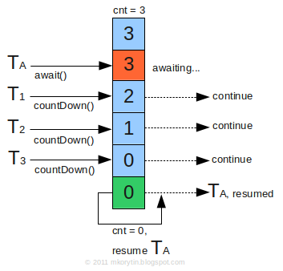


用法一：一个线程等待多个线程都执行完毕，再继续自己的工作

```java
// 描述：工厂中，质检，5个工人检查，所有人都认为通过，才通过
public class CountDownLatchDemo1 {
    public static void main(String[] args) throws InterruptedException {
        CountDownLatch latch = new CountDownLatch(5);
        ExecutorService service = Executors.newFixedThreadPool(5);
        for (int i = 0; i < 5; i++) {
            final int no = i + 1;
            Runnable runnable = () -> {
                try {
                    Thread.sleep((long) (Math.random() * 10000));
                    System.out.println("No." + no + "完成了检查。");
                } catch (InterruptedException e) {
                    e.printStackTrace();
                } finally {
                    latch.countDown();
                }
            };
            service.submit(runnable);
        }
        System.out.println("等待5个人检查完.....");
        latch.await();
        System.out.println("所有人都完成了工作，进入下一个环节。");
    }
}
```

用法二：多个线程等待某一个线程的信号，同时开始执行。


```java
// 模拟100米跑步，5名选手都准备好了，只等裁判员一声令下，
// 所有人同时开始跑步。当所有人都到终点后，比赛结束。
public class CountDownLatchDemo1And2 {

    public static void main(String[] args) throws InterruptedException {
        CountDownLatch begin = new CountDownLatch(1);

        CountDownLatch end = new CountDownLatch(5);
        ExecutorService service = Executors.newFixedThreadPool(5);
        for (int i = 0; i < 5; i++) {
            final int no = i + 1;
            Runnable runnable = () -> {
                System.out.println("No." + no + "准备完毕，等待发令枪");
                try {
                    begin.await();
                    System.out.println("No." + no + "开始跑步了");
                    Thread.sleep((long) (Math.random() * 10000));
                    System.out.println("No." + no + "跑到终点了");
                } catch (InterruptedException e) {
                    e.printStackTrace();
                } finally {
                    end.countDown();
                }
            };
            service.submit(runnable);
        }
        //裁判员检查发令枪...
        Thread.sleep(5000);
        System.out.println("发令枪响，比赛开始！");
        begin.countDown();

        end.await();
        System.out.println("所有人到达终点，比赛结束");
    }
}
```

#### CyclicBarrier

`CyclicBarrier`循环栅栏和`CountDownLatch`很类似，都能阻塞一组线程。当有大量线程相互配合，分别计算不同任务，并且需要最后统一汇总的时候，可以使用`CyclicBarrier`。`CyclicBarrier`可以构造一个集结点，当某一个线程执行完毕，它就会到集结点等待，直到所有线程都到了集结点，那么该栅栏就会被撤销，所有线程再统一出发，继续执行剩下的任务。

[^2]
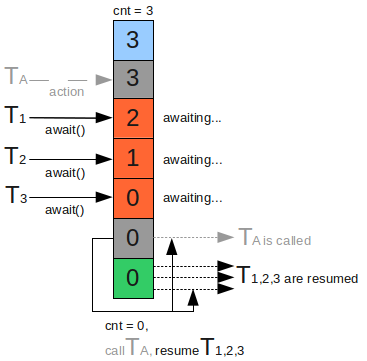


```java
public class CyclicBarrierDemo {
    public static void main(String[] args) {
        CyclicBarrier cyclicBarrier = new CyclicBarrier(5,
                () -> System.out.println("所有人都到场了， 大家统一出发！"));
        for (int i = 0; i < 10; i++)
            new Thread(new Task(i, cyclicBarrier)).start();
    }

    static class Task implements Runnable{
        private int id;
        private CyclicBarrier cyclicBarrier;

        public Task(int id, CyclicBarrier cyclicBarrier) {
            this.id = id;
            this.cyclicBarrier = cyclicBarrier;
        }

        @Override
        public void run() {
            System.out.println("线程" + id + "现在前往集合地点");
            try {
                Thread.sleep((long) (Math.random()*10000));
                System.out.println("线程"+id+"到了集合地点，开始等待其他人到达");
                cyclicBarrier.await();
                System.out.println("线程"+id+"出发了");
            } catch (InterruptedException e) {
                e.printStackTrace();
            } catch (BrokenBarrierException e) {
                e.printStackTrace();
            }
        }
    }
}
```

!!! note "CyclicBarrier v.s. CountDownLatch"
    
    * CountDownLatch: 一个线程(或者多个)， 等待另外N个线程完成某个事情之后才能执行。不可以重置。
    * CyclicBrrier: N个线程相互等待，任何一个线程完成之前，所有的线程都必须等待。可以重置。

#### Phaser

`Phaser`类似于`CyclicBarrier`：让一组线程在栅栏前等待，然后当最后一个线程到达的时候一起出发。但它能更灵活使用：`Phaser`能够注册或者注销线程。

### 9 AQS

AQS：AbstractQueuedSynchronizer，即抽象队列同步器。它是构建锁或者其他同步组件的基础框架（如ReentrantLock、CountDownLatch、Semaphore等），JUC并发包的作者(Doug Lea)[^3]期望它能够成为实现大部分同步需求的基础。AQS的主要使用方式是继承，子类通过继承同步器并实现它的抽象方法来管理同步状态。

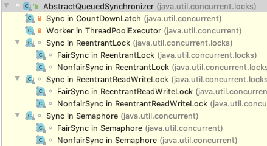


AQS核心思想是，如果被请求的共享资源空闲，则将当前请求资源的线程设置为有效的工作线程，并且将共享资源设置为锁定状态。如果被请求的共享资源被占用，那么就需要一套线程阻塞等待以及被唤醒时锁分配的机制，这个机制AQS是用CLH队列锁实现的，即将暂时获取不到锁的线程加入到队列中。


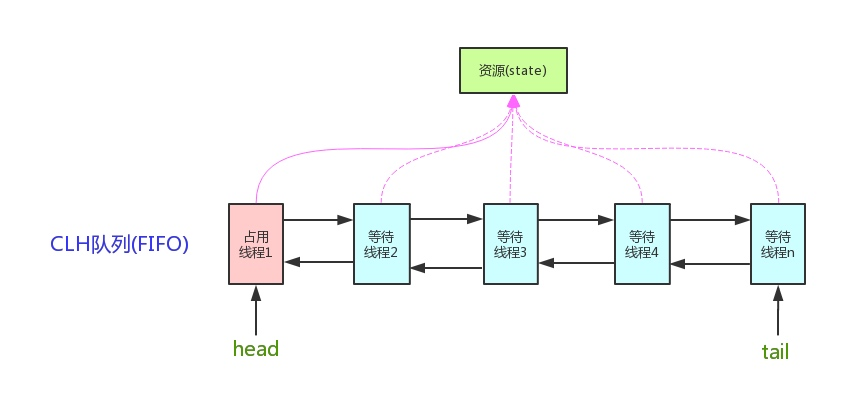

* state: 在Semaphore里，表示“剩余的许可证的数量”，在CountDownLatch里，表示“还需要倒数的数量”
* state是volatile修饰的，会被并发地修改，所以所有修改state的方法都需要保证线程安全，比如getState，setState以及compareAndSetState操作来读取和更新这个状态。


获取/释放方法：

* 获取操作会依赖state变量，经常会阻塞

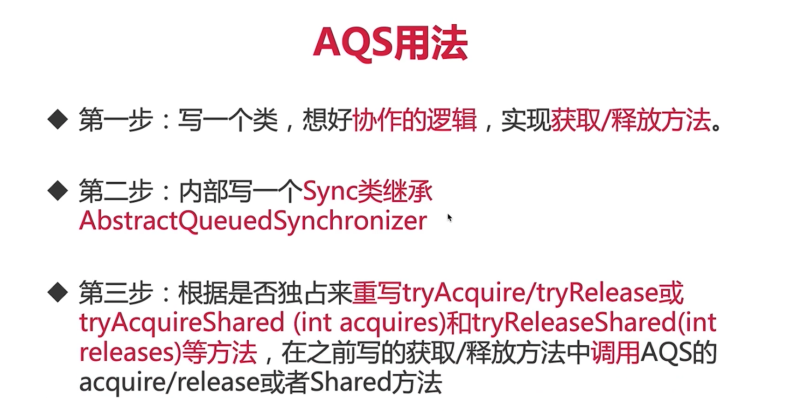


### 10 Future

Runnable的缺陷

* 不能有返回值
* 不能抛出checked Exception异常

Callable接口类似于Runnable，被其他线程执行任务。


```java
public interface Callable<V> {
    // Computes a result, 
    // or throws an exception if unable to do so.
    V call() throws Exception;
}
```

Future的作用：

* 可以使用Future.get()来获取Callable接口返回的执行结果，还可以通过Future.isDone()来判断任务是否已经执行完了。以及取消这个任务，限时获取任务的结果等。
* 在call()未执行完毕之前，调用get()的线程会被阻塞，直到call()方法返回了结果后，此时future.get()才会得到该结果，然后主线程才会切换到runnable状态
* 所以Future是一个存储器，它存储了call()这个任务的结果，而这个任务的执行时间是无法提前确定的，因为这完全取决于call()方法执行的情况

```java
public interface Future<V> {
    boolean cancel(boolean mayInterruptIfRunning);
    boolean isCancelled();
    boolean isDone();
    V get() throws InterruptedException, ExecutionException;
    V get(long timeout, TimeUnit unit)
        throws InterruptedException, ExecutionException, TimeoutException;
}
```


get()方法的行为取决于Callable任务的状态，只有以下5种情况：

* 任务正常完成：get()方法会立刻返回结果
* 任务尚未完成(任务还没开始或进行中): get将阻塞并直到任务完成
* 任务执行过程中抛出异常：get方法会抛出ExecutionException异常
* 任务被取消：get方法抛出CancellationException异常
* 任务超时：如果时间到了还没有结果，抛出TimeoutException异常


用法：线程池的submit方法返回Future对象


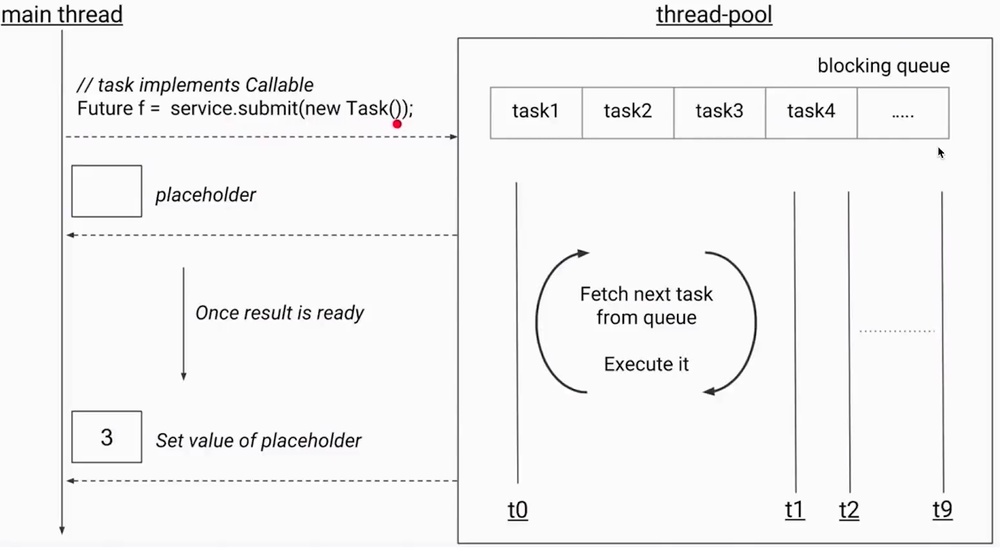

cancel()方法：取消任务的执行

* 如果这个任务还没有开始执行，那么任务会被正常的取消，未来也不会被执行，返回true
* 如果任务已经完成，或者已经取消：那么cancel()方法会执行失败，返回false
* 如果任务已经开始执行，那么这个取消方法将不会直接取消该任务，如果mayInterruptIfRunning=true，则会中断。所以Future.cancel(true)适用于任务能够处理interrupt


用FutureTask来创建Future

* 用FutureTask来获取Future和任务的结果
* FutureTask是一种包装器，可以把Callable转化成Future和Runnable，它同时实现两者的接口。所以它既可以作为Runnable被线程执行，又可以作为Future得到Callable的返回值。
* 把Callable实例当作参数，生成FutureTask的对象，然后把这个对象当作一个Runnable对象，用线程池或另起线程去执行这个Runnable对象，最后通过FutureTask获取刚才执行的结果。


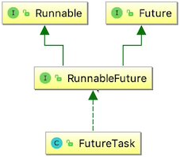

```java
FutureTask<Integer> task = new FutureTask<>(()-> new Random().nextInt(5));
ExecutorService service = Executors.newCachedThreadPool();
service.submit(task);
System.out.println("task运行结果：" + task.get());
```


Future的注意点

* 当for循环批量获取future的结果时，容易发生一部分线程很慢的情况，get方法调用时应使用timeout限制
* Future的生命周期不能后退: 和线程池的生命周期一样，一旦完全完成了任务，它就永远停在了“已完成”的状态，不能重头再来


[^2]: https://sites.google.com/site/webdevelopart/21-compile/06-java/javase/concurrent?tmpl=%2Fsystem%2Fapp%2Ftemplates%2Fprint%2F&showPrintDialog=1
[^3]: The java.util.concurrent Synchronizer Framework, Doug Lea, http://gee.cs.oswego.edu/dl/papers/aqs.pdf


### 附录

##### IDEA调试多线程
把 All 改为 Thread。如果点了 Make Default ，那么后续加上的断点都是 Thead 设置，之前加上的断点不影响。


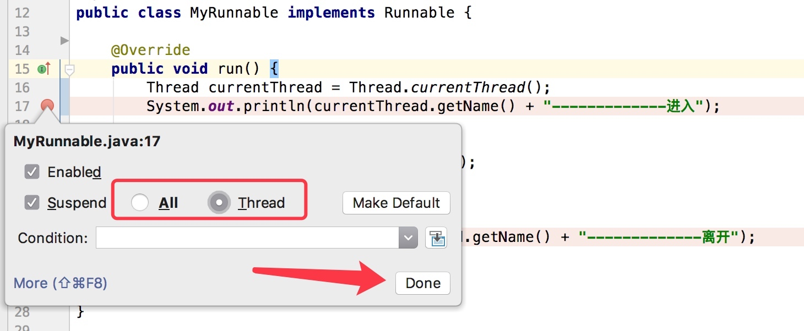

##### IDEA调试死锁

在运行或者调试时，直接生成thread dump.

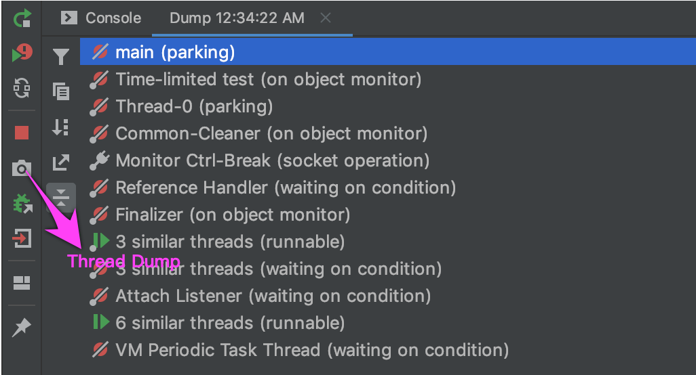

或者使用`jps`查看正在运行的JVM，随后使用`jstack pid`打印线程号为`pid`的Java线程栈信息。会发现有`FOND Java-level deadlock`这样的信息。

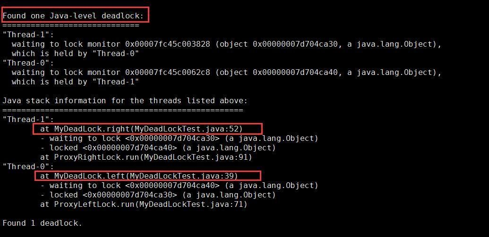


