###  1 走进Java


Java不仅仅是一门编程语言，它还是一个由一系列计算机软件和规范形成的技术体系，这个技术体系提供了完整的用于软件开发和跨平台部署的支持环境[^0]。


**按照技术所服务的领域**来划分，Java技术体系可以分为4个平台，分别为：

* Java Card：支持一些Java小程序（Applets）运行在小内存设备（如智能卡）上的平台。
* Java ME（Micro Edition）：支持Java程序运行在移动终端（手机、PDA）上的平台，对Java API有所精简，并加入了针对移动终端的支持，这个版本以前称为J2ME。
* **Java SE**（Standard Edition）：支持面向桌面级应用（如Windows下的应用程序）的Java平台，提供了完整的Java核心API，这个版本以前称为J2SE。
* **Java EE**（Enterprise Edition）：支持使用多层架构的企业应用（如ERP、CRM应用）的Java平台，除了提供Java SE API外，还对其做了大量的扩充并提供了相关的部署支持，这个版本以前称为J2EE。

!!! note
    JDK是java的开发工具包，JDK不分javaME, javaSE和javaEE, 所在Oracle的官网上只要下载JavaSE对应的版本JDK即可。


Oracle JDK由Sun Microsystems Inc.开发， OpenJDK由Oracle，OpenJDK和Java社区开发，后者开源并且可以免费使用(GNU GPL协议)。


#### Java发展史


* JDK 1.0: Java虚拟机、Applet、AWT等；
* JDK 1.1：JAR文件格式、JDBC、JavaBeans、RMI、内部类、反射；
* JDK 1.2：拆分为J2SE/J2EE/J2ME、内置JIT编译器、一系列Collections集合类；
* JDK 1.3：JNDI服务、使用CORBA IIOP实现RMI通信协议、Java 2D改进；
* JDK 1.4：正则表达式、异常链、NIO、日志类、XML解析器和XSLT转换器；
* JDK 1.5：自动装箱、泛型、动态注解、枚举、可变参数、遍历循环、改进了Java内存模型、提供了java.util.concurrent并发包；
* JDK 1.6：提供动态语言支持、提供编译API和微型HTTP服务器API、虚拟机优化（锁与同步、垃圾收集、类加载等）；
* JDK 1.7：G1收集器、加强对Java语言的调用支持、升级类加载架构；
* JDK 1.8：Lambda表达式等；


#### Java虚拟机发展史

* Sun Classic/Exact VM

Sun Classic/Exact VM是世界上第一款商用Java虚拟机。这款虚拟机只能使用 ==纯解释器== 方式来执行Java代码，如果要使用JIT编译器，就必须进行外挂。但是假如外挂了JIT编译器， JIT编译器就完全接管了虚拟机的执行系统，解释器便不再工作了。Class VM在JDK 1.2之前是Sun JDK中唯一的虚拟机，在JDK 1.2时，它与HotSpot VM并存，但默认使用的是Classic VM。

* Sun HotSpot VM

HotSpot VM是Sun JDK和OpenJDK中所带的虚拟机，也是⽬前使⽤范围最⼴的Java虚拟机。HotSpot VM最初由⼀家名为“Longview Technologies”的⼩公司设计的，后来被Sun收购。HotSpot VM既继承了Sun之前两款商用虚拟机的优点(准确式内存管理)，也有许多自己新的技术优势。==HotSpot VM的热点代码探测能力(这是为什么叫hotspot的原因)可以通过执行计数器找出最具有编译价值的代码，然后通知JIT编译器以方法为单位进行编译==。如果⼀个⽅法被频繁调⽤，或⽅法中有效循环次数很多，将会分别触发标准编译和OSR(栈上替换)编译动作。通过编译器与解释器恰当地协同⼯作，可以在最优化的程序响应时间与最佳执⾏性能中取得平衡，⽽且⽆须等待本地代码输出才能执⾏程序，即时编译的时间压⼒也相对减⼩，这样有助于引⼊更多的代码优化技术，输出质量更⾼的本地代码。


* Sun Mobile-Embedded VM/Meta-Circular VM

Sun公司所研发的虚拟机可不仅有前⾯介绍的服务器、桌⾯领域的商 ⽤虚拟机，除此之外，Sun公司⾯对移动和嵌⼊式市场，也发布过虚拟机产品。常见的有KVM，CDC/CLDC HotSpot Implementation等。

* BEA JRockit/IBM J9 VM

除了Sun公司以外，其他组织、公司也研发过不少虚拟机实现，其中规模最⼤、最著名的就是BEA和IBM公司了。

JRockit VM曾经号称“世界上速度最快的Java虚拟机”。它是⼀款专门为服务器硬件和服务器端应⽤场景⾼度优化的虚拟机，专注于服务器端应用，不太关注程序启动速度，因此JRockit内部不包含解释器实现，全部代码都靠即时编译器编译后执行。除此之外， JRockit的垃圾收集器和 MissionControl服务套件等部分的实现，在众多Java虚拟机中也一直处于领先水平。


IBM J9的市场定位与Sun HotSpot比较接近，它是一款设计上从服务器端到桌面应用再到嵌入式都全面考虑的多用途虚拟机。

* Azul VM/BEA Liquid VM

Azul VM 和 BEA Liquid VM是特定硬件平台专有的虚拟机，它们往往有更高的性能。

Azul VM是在HotSpot基础上进⾏⼤量改进，运⾏于 Azul Systems公司的专有硬件Vega系统上的Java虚拟机，每个Azul VM实例都可以管理⾄少数⼗个CPU和数百GB内存的硬件资源，并提供在巨⼤内存范围内实现可控的GC时间的垃圾收集器、为专有硬件优化的线程调度等优秀特性。

Liquid VM可以直接运⾏在⾃家Hypervisor系统上的JRockit VM的虚拟化版本， Liquid VM不需要操作系统的⽀持，或者说它⾃⼰本⾝实现了⼀个专⽤操作系统的必要功能，如⽂件系统、⽹络⽀持等。由虚拟机越过通⽤操作系 统直接控制硬件可以获得很多好处，如在线程调度时，不需要再进⾏内核态/⽤户态的切换等，这样可以最⼤限度地发挥硬件的能⼒，提升Java程序 的执⾏性能。


#### 展望Java技术的未来

*  向Native迈进

在微服务架构的视角下，应用拆分后，单个微服务很可能就不再需要面对数十、数百GB乃至TB 的内存，有了高可用的服务集群，也无须追求单个服务要7×24小时不间断地运行，它们随时可以中断和更新；但相应地，Java的启动时间相对较长，需要预热才能达到最高性能等特点就显得相悖于这样的应用场景。**提前编译**(Ahead of Time Compilation，AOT)是指Java虚拟机加载这些已经预编译成二进制库之后就能够直接调用，而无须再等待即时编译器在运行时将其编译成二进制机器码。

###  2 Java内存区域与内存溢出正常

本章将从概念上介绍Java虚拟机内存的各个区域，讲解这些区域的作⽤、服务对象以及其中可能产⽣的问题。

####  运行时数据区域

Java虚拟机所管理的内存将会包括以下⼏个运⾏时数据区域(runtime data area)。

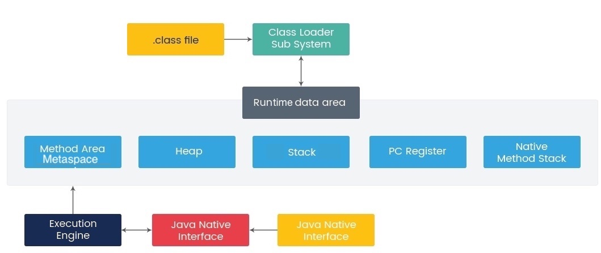


* Method Area 方法区
* Heap 堆
* Stack 栈
* PC Register 程序计数器寄存器
* Native Method Stack 本地方法栈


更加详细的JVM内部图(后面的章节都会涉及到)：


##### PC寄存器

程序计数器寄存器(Program Counter Register)是一块较小的内存空间，它可以看作是当前线程所执行的字节码的行号指示器。每条线程都有⼀个独⽴的PC寄存器，各条线程之间计数器互不影响，独⽴存储。

如果线程正在执行的是Java方法，那么这个计数器的值就是正在执行的虚拟机字节码指令的地址；如果正在执行的是`Native`方法，这个计数器值为空(undefined)。此内存区域是唯一一个在Java虚拟机规范中没有规定任何`OutOfMemoryError`情况的区域。

##### Java虚拟机栈

Java虚拟机栈是线程私有的，它的生命周期与线程相同。每个方法执行的同时都会创建一个栈帧(Stack Frame)用于存储局部变量表、操作数栈、动态链接、方法出口等信息。每一个方法被调用直至执行完毕的过程，就对应着一个栈帧在虚拟机栈中从入栈到出栈的过程。

局部变量表存放了编译期可知的各种基本数据类型(`boolean`、`byte`、`char`、`short`、`int`、`float`、`long`、`double`)、对象引用(``Reference``类型)和`returnAddress`类型（指向了一条字节码指令的地址）。

其中64位长度的`long`和`double`类型的数据会占用2个局部变量空间(Slot)，其余的数据类型占1个。局部变量表所需的内存空间在编译期间分配完成，当进入一个方法时，这个方法需要在帧中分配多大的局部变量空间是完全确定的，在方法运行期间不会改变局部变量表的大小。

在Java虚拟机规范中，对这个区域规定了两种异常状况：

* 如果线程请求栈的深度大于虚拟机所允许的深度，将抛出`StackOverflowError`异常。
* 如果虚拟机栈可以动态扩展(HotSpot不支持)，如果扩展时⽆法申请到⾜够的内存，就会抛出抛出`OutOfMemoryError`异常。

##### 本地方法栈

**本地方法栈**(Native Method Stack)与虚拟机栈所发挥的作用是非常相似的，它们之间的区别不过是虚拟机栈为虚拟机执行java方法，而本地栈则为虚拟机使用到的`native`方法服务。与虚拟机栈一样，本地方法栈也会在栈深度溢出或者栈扩展失 败时分别抛出`StackOverflowError`和`OutOfMemoryError`异常。

##### Java堆

Java**堆**(Heap)是线程共享的，在虚拟机启动时创建。==Java堆的唯一目的就是存放对象实例==，几乎所有的对象实例都在这里分配内存。

Java堆是垃圾收集器管理的主要区域，因此很多时候也被称作"GC堆"(Garbage Collected Heap)。由于现在收集器基本都采用分代收集算法，所以Java堆还可以细分为：新生代、老年代；再细致一点的有Eden空间、From Survivor空间、To Survivor空间等。


* Young Generation 新生代
    * Eden: where new objects get instantiated
    * S0, S1 (Survivor space): hold live objects during minor GC
        * S0: from Survivor
        * S1: to Survivor
* Old Generation (Tenured) 老年代
* Permanent Generation 永久代 (已在Java 8中被删除，见下文)


如果从分配内存的角度看，所有线程共享的Java堆中可以划分出多个线程私有的**分配缓冲区**（Thread Local Allocation Buffer，TLAB)，以提升对象分配时的效率。

##### 方法区/元空间

**⽅法区**(Method Area)是各个线程共享的内存区域，它⽤于存储*已被虚拟机加载的类信息、常量、静态变量、即时编译器编译后的代码*等数据。

对于HotSpot虚拟机来说，它也叫做**永久代**(Permanent Generation, **PermGen**)。这是因为HotSpot虚拟机把GC分代收集扩展⾄⽅法区，或者说使⽤永久代来实现⽅法区，这样HotSpot的垃圾收集器可以像管理Java堆⼀样管理这部分内存，能够省去专门为⽅法区编写内存管理代码的⼯作。对于其他虚拟机（如BEA JRockit、IBM J9等）来说是不存在永久代的概念的。

由于永久代内可能会发生内存泄露或溢出等问题而导致的`java.lang.OutOfMemoryError: PermGen`，JEP小组从JDK1.7开始就筹划移除永久代([JEP 122: Remove the Permanent Generation](http://openjdk.java.net/jeps/122))，并且在JDK 1.7中把字符串常量，符号引用等移出了永久代。到了Java 8，永久代被彻底地移出了JVM，取而代之的是**元空间**(Metaspace)：

> In JDK 8, classes metadata is now stored in the **native heap**(本地堆内存) and this space is called **Metaspace**(元空间).


根据Java虚拟机规范的规定，当⽅法区⽆法满⾜内存分配需求时，将抛出`OutOfMemoryError`异常。


###### 运行时常量池

**运⾏时常量池**(Runtime Constant Pool）是⽅法区的⼀部分。Class文件中除了有类的版本、字段、方法、接口等描述信息外，还有一项信息就是常量池表(Constant Pool Table)，用于存放编译期生成的各种字面量和符号引用。这部分内容将在类加载后进入方法区的运行时常量池中存放。

JDK 1.7开始，字符串常量和符号引用等就被移出永久代：

* 符号引用迁移至系统堆内存(Native Heap)
* 字符串字面量迁移至Java堆(Java Heap)


Interned String:

> In JDK 7, interned strings are no longer allocated in the permanent generation of the Java heap, but are instead allocated in the main part of the **Java heap** (known as the young and old generations), along with the other objects created by the application. This change will result in more data residing in the main Java heap, and less data in the permanent generation, and thus may require heap sizes to be adjusted. Most applications will see only relatively small differences in heap usage due to this change, but larger applications that load many classes or make heavy use of the `String.intern()` method will see more significant differences. <small>[[Java SE 7 Features and Enhancements](http://www.oracle.com/technetwork/java/javase/jdk7-relnotes-418459.html#jdk7changes)]</small>


##### 直接内存/堆外内存

**直接内存**(Direct Memory)或**堆外内存**(off-heap memory)不是虚拟机运行时数据区的一部分，这些内存直接受操作系统管理。这样做的结果就是能保证一个较小的堆，以减少垃圾回收对应用的影响。


怎样通过Java分配内存？

* `java.nio.ByteBuffer`[详见](14 Serialization and File IO.md):
    * HeapByteBuffer (on-heap, up to 2gb) 
    * DirectByteBuffer (off-heap, up to 2gb) 
    * MappedByteBuffer (off-heap, up to 2gb, persisted)
* `sun.misc.Unsafe`
    *  allocateMemory(long allocationSizeInBytes);

直接内存/堆外内存的优缺点：

* 优点 ：
    * 可以很方便的自主开辟很大的内存空间，对大内存的伸缩性很好
    * 减少垃圾回收带来的系统停顿时间
    * 直接受操作系统控制，可以直接被其他进程和设备访问，减少了原本从虚拟机复制的过程
    * 特别适合那些分配次数少，读写操作很频繁的场景
* 缺点 ：
    * 容易出现内存泄漏，并且很难排查
    * 堆外内存的数据结构不直观，当存储结构复杂的对象时，会浪费大量的时间对其进行串行化


[更多Off-Heap的详细应用可参考此PPT](https://www.slideshare.net/rgrebski/on-heap-cache-vs-offheap-cache-53098109)

####  HotSpot虚拟机对象探秘

本节以常⽤的虚拟机HotSpot和常⽤的内存区域Java堆为例，深⼊探讨HotSpot虚拟机在Java堆中对象分配、布局和访问的全过程。

##### 对象的创建

(1) 虚拟机遇到一个`new`指令时，首先去检查这个指令的参数是否能在常量池中定位到一个类的符号引用，并且检查这个符号引用代表的类是否已经被加载、解析和初始化过。如果没有，那必须先执行相应的类加载过程。

(2)在类加载检查通过后，接下来虚拟机将为新⽣对象分配内存。对象所需内存的⼤⼩在类加载完成后便可完全确定，为对象分配空间的任务等同于把⼀块确定⼤⼩的内存从Java堆中划分出来。如果Java堆是绝对规整的(所有⽤过的内存都放在⼀边， 空闲的内存放在另⼀边，中间放着⼀个指针作为分界点的指⽰器)，那么将使用**指针碰撞**(Bump the Pointer)的分配方式: 把那个指针向空闲空间那边挪动⼀段与对象⼤⼩相等的距离。 如果Java堆中的内存并不是规整的，已使⽤的内存和空闲的内存相互交错，那就没有办法简单地进⾏指针碰撞了，虚拟机就必须维护⼀个列表，记录上哪些内存块是可⽤的，在分配的时候从列表中找到⼀块⾜够⼤的空间划分给对象实 例，并更新列表上的记录，这种分配⽅式称为**空闲列表**(Free List)。选择哪种分配方式由Java堆是否规整决定，而Java堆是否规整又由所采用的垃圾收集器是否带有空间压缩整理（Compact）的能力决定。因此，当使用Serial、ParNew等带压缩整理过程的收集器时，系统采用的分配算法是指针碰撞，既简单又高效；而当使用CMS这种基于清除(Sweep)算法的收集器时，理论上就只能采用较为复杂的空闲列表来分配内存。


但是内存的分配是同步的，如果一个线程刚分配一个对象内存，但是还没有修改指针所指向的位置，那么另一个线程分配对象的时候可能就出错了。解决方法有两个:

* 对分配内存空间的动作进行同步处理（CAS方式）。
* 把内存分配的动作按照线程划分在不同的空间进行，每个线程在java堆中预分配一小块内存，称为本地线程分配缓冲(TLAB)。只有TLAB用完并分配新的TLAB时，才需要同步。JVM是否开启TLAB功能，可通过-XX:+/-UseTLAB参数来设定。

(3) 内存分配完之后，初始化零值（不包括对象头），如果使用TLAB，这一工作过程也可以提前至TLAB分配时进行。

(4) 接下来，JVM对对象进行必要的设置，例如这个对象是哪个类的实例、如何才能找到类的元数据信息、对象的哈希码、对象的GC分代年龄等信息。这些信息存放在对象的对象头中，根据JVM当前运行状态不同，如是否启用偏向锁等，对象头会有不同的设置方式。

在上⾯⼯作都完成之后，从虚拟机的视角来看，⼀个新的对象已经产⽣了，但从Java程序的视角来看，对象创建才刚刚开始——即Class文件中的`<init>()`⽅法还没有执⾏，所有的字段都还为零。所以，⼀般来说（由字节码中是否跟随invokespecial指令所决定），执⾏`new`指令之后会接着执⾏`<init>()`⽅法，把对象按照程序员的意愿进⾏初始化，这样⼀个真正可⽤的对象才算完全产⽣出来。


##### 对象的内存布局

在HotSpot虚拟机中，对象在内存中存储的布局可以分为3块区域：*对象头*(Object Header)、*实例数据*(Instance Data)和*对齐填充*(Padding)。


HotSpot虚拟机的对象头包括一下几部分信息:

* Mark Word: 用于存储对象自身的运行时数据（哈希码、GC分代年龄、锁状态标志、线程持有的锁、偏向线程ID、偏向时间戳等）
* Klass pointer: 指向对象对应的Klass对象(其对应的元数据对象）。
* Length：如果是数组对象，还有一个保存数组长度的空间，占4个字节；

OOP-Klass Model用来表示Java对象。

* OOP是指Ordinary Object Pointer(普通对象指针)，用来表示对象的实例信息
* Klass包含元数据和方法信息，用来描述Java类

在Java程序运行的过程中，每创建一个新的对象，在JVM内部就会相应地创建一个对应类型的oop对象。各种oop类的共同基类为`oopDesc`类[^2]。

```cpp
class oopDesc {
private:

  volatile markOop  _mark; // mark word
  union _metadata { // 元数据
    // 实例对应的 Klass （实例对应的类）的指针
    Klass*      _klass;
    // 压缩指针
    narrowKlass _compressed_klass;
  } _metadata;
```


HotSpot虚拟机`markOop.cpp`中的代码（注释）⽚段，它描述了32bit下Mark Word的存储状态。[source](http://hg.openjdk.java.net/jdk7/jdk7/hotspot/file/9b0ca45cd756/src/share/vm/oops/markOop.hpp)

```C
enum { age_bits                 = 4,
       lock_bits                = 2,
       biased_lock_bits         = 1,
       max_hash_bits            = BitsPerWord - age_bits - lock_bits - biased_lock_bits,
       hash_bits                = max_hash_bits > 31 ? 31 : max_hash_bits,
       cms_bits                 = LP64_ONLY(1) NOT_LP64(0),
       epoch_bits               = 2
  };
```

接下来的实例数据是对象真正存储的有效信息，也是在程序代码中所定义的各种类型的字段内容。⽆论是从⽗类继承下来的，还是在⼦类中定义的，都需要记录起来。在父类中定义的变量会出现在子类之前，如果CompactFields参数值为true，那么子类中较窄的变量也可能会插入到父类变量的空隙之中。

对齐填充并不是必然存在的，也没有特别的含义，它仅仅起着占位符的作⽤。由于HotSpot VM的⾃动内存管理系统要求对象起始地址必须是8字节的整数倍，换句话说，就是对象的⼤⼩必须是8字节的整数倍。⽽对象头部分正好是8字节的倍数(1倍或者2倍)，因此，当对象实例数据部分没有对齐时，就需要通过对齐填充来补全。


JVM一般是这样使用锁和Mark Word的：

1. 当没有被当成锁时，这就是一个普通的对象，Mark Word记录对象的HashCode，锁标志位是01，是否偏向锁那一位是0。
2. 当对象被当做同步锁并有一个线程A抢到了锁时，锁标志位还是01，但是否偏向锁那一位改成1，前23bit记录抢到锁的线程id，表示进入偏向锁状态。
3. 当线程A再次试图来获得锁时，JVM发现同步锁对象的标志位是01，是否偏向锁是1，也就是偏向状态，Mark Word中记录的线程id就是线程A自己的id，表示线程A已经获得了这个偏向锁，可以执行同步锁的代码。
4. 当线程B试图获得这个锁时，JVM发现同步锁处于偏向状态，但是Mark Word中的线程id记录的不是B，那么线程B会先用CAS操作试图获得锁，这里的获得锁操作是有可能成功的，因为线程A一般不会自动释放偏向锁。如果抢锁成功，就把Mark Word里的线程id改为线程B的id，代表线程B获得了这个偏向锁，可以执行同步锁代码。如果抢锁失败，则继续执行步骤5。
5. 偏向锁状态抢锁失败，代表当前锁有一定的竞争，偏向锁将升级为轻量级锁。JVM会在当前线程的线程栈中开辟一块单独的空间，里面保存指向对象锁Mark Word的指针，同时在对象锁Mark Word中保存指向这片空间的指针。上述两个保存操作都是CAS操作，如果保存成功，代表线程抢到了同步锁，就把Mark Word中的锁标志位改成00，可以执行同步锁代码。如果保存失败，表示抢锁失败，竞争太激烈，继续执行步骤6。
6. 轻量级锁抢锁失败，JVM会使用自旋锁，自旋锁不是一个锁状态，只是代表不断的重试，尝试抢锁。从JDK1.7开始，自旋锁默认启用，自旋次数由JVM决定。如果抢锁成功则执行同步锁代码，如果失败则继续执行步骤7。
7. 自旋锁重试之后如果抢锁依然失败，同步锁会升级至重量级锁，锁标志位改为10。在这个状态下，未抢到锁的线程都会被阻塞。


##### 对象的访问定位

Java程序需要通过栈上的`Reference`数据来操作堆上的具体对象。目前主流的对象访问方式有两种：句柄(handle)和直接指针。

* 如果直接使用句柄访问，java堆中将会划分出一块内存来作为句柄池，`Reference`中存储的是对象的句柄地址，而句柄中包含了对象数据与类型数据各自的具体地址信息。

> In computer programming, a handle is an abstract reference to a resource.

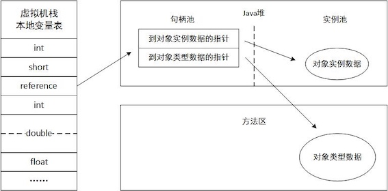


* 如果使用直接指针访问，那么java堆对象的布局中就必须考虑如何放置访问类型数据的相关信息，而`Reference`中存储的直接就是对象地址，如下图所示。


这两种对象访问方式各有优势：

* 使用句柄来访问的最大好处是`Reference`中存储的是稳定的句柄地址，在对象被移动时只会改变句柄中的实例数据指针，而`Reference`本身不需要修改。
* 使用直接指针访问方式的最大好处就是速度更快，它节省了一次指针定位的时间开销。由于对象的访问在Java中⾮常频繁，因此这类开销积少成多后也是⼀项⾮常可观的执⾏成本。

HotSpot虚拟机使用的是直接指针访问的方式。但各种语⾔和框架使⽤句柄来访问的情况也⼗分常见。

####  实战：OutOfMemoryError异常

主要是为了学习之前学的各种内存区域的内容，还有就是以后遇到内存错误的时候，能够根据异常的信息快速判读是哪个区域的内存溢出，知道是什么样的代码可能会导致这些区域内存溢出，以及出现这些异常后，该如何处置。

!!! note

    常见的HotSpot JVM参数

    * `-Xms` 初始堆大小
    * `-Xmx`	最大堆大小
    * `-Xmn	` 新生代大小
    * `-XX: MaxPermSize`	设置持久代最大值
    * `-Xss`	每个线程的堆栈大小


##### Java堆溢出

Java堆⽤于存储对象实例，只要不断地创建对象，并且保证GC Roots到对象之间有可达路径来避免垃圾回收机制清除这些对象，那么在对象数量到达最⼤堆的容量限制后就会产⽣内存溢出异常。

Java堆内存溢出异常测试:

```Java
//VM Args：-Xms20m -Xmx20m -XX: +HeapDumpOnOutOfMemoryError
// 限制Java堆的⼤⼩为20MB，不可扩展（将堆的最⼩值-Xms参数与最⼤值-Xmx参数设置为⼀样即可避免堆⾃动扩展）
// -XX: +HeapDumpOnOutOfMemoryError可以让虚拟机在出现内存溢 出异常时Dump出当前的内存堆转储快照以便事后进⾏分析
import java.util.ArrayList;
public class HeapOOM{
    static class OOMObject{ }
    public static void main(String[] args){
        ArrayList<OOMObject> list=new ArrayList<OOMObject>();
        while(true){
            list.add(new OOMObject());
        }
    }
}
```

结果

```
java.lang.OutOfMemoryError: Java heap space
Dumping heap to java_pid46106.hprof ...
Heap dump file created [29129293 bytes in 0.350 secs]
```

要解决这个区域的异常，⼀般的⼿段是先通过内存映像分析⼯具对Dump出来的堆转储快照进⾏分析，重点是确认内存中的对象是否是必要的，也就是要先分清楚到底是出现了内存泄漏(Memory Leak)还是内存溢出(Memory Overflow)。

!!! note " Memory Analyzer"

    可以使用Eclipse Memory Analyzer打开堆转储快照⽂件。The Eclipse Memory Analyzer is a fast and feature-rich Java heap analyzer that helps you find memory leaks and reduce memory consumption.[Official Website](http://www.eclipse.org/mat/)

    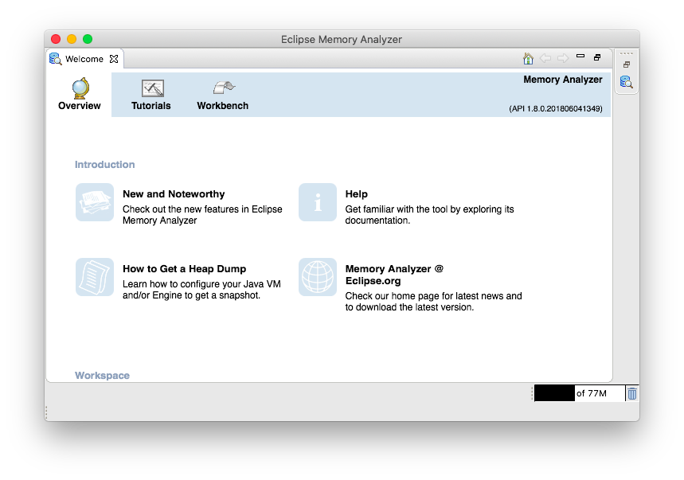


如果是内存泄漏，可进一步通过工具查看泄漏对象到GC Roots的引用链。于是就能找到泄露对象是通过怎样的路径与GC Roots相关联并导致垃圾收集器无法自动回收它们的。掌握了泄露对象的类型信息及GC Roots引用链的信息，就可以比较准确地定位出泄露代码的位置。

如果不存在泄露，换句话说，就是内存中的对象确实都还必须存活着，那就应当检查虚拟机的堆参数（-Xmx与-Xms），与机器物理内存对比看是否还可以调大，从代码上检查是否存在某些对象生命期过长、持有状态时间过长的情况，尝试减少程序运行期的内存消耗。

##### 虚拟机栈和本地方法栈溢出

由于HotSpot虚拟机中并不区分虚拟机栈和本地方法栈，因此，对于HotSpot来说，虽然`-Xoss`参数（设置本地方法栈大小）存在，但实际上是没有效果的，栈容量只由`-Xss`参数设置。关于虚拟机栈和本地方法栈，在Java虚拟机规范中描述了两种异常：

* 如果线程请求的栈深度大于虚拟机所允许的最大深度，将抛出`StackOverflowError`异常。
* 如果虚拟机在扩展栈时无法申请到足够的内存空间，将抛出`OutOfMemoryError`异常。

虚拟机栈和本地⽅法栈OOM测试（仅作为第1点测试程序）:
　
```Java
//VM args: -Xss128k
// -Xss128k 减小栈内存至128k
public class JavaVMStackOverFlowError {
    private int stackLength = 1;
    public void stackLeak(){
        stackLength++;
        stackLeak();
    }
    public static void main(String[] args){
        JavaVMStackOverFlowError sof = new JavaVMStackOverFlowError();
        try{
            sof.stackLeak();
        }catch(Throwable e){
            System.out.println("stackLength: "+sof.stackLength);
            throw e;
        }
    }
}
```
　
```
stackLength: 17600
Exception in thread "main" java.lang.StackOverflowError
	at JavaVMStackOverFlowError.stackLeak(JavaVMStackOverFlowError.java:5)
...
```

这两种异常其实存在着一些互相重叠的地方。实验结果表明：在单个线程下，无论是由于栈帧太大还是虚拟机栈容量太小，当内存无法分配的时候，虚拟机抛出的都是`StackOverflowError`异常。如果测试时不限于单线程，通过不断地建立线程的方式倒是可以产生内存溢出异常。

如果是建立过多线程导致内存溢出，在不能减少线程数或者更换64位虚拟机的情况下，就只能通过减少最大堆和减少栈容量来换取更多的线程。


##### 方法区和运行时常量池溢出


`String.intern()`是一个`Native`方法，他的作用是：如果字符串常量池中已经包含一个等于此`String`常量的字符串，则返回代表池中这个字符串的`String`对象；否则，将此`String`对象包含的字符串添加到常量池中，并且返回此`String`对象的引用。在JDK1.6及之前的版本中，由于常量池分配在永久代内，我们可以通过-XX:PermSize和-XX:MaxPermSize限制方法区大小，从而间接限制其中的常量池的容量。

这意味着重复调用`String.intern()`在JDK1.6之前的版本中会抛出方法区(PermGen space) `OutOfMemoryError`，而在JDK1.7中，不会出现。

```Java
 //VM args:-XX:PermSize10M -XX:MaxPermSize=10M
 // PermSize 方法区大小
import java.util.ArrayList;
import java.util.List;
public class RuntimeContantPoolOutOfMemoryError {

    public static void main(String[] args) {
        //保存对常量池字符串的应用，避免Full GC回收常量池的行为
        List<String> list = new ArrayList<String>();
        //10M在int的范围足够产生OutOfMemoryError
        int i = 0;
        while(true){
            list.add(String.valueOf(i++));
        }
    }
}
```

##### 本机直接内存溢出

`DirectMemory`容量可以通过`-XX:Max`DirectMemory`Size`指定，如果不指定，则默认与Java堆最大值（`-Xmx`  指定）一样。代码清单越过了`DirectByteBuffer`类，直接通过反射获取Unsafe实例进行内存分配（Unsafe类的getUnsafe方法限制了只有引导类加载器才会返回实例，也就是设计者希望只有`rt.jar`中的类才能使用Unsafe的功能）。因为，虽然使用`DirectByteBuffer`分配内存也会抛出内存异常，但它抛出异常时并没有真正向操作系统申请内存分配，而是通过计算得知内存无法分配，于是手动抛出异常，真正申请分配内存的方法是`unsafe.allocateMemory`.

```Java
/**
 * VM Args: -Xmx20M -XX:Max`DirectMemory`Size=10M
 */
public class `DirectMemory`OOM {
    private static final int _1MB = 1024*1024;
    public static void main(String[] args) throws IllegalAccessException {
        Field unsafeField = Unsafe.class.getDeclaredFields()[0];
        unsafeField.setAccessible(true);
        Unsafe unsafe = (Unsafe) unsafeField.get(null);
        while(true) {
            unsafe.allocateMemory(_1MB);
        }
    }
}
```

由`DirectMemory`导致的内存溢出，一个明显的特征是在Heap Dump文件中不会看见明显的异常，如果读者发现OOM之后Dump文件很小，而程序中又直接或者间接使用了NIO，那就可以考虑检查一下是不是这方面的原因。
###  3 垃圾收集器与内存分配策略


⽬前内存的动态分配与内存回收技术已经相当成熟，那为什么我们还要去了解GC和内存分配呢？答案很简单：当需要排查各种内存溢出、内存泄漏问题时，当垃圾收集成为系统达到更⾼并发量的瓶颈时，我们就需要对这些“⾃动化”的技术实施必要的监控和调节。


监控和调节的必要性：


以下几个区域的内存分配和回收都具备确定性，不需要过多考虑回收的问题，因为方法结束或者线程结束，内存自然就跟随着回收了。

* Java内存的程序计数器、虚拟机栈、本地方法栈3个区域随线程而生，随线程而灭
* 栈中的栈帧随着方法的进入和退出而有条不紊地执行着入栈和出栈操作。每一个栈帧中分配多少内存基本上是在类结构确定下来时就已知的


Java堆和方法区则不一样，一个接口中的多个实现类需要的内存可能不一样，一个方法中的多个实现类需要的内存可能不一样，一个方法中的多个分支需要的内存也可能不一样，只有在程序处于运行期间时才能知道会创建哪些对象，这部分内存的分配和回收是动态的，垃圾收集器所关注的是这部分的内存。

####  对象已死吗

垃圾收集器在对堆进⾏回收前，第⼀件事情就是要确定这些对象之中哪些还“存活”着，哪些已经“死去”（即不可能再被任何途径使⽤的对象）。

##### 引用计数算法

**引用计数**(Reference Counting)算法： 给对象中添加⼀个引⽤计数器，每当有⼀个地⽅引⽤它时，计数器值就加1；当引⽤失效时，计数器值就减1；任何时刻计数器为0的对象就是不可能再被使⽤的。它的实现简单，判定效率也很高，在大部分情况下它都是一个不错的算法。

但是至少主流的Java虚拟机里面没有选用计数算法来管理内存，其中主要原因是它很难解决对象之间互相循环引用的问题。

##### 可达性分析算法

在主流的商⽤程序语⾔(Java、C#，甚⾄包括前⾯提到的古⽼的Lisp)的主流实现中，都是称通过**可达性分析**(Reachability Analysis)来判定对象是否存活的。

通过一系列的称为"GC Roots"(Garbage Collection Roots)的对象作为起始点，从这些节点开始向下搜索，搜索所走过的路径称为**引用链**(Reference Chain)，当一个对象到GC Roots没有任何引用链相连时，则证明此对象是不可用的。


如下图所⽰，对象object 5、object 6、object 7虽然互相有关联，但是它们到GC Roots是不可达的，所以它们将会被判定为是可回收的对象。


在Java语言中，可作为GC Roots的对象包括下面几种：

*   虚拟机栈(栈帧中的本地变量表)中引用的对象。
*   方法区中类静态属性引用的对象。
*   方法区中常量引用的对象。
*   本地方法栈中JNI(Java本地接口)引用的对象。

##### 再谈引用

为了更好的管理对象的内存，更好地进行垃圾回收，Java对引用的概念进行了扩充，将引用分为**强引用**(Strong Reference)、**软引用**(Soft Reference)、**弱引用**(Weak Reference)、**虚引用**(Phantom Reference)4种，这4种引用强度依次逐渐减弱。


* **强引用**就是指在程序代码之中普遍存在的，类似`:::Java Object obj = new Object()`这类的引用。当内存空间不足，Java虚拟机宁愿抛出`OutOfMemoryError`错误，使程序异常终止，也不会靠随意回收具有强引用的对象来解决内存不足问题。而如果GC Roots的可达性分析结果为不可达，那么在GC时会被回收。
* **软引用**是用来描述一些还有用但并非必需的对象。对于软引用关联着的对象，在系统将要发生内存溢出异常之前，将会把这些对象列进回收范围之中进行第二次回收。如果这次回收还没有足够的内存，才会抛出内存溢出异常。用`SoftReference`类来实现软引用。适合一些内存敏感的缓存例如网页缓存、图片缓存。
* **弱引用**也是用来描述非必需对象的，但是它的强度比软引用更弱一些，被弱引用关联的对象只能生存到下一次垃圾收集发生之前。当垃圾收集器工作时，无论当前内存是否足够，都会回收掉只被弱引用关联的对象。用`WeakReference`类来实现弱引用。
* **虚引用**也称为幽灵引用或者幻影引用，它是最弱的一种引用关系。一个对象是否有虚引用的存在，完全不会对其生存时间构成影响，也无法通过虚引用来取得一个对象实例。为一个对象设置虚引用关联的唯一目的就是能在这个对象被收集器回收时收到一个系统通知。有`PhantomReference`类来实现虚引用。


| 类型 | 回收时间 | 使用场景 |
| --- | --- | --- |
| 强引用 | 一直存活，除非GC Roots不可达 | 所有程序的场景，基本对象，自定义对象等。|
| 软引用 | 内存不足时会被回收 | 一般用在对内存非常敏感的资源上，用作缓存的场景比较多，例如：网页缓存、图片缓存。 |
| 弱引用 | 只能存活到下一次GC前 | 生命周期很短的对象，例如`ThreadLocalMap`中的`Entry`。 |
| 虚引用 | 随时会被回收， 创建了可能很快就会被回收 | 在netty的内存泄漏检测中使用到：ResourceLeakDetector中的ResourceLeak。 |

##### 生存还是死亡

即使在可达性分析算法中不可达的对象，也并非是“非死不可”的，这时候它们暂时处于“缓刑”阶段，要真正宣告一个对象死亡，至少要经历两次标记过程：如果对象在进行可达性分析后发现没有与GC Roots相连接，那么它将会被第一次标记且进行一次刷选，刷选的条件是此对象是否有必要执行`finalize`方法。当对象没有覆盖`finalize`方法，或者`finalize`方法已经被虚拟机调用过，虚拟机将这两种情况都视为“没有必要执行”。

被判定有必要执行`finalize`方法的对象将被放置与F-Queue的队列中。并在稍后由一个虚拟机自动建立的、低优先级的`Finalizer`线程去执行它。这个执行并不会等待其运行结束，防止阻塞和崩溃。`finalize()`方法是对象逃过死亡命运的最后一次机会，稍后GC将对F-Queue中的对象进行第二次小规模的标记，如果对象要在`finalize`方法中拯救自己---只要重新与引用链上的任何一个对象建立关联即可。但是一个对象的`finalize()`方法只能被执行一次。

```Java
/**
 * 此代码演示了两点：
 * 1.对象可以在被GC时自我拯救。
 * 2.这种自救的机会只有一次，因为一个对象的finalize()方法最多只会被系统自动调用一次
 * @author zzm
 */

public class FinalizeEscapeGC {

    public static FinalizeEscapeGC SAVE_HOOK = null;

    public void isAlive() {
        System.out.println("yes, i am still alive :)");
    }

    @Override
    protected void finalize() throws Throwable {
        super.finalize();
        System.out.println("finalize method executed!");
        FinalizeEscapeGC.SAVE_HOOK = this;
    }

    public static void main(String[] args) throws Throwable {
        SAVE_HOOK = new FinalizeEscapeGC();

        //对象第一次成功拯救自己
        SAVE_HOOK = null;
        System.gc();
        // 因为Finalizer方法优先级很低，暂停0.5秒，以等待它
        Thread.sleep(500);
        if (SAVE_HOOK != null) {
            SAVE_HOOK.isAlive();
        } else {
            System.out.println("no, i am dead :(");
        }

        // 下面这段代码与上面的完全相同，但是这次自救却失败了
        SAVE_HOOK = null;
        System.gc();
        // 因为Finalizer方法优先级很低，暂停0.5秒，以等待它
        Thread.sleep(500);
        if (SAVE_HOOK != null) {
            SAVE_HOOK.isAlive();
        } else {
            System.out.println("no, i am dead :(");
        }
    }
}
// output:
// finalize method executed!
// yes, i am still alive :)
// no, i am dead :(
```

⼤家尽量避免使⽤`finalize()`方法，因为它不是C/C++中的析构函数，⽽是Java刚诞⽣时为了使C/C++程序员更容易接受它所做出的⼀个妥协。它的运⾏代价⾼昂，不确定性⼤，⽆法保证各个对象的调⽤顺序。

##### 回收方法区

永久代的垃圾回收主要回收两部分内容：废弃常量和无用的类。

回收废弃常量与回收Java堆中的对象非常类似。以常量池中字面量的回收为例，如果没有任何对象引用常量池中的常量，也没有其他地方引用，如果这是发生内存回收，而且必要的话，就会被系统清理出常量池。

判断一个类是否是“无用的类”的条件则相对苛刻许多，需要满足下面3个条件：

*   该类所有的实例都已经被回收，也就是java堆中不存在该类的任何实例。
*   加载该类的`ClassLoader`已经被回收
*   该类对应的`Class`对象没有在任何地方被引用，无法在任何地方通过反射访问该类的方法。

虚拟机可以对满⾜上述3个条件的⽆⽤类进⾏回收，这⾥说的仅仅是“可以”，⽽并不是和对象⼀样，不使⽤了就必然会回收。

是否对类进行回收，HotSpot虚拟机提供了`-Xnoclassgc`参数进行控制，还可以使用`-verbose:class`以及`-XX:+TraceClassLoading`、`-XX:+TraceClassUnLoading`查看类加载和卸载信息，，其中`-verbose:class`和`-XX:+TraceClassLoading`可以在Product版的虚拟机中使用，`-XX:+TraceClassUnLoading`参数需要FastDebug版的虚拟机支持。

在大量使用反射、动态代理、CGLib等ByteCode框架、动态生成JSP以及OSGi这类频繁自定义`ClassLoader`的场景都需要虚拟机具备类卸载的功能，以保证永久代不会溢出。

####  垃圾收集算法

##### 标记-清除算法

最基础的收集算法是**标记-清除**(Mark-Sweep)算法。算法分为标记和清除两个阶段：首先标记出所有需要回收的对象，在标记完成后统一回收所有被标记的对象，它的标记过程就是使用可达性算法进行标记的。

它的主要不⾜有两个：

* 执行效率不稳定：如果Java堆中包含大量对象，而且其中大部分是需要被回收的，这时必须进行大量标记和清除的动作，导致标记和清除两个过程的执行效率都随对象数量增长而降低；
* 内存空间的碎片化：标记、清除之后会产生大量不连续的内存碎片，空间碎片太多可能会导致当以后在程序运行过程中需要分配较大对象时无法找 到足够的连续内存而不得不提前触发另一次垃圾收集动作;


##### 标记-复制算法

**标记复制算法**(简称复制算法，Copying)：将可用内存按照容量分为大小相等的两块，每次只使用其中的一块。当这一块的内存用完了，就将还存活着的对象复制到另一块上面，然后把已使用过的内存空间一次清理掉。这样使得每次都是对整个半区进⾏内存回收，内存分配时也就不⽤考虑内存碎⽚等复杂情况，只要移动堆顶指针，按顺序分配内存即可，实现简单，运⾏⾼效。只是这种算法的代价是将内存缩⼩为了原来的⼀半，未免太⾼了⼀点。复制收集算法在对象存活率较⾼时就要进⾏较多的复制操作，效率将会变低。


现在的商业虚拟机都采⽤这种收集算法来回收新生代，IBM公司的专门研究表明，新生代中的对象98%是“朝⽣夕死”的，所以并不需要按照1:1的⽐例来划分内存空间，⽽是将内存分为⼀块较⼤的Eden空间和两块较⼩的Survivor空间，每次使⽤Eden和其中⼀块Survivor。当回收时，将Eden和Survivor中还存活着的对象⼀次性地复制到另外⼀块Survivor空间上，最后清理掉Eden和刚才⽤过的Survivor空间。HotSpot虚拟机默认Eden和Survivor的⼤⼩⽐例是8:1，也就是每次新生代中可⽤内存空间为整个新生代容量的90%（80%+10%），只有10%的内存会被“浪费”。

当Survivor空间不够⽤时，需要依赖其他内存(这⾥指⽼年代)进⾏分配担保(**Handle Promotion**)。如果另外⼀块Survivor空间没有⾜够空间存放上⼀次新生代收集下来的存活对象时，这些对象将直接通过分配担保机制进⼊⽼年代。

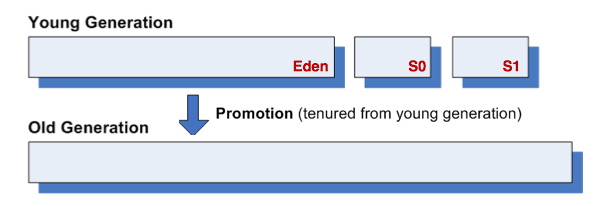


##### 标记-整理算法

**标记整理算法**(Mark-Compact)，标记过程仍然和“标记-清除”一样，但后续不是直接对可回收对象进行清理，而是让所有存活对象向一端移动，然后直接清理掉端边界以外的内存。


##### 分代收集算法

当前商业虚拟机的垃圾收集都采⽤**分代收集**(Generational Collection)算法。根据对象存活周期的不同将内存分为几块。一般把Java堆分为新生代和老年代，根据各个年代的特点采用最合适的收集算法。在新生代中，每次垃圾收集时有大批对象死去，只有少量存活，可以选用复制算法。而老年代对象存活率高，使用标记清理或者标记整理算法。

#####  当前商用实现

这是现有的商用GC对应的算法：


####  HotSpot的算法实现

在HotSpot虚拟机上实现垃圾回收算法时，必须对算法的执⾏效率有严格的考量，才能保证虚拟机⾼效运⾏。


##### 枚举根节点

从可达性分析中从GC Roots节点找引⽤链这个操作为例，可作为GC Roots的节点主要在全局性的引⽤（例如常量或类静态属性）与执⾏上下⽂ （例如栈帧中的本地变量表）中，现在很多应⽤仅仅⽅法区就有数百兆， 如果要逐个检查这⾥⾯的引⽤，那么必然会消耗很多时间。

可达性分析对执⾏时间的敏感还体现在GC停顿上，因为这项分析⼯作必须在⼀个能确保⼀致性的快照中进⾏——这⾥**⼀致性**的意思是指在整个分析期间整个执⾏系统看起来就像被冻结在某个时间点上，不可以出现分析过程中对象引⽤关系还在不断变化的情况，该点不满⾜的话分析结果准确性就⽆法得到保证。这点是导致GC进⾏时必须停顿所有Java执⾏线程（Sun将这件事情称为“Stop The World”）的其中⼀个重要原因，即使是在号称(⼏乎)不会发⽣停顿的CMS收集器中，**枚举根节点时也是必须要停顿的**。


在HotSpot的实现中，是使⽤⼀组称为OopMap的数据结构来达到这个⽬的的，在类加载完成的时候，HotSpot就把对象内什么偏移量上是什么类型的数据计算出来，在JIT(即时编译器)编译过程中，也会在特定的位置记录下栈和寄存器中哪些位置是引⽤。 这样，GC在扫描时就可以直接得知这些信息了。


##### 安全点

如果为每⼀条指令都⽣成对应的OopMap，那将会需要⼤量的额外空间，这样GC的空间成本将会变得很⾼。实际上，HotSpot没有为每条指令都生成OopMap，而只是在“特定的位置”记录了这些信息，这些位置称为**安全点**(Safepoint)，**即程序执行时并非在所有地方都能停顿下来开始GC，只有在到达安全点时才能暂停**。Safepoint的选定既不能太少以至于让GC等待时间太长，也不能过于频繁以致于过分增大运行时的负荷。所以，安全点的选定基本上是以程序“是否具有让程序长时间执行的特征”为标准选定的----因为每条指令执行的时间都非常短暂，程序不太可能因为指令流长度太长这个原因而过长时间运行，“长时间执行”的最明显特征就是指令序列复用，例如方法调用、循环跳转、异常跳转等，所以具有这些功能的指令才会产生Safepoint。

由于GC时，需要所有线程在安全点中断，一种是抢占式中断；另一种是主动式中断，其中抢占式中断就是在GC发生时，首先把所有线程全部中断，如果发现有线程不在安全点，就恢复线程，让它跑到安全点上。现在⼏乎没有虚拟机实现采⽤抢先式中断来暂停线程从⽽响应GC事件。而主动式中断的思想不是直接对线程操作，仅仅是简单设置一个标志，各个线程执行时主动去轮询这个标志，发现中断标志为真时就自己中断挂起。轮询标志的地方和安全点是重合的。

##### 安全区域

有了安全点之后，也不能完美地解决GC的问题，但实际情况却不一定。当程序没有被分配cpu时间，典型的例子就是线程处于sleep或者blocked状态，这个时候线程无法响应JVM的中断请求，“走”到安全点挂起。对于这种情况，就需要安全区域来解决。

**安全区域**(Safe Region)是指在一段代码片段之中，引用关系不会发生变化。在这个区域中的任意地方开始GC都是安全的，我们也可以把Safe Region看做是被扩展的Safepoint。


####  垃圾收集器


如果说垃圾收集算法是内存回收的⽅法论，那么垃圾收集器就是内存回收的具体实现。下面是Sun HotSpot虚拟机1.6版本Update22包含的7种作⽤于不同分代的收集器。如果两个收集器之间存在连线，就说明它们可以搭配使⽤。虚拟机所处的区域，则表⽰它是属于新生代收集器还是⽼年代收集器。

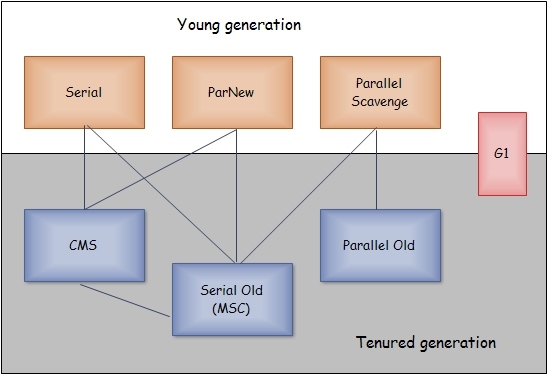


##### Serial收集器

Serial收集器是单线程收集器。它进行垃圾收集时，**必须暂停其他所有的工作线程，直到它收集结束**("Stop The World")。实际上到现在为⽌，它依然是虚拟机运⾏在Client模式下的默认新生代收集器。

它有着优于其他收集器的地⽅：简单⽽⾼效(与其他收集器的单线程⽐)，对于限定单个CPU的环境来说， Serial收集器由于没有线程交互的开销，专⼼做垃圾收集⾃然可以获得最⾼的单线程收集效率。在⽤户的桌⾯应⽤场景中，分配给虚拟机管理的内存⼀般来说不会很⼤，收集⼏⼗兆甚⾄⼀两百兆的新生代(仅仅是新生代使⽤的内存，桌⾯应⽤基本上不会再⼤了)，停顿时间完全可以控制在⼏⼗毫秒最多⼀百多毫秒以内，只要不是频繁发⽣，这点停顿是可以接受的。所以，Serial收集器对于运⾏在Client模式下的虚拟机来说是⼀个很好的选择。

Serial/Serial Old收集器运⾏⽰意图


##### ParNew收集器


ParNew收集器其实就是Serial收集器的多线程版本，除了使⽤多条线程进⾏垃圾收集之外，其余⾏为都与Serial收集器完全⼀样。


ParNew/Serial Old收集器运⾏⽰意图：
　
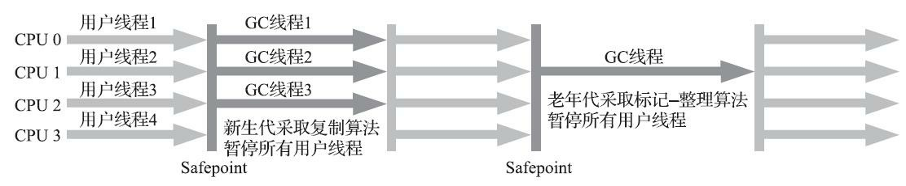


它是许多运⾏在Server模式下的虚拟机中⾸选的新生代收集器，其中有⼀个与性能⽆关但很重要的原因是，除了Serial收集器外，⽬前只有它能与CMS收集器配合⼯作。

##### Parallel Scavenge收集器

Parallel Scavenge收集器的⽬标则是达到⼀个可控制的吞吐量(Throughput)。所谓吞吐量就是CPU⽤于运⾏⽤户代码的时间与CPU总消耗时间的⽐值，即吞吐量=运⾏⽤户代码时间/（运⾏⽤户代码时间+垃圾收集时间，虚拟机总共运⾏了100分钟，其中垃圾收集花掉1分钟，那吞吐量就是99%。


停顿时间越短就越适合需要与⽤户交互的程序，良好的响应速度能提升⽤户体验，⽽⾼吞吐量则可以⾼效率地利⽤CPU时间，尽快完成程序的 运算任务，主要适合在后台运算⽽不需要太多交互的任务。


##### Serial Old 收集器

Serial Old是Serial收集器的老年代版本，它同样是单线程的。使用“标记-整理”算法。

这个收集器的主要意义也是在于给Client模式下的虚拟机使⽤。如果在Server模式下，那么它主要还有两⼤⽤途：⼀种⽤途 是在JDK 1.5以及之前的版本中与Parallel Scavenge收集器搭配使⽤ ，另⼀种⽤途就是作为CMS收集器的后备预案，在并发收集发⽣Concurrent Mode Failure时使⽤。


Serial/Serial Old收集器运⾏⽰意图


##### Parallel Old收集器

Parallel Old是Parallel Scavenge收集器的老年代版本，使用多线程和“标记-整理”算法。这个收集器是在JDK1.6中才开始提供的。

##### CMS收集器


CMS收集器是基于“标记—清除”算法实现的，它的运作过程相对于前⾯⼏种收集器来说更复杂⼀ 些，整个过程分为4个步骤，包括：

1. 初始标记(initial mark): 标记⼀下GC Roots能直接关联到的对象，速度很快。
2. 并发标记(concurrent marking): 进⾏GC RootsTracing的过程。
3. 重新标记(remark): 为了修正并发标记期间因⽤户程序继续运作⽽导致标记产⽣变动的那⼀部分对象的标记记录
4. 并发清理(concurrent sweep): 回收所有被标记的垃圾区域。和程序同时进行。


CMS是⼀款优秀的收集器，有并发收集、低停顿的优点，但有三个主要缺点：


* 对CPU资源⾮常敏感。在并发阶段，它虽然不会导致⽤户线程停顿，但是会因为占⽤了⼀部分线程（或者说CPU资源）⽽导致应⽤程序变慢，总吞吐量会降低。
* ⽆法处理浮动垃圾（Floating Garbage），可能出现“Concurrent Mode Failure”失败⽽导致另⼀次Full GC的产⽣。由于CMS并发清理阶段⽤户线程还在运⾏着，伴随程序运⾏⾃然就还会有新的垃圾不断产⽣，这⼀部分垃圾出现在标记过程之后，CMS⽆法在当次收集中处理 掉它们，只好留待下⼀次GC时再清理掉。这⼀部分垃圾就称为“**浮动垃圾**”。也是由于在垃圾收集阶段⽤户线程还需要运⾏，那也就还需要预留有 ⾜够的内存空间给⽤户线程使⽤，因此CMS收集器不能像其他收集器那样 等到⽼年代⼏乎完全被填满了再进⾏收集，需要预留⼀部分空间提供并发收集时的程序运作使⽤。要是CMS运⾏期间预留的内存⽆法满⾜程序需要，就会出现⼀次“Concurrent Mode Failure”失败，这时虚拟机将启动后备预案：临时启⽤Serial Old收集器来重新进⾏⽼年代的垃圾收集，这样停顿时间就很长了。
* 有⼤量空间碎⽚产⽣。空间碎⽚过多时，将会给⼤对象分配带来很⼤⿇烦，往往会出现⽼年代还有很⼤空间剩余，但是⽆法找到⾜够⼤的连续空间来分配当前对象，不得不提前触发⼀次Full GC。


CMS收集器与线性收集器相比，能够很好的缩短停顿时间。

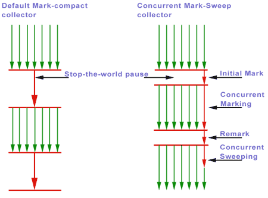

##### G1收集器

详见[Oracle G1收集器入门](https://www.oracle.com/technetwork/tutorials/tutorials-1876574.html)

G1收集器(Garbage-First Garbage Collector)是当今收集器技术发展的最前沿成果之一。G1是一款面向服务端应用的垃圾收集器。HotSpot开发团队赋予它的使命是在未来替换CMS。

它具有以下几个特点：

* 并⾏与并发：G1能充分利⽤多CPU、多核环境下的硬件优势，使⽤多个CPU(CPU或者CPU核⼼)来缩短Stop-The-World停顿的时间，部分其他收集器原本需要停顿Java线程执⾏的GC动作，G1收集器仍然可以通过并发的⽅式让Java程序继续执⾏。
* 分代收集：与其他收集器⼀样，分代概念在G1中依然得以保留。虽然G1可以不需要其他收集器配合就能独⽴管理整个GC堆，但它能够采⽤不同的⽅式去处理新创建的对象和已经存活了⼀段时间、熬过多次GC的旧对 象以获取更好的收集效果。
* 空间整合：与CMS的"标记—清理"算法不同，G1从整体来看是基于"标记—整理"算法实现的收集器，从局部(两个Region之间)上来看是基于“复制”算法实现的，但⽆论如何，这两种算法都意味着G1运作期间不会产⽣内存空间碎⽚，收集后能提供规整的可⽤内存。这种特性有利于程序长时间运⾏，分配⼤对象时不会因为⽆法找到连续内存空间⽽提前触发下⼀次GC。
* 可预测的停顿：这是G1相对于CMS的另⼀⼤优势，降低停顿时间是G1和CMS共同的关注点，但G1除了追求低停顿外，还能建⽴可预测的停顿时间模型，能让使⽤者明确指定在⼀个长度为M毫秒的时间⽚段内，消耗在垃圾收集上的时间不得超过N毫秒，这⼏乎已经是实Java(RTSJ)的垃圾收集器的特征了。

在G1之前的其他收集器进⾏收集的范围都是整个新生代或者⽼年代， ⽽G1不再是这样。使⽤G1收集器时，Java堆的内存布局就与其他收集器有很⼤差别，它将整个Java堆划分为多个⼤⼩相等的独⽴区域(Region)， 虽然还保留有新生代和⽼年代的概念，但新生代和⽼年代不再是物理隔离 的了，它们都是⼀部分Region(不需要连续)的集合。


> G1 partitions the heap into a set of equally sized heap regions, each a contiguous range of virtual memory. A region is the unit of memory allocation and memory reclamation. At any given time, each of these regions can be empty (light gray), or assigned to a particular generation, young or old. As requests for memory comes in, the memory manager hands out free regions. The memory manager assigns them to a generation and then returns them to the application as free space into which it can allocate itself.
> The young generation contains eden regions (red) and survivor regions (red with "S"). These regions provide the same function as the respective contiguous spaces in other collectors, with the difference that in G1 these regions are typically laid out in a noncontiguous pattern in memory. Old regions (light blue) make up the old generation. Old generation regions may be humongous (light blue with "H") for objects that span multiple regions.
> An application always allocates into a young generation, that is, eden regions, with the exception of humongous, objects that are directly allocated as belonging to the old generation. <small>[[HotSpot Virtual Machine Garbage Collection Tuning Guide](https://docs.oracle.com/javase/9/gctuning/JSGCT.pdf)]</small>


[HotSpot Virtual Machine Garbage Collection Tuning Guide](https://docs.oracle.com/javase/9/gctuning/JSGCT.pdf)

The following list describes the phases, their pauses and the transition between the phases of the G1 garbage collection cycle in detail:

1. Young-only phase: This phase starts with a few young-only collections that promote objects into the old generation. The transition between the young-only phase and the space-reclamation phase starts when the old generation occupancy reaches a certain threshold, the Initiating Heap Occupancy threshold. At this time, G1 schedules an Initial Mark young-only collection instead of a regular young-only collection.
    * Initial Mark : This type of collection starts the marking process in addition to performing a regular young-only collection. Concurrent marking determines all currently reachable (live) objects in the old generation regions to be kept for the following space-reclamation phase. While marking hasn’t completely finished, regular young collections may occur. Marking finishes with two special stop-the-world pauses: Remark and Cleanup.
    * Remark: This pause finalizes the marking itself, and performs global reference processing and class unloading. Between Remark and Cleanup G1 calculates a summary of the liveness information concurrently, which will be finalized and used in the Cleanup pause to update internal data structures.
    * Cleanup: This pause also reclaims completely empty regions, and determines whether a space-reclamation phase will actually follow. If a space-reclamation phase follows, the young-only phase completes with a single young-only collection.
2. Space-reclamation phase: This phase consists of multiple mixed collections that in addition to young generation regions, also evacuate live objects of sets of old generation regions. The space-reclamation phase ends when G1 determines that evacuating more old generation regions wouldn't yield enough free space worth the effort.

After space-reclamation, the collection cycle restarts with another young-only phase. As backup, if the application runs out of memory while gathering liveness information, G1 performs an in-place stop-the-world full heap compaction (Full GC) like other collectors.

##### 理解GC日志

我们先看一段GC日志：

!!! example "GC日志"

    ```text
    [GC [PSYoungGen: 8987K->1016K(9216K)] 9984K->5056K(19456K), 0.0569611 secs]
    [GC [PSYoungGen: 8038K->1000K(9216K)] 12078K->10425K(19456K), 0.0709523 secs][Times：user=0.01 sys=0.00，real=0.02 secs]
    [Full GC [PSYoungGen: 1000K->0K(9216K)] [ParOldGen: 9425K->8418K(10240K)] 10425K->8418K(19456K) [PSPermGen: 9678K->9675K(21504K)], 0.3152834 secs]
    [Full GC [PSYoungGen: 8192K->3583K(9216K)] [ParOldGen: 8418K->9508K(10240K)] 16610K->13092K(19456K) [PSPermGen: 9675K->9675K(22016K)], 0.1913859 secs]
    [Full GC [PSYoungGen: 7716K->7702K(9216K)] [ParOldGen: 9508K->9508K(10240K)] 17224K->17210K(19456K) [PSPermGen: 9675K->9675K(21504K)], 0.2769775 secs]
    [Full GC [PSYoungGen: 7702K->7702K(9216K)] [ParOldGen: 9508K->9409K(10240K)] 17210K->17111K(19456K) [PSPermGen: 9675K->9675K(21504K)], 0.2491993 secs]
    ```

*   “\[GC”和“\[full DC”说明了这次垃圾回收的停顿类型。如果是调用`System.gc()`方法所触发的收集，那么这里显示“\[Full DC(System)”.
*   \[DefNew、\[Tenured、\[Perm 表示GC发生的区域。\[DefNew表示新生代使用Serial串行GC垃圾收集器。如果是ParNew收集器，新生代名为“\[ParNew”。如果采用Parallel Scavenge收集器，那它配套的新生代名为"\[PSYoungGen"。对于老年代和永久代同理。
*   \[PSYoungGen: 8987K->1016K(9216K)\] 9984K->5056K(19456K), 0.0569611 secs\]中后面的数字含义是：GC前该内存区域已使用容量->GC后Java堆已使用容量（Java堆总容量）。后面的时间是该区域GC所占用的时间，单位是秒。
*   \[Times: user=0.03 sys=0.02, real=0.06 secs\] 这里的user、sys和real与Linux的time命令所输出的时间含义一，分别代表用户态消耗的CPU时间，内核态消耗的CPU时间和操作从开始到结束所经过的墙钟时间。


####  内存分配与回收策略

Java技术体系中所提倡的⾃动内存管理最终可以归结为⾃动化地解决了两个问题：给对象分配内存以及回收分配给对象的内存。

对象的内存分配，往大方向讲，就是在堆上分配（但也可能经过JIT编译后被拆散为标量类型并间接地栈上分配），对象主要分配在新生代的Eden区上，如果启动了本地线程分配缓冲，将按线程优先在TLAB上分配。少数情况下也可能会直接分配在老年代中，分配的规则并不是百分之百固定的，其细节取决于当前使用的是哪一种垃圾收集器组合，还有虚拟机中与内存相关的参数的设置。

接下来我们将会讲解几条最普遍的内存分配规则，并通过代码去验证这些规则。本节下面的代码在测试时使用Client模式虚拟机运行，没有手工指定收集器组合，换句话说，验证的是在使用Serial/Serial Old收集器下(ParNew/Serial Old收集器组合的规则也基本一致)的内存分配和回收的策略。

##### 对象优先在Eden分配

大多数情况下，对象在新生代Eden区中分配。当Eden区没有足够空间进行分配时，虚拟机将发起一次**Minor GC**。

虚拟机提供了`-Xlog:gc*`这个收集器日志参数(`-XX：+PrintGCDetails`已过时)，告诉虚拟机在发生垃圾收集行为时打印内存回收日志，并且在进程退出的时候输出当前的内存各区域分配情况。

!!! example

    例子中的`testAllocation()`方法中，尝试分配3个2MB大小和1个4MB大小的对象，在运行时通过`-Xms20M`、 `-Xmx20M`、` -Xmn10M`这3个参数限制了Java堆大小为20MB，不可扩展，其中10MB分配给新生代，剩下的10MB分配给老年代。`-XX:SurvivorRatio=8`决定了新生代中Eden区与一个Survivor区的空间比例是8∶1，从输出的结果也可以清晰地看到"eden space 8192K、from space 1024K、to space 1024K"的信息，新生代总可用空间为9216KB（Eden区+1个Survivor区的总容量）。

    ```Java tab="java"
    //VM参数: -Xms20M -Xmx20M -Xmn10M -Xlog:gc* -XX:SurvivorRatio=8 -XX:+UseSerialGC
    public class TestAllocation {
        private static final int _1MB = 1024 * 1024;

        public static void main(String[] args) {
            byte[] allocation1, allocation2, allocation3, allocation4;
            allocation1 = new byte[2 * _1MB];
            allocation2 = new byte[2 * _1MB];
            allocation3 = new byte[2 * _1MB];
            allocation4 = new byte[4 * _1MB];  // 出现一次Minor GC
        }
    }
    ```

    ```text tab="log"
    [0.035s][info][gc] Using Serial
    [0.035s][info][gc,heap,coops] Heap address: 0x00000007bec00000, size: 20 MB, Compressed Oops mode: Zero based, Oop shift amount: 3
    [0.317s][info][gc,start     ] GC(0) Pause Young (Allocation Failure)
    [0.327s][info][gc,heap      ] GC(0) DefNew: 6657K->865K(9216K)
    [0.327s][info][gc,heap      ] GC(0) Tenured: 0K->4096K(10240K)
    [0.327s][info][gc,metaspace ] GC(0) Metaspace: 4995K->4995K(1056768K)
    [0.327s][info][gc           ] GC(0) Pause Young (Allocation Failure) 6M->4M(19M) 9.499ms
    [0.327s][info][gc,cpu       ] GC(0) User=0.01s Sys=0.01s Real=0.01s
    [0.330s][info][gc,heap,exit ] Heap
    [0.330s][info][gc,heap,exit ]   def new generation   total 9216K, used 7301K [0x00000007bec00000, 0x00000007bf600000, 0x00000007bf600000)
    [0.330s][info][gc,heap,exit ]   eden space 8192K,  78% used [0x00000007bec00000, 0x00000007bf2491f0, 0x00000007bf400000)
    [0.330s][info][gc,heap,exit ]   from space 1024K,  84% used [0x00000007bf500000, 0x00000007bf5d8568, 0x00000007bf600000)
    [0.330s][info][gc,heap,exit ]   to space 1024K,   0% used [0x00000007bf400000, 0x00000007bf400000, 0x00000007bf500000)
    [0.330s][info][gc,heap,exit ]   tenured generation total 10240K, used 4096K [0x00000007bf600000, 0x00000007c0000000, 0x00000007c0000000)
    [0.330s][info][gc,heap,exit ]   the space 10240K,  40% used [0x00000007bf600000, 0x00000007bfa00020, 0x00000007bfa00200, 0x00000007c0000000)
    [0.330s][info][gc,heap,exit ]  Metaspace used 5035K, capacity 5096K, committed 5376K, reserved 1056768K
    [0.330s][info][gc,heap,exit ]   class space used 448K, capacity 460K, committed 512K, reserved 1048576K
    ```

执行`testAllocation()`中分配`allocation4`对象的语句时会发生一次Minor GC，这次GC的结果是新生代6657KB变为865K，而总内存占用量则几乎没有减少（因为`allocation1`、`allocation2`、`allocation3`三个对象都是存活的，虚拟机几乎没有找到可回收的对象）。这次GC发生的原因是给`allocation4`分配内存的时候，发现Eden已经被占用了6MB，剩余空间已不足以分配`allocation4`所需的4MB内存，因此发生Minor GC。GC期间虚拟机又发现已有的3个2MB大小的对象全部无法放入Survivor空间（Survivor空间只有1MB大小），所以只好通过分配担保机制提前转移到老年代去。

这次GC结束后，4MB的`allocation4`对象顺利分配在Eden中，因此程序执行完的结果是Eden占用4MB（被`allocation4`占用），Survivor空闲，老年代被占用6MB（被`allocation1`、`allocation2`、`allocation3`占用）。通过GC日志可以证实这一点。


##### 大对象直接进入老年代

所谓的大对象是指，需要大量连续内存空间的Java对象，最典型的大对象就是那种很长的字符串以及数组。大对象对虚拟机的内存分配来说就是一个坏消息(替Java虚拟机抱怨一句，比遇到一个大对象更加坏的消息就是遇到一群“朝生夕灭”的“短命大对象”，写程序的时候应当避免)，经常出现大对象容易导致内存还有不少空间时就提前触发垃圾收集以获取足够的连续空间来“安置”它们。

虚拟机提供了一个`-XX:PretenureSizeThreshold`参数，令大于这个设置值的对象直接在老年代分配。这样做的目的是避免在Eden区及两个Survivor区之间发生大量的内存复制（新生代采用复制算法收集内存）。


Note
    `PretenureSizeThreshold`参数只对Serial和ParNew两款收集器有效，Parallel Scavenge收集器不认识这个参数，Parallel Scavenge收集器一般并不需要设置。如果遇到必须使用此参数的场合，可以考虑ParNew加CMS的收集器组合。

!!! example

    例子中的Eden空间几乎没有被使用，而老年代的10MB空间被使用了40%，也就是4MB的`allocation`对象直接就分配在老年代中，这是因为`PretenureSizeThreshold`被设置为3MB（就是3145728，这个参数不能像`-Xmx`之类的参数一样直接写3MB），因此超过3MB的对象都会直接在老年代进行分配。


    ```Java tab="Java"
    /**
     * VM参数: -Xms20M -Xmx20M -Xmn10M -XX:SurvivorRatio=8 -Xlog:gc*
     * -XX:+UseSerialGC -XX:PretenureSizeThreshold=3145728
     */

    public class TestPretenureSIzeThreadhold {

        private static final int _1MB = 1024 * 1024;

        public static void main(String[] args){
            byte[] allocation;
            allocation = new byte[4 * _1MB];  //直接分配在老年代中
        }
    }
    ```  

    ```text tab="log"
    [0.028s][info][gc] Using Serial
    [0.029s][info][gc,heap,coops] Heap address: 0x00000007bec00000, size: 20 MB, Compressed Oops mode: Zero based, Oop shift amount: 3
    [0.309s][info][gc,heap,exit ] Heap
    [0.310s][info][gc,heap,exit ]  def new generation   total 9216K, used 2725K [0x00000007bec00000, 0x00000007bf600000, 0x00000007bf600000)
    [0.310s][info][gc,heap,exit ]   eden space 8192K,  33% used [0x00000007bec00000, 0x00000007beea95a0, 0x00000007bf400000)
    [0.310s][info][gc,heap,exit ]   from space 1024K,   0% used [0x00000007bf400000, 0x00000007bf400000, 0x00000007bf500000)
    [0.310s][info][gc,heap,exit ]   to   space 1024K,   0% used [0x00000007bf500000, 0x00000007bf500000, 0x00000007bf600000)
    [0.310s][info][gc,heap,exit ]  tenured generation   total 10240K, used 4096K [0x00000007bf600000, 0x00000007c0000000, 0x00000007c0000000)
    [0.310s][info][gc,heap,exit ]    the space 10240K,  40% used [0x00000007bf600000, 0x00000007bfa00010, 0x00000007bfa00200, 0x00000007c0000000)
    [0.310s][info][gc,heap,exit ]  Metaspace       used 4968K, capacity 5032K, committed 5120K, reserved 1056768K
    [0.310s][info][gc,heap,exit ]   class space    used 442K, capacity 460K, committed 512K, reserved 1048576K
    ```


##### 长期存活的对象将进入老年代

既然虚拟机采用了分代收集的思想来管理内存，那么内存回收时就必须能识别哪些对象应放在新生代，哪些对象应放在老年代中。为了做到这点，虚拟机给每个对象定义了一个对象年龄(Age)计数器。如果对象在Eden出生并经过第一次Minor GC后仍然存活，并且能被Survivor容纳的话，将被移动到Survivor空间中，并且对象年龄设为1。对象在Survivor区中每“熬过”一次Minor GC，年龄就增加1岁，当它的年龄增加到一定程度（默认为15岁），就将会被晋升到老年代中。对象晋升老年代的年龄阈值，可以通过参数`-XX:MaxTenuringThreshold`设置。


!!! example

    这个例子分别以`-XX:MaxTenuringThreshold=1`和`-XX:MaxTenuringThreshold= 15`两种设置来`testTenuringThreshold()`方法，此方法中的`allocation1`对象需要256KB内存，Survivor空间可以容纳。当`MaxTenuringThreshold=1`时，`allocation1`对象在第二次GC发生时进入老年代，新生代已使用的内存GC后非常干净地变成0KB。而`MaxTenuringThreshold=15`时，第二次GC发生后，`allocation1`对象则还留在新生代Survivor空间，这时新生代仍然有404KB被占用。


    ```Java tab="测试TenuringThreshold"
    /**
     * VM参数: -Xms20M -Xmx20M -Xmn10M -XX:SurvivorRatio=8
     * -XX:MaxTenuringThreshold=1 -Xlog:gc* -XX:+UseSerialGC
     */

    public class testTenuringThreshold {
        private static final int _1MB = 1024 * 1024;

        @SuppressWarnings("unused")
        public static void main(String[] args) {
            byte[] allocation1, allocation2, allocation3;
            allocation1 = new byte[_1MB / 4];
            // 什么时候进入老年代取决于XX:`MaxTenuringThreshold`设置
            allocation2 = new byte[4 * _1MB];
            allocation3 = new byte[4 * _1MB];
            allocation3 = null;
            allocation3 = new byte[4 * _1MB];
        }
    }
    ```


    ```text tab="MaxTenuringThreshold=1"
    [0.030s][info][gc] Using Serial
    [0.030s][info][gc,heap,coops] Heap address: 0x00000007bec00000, size: 20 MB, Compressed Oops mode: Zero based, Oop shift amount: 3
    [0.276s][info][gc,start     ] GC(0) Pause Young (Allocation Failure)
    [0.288s][info][gc,heap      ] GC(0) DefNew: 6913K->1024K(9216K)
    [0.288s][info][gc,heap      ] GC(0) Tenured: 0K->4192K(10240K)
    [0.288s][info][gc,metaspace ] GC(0) Metaspace: 4971K->4971K(1056768K)
    [0.288s][info][gc           ] GC(0) Pause Young (Allocation Failure) 6M->5M(19M) 11.650ms
    [0.288s][info][gc,cpu       ] GC(0) User=0.01s Sys=0.01s Real=0.01s
    [0.291s][info][gc,start     ] GC(1) Pause Young (Allocation Failure)
    [0.295s][info][gc,heap      ] GC(1) DefNew: 5204K->0K(9216K)
    [0.295s][info][gc,heap      ] GC(1) Tenured: 4192K->5216K(10240K)
    [0.295s][info][gc,metaspace ] GC(1) Metaspace: 4973K->4973K(1056768K)
    [0.295s][info][gc           ] GC(1) Pause Young (Allocation Failure) 9M->5M(19M) 4.475ms
    [0.295s][info][gc,cpu       ] GC(1) User=0.00s Sys=0.00s Real=0.01s
    [0.297s][info][gc,heap,exit ] Heap
    [0.297s][info][gc,heap,exit ]  def new generation   total 9216K, used 4234K [0x00000007bec00000, 0x00000007bf600000, 0x00000007bf600000)
    [0.297s][info][gc,heap,exit ]   eden space 8192K,  51% used [0x00000007bec00000, 0x00000007bf0225e0, 0x00000007bf400000)
    [0.297s][info][gc,heap,exit ]   from space 1024K,   0% used [0x00000007bf400000, 0x00000007bf400270, 0x00000007bf500000)
    [0.297s][info][gc,heap,exit ]   to   space 1024K,   0% used [0x00000007bf500000, 0x00000007bf500000, 0x00000007bf600000)
    [0.297s][info][gc,heap,exit ]  tenured generation   total 10240K, used 5216K [0x00000007bf600000, 0x00000007c0000000, 0x00000007c0000000)
    [0.297s][info][gc,heap,exit ]    the space 10240K,  50% used [0x00000007bf600000, 0x00000007bfb18188, 0x00000007bfb18200, 0x00000007c0000000)
    [0.297s][info][gc,heap,exit ]  Metaspace       used 4996K, capacity 5032K, committed 5120K, reserved 1056768K
    [0.297s][info][gc,heap,exit ]   class space    used 443K, capacity 460K, committed 512K, reserved 1048576K
    ```

    ```text tab="MaxTenuringThreshold=15"
    [0.033s][info][gc] Using Serial
    [0.033s][info][gc,heap,coops] Heap address: 0x00000007bec00000, size: 20 MB, Compressed Oops mode: Zero based, Oop shift amount: 3
    [0.322s][info][gc,start     ] GC(0) Pause Young (Allocation Failure)
    [0.333s][info][gc,heap      ] GC(0) DefNew: 6913K->1023K(9216K)
    [0.333s][info][gc,heap      ] GC(0) Tenured: 0K->4195K(10240K)
    [0.333s][info][gc,metaspace ] GC(0) Metaspace: 5020K->5020K(1056768K)
    [0.333s][info][gc           ] GC(0) Pause Young (Allocation Failure) 6M->5M(19M) 10.971ms
    [0.333s][info][gc,cpu       ] GC(0) User=0.01s Sys=0.01s Real=0.01s
    [0.336s][info][gc,start     ] GC(1) Pause Young (Allocation Failure)
    [0.341s][info][gc,heap      ] GC(1) DefNew: 5204K->4K(9216K)
    [0.341s][info][gc,heap      ] GC(1) Tenured: 4195K->5219K(10240K)
    [0.341s][info][gc,metaspace ] GC(1) Metaspace: 5063K->5063K(1056768K)
    [0.341s][info][gc           ] GC(1) Pause Young (Allocation Failure) 9M->5M(19M) 5.095ms
    [0.341s][info][gc,cpu       ] GC(1) User=0.00s Sys=0.00s Real=0.01s
    [0.343s][info][gc,heap,exit ] Heap
    [0.343s][info][gc,heap,exit ]  def new generation   total 9216K, used 4238K [0x00000007bec00000, 0x00000007bf600000, 0x00000007bf600000)
    [0.343s][info][gc,heap,exit ]   eden space 8192K,  51% used [0x00000007bec00000, 0x00000007bf0227a8, 0x00000007bf400000)
    [0.343s][info][gc,heap,exit ]   from space 1024K,   0% used [0x00000007bf400000, 0x00000007bf401218, 0x00000007bf500000)
    [0.343s][info][gc,heap,exit ]   to   space 1024K,   0% used [0x00000007bf500000, 0x00000007bf500000, 0x00000007bf600000)
    [0.343s][info][gc,heap,exit ]  tenured generation   total 10240K, used 5219K [0x00000007bf600000, 0x00000007c0000000, 0x00000007c0000000)
    [0.343s][info][gc,heap,exit ]    the space 10240K,  50% used [0x00000007bf600000, 0x00000007bfb18ea0, 0x00000007bfb19000, 0x00000007c0000000)
    [0.343s][info][gc,heap,exit ]  Metaspace       used 5074K, capacity 5096K, committed 5376K, reserved 1056768K
    [0.343s][info][gc,heap,exit ]   class space    used 456K, capacity 460K, committed 512K, reserved 1048576K
    ```


##### 动态对象年龄判定

为了能更好地适应不同程序的内存状况，虚拟机并不是永远地要求对 象的年龄必须达到了`MaxTenuringThreshold`才能晋升⽼年代，如果在Survivor空间中相同年龄所有对象⼤⼩的总和⼤于Survivor空间的⼀半，年龄⼤于或等于该年龄的对象就可以直接进⼊⽼年代，⽆须等到 `MaxTenuringThreshold`中要求的年龄。    

##### 空间分配担保

在发⽣Minor GC之前，虚拟机会先检查⽼年代最⼤可⽤的连续空间是否⼤于新生代所有对象总空间，如果这个条件成⽴，那么Minor GC可以确保是安全的。如果不成⽴，则虚拟机会查看HandlePromotionFailure设置值是否允许担保失败。如果允许，那么会继续检查⽼年代最⼤可⽤的连续空间是否⼤于历次晋升到⽼年代对象的平均⼤⼩，如果⼤于，将尝试着进⾏⼀次Minor GC，尽管这次Minor GC是有风险的；如果⼩于，或者HandlePromotionFailure设置不允许冒险，那这时也要改为进⾏⼀次Full GC。


##### Minor/Major/Full GC

Minor GC vs Major GC vs Full GC

* Minor GC： 清理新生代(Young Generation, consisting of Eden and Survivor spaces)时。
* Major GC: 清理老年代(Old generation, also tenured space)。
* Full GC: 清理整个堆空间—包括新生代和老年代。


###  4 虚拟机性能监控与故障处理工具


#### VisualVM

[VisualVM](https://visualvm.github.io)是到目前为止随JDK发布的功能最强大的运行监视和故障处理程序。

使用JDK自带的VisualVM在安装VisualGC插件后，可以非常方便的查看垃圾收集器各个部分的大小及其随时间的变化。


### 5 调优案例分析与实战

###  6 类文件结构


####  Class类文件的结构

Class文件是一组以8位字节为基础单位的二进制流。当遇到需要占⽤8位字节以上空间的数据项时，以Big-Endian方式存储。Class文件采用一种类似于C语言结构体的伪结构来存储数据，这种伪结构中只有两种数据类型：无符号数和表。

* ⽆符号数属于基本的数据类型，以`u1`、`u2`、`u4`、`u8`来分别代表1、2、4和8个字节的⽆符号数，⽆符号数可以⽤来描述数字、索引引⽤、数量值或者按照UTF-8编码构成字符串值。
* 表是由多个⽆符号数或者其他表作为数据项构成的复合数据类型，所有表都习惯性地以`_info`结尾。


Class文件格式：

```C
ClassFile {
    u4			magic;
    u2			minor_version;
    u2			major_version;
    u2			constant_pool_count;
    cp_info		contant_pool[constant_pool_count – 1];
    u2			access_flags;
    u2			this_class;
    u2			super_class;
    u2			interfaces_count;
    u2			interfaces[interfaces_count];
    u2			fields_count;
    field_info		fields[fields_count];
    u2			methods_count;
    method_info		methods[methods_count];
    u2			attributes_count;
    attribute_info	attributes[attributes_count];
}
```

[^12]

##### 分析工具

以下面简短的Java代码为例，

```Java
public class TestClass{
    private int m;
    public int inc() {
        return m+1;
    }
}
```

编译后，使用[Classpy](http://ginobefunny.com/post/deep_in_jvm_notes_part4/)打开，


也可以直接用JDK工具`javap`分析Class文件字节码。

```java
 javap -c -verbose TestClass.class

  MD5 checksum ce62ee2f47f2ff81598bbcb156358747
  Compiled from "TestClass.java"
public class com.unstandingJVM.TestClass
  minor version: 0
  major version: 53
  flags: (0x0021) ACC_PUBLIC, ACC_SUPER
  this_class: #3                          // com/unstandingJVM/TestClass
  super_class: #4                         // java/lang/Object
  interfaces: 0, fields: 1, methods: 2, attributes: 1
Constant pool:
   #1 = Methodref          #4.#18         // java/lang/Object."<init>":()V
   #2 = Fieldref           #3.#19         // com/unstandingJVM/TestClass.m:I
   #3 = Class              #20            // com/unstandingJVM/TestClass
   #4 = Class              #21            // java/lang/Object
   #5 = Utf8               m
   #6 = Utf8               I
   #7 = Utf8               <init>
   #8 = Utf8               ()V
   #9 = Utf8               Code
  #10 = Utf8               LineNumberTable
  #11 = Utf8               LocalVariableTable
  #12 = Utf8               this
  #13 = Utf8               Lcom/unstandingJVM/TestClass;
  #14 = Utf8               inc
  #15 = Utf8               ()I
  #16 = Utf8               SourceFile
  #17 = Utf8               TestClass.java
  #18 = NameAndType        #7:#8          // "<init>":()V
  #19 = NameAndType        #5:#6          // m:I
  #20 = Utf8               com/unstandingJVM/TestClass
  #21 = Utf8               java/lang/Object
{
  public com.unstandingJVM.TestClass();
    descriptor: ()V
    flags: (0x0001) ACC_PUBLIC
    Code:
      stack=1, locals=1, args_size=1
         0: aload_0
         1: invokespecial #1                  // Method java/lang/Object."<init>":()V
         4: return
      LineNumberTable:
        line 3: 0
      LocalVariableTable:
        Start  Length  Slot  Name   Signature
            0       5     0  this   Lcom/unstandingJVM/TestClass;

  public int inc();
    descriptor: ()I
    flags: (0x0001) ACC_PUBLIC
    Code:
      stack=2, locals=1, args_size=1
         0: aload_0
         1: getfield      #2                  // Field m:I
         4: iconst_1
         5: iadd
         6: ireturn
      LineNumberTable:
        line 6: 0
      LocalVariableTable:
        Start  Length  Slot  Name   Signature
            0       7     0  this   Lcom/unstandingJVM/TestClass;
}
SourceFile: "TestClass.java"
```

最方便的是使用IntelliJ IDEA的插件[jclasslib Bytcode Viewer](https://plugins.jetbrains.com/plugin/9248-jclasslib-bytecode-viewer)，使用方法为选择View菜单栏中的`Show ByteCode`或者`Show ByteCode with jclasslib`选项。

##### 魔数

每个Class⽂件的头4个字节称为**魔数**(Magic Number)，它的唯⼀作⽤是确定这个⽂件是否为⼀个能被虚拟机接受的Class⽂件，[可参考[Magic Number in OSC](13 File System Interface.md)]。Class⽂件的魔数的很有"浪漫⽓息"，值为：0xCAFEBABE(咖啡宝贝？)。

##### 版本号

紧接着魔数的4个字节存储的是Class⽂件的版本号：第5和第6个字节是次版本号(Minor Version)，第7和第8个字节是主版本号(Major Version)。

##### 常量池

由于常量池(constant pool)中常量的数量是不固定的，所以在常量池的入口需要放置项`u2`类型的数据，代表常量池容量计数值(`constant_pool_count`)。常量池中主要存放两⼤类常量：字⾯量(Literal)和符号引⽤(Symbolic References)。字⾯量⽐较接近于Java语⾔层⾯的常量概念，如⽂本字符串、声明为final的常量值等。⽽符号引⽤则属于编译原理⽅⾯的概念，包括了下⾯三类常量：类和接口的全限定名(Fully Qualified Name)、字段的名称和描述符(Descriptor)，⽅法的名称和描述符。

[^12]

常量池由多个`cp_info`结构组成，一个`cp_info`对应一个常量。在字节码中共有14种类型的`cp_info`，以`CONSTANT_utf8_info`为例，`tag`表示`cp_info`的类型，这里为01。接下来两个字节`length`标识该字符串的长度，最后`bytes`是字符串具体的值[^12]。


##### 访问标志

在常量池结束之后，紧接着的两个字节代表*访问标志*(`access_flags`)，这个标志⽤于识别⼀些类或者接口层次的访问信息，包括：这个Class是类还是接口；是否定义为`public`类型；是否定义为`abstract`类型；如果是类的话，是否被声明为`final`等。    


##### 类索引、⽗类索引与接口索引集合

类索引(`this_class`)和⽗类索引(`super_class`)都是⼀个`u2`类型的数据，⽽接口索引集合(interfaces)是⼀组u2类型的数据的集合，Class⽂件中由这三项数据来确定这个类的继承关系。

##### 字段表

字段表`field_info`⽤于描述接口或者类中声明的变量。

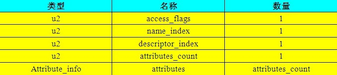

字段修饰符放在access_flags中，包含ACC_PUBLIC(字段是否public)、ACC_PRIVATE(字段是否private)、ACC_PROTECTED(字段是否protected)、ACC_STATIC(字段是否static) 、ACC_VOLATILE(字段是否volatile)等。

`name_index`和`descriptor_index`都是对常量池的引⽤，分别代表着字段的简单名称以及字段和⽅法的描述符。

描述符的作用则是用来描述字段的数据类型、方法的参数列表（包括数量、类型以及顺序等）和返回值的。根据描述符规则，详细的描述符标示字的含义如下表所示：

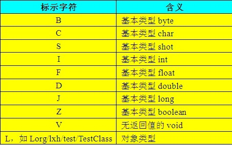


TestClass的filed_info:


##### 方法表

Class⽂件存储格式中对⽅法的描述与对字段的描述⼏乎采⽤了完全⼀致的⽅式，⽅法表(`method_info`)的结构如同字段表⼀样，每个方法都有权限修饰符(`access_flags`)、方法名索引(`name_index`)、描述符索引(`descriptor_index`)、属性列表(`attributes`)这⼏项。

[^12]


⽅法⾥的Java代码，经过编译器编译成字节码指令后，存放在`attribute_info`中⼀个名为`Code`的属性⾥⾯。

##### 属性表

属性表(attribute_info)包含以下属性：


####  字节码指令简介
Java虚拟机的指令由⼀个字节长度的、代表着某种特定操作含义的数字(称为**操作码**，Opcode)以及跟随其后的零⾄多个代表此操作所需参数(称为**操作数**，Operands)⽽构成。

JVM的指令集是基于栈而不是寄存器，基于栈可以具备很好的跨平台性（因为寄存器指令集往往和硬件挂钩），但缺点在于，要完成同样的操作，基于栈的实现需要更多指令才能完成（因为栈只是一个FILO结构，需要频繁压栈出栈）。另外，由于栈是在内存实现的，而寄存器是在CPU的高速缓存区，相较而言，基于栈的速度要慢很多，这也是为了跨平台性而做出的牺牲。[^12]

####  共有设计和私有设计

理解公有设计与私有实现之间的分界线是⾮常有必要的，Java虚拟机实现必须能够读取Class⽂件并精确实现包含在其中的Java虚拟机代码的语义。拿着Java虚拟机规范⼀成不变地逐字实现其中要求的内容当然是⼀种可⾏的途径，但⼀个优秀的虚拟机实现，在满⾜虚拟机规范的约束下对具 体实现做出修改和优化也是完全可⾏的，并且虚拟机规范中明确⿎励实现者这样做。

虚拟机实现的⽅式主要有以下两种：

* 将输⼊的Java虚拟机代码在加载或执⾏时翻译成另外⼀种虚拟机的指令集。
* 将输⼊的Java虚拟机代码在加载或执⾏时翻译成宿主机CPU的本地指令集（即JIT代码⽣成技术）。

####  Class文件结构的发展

相对于语⾔、API以及Java技术体系中其他⽅⾯的变化，Class⽂件结构⼀直处于⽐较稳定的状态，Class⽂件的主体结构、字节码指令的语义和数量⼏乎没有出现过变动，所有对Class⽂件格式的改进，都集中在向访问标志、属性表这些在设计上就可扩展的数据结构中添加内容。
###  7 虚拟机类加载机制

虚拟机的类加载机制是指，虚拟机把描述类的数据从Class⽂件加载到内存，并对数据进⾏验证、准备、解析、初始化等，最终形成可以被虚拟机直接使⽤的Java类型。

与那些在编译时需要进⾏链接的语⾔不同，在Java语⾔⾥⾯，**类型的加载、链接和初始化过程都是在程序运⾏期间完成的**，这种策略虽然会令类加载时稍微增加⼀些性能开销，但是会为Java应⽤程序提供⾼度的灵活性，Java天⽣可以动态扩展的语⾔特性就是依赖运⾏期动态加载和动态链接这个特点实现的。


####  类加载的时机

类从被加载到虚拟机内存中开始，到卸载出内存为⽌，它的整个⽣命周期包括：加载(Loading)、验证(Verification)、准备(Preparation)、解析(Resolution)、初始化(Initialization)、使⽤(Using)和卸载(Unloading)7个阶段。


####  类加载的过程
##### 加载

> **Loading** is the process of finding the class file that represents the class or interface type with a particular name and reading it into a byte array. Next the bytes are parsed to confirm they represent a Class object and have the correct major and minor versions. Any class or interface named as a direct superclass is also loaded. Once this is completed a class or interface object is created from the binary representation.


加载是类加载(Class Loading)过程的⼀个阶段，虚拟机需要完成以下3件事情：

* 通过⼀个类的全限定名来获取定义此类的⼆进制字节流。
* 将这个字节流所代表的静态存储结构转化为⽅法区的运⾏时数据结构。
* 在内存中⽣成⼀个代表这个类的`java.lang.Class`对象，作为⽅法区这个类的各种数据的访问⼊口。

第一条中的获取二进制字节流可以从多个地方获取。例如ZIP包(JAR)，网络(Applet)，运行时计算生成(`java.lang.refelct.Proxy`)等。

##### 验证

验证是为了确保Class⽂件的字节流中包含的信息符合当前虚拟机的要求，并且不会危害虚拟机⾃⾝的安全。

虽然Java语⾔本⾝是相对安全的语⾔，但是Class⽂件并不⼀定要求⽤Java编译⽽来，它可以使⽤任何途径产⽣，甚⾄包括⽤⼗六进制编辑器直接编写来产⽣Class⽂件。虚拟机如果不检查输 ⼊的字节流，对其完全信任的话，很可能会因为载⼊了有害的字节流⽽导致系统崩溃。

* ⽂件格式验证：验证字节流是否符合Class⽂件格式的规范，并且能被当前 版本的虚拟机处理。
* 元数据验证：对字节码描述的信息进⾏语义分析，以保证其描述的信息符合Java语⾔规范的要求，

##### 准备

Preparing involves allocation of memory for static storage and any data structures used by the JVM such as method tables. Static fields are created and initialized to their default values, however, no initializers or code is executed at this stage as that happens as part of initialization.


准备阶段为类变量分配内存并设置类变量(仅包括被被static修饰的变量)初始值，这些变量所使⽤的内存都将在⽅法区中进⾏分配。实例变量将会在对象实例化时随着对象一起分配在Java堆中。初始值通常情况下是数据类型的默认值.

```Java
public static int value = 123; //初始值为0
```

如果类字段的字段属性表中存在ConstantValue属性，那在准备阶段变量value就会被初始化为ConstantValue属性所指定的值：

```Java
public static final int value = 123; // 初始值为123
```


##### 解析

解析阶段将常量池内的符号引⽤替换为直接引⽤。

**符号引⽤**(Symbolic References): 符号引⽤以⼀组符号来描述所引⽤的⽬标，符号可以是任何形式的字⾯量，只要使⽤时能⽆歧义地定位到⽬标即可。符号引⽤与虚拟机实现的内存布局⽆关，引⽤的⽬标并不⼀定已经加载到内存中。各种虚拟机实现的内存布局可以各不相同，但是它们能接受的符号引⽤必须都是⼀致的，因为符号引⽤的字⾯量形式明确定义在Java虚拟机规范的Class⽂件格式中。

**直接引⽤**(Direct References): 直接引⽤可以是直接指向⽬标的指针、相对偏移量或是⼀个能间接定位到⽬标的句柄。直接引⽤是和虚拟机实现的内存布局相关的，同⼀个符号引⽤在不同虚拟机实例上翻译出来的直接引⽤⼀般不会相同。如果有了直接引⽤，那引⽤的⽬标必定已经在内 存中存在。


##### 初始化

Initialization of a class or interface consists of executing the class or interface initialization method <`clinit`>.


What is the difference between <`init`> and <`clinit`>? [StackOverflow](https://stackoverflow.com/questions/8517121/java-what-is-the-difference-between-init-and-clinit)

* <`init`> is the (or one of the) constructor(s) for the instance, and non-static field initialization.
* <`clinit`> are the static initialization blocks for the class, and static field initialization.

```Java
class X {

   static Log log = LogFactory.getLog(); // <clinit>

   private int x = 1;   // <init>

   X(){
      // <init>
   }

   static {
      // <clinit>
   }
}
```

对于初始化阶段，虚拟机规范严格规定了有且只有5种情况必须⽴即对类进⾏“初始化”：

* 遇到`new`、`getstatic`、`putstatic`或`invokestatic`这4条字节码指令时，如果类没有进⾏过初始化，则需要先触发其初始化。⽣成这4条指令的最常见的Java代码场景是：使⽤`new`关键字实例化对象的时候、读取或设置⼀个类的静态字段(被final修饰、已在编译期把结果放⼊常量池的静态字段除外)的时候，以及调⽤⼀个类的静态⽅法的时候。
* 使⽤`java.lang.reflect`包的⽅法对类进⾏反射调⽤的时候，如果类没有进⾏过初始化，则需要先触发其初始化。（例如，`Class.forName`)
* 当初始化⼀个类的时候，如果发现其⽗类还没有进⾏过初始化，则需要先触发其⽗类的初始化。
* 当虚拟机启动时，⽤户需要指定⼀个要执⾏的主类(包含`main()`⽅法的那个类)，虚拟机会先初始化这个主类。
* 当使⽤JDK 1.7的动态语⾔⽀持时，如果⼀个`java.lang.invoke.MethodHandle`实例最后的解析结果REF_getStatic、 REF_putStatic、REF_invokeStatic的⽅法句柄，并且这个⽅法句柄所对应的类没有进⾏过初始化，则需要先触发其初始化。

"有且只有"这5种场景中的⾏为称为对⼀个类进⾏**主动引⽤**。除此之外，所有引⽤类的⽅式都不会触发初始化，称为**被动引⽤**。


下面代码运⾏之后，只会输出"SuperClass init!"，⽽不会输出"SubClass init!"。可通过`-Xlog:class+load=info`打印类加载信息。

!!! example "主动使用和被动使用"

    ```Java tab="被动使用1"
    //被动使用类字段演示一：通过子类引用父类的静态字段，不会导致子类初始化
    public class NotInitialization1 {
        public static void main(String[] args) {
            System.out.println(SubClass.value);
        }
    }

    class SuperClass {
        static {
            System.out.println("SuperClass init!");
        }
        public static int value = 123;
    }

    class SubClass extends SuperClass {
        static {
            System.out.println("SubClass init!");
        }
    }
    ```

    ```Java tab="被动使用2"
    // 被动使用类字段演示二：通过数组定义来引用类，不会触发此类的初始化
    public class NotInitialization2  {
        public static void main(String[] args) {
            SuperClass[] sca = new SuperClass[10];
        }
    }
    ```


####  类加载器


##### 类与类加载器

对于任意⼀个类，都需要由加载它的类加载器和这个类本⾝⼀同确⽴其在Java虚拟机中的唯⼀性，每⼀个类加载器， 都拥有⼀个独⽴的类名称空间。

⽐较两个类是否“相等”，只有在这两个类是由同⼀个类加载器加载的前提下才有意义，否则，即使这两个类来源于同⼀个Class⽂件，被同⼀个虚拟机加载，只要加载它们的类加载器不同，那这两个类就必定不相等。

!!! example "不同的类加载器对`instanceof`关键字运算的结果的影响"

    ```Java
    //类加载器与instanceof关键字演示
    public class ClassLoaderTest {
        static class MyClassLoader extends ClassLoader {
            @Override
            public Class<?> loadClass(String name) throws ClassNotFoundException {
                try {
                    String fileName = name.substring(name.lastIndexOf(".") + 1)
                                + ".class";
                    InputStream is = getClass()
                        .getResourceAsStream(fileName); // 找到class文件
                    if (is == null)  return super.loadClass(name);
                    byte[] b = new byte[is.available()];
                    is.read(b);  // 读取class
                    return defineClass(name, b, 0, b.length); // 转化为class实例
                } catch (IOException e) {
                    throw new ClassNotFoundException(name);
                }
            }
        }

        public static void main(String[] args) throws Exception {
            MyClassLoader myClassLoader = new MyClassLoader();
            Object obj = myClassLoader
                .loadClass("com.unstandingJVM.ClassLoaderTest").newInstance();
            // 输出：class com.unstandingJVM.ClassLoaderTest
            System.out.println(obj.getClass());        
            //输出： false
            System.out.println(obj instanceof com.unstandingJVM.ClassLoaderTest);
        }
    }
    ```

##### 双亲委派模型

https://www.baeldung.com/java-classloaders

从Java虚拟机的角度来讲，只存在两种不同的类加载器：⼀种是**启动类加载器**(Bootstrap ClassLoader)，这个类加载器使⽤C++语⾔实现 ，是虚拟机⾃⾝的⼀部分；另⼀种就是所有其他的类加载器，这些类加载器都由Java语⾔实现，独⽴于虚拟机外部，并且全都继承⾃抽象类 `java.lang.ClassLoader`。


* **Bootstrap ClassLoader**(启动类加载器): It is usually implemented as native code because it is instantiated very early as the JVM is loaded. It loads JDK internal classes, typically loads `rt.jar` and other core libraries located in `$JAVA_HOME/jre/lib` directory.
* **Extension ClassLoader**(扩展类加载器): It loads classes from the JDK extensions directory, usually `$JAVA_HOME/lib/ext` directory.
* **Application ClassLoader**(应⽤程序类加载器): It loads classes from the current classpath that can be set while invoking a program using `-cp` or `-classpath` command line options.
* **User Defined ClassLoaders**(⾃定义类加载器): It can alternatively be used to load application classes. A user defined classloader is used for a number of special reasons including run time reloading of classes or separation between different groups of loaded classes typically required by web servers such as Tomcat.

```Java
public class ViewClassLoader {
    public static void main(String[] args) {
        // 启动类加载器，HashMap位于$JAVA_HOME
        System.out.println(java.util.HashMap.class.getClassLoader());
        // 扩展类加载器，位于$JAVA_HOME/lib/ext
        System.out.println(javafx.collections.FXCollections
                    .class.getClassLoader());
        // 应用程序类加载器，位于当前目录
        System.out.println(ViewClassLoader.class.getClassLoader());
        // 自定义类加载器
        ClassLoaderTest.MyClassLoader myClassLoader =
                new ClassLoaderTest.MyClassLoader();
        Object obj = myClassLoader
                .loadClass("com.unstandingJVM.ClassLoaderTest").newInstance();
        System.out.println("class loader for testClassLoader class:"
                + obj.getClass().getClassLoader());
    }
}
// 输出结果
// null  #启动类加载器
// sun.misc.Launcher$ExtClassLoader@123a439b # 扩展类加载器
// sun.misc.Launcher$AppClassLoader@18b4aac2 # 应用程序类加载器
// com.unstandingJVM.ClassLoaderTest$MyClassLoader@76ccd017 # 自定义类加载器
```


类加载器的⼯作过程是：如果⼀个类加载器收到了类加载的请求，它⾸先不会⾃⼰去尝试加载这个类，⽽是把这个请求委派给⽗类加载器去完成，每⼀个层次的类加载器都是如此，因此所有的加载请求最终都应该传送到顶层的启动类加载器中，只有当⽗加载器反馈⾃⼰⽆法完成这个加载请求（它的搜索范围中没有找到所需的类）时，⼦加载器才会尝试⾃⼰去加载。类加载器之间的这种关系被称为类加载器的**双亲委派模型**(Parents Delegation Model)。

到了Java SE9，classloader越来越复杂，详细见[The Class Loader Hierarchy](https://docs.oracle.com/cd/E19501-01/.                                                                                                             819-3659/beadf/index.html)


###  8 虚拟机字节码执行引擎


执⾏引擎是Java虚拟机最核⼼的组成部分之⼀。“虚拟机”是⼀个相对于"物理机"的概念，这两种机器都有代码执⾏能⼒，其区别是物理机的执⾏引擎是直接建⽴在处理器、硬件、指令集和操作系统层⾯上的，⽽虚拟机的执⾏引擎则是由⾃⼰实现的，因此可以⾃⾏制定指令集与执⾏引擎的结构体系，并且能够执⾏那些不被硬件直接⽀持的指令集格式。

在不同的虚拟机实现⾥⾯，执⾏引擎在执⾏Java代码的时候可能会有解释执⾏（通过解释器执⾏）和编译执⾏（通过即时编译器产⽣本地代码执⾏）两种选择， 也可能两者兼备，甚⾄还可能会包含⼏个不同级别的编译器执⾏引擎。

为了能更高效的执行，同时又保持跨平台的特性，另外一个方法就是在执行class时再将其翻译为对应的机器码，这个方法是比较靠谱的，因此无论是Hotspot、还是JRockit，都采用了这种方式，也就是大家熟知的JIT(Just In Time) Compiler。


JAVA的第一道工序是javac编译，当然目标文件是字节码BYTECODE。后续可能有三种处理方式：

1. 运行时，BYTECODE由JVM逐条解释执行(通过解释器执行)
2. 运行时，部分代码可能由JIT(Just In Time)翻译为目标机器指令（以method为翻译单位，还会保存起来，第二次执行就不用翻译了）直接执行；
3. RTSJ。继JAVAC之后执行AOT二次编译，生成静态的目标平台代码（典型的就是IBM WEBSHPERE REAL TIME）。

OK，既然觉得在装载class后翻译成机器码去执行可以比较高效，那这个时候又会出现两种状况，是执行class的时候就立刻翻译成机器码，还是先用解释模式执行，然后到一定时机再翻译成机器码呢，之所以出现这两种状况，原因在于将class翻译为机器码是需要消耗时间的，因此如果执行class 的时候就立刻翻译成机器码的话，也就会导致Java程序启动速度会比较慢，JRockit是这么认为的，JRockit的服务对象是server级应用，这类应用的特点是没那么在乎启动速度，而更在乎的是执行时的高效，而且如果执行的时候就立刻翻译成机器码的话，就意味着压根不需要实现解释器，因此 JRockit采取的方法是在执行class时直接编译为机器码，而Hotspot由于需要同时支持client和server应用，对于client应用而言，启动速度非常重要，因此Hotspot采用的是先解释执行，到了一定时机后再翻译成机器码。

详见 JRockit权威指南--深入理解JVM 第二章
###  9 类加载及执行子系统的案例与实战


...to be continued
###  10 早期(编译期)优化


java的编译器可能指的以下三种：

1. **前端编译器**：将`*.java`文件变成`*.class`文件，例如Sun的Javac、Eclipse JDT中的增量式编译器（ECJ）。随后`.class`文件由Java虚拟机解释执行。
2. **JIT编译器**（Just In Time Compiler，即时编译器）：将**字节码**变成**机器码**，例如HotSpot VM的C1、C2编译器
3. **AOT编译器**（Ahead Of Time Compiler）：直接把`*.java`文件编译成**本地机器码**，例如GNU Compiler for the Java（GCJ）、Excelsior JET， ART (Android Runtime)

本文中涉及到的编译器都仅限于第一类，第二类编译器跟java语言的关系不大。javac这类编译器对代码的运行效率**几乎没有**任何**优化措施**，但javac做了许多针对java语言代码过程的优化措施来**改善**程序员的**编码风格**和**提高编码效率**，java许多的语法特性都是靠编译器的语法糖来实现的。

####  javac编译器

Sun javac编译器的编译过程可以分为3个过程：

* 解析与填充符号表过程
* 插入式注解处理器的注解处理过程
* 分析与字节码生成过程


####  java语法糖

##### 泛型与类型擦除

泛型(Generics)的本质是**参数化类型**（Parametersized Type）的应用，也就是说所操作的数据类型被指定为一个参数。

Java中的泛型**只在程序源码中存在**，在编译后的字节码文件中，已经替换为原来的原生类型(Raw Type)，并在相应的地方插入了强制转型代码。因此，对于运行期的Java语言来说，`ArrayList<int>`与`ArrayList<String>`就是同一个类，所以泛型技术实际上是Java语言的一种语法糖，Java语言中的泛型实现方法称为**类型擦除**(type erasure)，基于这种方法实现的泛型称为**伪泛型**。

!!! example "类型擦除"

    由于类型擦除，下面的代码却会报错:" Method listMethod(List<String>) has the same erasure listMethod(List<E>) as another method in type Foo"。

    ```java
    public class Foo {  
        public void listMethod(List<String> stringList){  
        }  
        public void listMethod(List<Integer> intList) {  
        }  
    }
    ```

    下面定义了两个`ArrayList`数组，不过一个是`ArrayList<String>`泛型类型，只能存储字符串。一个是`ArrayList<Integer>`泛型类型，只能存储整形。最后，我们通过arrayList1对象和arrayList2对象的`getClass()`方法获取它们的类的信息，最后发现结果为true。说明泛型类型`String`和`Integer`都被擦除掉了，只剩下了原始类型。

    ```java
		ArrayList<String> arrayList1=new ArrayList<String>();
		arrayList1.add("abc");
		ArrayList<Integer> arrayList2=new ArrayList<Integer>();
		arrayList2.add(123);
		System.out.println(arrayList1.getClass()==arrayList2.getClass());
    ```

https://stackoverflow.com/questions/18666710/why-are-arrays-covariant-but-generics-are-invariant

https://craftinginterpreters.com/evaluating-expressions.html#design-note

##### 自动装箱、拆箱与遍历循环

自动装箱、自动拆箱与遍历循环这些语法糖是java语言里使用得最多的语法糖。

##### 条件编译

使用条件为常量的if语句，Java语言可以实现条件编译。

!!! example "条件编译"

    以下代码Java编译器会提示错误。

    ```java
    public class test {
        public static void main(String[] args) {
            //编译器将会提示error: unreachable statement
            while (false) {
                System.out.println("");
            }
        }
    }
    ```

###  11 晚期(运行期)优化

在部分的商用虚拟机中，java程序最初是通过**解释器**（Interpreter）进行**解释执行**的，当虚拟机发现某个方法或代码块的运行特别频繁时，就会把这些代码认定为“**热点代码**”（Hot Spot Code）。为了提高热点代码的执行效率，在运行时，虚拟机将会把这些代码**编译**成与本地平台相关的机器码，并进行各种层次的优化，完成这个过程的编译器称为**即时编译器**(Just In Time Compiler)。

java虚拟机规范中没有规定即时编译器应该如何实现，也没有规定虚拟机必需拥有即时编译器，这部分功能完全是虚拟机具体实现相关的内容。本文中提及的编译器、即时编译器都是指**HotSpot虚拟机**内的即时编译器.

#### HotSpot虚拟机内的即时编译器

##### 解释器和编译器

HotSpot虚拟机采用**解释器与编译器并存**的架构，解释器与编译器两者各有优势：

1. 当程序需要迅速启动和执行的时候，解释器可以首先发挥作用，省去编译的时间，**立即执行**;
2. 在程序运行后，随着时间的推移，编译器逐渐发挥作用，把越来越多的代码编译成本地代码之后，可以**获得更高的执行效率**;
3. 当程序运行环境中内存资源限制较大，可以使用**解释**执行**节约内存**，反之可以使用**编译**执行来**提升效率**;
4. 解释器还可以作为编译器**激进优化**的一个“**逃生门**”，让编译器根据概率选择一些大多数时候都能提升运行速度的优化手段，当激进优化的假设不成立时，可以通过逆优化退回到解释状态继续执行;


HotSpot虚拟机中内置了两个即时编译器，分别称为Client Compiler和Server Compiler，或者简称为**C1编译器**和**C2编译器**，虚拟机默认采用解释器与其中一个编译器直接配合的方式工作。


由于即时编译器编译本地代码需要占用程序运行时间，要编译出优化程度更高的代码，所花费的时间可能更长；而且想要编译出优化程度更高的代码，解释器可能还要替编译器收集性能监控信息，这对解释执行的速度也有影响。HotSpot虚拟机采用**分层编译**（Tiered Compilation）的策略，其中包括：

* **第0层**：程序**解释执行**，解释器不开启性能监控功能（Profiling），可触发第1层编译；
* **第1层**：也称为**C1编译**，将字节码编译为本地代码，进行简单、可靠的优化，如有必要将加入性能监控的逻辑；
* **第2层**：也称为**C2编译**，也是将字节码编译为本地代码，但是会启用一些编译耗时较长的优化，甚至会根据性能监控信息进行一些不可靠的激进优化；

实施分层编译后，Client Compiler和Server Compiler将会同时⼯作，许多代码都可能会被多次编译，⽤Client Compiler获取更⾼的编译速度，⽤Server Compiler来获取更好的编译质量，在解释执⾏的时候也⽆须再承担收集性能监控信息的任务。

##### 编译对象与触发条件

在运行过程中会被即时编译器编译的“**热点代码**”有两类：

* 被多次调用的方法
* 被多次执行的循环体

在这两种情况下，都是**以整个方法作为编译对象**，这种编译方式被称为**栈上替换**（On Stack Replacement，简称OSR编译，即方法栈帧还在栈上，方法就被替换了）。

判断一段代码是不是热点代码，是不是需要触发即时编译，这样的行为称为**热点探测**（Hot Spot Detection），目前主要的热点探测判定方式有两种：

* **基于采样的热点探测**（Sample Based Hot Spot Detection）：采用这种方法的虚拟机会周期性地检查各个线程地栈顶，如果发现某个方法**经常出现在栈顶**，那这个方法就是“热点方法”
  * **优点**：实现简单、高效，还可以很容易地获取方法调用关系
  * **缺点**：很难精确地确认一个方法的热度，容易因为受到线程阻塞或别的外界因素的影响而扰乱热点探测
* **基于计数器的热点探测**（Counter Based Hot Spot Detection）：采用这个种方法的虚拟机会为每个方法建立计数器，**统计方法的执行次数**，如果执行次数超过一定的阈值就认为它是“热点方法”
  * **优点**：统计结果相对来说更加精确和严谨
  * **缺点**：实现复杂

在**HotSpot虚拟机**中使用的是**第二种**，因此它为每个方法准备了两类计数器：**方法调用计数器**（Invocation Counter）和**回边计数器**（Back Edge Counter）。在确定虚拟机运行参数的前提下，这两个计数器都由一个确定的阈值，当计数器超过阈值溢出了，就会触发JIT编译

* **方法调用计数器**：用于统计方法被调用的次数，它的默认阈值在Client模式下是1500次，在Server模式在是10000次，可通过-XX: CompileThreshold来设定
  * 方法被调用时，先检查该方法是否存在被JIT编译过的版本
    * **存在**：优先使用编译后的本地代码来执行
    * **不存在**：将此方法的调用计数器值加1，执行下一步
  * 判断方法调用计数器与汇编计数器值之和是否超过方法调用计数器的阈值
    * **超过阈值**：向即时编译器提交一个该方法的代码编译请求。默认不会同步等待编译请求完成，而是继续解释执行，当编译工作完成之后，这个方法的调用入口地址就会被系统自动改写成新的，下一次调用该方法时就会使用已编译版本
    * **未超过**：解释执行
  * 如果不做任何设置，方法调用计数器统计的**不是方法被调用的绝对次数**，**而是一个相对执行频率**，即一段时间之内方法被调用的次数。当超过一定的时间限度，如果方法的调用次数仍然不足以让它提交给即时编译器编译，那这个方法的调用计数器就会被减少一般，这个过程称为方法调用计数器的**热度衰减**（Counter Decay）


* **回边计数器**：用于统计一个方法中循环体代码执行的次数，在字节码中遇到控制流向后跳转的指令称为“回边”（Back Edge）
  * 回边计数器阈值计算公式：
    * **Client模式**：方法调用计数器阈值（CompileThreshold） * OSR比率（OnStackReplacePercentage） / 100 ==> 默认值为13995
    * **Server模式**：方法调用计数器阈值（CompileThreshold） * (OSR比率（OnStackReplacePercentage） - 解释器监控比率（InterpreterProfilePercentage） / 100) ==> 默认值为10700
  * 当解释器遇到一条回边指令时，会先查找将要执行的代码片段是否有已经编译好的版本
    * **有**：优先执行已编译代码
    * **无**：把回边计数器的值加1，执行下一步
  * 判断方法调用计数器与回边计数器值之后是否超过回边计数器的阈值
    * **超过**：提交一个OSR编译请求，并且把回边计数器的值降低一些，以便继续在编译器中执行循环，等待编译器输出编译结果
    * **未超过**：解释执行
  * 与方法计数器不同，回边计数器**没有计数热度衰减的过程**，因此这个计数器统计的就是该方法循环执行的绝对次数


ps：上面描述的是Client VM的即时编译方法，对于Server VM来说，执行情况会比上面的描述更复杂

##### 编译过程

Server Compiler和Client Compiler两个编译器的编译过程是不一样的

Client Compiler是一个**简单快速的三段式编译器**，主要的关注点在于**局部性的优化**，而放弃了许多耗时较长的全局优化手段。

1. **第一个阶段**：使用一个平台独立的前端将字节码构造成一种**高级中间代码**表示（High-Level Intermediate Representaion, HIR）。HIR使用静态单分配（Static Single Assignment, SSA）的形式来代表代码值，这可以使得一些在HIR的构造过程之中和之后进行的优化动作更容易实现。在此之前编译器会在字节码上完成一部分基础优化，如方法内联、常量传播等。
2. **第二个阶段**：使用一个平台相关的前端从HIR中产生**低级中间代码**表示（Low-Level Intermediate Representaion, LIR），而在此之前会在HIR上完成另外一些优化，如空值检查清除、范围检查清除等。
3. **最后阶段**：使用平台相关的后端使用线性扫描算法（Linear Scan Register Allocation）在LIR上分离寄存器，并在LIR上做窥孔（Peephole）优化，然后产生**机器代码**。


Server Compiler是**专门面向服务端的典型应用并为服务端的性能配置特别调整过的编译器**，它会执行所有经典的优化动作。Server Compiler的寄存器分配器是一个全局图着色分配器，它可以充分利用某些处理器架构上的大寄存器集合。以即时编译的标准来看，Server Compiler**编译速度比较缓慢**，但依然远远超过传统的静态优化编译器，而且相对于Client Compiler编译**输出的代码质量有所提高**，可以减少本地代码的执行时间，从而抵消了额外的编译时间开销

#### 编译优化技术

在即时编译器中采用的优化技术有很多，本节主要针对以下四种优化技术。

##### 公共子表达式消除

公共子表达式消除是一个普遍应用与各种编译器的经典优化技术，它的含义是：

* 如果一个表达式E已经计算过了，并且从先前的计算到现在E中的**所有变量的值都没有发生变化**，那么E的这次出现就成为了公共子表达式
* 对于这种表达式，没有必要花时间再对它进行计算，只需要直接**用前面计算过的表达式结果替代E**就可以了
* 如果这种优化仅限于程序的基本块内，便称为**局部公共子表达式消除**（Local Common Subexpression Elimination），如果这种优化的范围涵盖了多个基本块，那就称为**全局公共子表达式消除**（Global Common Subexpression Elimination）

##### 数组边界检查消除

数组边界检查消除（Array Bounds Checking Elimination）是即时编译器中的一项语言相关的经典优化技术。由于java语言中访问数组元素时，系统将会**自动进行上下界的范围检查**，这必定会**造成性能负担**。为了安全，数组边界检查是必须做的，但数组边界检查是否必须一次不漏的执行则是**可以“商量”**的事情。例如编译器通过数据流分析判定数组下标的取值永远在[0,数组.length)之内，就可以**把数组的上下界检查消除**

从更高的角度看，大量安全检查使编写java程序更简单，但也造成了更多的**隐式开销**，对于这些隐式开销，除了尽可能把运行期检查提到编译期完成的思路之外，还可以使用**隐式异常处理**：

  ```
  if(x != null){
    return x.value;
  }else{
    throw new NullPointException();
  }

  隐式异常优化后：

  try{
    return x.value;
  }catch(segment_fault){
    uncommon_trap();
  }
  ```

虚拟机会注册一个Segment Fault信号的异常处理器（uncommon_trap()），这样x不为空时，不会额外消耗一次对foo判空的开销。代价是当x为空时，必须转入异常处理器中恢复并抛出NullPointException，速度远比一次判空检查慢

##### 方法内联

方法内联是编译器最重要的优化手段之一，除了消除方法调用成本之外，更重要的意义是**为其他优化手段建立良好的基础**。方法内联的优化行为只不过是把目标方法的代码“**复制**”到发起调用的方法之中，**避免发生真实的方法调用**而已。但实际上java虚拟机中的内联过程远远没有那么简单，因为java中的方法大多数是**虚方法**，虚方法在编译期做内联的时候**根本无法确定**应该使用哪个方法版本

对此java虚拟机设计团队想了很多办法，首先是引入了一种名为“**类型继承关系分析**”（Class Hierarchy Analysis, CHA）的技术，这是一种基于整个应用程序的类型分析技术，它用于确定在目前已加载的类中，某个接口是否有多余一种的实现，某个类是否存在子类、子类是否为抽象类等信息

编译器在进行内联：
* **非虚方法**：直接进行内联，这时候的内联是有稳定前提保障的
* **虚方法**：向CHA查询此方法只在当前程序下是否有多个目标版本可供选择
  * **只有一个**：可以进行内联，不过这种内联属于**激进优化**，需要预留一个“**逃生门**”，称为**守护内联**（Guarded Inlining）。如果程序的后续执行过程中，虚拟机一直没有加载到会令这个方法的接收者的继承关系发生变化的类，那这个内联游湖的代码就可以一直使用下去。否则，就需要抛弃已经编译的代码，退回到解释状态执行，或者重新进行编译
  * **有多个版本**：编译器还将进行最后一次努力，使用**内联缓存**（Inline Cache）来完成方法内联。工作原理大致是：在未发生方法调用之前，内联缓存状态为空，当第一次调用发生后，**缓存记录下方法接收者的版本信息**，并且每次进行方法调用时都比较接收者版本，如果以后进来的每次调用的方法接收者版本都是一样的，那这个内联还可以一直用下去。如果发生了方法接收者不一致的情况，就说明程序真正使用了虚方法的多态特性，这时才会**取消内联**，查找虚方法表进行**方法分派**

##### 逃逸分析

逃逸分析（Escape Analysis）是目前java虚拟机中比较前沿的优化技术，它与类型继承关系分析一样，并**不是直接优化代码的手段，而是为其他优化手段提供依据的分析技术**。其基本行为是分析对象动态作用域：当一个对象在方法中被定义后，它可能被外部方法所引用，如作为调用参数传递到其他方法中，称为**方法逃逸**；被外部线程访问到，称为**线程逃逸**

如果能证明一个对象不会逃逸到方法或线程之外，则可能为这个变量进行一些高效的优化：

* **栈上分配**（Stack Allocation）：将对象在栈上分配内存，这样就可以使对象所占内存空间随栈帧出栈而销毁，减小垃圾收集系统的压力
* **同步消除**（Synchronization Elimination）：对象无法被其他线程访问，这个变量的读写肯定不会有竞争，对这个变量实施的同步措施也就可以消除掉
* **标量替换**（Scalar Replacement）：**标量**（Scalar）是指一个数据已经无法再分解成更小的数据来表示。如果逃逸分析证明一个对象不会被外部访问，并且这个对象可以被拆散的话，那程序真正执行的时候**可能不创建这个对象**，而直接创建它的成员变量来代替。将对象拆分后，除了可以让对象的成员变量在栈上分配和读写之外，还可以为后续进一步的优化手段创建条件

#### java与C/C++的编译器对比

java与C/C++的编译器对比实际上**代表了最经典的即时编译器与静态编译器的对比**。java虚拟机的即时编译器与C/C++的静态优化编译器相比，可能会由于下列原因而导致输出的本地代码有一些劣势：

1. 即时编译器运行时**占用的是用户程序的运行时间**，因此即时编译器不敢随便引入大规模的优化技术，而编译的时间成本在静态优化编译器中并不是主要的关注点
2. java语言是动态的类型安全语言，这就意味着虚拟机**必须频繁地进行安全检查**
3. java语言中虚方法的使用频率远远大于C/C++语言，导致**即时编译器在进行一些优化时的难度要远大于C/C++的静态优化编译器**
4. java语言时可以动态扩展的语言，运行时加载新的类可能改变程序类型的继承关系，导致许多全局的优化措施都**只能以激进优化的方式来完成**
5. java虚拟机中对象的内存分配都是在堆上进行的，而C/C++的对象则有多种分配方式，而且C/C++中主要由用户程序代码来回收分配的内存，因此**运行效率上比垃圾收集机制要高**

上面说的java语言相对C/C++的劣势都是为了换取**开发效率上的优势**而付出的代价，而且还有许多优化是java的即时编译器能做而C/C++的静态优化编译器不能做或者不好做的，如别名分析、调用频率预测、分支频率预测、裁剪为被选择的分支等
###  12 Java内存模型与线程


并发处理的广泛应用是使得Amdahl定律代替摩尔定律成为计算机性能发展源动力的根本原因，也是人类“压榨”计算机运算能力的最有力武器。


多任务处理在现代计算机操作系统中几乎已是一项必备的功能了； 除了充分利用计算机处理器的能力外，一个服务端同时对多个客户端提供服务则是另一个更具体的并发应用场景；服务端是Java语言最擅长的领域之一，不过如何写好并发应用程序却又是服务端程序开发的难点之一，处理好并发方面的问题通常需要更多的编码经验来支持，幸好Java语言和虚拟机提供了许多工具，把并发编码的门槛降低了不少。

####  硬件的效率与一致性

##### 缓存一致性

基于高速缓存的存储交互很好地解决了处理器与内存的速度矛盾，但是也为计算机系统带来更高的复杂度，因为它引入了一个新的问题：**缓存一致性**(Cache Coherence)。在多处理系统中，每个处理器都有自己的高速缓存，而它们有共享同一主内存(Main memory)。

> Cache coherence is the uniformity of shared resource data that ends up stored in multiple local caches. 缓存一致性是存储在多个局部缓存中的共享资源的一致性。


为了解决一致性的问题，需要各个处理器访问缓存时都遵循一些协议，在读写时要根据协议来进行操作，这类协议有MSI、MESI、MOSI、Synapse、Firefly及Dragon Protocol等。不同架构的物理机器可以拥有不一样的内存模型，而Java虚拟机也有自己的内存模型，并且Java虚拟机内存模型中定义的内存访问操作与硬件的缓存访问操作是具有可比性的。

##### 乱序执行

除了增加高速缓存之外，为了使得处理器内部的运算单元能尽量被充分利用，处理器可能会对输入代码进行**乱序执行**(Out-Of-Order Execution)优化，处理器会在计算之后将乱序执行的结果重组，保证该结果与顺序执行的结果是一致的；与处理器的乱序执行优化类似，Java虚拟机的即时编译器中也有类似的**指令重排序**(Instruction Reorder)优化。


**In-order v.s. Out-of-order Execution**

[ CSE P 548: Computer Architecture, University of Washington](https://courses.cs.washington.edu/courses/csep548/06au/lectures/introOOO.pdf)


* In-order execution 顺序执行
    * instructions are fetched, executed and completed in compiler-generated order
    * one stalls, they all stall
    * instructions are **statically scheduled**
* Out-Of-Order execution 乱序执行
    * instructions are fetched in compiler-generated order
    * instruction completion is in-oder.
    * instructions are **dynamically scheduled**

Dynamic Scheduling:


[CMU Computer Architecture](https://www.archive.ece.cmu.edu/~ece740/f11/lib/exe/fetch.php?media=wiki:lectures:onur-740-fall11-lecture10-ooo-afterlecture.pdf)

In-order pipeline


* **Problem**: A true data dependency stalls dispatch of younger
instructions into functional (execution) units
* Dispatch: Act of sending an instruction to a functional unit

Out-of-order Execution (Dynamic Scheduling)

* Idea: Move the dependent instructions out of the way of
independent ones
    * Rest areas for dependent instructions: Reservation stations

####  Java内存模型

Java虚拟机规范中视图定义一种**Java内存模型**(Java Memory Model, JMM)来屏蔽掉各种硬件和操作系统的内存访问差异，以实现让Java程序在各种平台下都能达到一致的内存访问效果。


[Princeton COS 597C](https://www.cs.princeton.edu/courses/archive/fall10/cos597C/docs/memory-models.pdf)

> Memory model is a formal specification of how the memory system will appear to the programmer, **eliminating the gap between the behavior expected by the programmer and the actual behavior supported by a system**. [Adve's 1995]


Memory model specifies:

* How Threads interact through memory
* What value a read can return
* When does a value update become visible to other Threads
* What assumptions are allowed to make about memory when writing a program or applying some program optimization


##### 主内存与工作内存

Java内存模型的一个主要目标是定义程序中*各个变量的访问规则*，即在虚拟机中将变量存储到内存和从内存中取出变量这样的底层细节。此处的变量与Java编程中所说的变量有所区别，它包括了实例字段、静态字段和构成数组对象的元素，但不包括局部变量与方法参数，因为后者是线程私有的，不会被共享；

Java内存模型规定了所有的变量都存储在**主内存**(Main Meory)中(此处的主内存与介绍物理硬件时的主内存名字一样，两者也可以相互类比，但此处仅是虚拟机内存的一部分)，每个线程还有自己的**工作内存**(Working Memory, 可与前面所讲的处理器高速缓存类比)，线程的工作内存中保存了被该线程使用到的变量的主内存副本拷贝，线程对变量的所有操作都必须在工作内存中进行，而不能直接读写主内存中的变量。

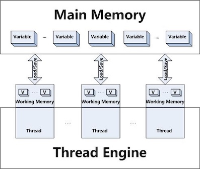


##### 内存间交互操作

关于主内存与工作内存之间具体的交互协议，即一个变量如何从主内存拷贝到工作内存、如何从工作内存同步回主内存之类的实现细节，Java内存模型中定义了以下八种操作来完成，虚拟机实现时必须保证下面提及的每一种操作都是原子的、不可再分的（对于`double`和`long`类型的变量的某些操作在某些平台允许有例外）：

* `lock`(锁定)：作用于主内存变量，它把一个变量标识为一条线程独占的状态。
* `unlock`(解锁)：作用于主内存变量，它把一个处理锁定的状态的变量释放出来,释放后的变量才可以被其它线程锁定，`unlock`之前必须将变量值同步回主内存。
* `read`(读取)：作用于主内存变量，它把一个变量的值从主内存传输到线程的工作内存中，以便随后的`load`动作使用。
* `load`(载入)：作用于工作内存变量，它把`read`操作从主内存中得到的值放入工作内存的变量副本中。
* `use`(使用)：作用于工作内存中的变量，它把工作内存中一个变量的值传递给执行引擎，每当虚拟机遇到一个需要使用到变量的字节码指令时将会执行这个操作。
* `assign`(赋值)：作用于工作内存变量，它把一个从执行引擎接收到的值赋值给工作内存的变量，每当虚拟机遇到一个给变量赋值的字节码指令时执行这个操作。
* `store`(存储)：作用于工作内存的变量，它把工作内存中一个变量的值传送到主内存中，以便随后的`write`操作使用。
* `write`(写入)：作用于主内存的变量，它把`store`操作从工作内存中得到的值放入主内存的变量中。

如果要把一个变量从主内存复制到工作内存，那就要顺序地执行`read`和`load`操作，如果要把变量从工作内存同步回主内存，就要顺序地执行`store`和`write`操作。Java内存模型只是要求上述两个操作必须按顺序执行，而没有保证必须是连续执行。也就是说`read`与`load`之间、`store`与`write`之间是可以插入其它指令的，如果对主在内中的变量a,b进行访问时，一种可能出现的顺序是`read` a、`read` b、`load` b、`load` a。除此之外，Java内存模型还规定了执行上述八种基础操作时必须满足如下规则：

* 不允许`read`和`load`、`store`和`write`操作之一单独出现，即不允许一个变量从主内存读取了但工作内存不接受，或者从工作内存发起回写但主内存不接受的情况出现。
* 不允许一个线程丢弃它的最近的`assign`操作，即变量在工作内存中改变(为工作内存变量赋值)了之后必须把该变化同步回主内存。
* 一个新变量只能在主内存中“诞生”，不允许在工作内存中直接使用一个未被初始化(`load`和`assign`)的变量，换话说就是一个变量在实施`use`和`store`操作之前，必须先执行过了`assign`和`load`操作。
* 如果一个变量事先没有被`load`操作锁定，则不允许对它执行`unlock`操作：也不允许去`unlock`一个被其它线程锁定的变量。
* 对一个变量执行`unlock`之前，必须把此变量同步回主内存中(执行`store`和`write`操作)。


#####  对于volatile型变量的特殊规则

关键字`volatile`可以说是Java虚拟机提供的最轻量级的同步机制；当一个变量定义为`volatile`之后，它将具备两种特性：第一是保证此变量对所有线程的**可见性**，这里的可见性是指当一个线程修改了这个变量的值，新的值对于其他线程来说是可以立即得知的，而普通的变量的值在线程间传递均需要通过主内存来完成；另外一个是**禁止指令重排序优化**，普通的变量仅仅会保证在该方法的执行过程中所有依赖赋值结果的地方都能获取到正确的结果，而不能保证变量赋值操作的顺序与程序代码中的执行顺序一致；

`volatile`变量在各个线程的工作内存中不存在一致性问题。但不能说“基于volatile变量的运算在并发下时安全的”。

由于`volatile`变量只能保证可见性，在不符合以下两条规则的运算场景中，我们仍然要通过加锁来保证原子性：

* 运算结果并不依赖变量的当前值或者能够确保只有单一的线程修改变量的值
* 变量不需要与其他的状态变量共同参与不变约束；

以下场景很适合用`volatile`变量来控制并发，当`shutdown()`方法被调用时，能保证所有线程的`doWork()`方法都立刻停下来。

```Java

volatile boolean shutdownRequested;

public void shutdown() {
    shutdownRequested = true;
}

public void doWork() {
    while (!shutdownRequested) {
        // do stuff
    }
}
```

`volatile`变量读操作的性能消耗与普通变量几乎没有任何差别，但是写操作则可能会慢一些，因为它需要在本地代码中插入许多内存屏障(Memory Barrier)指令来保证处理器不发生乱序执行；不过大多数场景下`volatile`的总开销仍然要比锁低，我们在`volatile`与锁之中选择的唯一依据仅仅是`volatile`的语义能否满足使用场景的需求；


Java内存模型中对`volatile`变量定义的特殊规则(假设V表示`volatile`行变量)：

* 在工作内存中，每次使用V前都必须先从主内存刷新最新的值，用于保证能看到其他线程对变量V所做的修改后的值
* 在工作内存中，每次修改V之后都必须立刻同步回主内存中，用于保证其他线程可以看到自己对变量V所做的修改
* 要求V不会被指令重排序优化，保证代码的执行顺序和程序的顺序相同。


##### 对于long和double型变量的特殊规则

Java内存模型要求`lock`、`unlock`、`read`、`load`、`assign`、`use`、`store`、`write`这八个操作都具有原子性。

但是对于64位的数据类型(long和double): 允许虚拟机将没有被`volatile`修饰的64位数据的读写操作划分为两次32位的操作来进行，即允许虚拟机实现选择可以不保证64位数据类型的`read`、`load`、`store`、`write`这4个操作的原子性，这点就是所谓的**long和double的非原子性协定**(Nonatomic Treatment of double and long Variables)；

但允许虚拟机选择把这些操作实现为具有原子性的操作，目前各种平台下的商用虚拟机几乎都选择把64位数据的读写操作作为原子操作来对待。

##### 原子性、可见性与有序性

**原子性**(Atomicity): 由Java内存模型来直接保证的原子性变量操作包括`read`、`load`、`assign`、`use`、`store`和`write`这六个。`lock`、`unlock`操作未直接开放给用户使用, 却提供了更高层次的字节码指令`monitorenter`和`monitorexit`来隐式地使用这两个操作---`synchronized`块之间的操作也具备原子性；

**可见性**(Visibility)：是指当一个线程修改了共享变量的值，其他线程能够立即得知这个修改。`volatile`、`synchronized`和`final`关键字能实现可见性。`synchronized`同步块的可见性是由“对一个变量执行`unlock`操作之前，必须把此变量同步回主内存中“这条规则获得的。`final`关键字的可见性是指，被`final`修饰的字段在构造器中一旦被初始化完成，并且构造器没有把"this"的引用传递出去，那么在其他线程中就能看见`final`字段的值。

**有序性**(Ordering)：如果在本线程内观察，所有的操作都是有序的；如果在一个线程中观察另一个线程，所有的操作都是无序的。Java语言提供了`volatile`和`synchronized`两个关键字来保证线程之间操作的有序性, `volatile`关键字本身就包含了禁止指令重排序的语意，而`synchronized`是由“一个变量在同一时刻只允许一条线程对其进行`lock`操作”这条规则获得的，这个规则决定了持有同一个锁的两个同步块只能串行的进入。


##### 先行发生原则

**先行发生**(happens-before)原则是判断数据是否存在竞争、线程是否安全的主要依据。

先行发生(happens-before)是Java内存模型中定义的两项操作之间的偏序关系，如果说操作A先行发生于操作B，其实就是说在发生操作B之前，操作A产生的影响能被操作B观察到，影响包括了修改了内存中共享变量的值、发送了消息、调用了方法等.

> Happens-before relationship is simply a guarantee that memory writes by one specific statement are visible to another specific statement. [^11]


下面是Java内存模型下一些天然的**先行发生关系**。这些先行发生关系无需任何同步器协助就可以存在。如果两个操作之间的关系不在此列，并且无法从以下规则推导出来的话，它们就没有顺序性保障，虚拟机可以对它们进行随意的重排序：

https://www.logicbig.com/tutorials/core-java-tutorial/java-multi-threading/happens-before.html

* **程序次序规则**(Pragram Order Rule)：*在一个线程内*，按照程序代码顺序，书写在前面的操作先行发生于书写在后面的操作。准确地说应该是控制流顺序而不是程序代码顺序，因为要考虑分支、循环结构。
* **管程锁定规则**(Monitor lock Rule)：一个`unlock`操作先行发生于后面对同一个锁的`lock`操作。这里必须强调的是同一个锁，而”后面“是指时间上的先后顺序。
* `volatile`**变量规则**(Volatile Variable Rule)：对一个`volatile`变量的写操作先行发生于后面对这个变量的读取操作，这里的”后面“同样指时间上的先后顺序。
* **线程启动规则**(Thread Start Rule)：`Thread`对象的`start()`方法先行发生于此线程的每一个动作。
* **线程终止规则**(Thread Termination Rule)：线程中的所有操作都先行发生于对此线程的终止检测，我们可以通过`Thread.join()`方法结束，`Thread.isAlive()`的返回值等作段检测到线程已经终止执行。
* **线程中断规则**(Thread Interruption Rule)：对线程`interrupt()`方法的调用先行发生于被中断线程的代码检测到中断事件的发生，可以通过`Thread.interrupted()`方法检测是否有中断发生。
* **对象终结规则**(Finalizer Rule)：一个对象初始化完成(构造方法执行完成)先行发生于它的`finalize()`方法的开始。
* **传递性**(Transitivity)：如果操作A先行发生于操作B，操作B先行发生于操作C，那就可以得出操作A先行发生于操作C的结论。

时间先后顺序与先行发生原则之间基本没有太大的关系，所以我们衡量并发安全问题的时候不要受到时间顺序的干扰，一切必须以先行发生原则为准。

####  Java与线程
##### 线程的实现

线程是比进程更轻量级的调度执行单位，线程的引入可以把一个进程的资源分配和执行调度分开，各个线程既可以共享进程资源又可以独立调度。

Java线程如何实现并不受Java虚拟机规范的约束，以HotSpot为例，它的每一个Java线程都是直接映射到一个操作系统原生线程来实现的，而且中间没有额外的间接结构，所以HotSpot自己是不会去干涉线程调度的(可以设置线程优先级给操作系统提供调度建议)，全权交给底下的操作系统去处理，所以何时冻结或唤醒线程、该给线程分配多少处理器执行时间、该把线程安排给哪个处理器核心去执行等，都是由操作系统完成的，也都是由操作系统全权决定的。所以可以看到`Thread`类与大部分的Java API有显著的差别，它的所有关键方法都是声明为`native`的。

!!! note
    `native`修饰词说明，该方法的实现是用其他语言(C/C++)实现的，该方法通过Java Native Interface (JNI, Java本地接口)调用本地代码。


##### Java线程调度

Java语言一共设置了10个级别的线程优先级(`Thread.MIN_PRIORITY`-`Thread.MAX_PRIORITY`)。

```Java
/* The minimum priority that a Thread can have.*/
public static final int MIN_PRIORITY = 1;
/* The default priority that is `assign`ed to a Thread.*/
public static final int NORM_PRIORITY = 5;
/* The maximum priority that a Thread can have. */
public static final int MAX_PRIORITY = 10;
```

##### 状态转换

Java语言定义了6种线程状态，在任意一个时间点，一个线程只能有且只有其中一种状态，分别是

* 新建(New): Thread state for a Thread which has not yet started.
* 运行(Runnable): Thread state for a runnable Thread.  A Thread in the runnable state is executing in the Java virtual machine but it may be waiting for other resources from the operating system such as processor.
* 阻塞(Blocked):  Thread state for a Thread blocked waiting for a monitor `lock`. A Thread in the blocked state is waiting for a monitor `lock` to enter a synchronized block/method or reenter a synchronized block/method after calling `Object.wait`.
* 等待(Waiting): A Thread that is waiting indefinitely for another Thread to perform a particular action is in this state.
    * `wait()`
    * `join()`
    * `LockSupport.park()`
* 限期等待(Timed Waiting): A Thread that is waiting for another Thread to perform an action for up to a specified waiting time is in this state.
    * `sleep()`
    * `wait(long)`
    * `join(long)`
    * `LockSupport.parkNanos(long)`
    * `LockSupport.parkUntil()`

* 结束(Terminated): A Thread that has exited is in this state.


####  协程

1：1的内核线程模型是如今Java虚拟机线程实现的主流选择，但是这种映射到操作系统上的线程天然的缺陷是切换、调度成本高昂，系统能容纳的线程数量也很有限。

协程(Coroutine)的主要优势是轻量，来源于由用户自己模拟多线程、自己保护恢复现场的工作模式。对于有栈协程，有一种特例实现名为纤程(Fiber)。


###  13 线程安全与锁优化


对于高效并发来讲，首先需要保证并发的正确性，然后在此基础上实现高效。

####  线程安全

> A class is **thread-safe** if it behaves correctly when accessed from multiple threads, regardless of the scheduling or interleaving of the execution of those threads by the runtime environment, and with no additional synchronization or other coordination on the part of the calling code. <small>[Java Concurrency in Practice]</small>

> 当多个线程访问一个类时，不管这些线程在运行时环境下的调度和交替执行，并且不需要进行额外的同步，或者在调用方进行其他的协调操作，它的行为表现正确，那这个类是**线程安全**的。

> Thread-safe classes encapsulates any needed synchronization so that clients need not provide their own.


##### Java语言中的线程安全

按照线程安全的“安全程度”由强至弱来排序，我们可以将Java语言中各个操作共享的数据分为以下五类：不可变、绝对线程安全、相对线程安全、线程兼容和线程对立。

<big><b>不可变</b></big>

**不可变**(Immutable)对象一定是线程安全的，无论是对象的方法实现还是方法的调用者，都不需要再进行任何的线程安全措施。

Java语言中，如果共享数据是一个基本数据类型，那么只要在定义时使用`final`关键字修饰它就可以保证它时不变的。如果共享数据是一个对象，那就需要保证对象的行为不会对其状态产生任何影响才行，比如`String`类的对象，它是一个典型的不可变对象，我们调用它的`substring()`、`replace()`这些方法都不会影响它原来的值，只会返回一个新构造的字符串对象。

除此之外，常用的不可变类型还有枚举类型，以及`java.lang.Number`的部分子类，如`Long`和`double`等Wrapper类型。

<big><b>线程绝对安全</b></big>


在Java API中标注自己是线程安全的类，大多数都不是绝对的线程安全。


<big><b>相对线程安全</b></big>

**线程相对安全**就是我们通常意义上所讲的线程安全，它需要保证对这个对象单独的操作是线程安全的，我们在调用的时候不需要做额外的保障措施，但是对于一些特定的顺序的连续调用，就可能需要在调用端使用额外的同步手段来保证调用的正确性。

在Java语言中，大部分的线程安全类都属于这种类型。

<big><b>线程兼容</b></big>

**线程兼容**指对象本身并不是线程安全的，但是可以通过在调用端正确地使用同步手段来保证对象在并发环境中可以安全地使用；我们说一个类不是线程安全的，绝大多数时候指的是这一种情况；

<big><b>线程对立</b></big>

**线程对立**是指无论调用端是否采取了同步措施，都无法在多线程环境中并发使用的代码，Java语言中很少出现。常见的线程对立操作还有`System.setIn()`, `System.setOut()`, `System.runFinalizersOnExit()`等等。


##### 线程安全的实现方法


###### synchronized

在Java里面，最基本的互斥同步手段就是`synchronized`关键字，`synchronized`关键字经过编译以后，会在同步块的前后分别形成`monitorenter`和`monitorexit`这两个字节码指令，这两个字节码都需要一个`reference`类型的参数来指明要锁定和解锁的对象。如果Java程序中的`synchronized`明确制定了对象参数，那就是这个对象的`reference`；如果没有明确指定，那就根据`synchronized`修饰的是实例方法还是类方法，去取对应的对象作为锁对象。

根据《Java虚拟机规范》的要求，在执行`monitorenter`指令时，首先要去尝试获取对象的锁。如果这个对象没被锁定，或者当前线程已经持有了那个对象的锁，就把锁的计数器的值增加一，而在执行`monitorexit`指令时会将锁计数器的值减一。一旦计数器的值为零，锁随即就被释放了。如果获取对象锁失败，那当前线程就应当被阻塞等待，直到请求锁定的对象被持有它的线程释放为止。


[Java Synchronized](https://cs.au.dk/~mis/dOvs/jvmspec/ref--44.html)

The `monitorenter/monitorexit` mechanism is used by the Java `synchronized` statement to coordinate access to an object among multiple threads. For example, when you write in Java code:

```Java

static void Sort(int [] array) {
    // synchronize this operation so that some other thread can't
    // manipulate the array while we are sorting it. This assumes that other
    // threads also synchronize their accesses to the array.
    synchronized(array) {
        // now sort elements in array
    }
}
```

then JVM code like the following is generated:


```
.method static Sort([I)V
    aload_0
    monitorenter    ; lock object in local variable 0

    ; now sort elements in array

    aload_0
    monitorexit      ; finished with object in local variable 0
    return
.end method
```

还有两点需要特别注意的。首先`synchronized`同步块对同一个线程来说是可重入，不会出现自己把自己锁死的问题。其次，同步块在已进入的线程执行完之前，会阻塞后面其他线程的进入。

###### ReentrantLock

另外还可以使用`java.util.concurrent`包中的重入锁(`ReentrantLock`)来实现同步。在基本用法上，`ReentrantLock`与`synchronized`很相似，它们都具备一样的线程重入特性，只是代码写法上有点区别。

不过`ReentrantLock`比`synchronized`增加了一些高级功能：等待可中断、可实现公平锁以及锁可以绑定多个条件；

* 等待可中断: 是指当持有锁的线程长期不释放锁的时候，正在等待的线程可以选择放弃等待，改为处理其他事情，可中断特性对处理执行时间非常长的同步块很有帮助。
* 公平锁: 是指多个线程在等待一个同一个锁时，必须按照申请的时间顺序来一次获得锁；`synchronzied`中的锁是非公平的，`ReentrantLock`默认情况下也是非公平的，但可以通过带布尔值的构造函数(`ReentrantLock​(boolean fair)`)要求使用公平锁。
* 绑定多个条件: 是指一个`ReentrantLock`对象可以同时绑定多个`Condition`对象(`ReentrantLock.newCondition()`)。[[Example](7 Synchronization Examples.md)]

**可重入**

> 若一个程序或子程序"在任何时刻被中断，然后被调度执行另外一段代码，这段代码又调用了该子程序不会出错", 则称其为**可重入**(Reentrant)的。<small>[wikipedia](https://zh.wikipedia.org/wiki/%E5%8F%AF%E9%87%8D%E5%85%A5)</small>

若一个方法是可重入的，则该方法应当满足下述条件：

* 不能含有静态（全局）非常量数据。
* 不能返回静态（全局）非常量数据的地址。
* 只能处理由调用者提供的数据。
* 不能依赖于单例模式资源的锁。
* 调用的函数也必需是可重入的。

上述条件就是要求可重入函数使用的所有变量都保存在调用栈的当前函数栈（frame）上，因此同一执行线程重入执行该函数时加载了新的函数帧，与前一次执行该函数时使用的函数帧不冲突、不互相覆盖，从而保证了可重入执行安全。


例如以下两个C函数都是可重入的：

```C
int f(int i){
  return i + 2;
}

int g(int i){
  return f(i) + 2;
}
```


###### 线程本地存储

如果一段代码中所需要的数据必须与其他代码共享，那就看看这些共享数据的代码是否能保证在同一个线程中执行？如果能保证，我们就可以把共享数据的可见范围限制在同一个线程之内，实现了**线程本地存储**(Thread Local Storage, TLS)。这样，无须同步也能保证线程之间不出现数据争用的问题。

也可以理解为每个变量在每个线程中都有一份独立的拷贝。通过使用线程局部存储技术，可以避免线程间的同步问题。

可以通过`java.lang.ThreadLocal`类来实现线程本地存储的功能。


####  锁优化

HotSpot虚拟机为了在线程之间更高效地共享数据及解决竞争问题，从而提高程序的执行效率，使用了各种锁优化技术，如自适应自旋(Adaptive Spinning)、锁消除(Lock Elimination)、锁膨胀(Lock Coarsening)、轻量级锁(Lightweight Locking)、偏向锁(Biased Locking)等。

锁升级是单向的: 无锁 -> 偏向锁 -> 轻量级锁 -> 重量级锁[^1]


##### 自旋锁与自适应自旋

**自旋锁**(Spinning): 让线程执行一个循环(忙等待, busy wait)。自旋次数的默认值是十次，用户也可以使用参数`-XX：PreBlockSpin`来自行更改。

**自适应自旋锁**(Adaptive Spinning): 自旋的时间不再固定，而是由前一次在同一个锁上的自旋时间及锁的拥有者的状态来决定；

* 如果在同一个锁对象上，自旋等待刚刚成功获得过锁，并且持有锁的线程正在运行中，那么虚拟机就会认为这次自旋也很有可能再次成功，进而允许自旋等待持续相对更长的时间，比如持续100次忙循环。
* 如果对于某个锁，自旋很少成功获得过锁，那在以后要获取这个锁时将有可能直接省略掉自旋过程，以避免浪费处理器资源。


##### 锁消除

**锁消除**(Lock Elimination)是指虚拟机即时编译器在运行时，对一些代码上要求同步，但是被检测到不可能存在共享数据竞争的锁进行消除。锁消除的主要判断依据来源于逃逸分析的数据支持。


##### 锁粗化

**锁粗化**(Lock Coarsening)是指减少不必要的紧连在一起的`unlock`，`lock`操作，将多个连续的锁扩展成一个范围更大的锁。


##### 轻量级锁

**轻量级锁**(Lightweight Locking)基于这样一种假设，即在真实的情况下我们程序中的大部分同步代码一般都处于无锁竞争状态（即单线程执行环境），在无锁竞争的情况下完全可以避免调用操作系统层面的重量级互斥锁，取而代之的是在`monitorenter`和`monitorexit`中只需要依靠一条CAS原子指令就可以完成锁的获取及释放。当存在锁竞争的情况下，执行CAS指令失败的线程将调用操作系统互斥锁进入到阻塞状态，当锁被释放的时候被唤醒。


* 在代码即将进入同步块的时候，如果此同步对象没有被锁定(Mark Word锁标志位为“01”状态)，虚拟机首先将在当前线程的栈帧中建立一个名为锁记录(Lock Record)的空间，用于存储锁对象目前的Mark Word的拷贝
* 虚拟机将使用CAS操作尝试把对象的Mark Word更新为指向Lock Record的指针
    * 如果更新成功，即代表该线程拥有了这个对象的锁，并且对象Mark Word的锁标志位设置为轻量级锁，表示此对象处于轻量级锁定状态。
    * 如果这个更新操作失败了，那就意味着至少存在一条线程与当前线程竞争获取该对象的锁。虚 机首先会检查对象的Mark Word是否指向当前线程的栈帧，
        * 如果是，说明当前线程已经拥有了这个对象的锁，那直接进入同步块继续执行就可以了，
        * 否则就说明这个锁对象已经被其他线程抢占了，那轻量级锁就不再有效，必须要膨胀为重量级锁。

##### 偏向锁

**偏向锁**(Biased Locking)是为了在无锁竞争的情况下避免在锁获取过程中执行不必要的CAS原子指令，因为CAS原子指令虽然相对于重量级锁来说开销比较小但还是存在非常可观的本地延迟。

偏向锁中的“偏”，就是偏心的“偏”、偏袒的“偏”。它的意思是这个锁会偏向于第一个获得它的线程，如果在接下来的执行过程中，该锁一直没有被其他的线程获取，则持有偏向锁的线程将永远不需要再进行同步。


[Java HotSpot VM Options](https://www.oracle.com/technetwork/articles/java/vmoptions-jsp-140102.html)

本参数表以JDK 1.6为基础编写，JDK 1.6的HotSpot虚拟机有很多非稳定参数（Unstable Options，即以-XX：开头的参数，JDK 1.6的虚拟机中大概有660多个），使用`-XX：+PrintFlagsFinal`参数可以输出所有参数的名称及默认值（默认不包括Diagnostic和Experimental的参数，如果需要，可以配合`-XX：+UnlockDiagnosticVMOptions`/`-XX：+UnlockExperimentalVMOptions`一起使用），下面的各个表格只包含了其中最常用的部分。参数使用的方式有如下3种：

* `-XX:+<option>`:   开启option参数。
* `-XX:-<option>`:  关闭option参数。
* `-XX:<option>=<value>`: 将option参数的值设置为value。

##### 内存管理参数


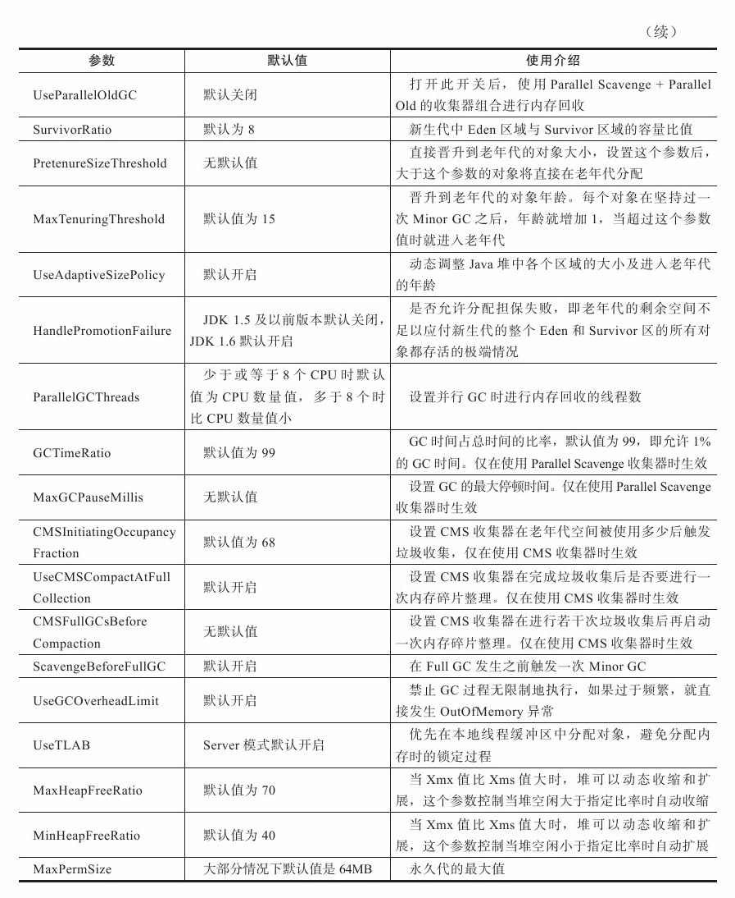

##### 即时编译参数

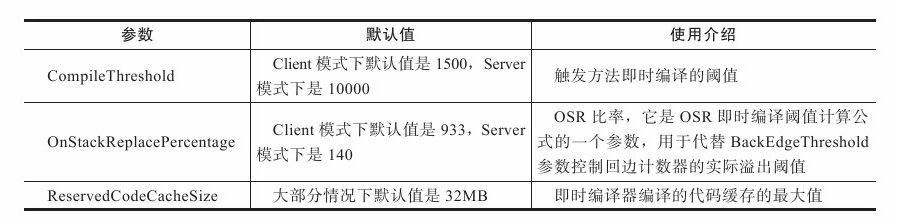


##### 类型加载参数
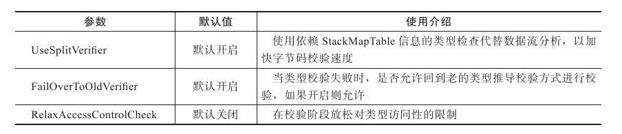


##### 多线程相关参数


##### 性能参数
 


###### 调试参数

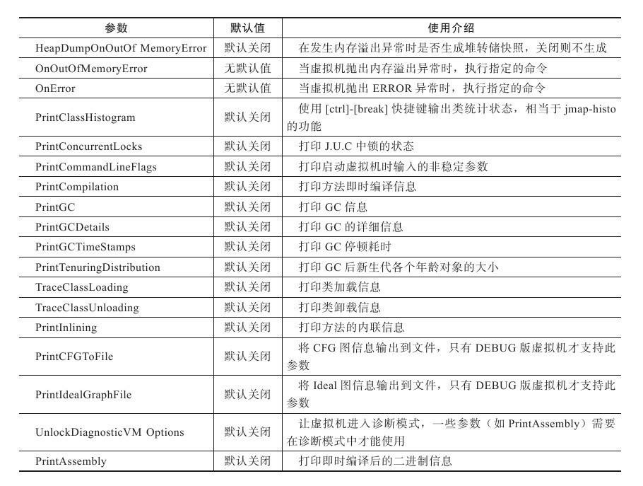

[^0]: 深入理解虚拟机， 第二版
[^1]: https://blog.dreamtobe.cn/2015/11/13/java_synchronized/### **HotSpot虚拟机主要参数列表**
[^11]: https://docs.oracle.com/javase/tutorial/essential/concurrency/memconsist.html
[^12]: https://tech.meituan.com/2019/09/05/java-bytecode-enhancement.html
