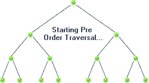

Given a binary tree, return the *preorder* traversal of its nodes' values.

Example:

```
Input: [1,null,2,3]
   1
    \
     2
    /
   3
Output: [1,2,3]
```

* Follow up: Recursive solution is trivial, could you do it iteratively?


#### 分析




常见的还是用递归的办法：

```Java
public List<Integer> preorderTraversal(TreeNode root) {
    List<Integer> list = new ArrayList<Integer>();
    preorderTraversalHelper(root, list); 
    return list;
}
    
private void preorderTraversalHelper(TreeNode root, List<Integer> list) {
    if (root == null) return;
    list.add(root.val);
    preorderTraversalHelper(root.left, list);
    preorderTraversalHelper(root.right, list);
}
```

论坛上有一种非常优美的方法，巧妙的利用了`List.addAll()`方法：

```Java
public List<Integer> preorderTraversal(TreeNode root) {
    List<Integer> list = new ArrayList<>();
    if (root == null) return list;
    list.add(root.val);
    list.addAll(preorderTraversal(root.left));
    list.addAll(preorderTraversal(root.right));
    return list;
}
```

但既然题目都说了，那么用迭代写一下：

```Java
public List<Integer> preorderTraversal(TreeNode root) {
    List<Integer> list = new ArrayList<>();
    if (root == null) return list;
    Stack<TreeNode> stack = new Stack<>();
    stack.push(root);
    while (!stack.isEmpty()) {
        TreeNode cur = stack.pop();
        if (cur != null) {
            list.add(cur.val);
            stack.push(cur.right);
            stack.push(cur.left);
        }
    }
    return list;
}
```
