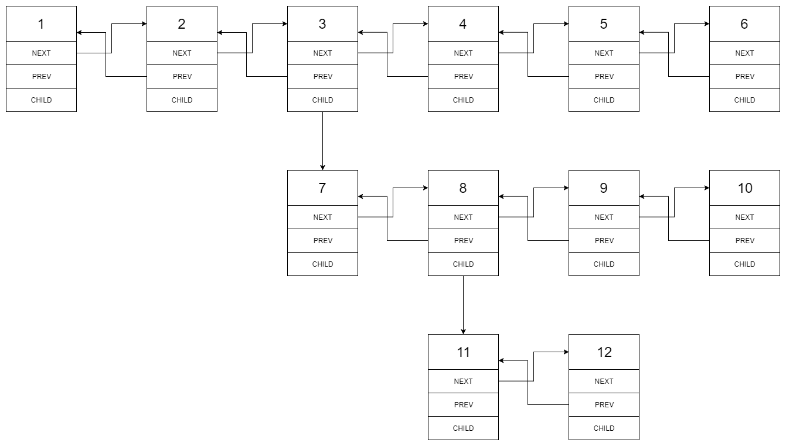
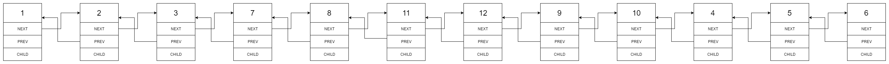

You are given a doubly linked list which in addition to the next and previous pointers, it could have a child pointer, which may or may not point to a separate doubly linked list. These child lists may have one or more children of their own, and so on, to produce a multilevel data structure, as shown in the example below.

Flatten the list so that all the nodes appear in a single-level, doubly linked list. You are given the head of the first level of the list.

 

Example 1:

<small>
Input: head = [1,2,3,4,5,6,null,null,null,7,8,9,10,null,null,11,12]

Output: [1,2,3,7,8,11,12,9,10,4,5,6]

Explanation:

The multilevel linked list in the input is as follows:




After flattening the multilevel linked list it becomes:



</small>

Example 2:

```
Input: head = [1,2,null,3]
Output: [1,3,2]
Explanation:

The input multilevel linked list is as follows:

  1---2---NULL
  |
  3---NULL
```

Example 3:

```
Input: head = []
Output: []
``` 

How multilevel linked list is represented in test case:

We use the multilevel linked list from Example 1 above:

```
 1---2---3---4---5---6--NULL
         |
         7---8---9---10--NULL
             |
             11--12--NULL
```
The serialization of each level is as follows:

```
[1,2,3,4,5,6,null]
[7,8,9,10,null]
[11,12,null]
```
To serialize all levels together we will add nulls in each level to signify no node connects to the upper node of the previous level. The serialization becomes:

```
[1,2,3,4,5,6,null]
[null,null,7,8,9,10,null]
[null,11,12,null]
```
Merging the serialization of each level and removing trailing nulls we obtain:

```
[1,2,3,4,5,6,null,null,null,7,8,9,10,null,null,11,12]
``` 

Constraints:

* Number of Nodes will not exceed 1000.
* `1 <= Node.val <= 10^5`

### 分析

根据这道题目的意思，把链表拉平就意味着在遍历链表时，如果遇到子链表(child != null)，则优先遍历子链表。遍历完所有子链表之后，回来遍历剩下的链表。可以用栈保存暂时还未遍历的链表。

```java
 public Node flatten(Node head) {
        if (head == null) return null;
        Stack<Node> stack = new Stack<>();
        // 遍历链表
        Node root = new Node(), cur = root, prev = root;
        while (head != null) {
            cur.next = head;
            cur.child = null;
            head.prev = cur;
            prev = cur;
            cur = cur.next;
            // 如果有子链表，先保存到栈中
            if (head.child == null) {
                head = head.next;
            } else {
                stack.push(head.next);
                head = head.child;
            }
        }
        // 遍历栈中的链表
        while (!stack.isEmpty()) {
            Node node = stack.pop();
            while (node != null) {
                cur.next = node;
                node.prev = cur;
                node = node.next;
                prev = cur;
                cur = cur.next;
            }
        }
        cur.prev = prev;
        // 别忘了，把链表头节点的prev设置为null
        root.next.prev = null;
        return root.next;
    }
    ```