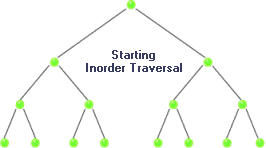
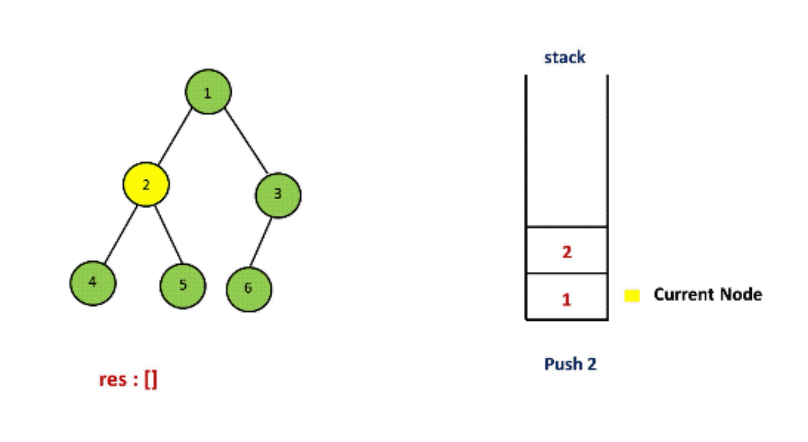

Given a binary tree, return the *inorder* traversal of its nodes' values.

Example:

```
Input: [1,null,2,3]
   1
    \
     2
    /
   3

Output: [1,3,2]
```

Follow up: Recursive solution is trivial, could you do it iteratively?

#### 分析



这道题目和[144. Binary Tree Preorder Traversal](144. Binary Tree Preorder Traversal.md)一摸一样，给出三种方案：

有帮助函数的递归，省去了反复要生成List<Integer>.

```Java
public List<Integer> inorderTraversal(TreeNode root) {
    List<Integer> list = new ArrayList<>();
    inorderTraversalHelper(root, list);
    return list;
}
    
private void inorderTraversalHelper(TreeNode root, List<Integer> list) {
    if (root == null) return;
    inorderTraversalHelper(root.left, list);
    list.add(root.val);
    inorderTraversalHelper(root.right, list);
}
```

直接递归

```Java
public List<Integer> inorderTraversal(TreeNode root) {
    List<Integer> list = new ArrayList<>();
    if (root == null) return list;
    list.addAll(inorderTraversal(root.left));
    list.add(root.val);
    list.addAll(inorderTraversal(root.right));
    return list;
}
```

迭代




```Java
public List<Integer> inorderTraversal(TreeNode root) {
    List<Integer> res = new ArrayList<Integer>();
    Stack<TreeNode> stack = new Stack<TreeNode>();
    TreeNode cur = root;
    while (cur != null || !stack.isEmpty()) { 
        while (cur != null) { 
            // Travel to each node's left child,
            // till reach the left leaf
            stack.push(cur);
            cur = cur.left;				
        }		 
        cur = stack.pop(); // Backtrack to higher level node A
        res.add(cur.val);  // Add the node to the result list
        cur = cur.right;   // Switch to A'right branch
    }
    return res;
}  
```
