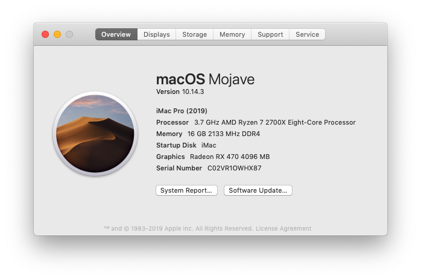

最近配置了一台电脑，配置如下。

* CPU：AMD Ryzen 2700x
* 显卡：AMD Radeon RX 470 4G
* 主板：MSI B450M 军火库
* 内存：48G 3000Hz
* M2: 三星970 EVO 256GB
* SSD: 东芝TR200 256GB


现在已经升级为Catalina，所有设备都能正常使用，而且能够正常睡眠，非常完美。



黑苹果的安装是非常快的，网上有大量资源，大概一个小时就可以。主要是完善比较费时间，因为需要大量的配置，这些配置因机器差异往往不同，需要不同的尝试达到完美的效果。


#### 安装Mac OS

使用的[聆曦制作的镜像](https://www.c4dlx.com/thread-654-1-1.html)。主要是安装非常方便，把相关脚本已经安放好了，需要在安装的时候执行这些脚本即可。

```text
下载链接： https://pan.baidu.com/share/init?surl=BEdGgVc4MUZZDD1Motlykw
提取码：nuat
解压密码：lingxi147170373User
```


#### Ryzen性能损失

AMD Ryzen在黑苹果下有一定的性能损失。可以在Clover Configuration中的引导参数重定制`busratio`参数补偿。例如，Ryzen 27000x的默认倍频一般为37，可以增加参数`busratio=37`。

#### 打USB补丁

往往USB，特别是USB3.0以上的接口在黑苹果中不能被识别，所以一般都需要在安装完了以后打补丁。

打补丁的具体教程可以参见[AMD-MAC论坛](https://forum.amd-osx.com/viewtopic.php?f=24&t=4986&hilit=native+usb)。

直接在终端中输入以下命令安装

```bash
curl -s -o ~/Desktop/ryzenusbfix.sh https://raw.githubusercontent.com/XLNCs/ryzenusbfix/master/ryzenusbfix.sh && chmod +x ~/Desktop/ryzenusbfix.sh && ~/Desktop/ryzenusbfix.sh
```

重启以后在系统报告的USB信息中可以看到连接的USB设备


#### 开启HDPI

苹果的系统显示非常好，得意于HDPI这项技术。HDPI可以通过相关命令开启，详见[HDPI](https://github.com/xzhih/one-key-hidpi)

同样的，输入以下脚本即可开启。

```BASH
sh -c "$(curl -fsSL 
https://raw.githubusercontent.com/xzhih/one-key-hidpi/master/hidpi.sh)"
```

重新启动系统后，在系统设置-显示中可以设置显示的效果：


同时，它操作时，可以选择注入花屏补丁，它解决了我的显示器闪屏问题。


#### 温度/风扇显示

如果对于系统监控有要求，往往还需要了解电脑各个部件的温度、风扇转速等情况。幸运的是，AMD平台的相关驱动已经比较完善了，直接可以在Clover中使用。详见[教程](https://hackintosher.com/guides/amd-hackintosh-monitoring-guide/)


#### 正确显示CPU型号

很多CPU在黑苹果中不能正确识别，虽然不影响系统运行，但终归是不完美的。幸运的是，还是有好心人制作了相关脚本，直接运行即可，详见[GITHUB](https://github.com/corpnewt/CPU-Name)。

```bash
git clone https://github.com/corpnewt/CPU-Name
cd CPU-Name
chmod +x CPU-Name.command
./CPU-Name.command
```

#### 调节CPU频率

[AMD Power Gadget](https://github.com/trulyspinach/SMCAMDProcessor)可以非常方便的调节AMD CPU频率，在写文档时可以使用低频，编译时使用高频。


#### 亮度调节

直接使用现成的软件[MonitorControl](https://github.com/the0neyouseek/MonitorControl)实现显示器的亮度调节。


#### 声音调节

一般来说，添加使用AppleALC.Kext之后就能够正确播放声音。但是往往不能使用按键调节系统音量。使用[SoundControl](https://staticz.com/soundcontrol/)软件可以实现USB、HDMI的音量调节功能。


#### 备份

最后一步，当系统完全安装准备好以后，除了Time Machine之外，最好做一个完全备份。因为当系统出现问题不能启动时，Time Machine需要重新安装以后才能还原，非常麻烦。使用SuperDuper可以一键傻瓜式备份磁盘上的全部文件，而且磁盘是可启动的。

#### xcode

```bash
sudo ln -s /Library/Developer/CommandLineTools/SDKs/MacOSX.sdk/usr/include/* /usr/local/include/
```