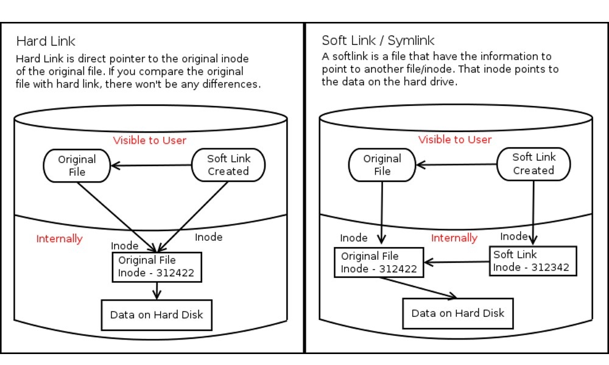
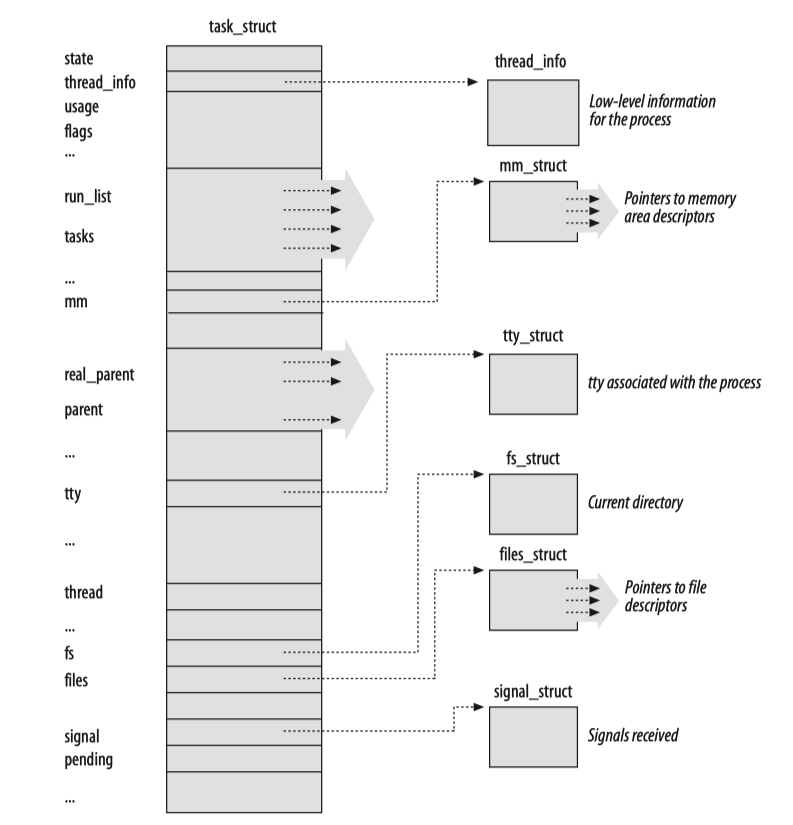
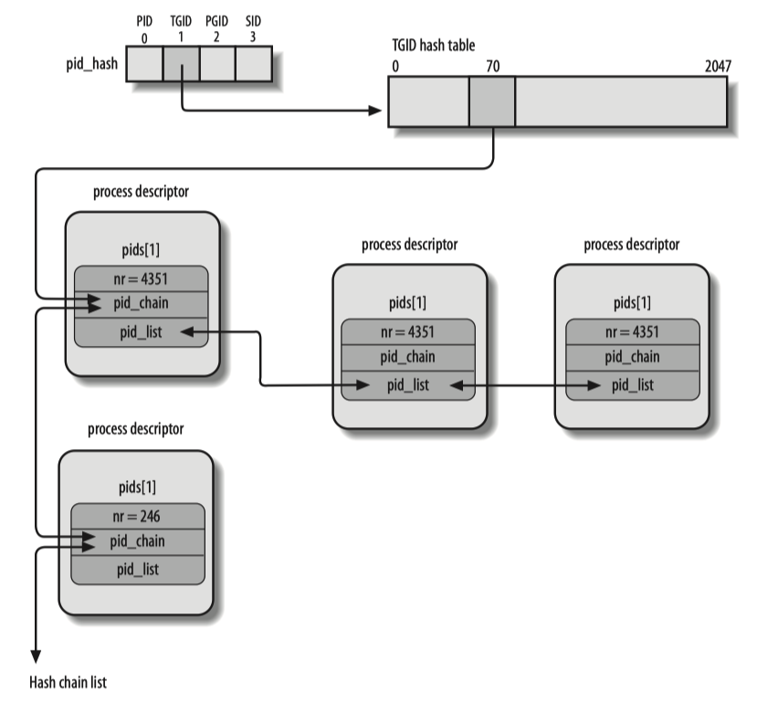
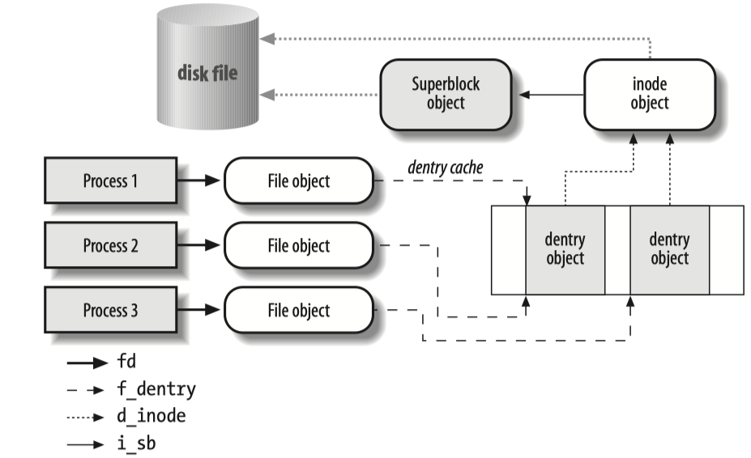
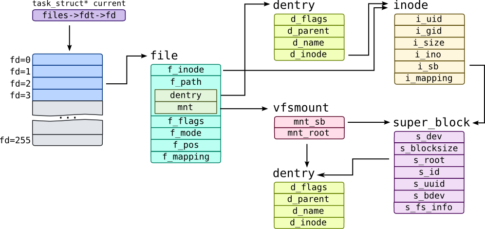

### 1 Introduction

#### Link

* A **hard link** is merely an additional name for an existing file.
* Soft links is a special kind of file that points to another file, much like a shortcut.

### 3 Processes

### 12 The Virtual FileSystem

The **Virtual FileSystem** (虚拟文件系统，also known as Virtual Filesystem Switch or VFS) is a kernel software layer that handles all system calls related to a standard Unix filesystem. Its main strength is providing a common interface to several kinds of filesystems.

A **common file model** mirrors the file model provided by the traditional Unix filesystem. Each specific filesystem implementation must translate its physical organization into the VFS's common file model.

The common file model consists of the following object types:

* the **superblock** object: Stores information concerning a mounted filesystem. For disk-based filesystems, this object usually corresponds to a filesystem control block stored on disk.
* The **inode** object:  Stores general information about a specific file. For disk-based filesystems, this object usually corresponds to a file control block stored on disk. Each inode object is associated with an inode number, which uniquely identifies the file within the filesystem.
* The **file** object: Stores information about the interaction between an open file and a process. This information exists only in kernel memory during the period when a process has the file open.
* The **dentry** object: Stores information about the linking of a directory entry (that is, a particular name of the file) with the corresponding file. Each disk-based filesystem stores this information in its own particular way on disk. The most recently used dentry objects are contained in a disk cache named the dentry cache, which speeds up the translation from a file pathname to the inode of the last pathname component.

[^1]

[^1]: https://myaut.github.io/dtrace-stap-book/kernel/fs.html
