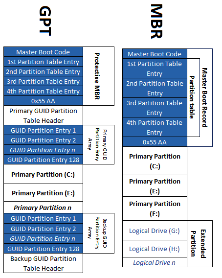
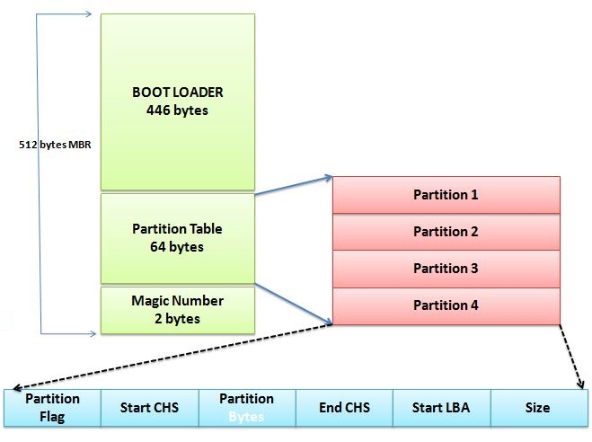
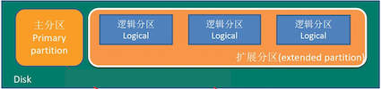
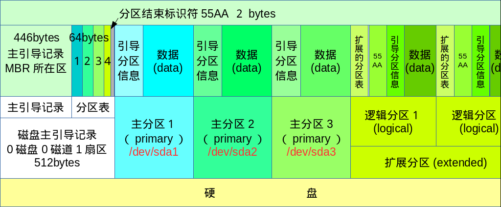
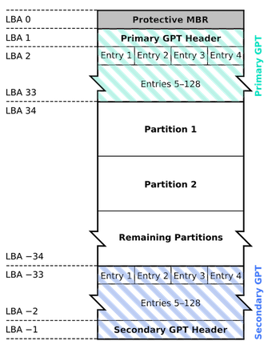
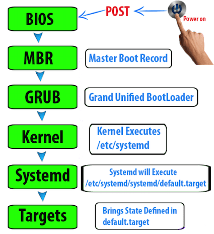
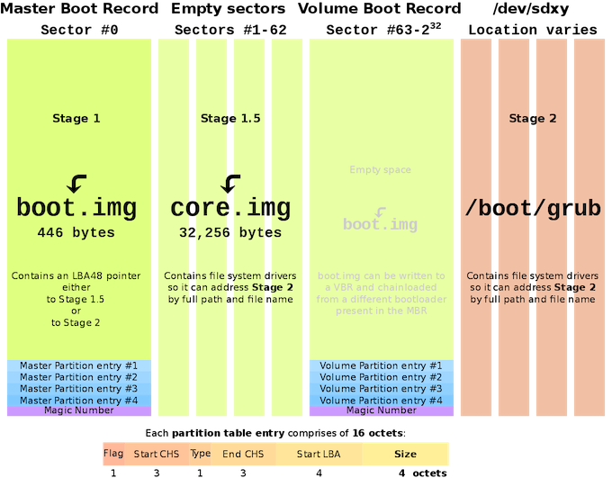

### 1 简介

Linux的核心版本编号(`uname -a`查看)类似于如下的样子：

```
3.10.0-123.e17.x86_64
主板本.次版本.释出版本-修改版本
```

### 2 文件与目录管理


| 目录 | 应放置档案内容 | 
| --- | --- |
| `/bin` | 在单人维护模式下还能够被操作的指令，可以被root与一般帐号所使用，主要有：cat, chmod, chown, bash等常用的指令。 | 
| `/boot` |   开机会使用到的档案，包括Linux核心档案以及开机选单与开机所需设定档等等。  Linux kernel常用的档名为：vmlinuz，如果使用的是grub2这个开机管理程式，则还会存在/boot/grub2/这个目录 | 
| `/dev` |   任何装置与周边设备都是以档案的型态存在于这个目录当中的。比要重要的档案有/dev/null, /dev/zero, /dev/tty , /dev/loop\*, / dev/sd\*等等 | 
| `/etc` |   系统主要的设定档几乎都放置在这个目录内，例如人员的帐号密码档、各种服务的启始档等等。一般来说，这个目录下的各档案属性是可以让一般使用者查阅的，但是只有root有权力修改。比较重要的档案有：   /etc/modprobe.d/, /etc/passwd, /etc/fstab, /etc/issue等等。另外FHS还规范几个重要的目录最好要存在/etc/目录下喔：  /etc/opt(必要)：这个目录在放置第三方协力软体/opt的相关设定档 /etc/X11/(建议)：与X Window有关的各种设定档都在这里，尤其是xorg.conf这个X Server的设定档。 /etc/sgml/(建议)：与SGML格式有关的各项设定档 /etc/xml/(建议)：与XML格式有关的各项设定档  | 
| `/lib` |   系统的函式库非常的多，而/lib放置的则是在开机时会用到的函式库，以及在/bin或/sbin底下的指令会调用的函式库。什么是函式库呢？妳可以将他想成是『外挂』，某些指令必须要有这些『外挂』才能够顺利完成程式的执行之意。另外FHS还要求底下的目录必须要存在：  /lib/modules/：这个目录主要放置可抽换式的核心相关模组(驱动程式)喔！ | 
| `/media` |   放置的就是可移除的设备， 包括软碟、光碟、DVD等等装置都暂时挂载于此。常见的档名有：/media/floppy, /media/cdrom等等。 | 
| `/mnt` |   用来暂时挂载某些额外的设备 | 
| `/opt` |   放置第三方软件。第三方软件也可以放置在/usr/local目录下。 | 
| `/run` |   系统开机后所产生的各项资讯 | 
| `/sbin` |   开机、修复、还原系统所需要的指令。  至于某些伺服器软体程式，一般则放置到/usr/sbin/当中。至于本机自行安装的软体所产生的系统执行档(system binary)，则放置到/usr/local/sbin/当中了。常见的指令包括：fdisk, fsck, ifconfig, mkfs等等。 | 
| `/srv` |   srv可以视为『service』的缩写，是一些网路服务启动之后，这些服务所需要取用的资料目录。常见的服务例如WWW, FTP等等。举例来说，WWW伺服器需要的网页资料就可以放置在/srv/www/里面。不过，系统的服务资料如果尚未要提供给网际网路任何人浏览的话，预设还是建议放置到/var/lib 底下即可。 | 
| `/tmp` |   一般使用者或者是正在执行的程序暂时放置档案的地方 | 
| `/usr` |   第二层FHS 设定，后续介绍 | 
| `/var` |   第二曾FHS 设定，主要为放置变动性的资料，后续介绍 | 

FHS 建议可以存在的目录

| 目录 | 应放置档案内容 | 
| --- | --- |
| `/home` |   系统预设的主目录(home directory) | 
| `/lib<qual>` |   用来存放与/lib不同的格式的二进制函式库，例如支持64位的/lib64函式库等 | 
| `/root` |   系统管理员(root)的主目录。之所以放在这里，是因为如果进入单人维护模式而仅挂载根目录时， 该目录就能够拥有root的家目录，所以我们会希望root的主目录与根目录放置在同一个分割槽中。 | 


### 3 账号管理与权限设定


Linux通过UID(User ID)和GID(Group ID)标识文件的拥有者和群组。当显示文件属性时，系统会根据`/etc/passwd`与`/etc/group`，找到UID和GID对应的账号和群组名称并显示出来。

可以简单的使用`useradd 帐号`来创建使用者。CentOS主要会帮我们处理几个项目：

* 在`/etc/passwd`里面创建一行与帐号相关的数据，包括创建UID/GID/主文件夹等；
* 在`/etc/group`里面加入一个与帐号名称一模一样的群组名称；
* 在`/home`下面创建一个与帐号同名的目录作为使用者主文件夹，且权限为700

使用`useradd`创建了帐号之后，在默认的情况下，该帐号是暂时被封锁的，除非使用`passwd 用户名`设置密码。


### 4 系统服务


#### service


服务(service)是常驻在内存中的程序，而且可以提供一些系统或网络功能。


!!! note "daemon/service"
    
    daemon和service可以视为相同，因为达成某个服务需要一个daemon在后台运行，没有这个daemon也就没有这个service。
    
    
Unix的System V版本使用`init`来管理服务，现在Linux使用`systemd`来管理服务

| `init` | `systemd` |
| --- | --- |
| 服务依序启动 | 多个服务同时启动 |
| 依赖多个指令(`chkconfig`, `service`等)来处理 | 只需一个`systemctl`指令 |
| 仅分为standalone与super daemon | 多个分类(service, socket, target等) |
|  | 兼容init |

#### service/chkconfig

```bash
# 查看服务状态
service iptables status
# 开启关闭服务
service iptables start/stop
# 查看服务是否开机启动
chkconfig iptables --list
# 设置服务开机启动/不启动
chkconfig iptables on/off
```


#### init 
#### systemctl

`systemd`全部的行为都使用`systemctl`来处理，其命令主要有：

* start ：立刻启动后面接的 unit
* stop：立刻关闭后面接的 unit
* restart：立刻关闭后启动后面接的 unit，亦即执行 stop 再 start 的意思
* reload：不关闭后面接的 unit 的情况下，重载配置文件，让设定生效
* enable：设定下次开机时，后面接的 unit 会被启动
* disable：设定下次开机时，后面接的 unit 不会被启动
* status：目前后面接的这个 unit 的状态，会列出有没有正在执行、开机预设执行否、登录等信息等！
* is-active ：目前有没有正在运作中
* is-enable ：开机时有没有预设要启用这个 unit


#### 例行性工作调度

例行性就是指每隔一定的周期要来办的事项。循环执行的例行性工作调度是由cron(crond)这个系统服务来控制的。通过配置文件可以限制crontab的使用：

* `/etc/cron.allow`: 将可以使用crontab的账号写入其中，若不在这个文件内的使用者则不可使用crontab
* `/etc/cron.deny`: 将不可以使用crontab的账号写入其中，若未记录到这个文件当中的使用者，就可以使用crontab

cron命令：

* -u ：只有 root 才能进行这个任务，亦即帮其他使用者创建/移除 crontab 工作调度；
* -e ：编辑 crontab 的工作内容
* -l ：查阅 crontab 的工作内容
* -r ：移除所有的 crontab 的工作内容，若仅要移除一项，请用 -e 去编辑。


### 5 磁盘管理和系统启动


#### 分区表

目前分区表(partiton table)主要有**MBR**(Master Boot Record)和**GPT**(GUID Partiton Table)两种格式。



##### MBR

MBR位于磁盘的第一个扇区(通常512bytes大小)，包含

* Boot Loader：引导加载程序，见下文
* Partition Table: 分区表，保存4个分区的记录
* Magic Number




!!! note "主分区/逻辑分区/扩展分区"
    
    磁盘的分区主要为主分区(primary partition)和扩展分区(Extended partition)。由于分区表的限制主分区和扩展分区最多可以有4个。逻辑分区(Logical partition)是由扩展分区进一步切割出来的。
    
    




MBR有以下缺点：

* 分区表仅有64btyes，记录的信息相当有限
* MBR仅存在一个扇区上，若被破坏后，经常难以恢复
* MBR的Boot Loader仅有446bytes，无法容纳较多的代码
* 不能识别大于2TB的硬盘

##### GPT

GPT将磁盘所有区块以*逻辑区块地址*(Logical Block Address, LBA)来处理，使用磁盘的前34个LBA区块(Primary GPT)来记录分区信息，并使用磁盘的最后33个LBA(Secondary GPT)用作备份。




* LBA0: 为了向后兼容，传统MBR仍旧保留在GPT分区表内
* LBA1: 记录了分区表本身的位置与大小，同时记录了备份的位置，还有分区表的校验码
* LAB2-33: 每个LBA可以记录4个分区

注意GPT分区没有主分区、扩展分区和逻辑分区的概念。

#### 系统启动

[Ref1](https://arkit.co.in/linux-boot-process-millionaire-guide/)
[Ref2](https://www.linoxide.com/doc/Linux_Boot_Sequence.pdf)
[Ref3](http://www.troubleshooters.com/linux/diy/howboot.htm)



* <hh>Step 1:  Power ON </hh>– When you press on power on button, SMPS (switch mode power supply) will get a signal to power on, immediate after it PGS (Power on boot signal) will execute to get power to all components.
* <hh>Step 2: POST </hh> – (Power-on-Self-Test) is diagnostic testing sequence all the computer parts will diagnose there own.
* <hh>Step 3: BIOS </hh> – (Basic Input Output System) BIOS is program which verifies all the attached components and identifies device booting order
* <hh>Step 4: MBR </hh> – (Master Boot Record) contains Boot Loader, Partition information and Magic Blocks. 
    * Boot loader – contains boot loader program which is 446 bytes in size. 
    * 64 Bytes of partition information will be located under MBR, which will provide redirects to actual `/boot` partition path to find GRUB2
    * 2 bytes are magic bytes to identify errors
* <hh>Step 5: GRUB </hh> – (Grand Unified Boot Loader) configuration file located in `/boot/grub2/grub.cfg` which actually points to `initramfs` is initial RAM disk, initial root file system will be mounted before real root file system.
    * Basically `initramfs` will load block device drivers such as SATA, RAID .. Etc. The `initramfs` is bound to the kernel and the kernel mounts this `initramfs` as part of a two-stage boot process.
* <hh>Step 6: KERNEL </hh> – GRUB2 config file will invoke boot menu when boot is processed, kernel will load. When kernel loading completes it immediately look forward to start processes services.
* <hh>Step 7: Starting `Systemd` </hh> -- the first system process
    * After that, the `systemd` process takes over to initialize the system and start all the system services. How `systemd` will start.
        * As we know before `systemd` there is no process service exists. `systemd` will be started by a system call `fork()`; fork system call have an option to specify PID, that why `systemd` always hold PID 1.
        * As there is no sequence to start processes/services, based on default.target will start. If lot many services enabled in default.target boot process will become slow.
* <hh>Step 8: User Interface </hh>  (UI) – Once that’s done, the “Wants” entry tells `systemd` to start the `display-manager.service` service (`/etc/systemd/system/display-manager.service`), which runs the GNOME display manager.

##### BIOS

The BIOS(Basic Input/Output System) bootstrap procedure essentially performs the following four operations:

* POST(Power-On Self-Test, 加电自检): Executes a series of tests on the computer hardware to establish which devices are present and whether they are working properly.
* Initializes the hardware devices
* Searches for an operating system to boot. The procedure may try to access the first sector (boot sector) of every  hard disk.
* As soon as a valid device is found, it copies the contents of its first sector into RAM, starting from physical address 0x00007c00, and then jumps into that address and executes the code just loaded.


##### Boot loader

* LInux LOader(LILO): installed either on MBR or in the boot sector of every disk partition
* GRand Unified Bootloader(GRUB): three stage boot loader
    * main configure file: `/boot/grub/grub.cfg`




!!! note "启动扇区"
    
    Boot Loader除了可以安装在MBR之外，还可以安装在每个分区的启动扇区(boot sector)


#####  Systemd

> `systemd` is a system management daemon designed exclusively for the Linux kernel. In the Linux startup process, it is the first process to execute in user land; therefore, it is also the parent process of all child processes in user land.


### 6 网络管理

####  防火墙 

##### Iptables
Iptables是一个防火墙工具，可以对数据包进行精细的控制，是Linux内核中集成的模块。


### 7 Bash

Shell 是一个应用程序，它连接了用户和Linux内核，让用户能够更加高效、安全、低成本地使用Linux内核。Shell有多个版本，例如Bourne SHell(sh), Bourne Again SHell(bash), Z SHell(zsh)。Linux的预设是bash。

bash的主要优点有以下几个：

* 记忆使用过的命令，保存在`.bash_history`文件中
* 命令与文件补全：使用[tab]键
* 设置命令别名：使用alias命令
* 工作控制：使用ctrl-c暂停，fg恢复
* 脚本: shell scripts
* 通配符


####  Shell的变量功能
####  Bash Shell的操作环境

##### 路径
##### 环境配置

login shell(登陆时，需要输入用户名和密码)其实只会读取这两个配置文件：

1. `/etc/profile`： 这是系统整体的设定，最好不要修改
2. `~/.bash_profile`：属于使用者个人设定，把要修改的数据写入这里

由于只有在登陆时才会读取配置文件，那么如果更新配置以后，可不可以不注销直接读取配置文件呢？可以使用source命令直接读取配置文件。

non-login shell(已经登陆，不需要输入用户名和密码)仅会读取`~/.bashrc`配置文件