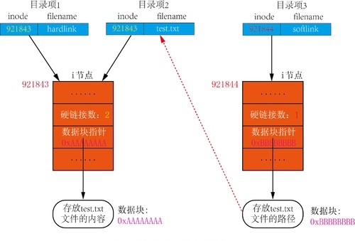
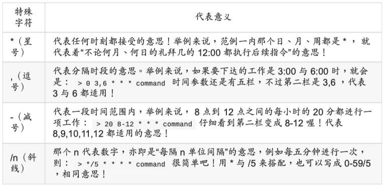
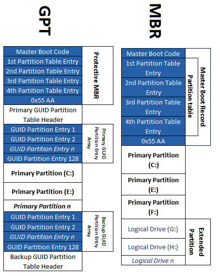
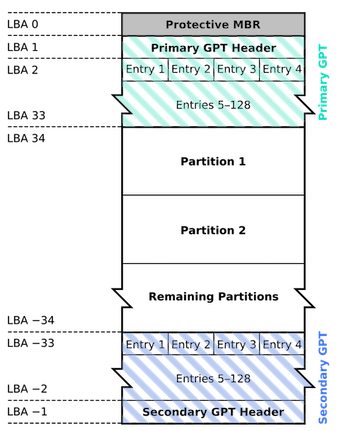
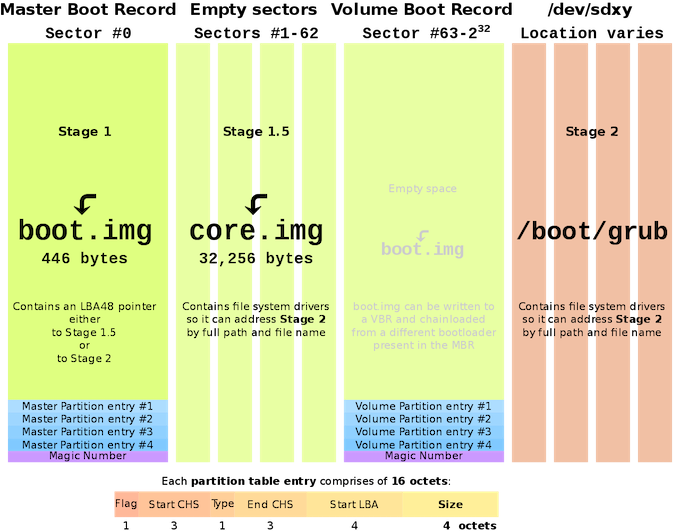

### 1 简介

Linux的核心版本编号(`uname -a`查看)类似于如下的样子：

```
3.10.0-123.e17.x86_64
主板本.次版本.释出版本-修改版本
```

### 2 文件与目录管理


| 目录 | 应放置档案内容 | 
| --- | --- |
| `/bin` | 在单人维护模式下还能够被操作的指令，可以被root与一般帐号所使用，主要有：cat, chmod, chown, bash等常用的指令。 | 
| `/boot` |   开机会使用到的档案，包括Linux核心档案以及开机选单与开机所需设定档等等。  Linux kernel常用的档名为：vmlinuz，如果使用的是grub2这个开机管理程式，则还会存在/boot/grub2/这个目录 | 
| `/dev` |   任何装置与周边设备都是以文件的型态存在于这个目录当中的。比要重要的档案有/dev/null, /dev/zero, /dev/tty , /dev/loop\*, / dev/sd\*等等 | 
| `/etc` |   系统主要的设定档几乎都放置在这个目录内，例如人员的帐号密码档、各种服务的启始档等等。一般来说，这个目录下的各档案属性是可以让一般使用者查阅的，但是只有root有权力修改。  | 
| `/lib` |   系统的函式库非常的多，而/lib放置的则是在开机时会用到的函式库，以及在/bin或/sbin底下的指令会调用的函式库。什么是函式库呢？妳可以将他想成是『外挂』，某些指令必须要有这些『外挂』才能够顺利完成程式的执行之意。另外FHS还要求底下的目录必须要存在：  /lib/modules/：这个目录主要放置可抽换式的核心相关模组(驱动程式)喔！ | 
| `/media` |   放置的就是可移除的设备， 包括软碟、光碟、DVD等等装置都暂时挂载于此。常见的档名有：/media/floppy, /media/cdrom等等。 | 
| `/mnt` |   用来暂时挂载某些额外的设备 | 
| `/opt` |   放置第三方软件。第三方软件也可以放置在/usr/local目录下。 | 
| `/run` |   系统开机后所产生的各项资讯 | 
| `/sbin` |   开机、修复、还原系统所需要的指令。  至于某些伺服器软体程式，一般则放置到/usr/sbin/当中。至于本机自行安装的软体所产生的系统执行档(system binary)，则放置到/usr/local/sbin/当中了。常见的指令包括：fdisk, fsck, ifconfig, mkfs等等。 | 
| `/tmp` |   一般使用者或者是正在执行的程序暂时放置档案的地方 | 
| `/usr` |   第二层FHS 设定，后续介绍 | 
| `/var` |   第二曾FHS 设定，主要为放置变动性的资料，后续介绍 | 


#### 文件与目录操作


##### ln

ln指令用来为文件创建链接，链接类型分为硬链接(hard link)和符号链接(symbolic link)两种。默认的链接类型是硬链接。如果要创建符号链接则必须使用`-s`选项。

* 软链接：ln -s 源文件 目标文件 
* 硬链接：ln 源文件 目标文件

软链接文件的大小和创建时间和源文件不同。硬链接文件和源文件的大小和创建时间一样。对于源文件的内容有修改，硬链接文件会同步更新修改，始终保持和源文件的内容相同。删除源文件，查看软链接文件，会发现查看的文件不存在(No such file or directory)，查看硬链接文件正常。

硬链接实际上是为文件建一个别名，链接文件和原文件实际上是同一个文件(用`ls -i`查看，这两个文件的inode号是同一个，说明它们是同一个文件)。软链接自身就是个链接文件，建立的是一个指向，即链接文件内的内容是指向原文件的指针，它们是两个文件。软链接可以跨文件系统，硬链接不可以。




##### find

find指令在指定目录下查找文件。使用find指令时必须制定一个查找的起始目录，将从指定目录下递归地便利其各个子目录，将满足查找条件的文件显示。


find   path   -option

-name<查找模式> 按照指定的文件名查找模式查找文件
-user<用户名> 查找属于指定用户名所有文件
-size<文件大小> 按照指定的文件大小查找文件(+n 大于, -n小于, n等于)


```bash
find . -name "*.md"
```

##### locate

locate指令利用事先建立的系统中所有文件名称及路径的locate数据库实现快速定位给定的文件。locate指令无需遍历整个文件系统，查询速度较快。为了保证查询结果的准确度，管理员必须定期更新locate数据库。由于locate指令基于数据库进行查询，所以第一次运行前，必须使用`updatedb`指令创建locate数据库。

locate -r 使用正则表达式

```bash
locate passwd
```
#### 文件系统

日志文件系统为Linux系统增加了一层安全性。它不再使用之前先将数据直接写入存储设备 再更新索引节点表的做法，而是先将文件的更改写入到临时文件（称作日志，journal）中。在数据成功写到存储设备和索引节点表之后，再删除对应的日志条目。如果系统在数据被写入存储设备之前崩溃或断电了，日志文件系统下次会读取日志文件并处 理上次留下的未写入的数据。

### 3 账号管理与权限设定


Linux通过UID(User ID)和GID(Group ID)标识文件的拥有者和群组。当显示文件属性时，系统会根据`/etc/passwd`与`/etc/group`，找到UID和GID对应的账号和群组名称并显示出来。

可以简单的使用`useradd 帐号`来创建使用者。CentOS主要会帮我们处理几个项目：

* 在`/etc/passwd`里面创建一行与帐号相关的数据，包括创建UID/GID/主文件夹等；
* 在`/etc/group`里面加入一个与帐号名称一模一样的群组名称；
* 在`/home`下面创建一个与帐号同名的目录作为使用者主文件夹，且权限为700

使用`useradd`创建了帐号之后，在默认的情况下，该帐号是暂时被封锁的，除非使用`passwd 用户名`设置密码。可以使用`usermod -l 新账号名 旧账号名`修改用户名，并使用`usermod -d`修改主目录。改变用户密码的一个简便方法就是用`passwd`命令。


使用`groupadd 新组名`命令可在系统上创建新组。随后可用`usermod -G 组名 用户名`将用户添加到组中。

#### 文件权限


##### chmod

其中a,b,c各为一个数字，a表示User，b表示Group，c表示Other的权限。

r=4，w=2，x=1

若要rwx（可读、可写、可执行）属性，则4+2+1=7
若要rw-（可读、可写、不可执行）属性，则4+2=6
若要r-w（可读、不可写、可执行）属性，则4+1=5


### 4 系统服务


#### service


服务(service)是常驻在内存中的程序，而且可以提供一些系统或网络功能。


!!! note "daemon/service"
    
    daemon和service可以视为相同，因为达成某个服务需要一个daemon在后台运行，没有这个daemon也就没有这个service。
    
    
Unix的System V版本使用`init`来管理服务，现在Linux使用`systemd`来管理服务

| `init` | `systemd` |
| --- | --- |
| 服务依序启动 | 多个服务同时启动 |
| 依赖多个指令(`chkconfig`, `service`等)来处理 | 只需一个`systemctl`指令 |
| 仅分为standalone与super daemon | 多个分类(service, socket, target等) |
|  | 兼容init |

#### service/chkconfig

```bash
# 查看服务状态
service iptables status
# 开启关闭服务
service iptables start/stop
# 查看服务是否开机启动
chkconfig iptables --list
# 设置服务开机启动/不启动
chkconfig iptables on/off
```


#### init 
#### systemctl

`systemd`全部的行为都使用`systemctl`来处理，其命令主要有：

* start ：立刻启动后面接的 unit
* stop：立刻关闭后面接的 unit
* restart：立刻关闭后启动后面接的 unit，亦即执行 stop 再 start 的意思
* reload：不关闭后面接的 unit 的情况下，重载配置文件，让设定生效
* enable：设定下次开机时，后面接的 unit 会被启动
* disable：设定下次开机时，后面接的 unit 不会被启动
* status：目前后面接的这个 unit 的状态，会列出有没有正在执行、开机预设执行否、登录等信息等！
* is-active ：目前有没有正在运作中
* is-enable ：开机时有没有预设要启用这个 unit


#### 例行性工作调度

例行性就是指每隔一定的周期要来办的事项。循环执行的例行性工作调度是由cron(crond)这个系统服务来控制的。通过配置文件可以限制crontab的使用：

* `/etc/cron.allow`: 将可以使用crontab的账号写入其中，若不在这个文件内的使用者则不可使用crontab
* `/etc/cron.deny`: 将不可以使用crontab的账号写入其中，若未记录到这个文件当中的使用者，就可以使用crontab

cron命令：

* -u ：只有 root 才能进行这个任务，亦即帮其他使用者创建/移除 crontab 工作调度；
* -e ：编辑 crontab 的工作内容
* -l ：查阅 crontab 的工作内容
* -r ：移除所有的 crontab 的工作内容，若仅要移除一项，请用 -e 去编辑。





### 5 磁盘管理和系统启动


#### 分区表

目前分区表(partiton table)主要有**MBR**(Master Boot Record)和**GPT**(GUID Partiton Table)两种格式。



##### MBR

MBR位于磁盘的第一个扇区(通常512bytes大小)，包含

* Boot Loader：引导加载程序，见下文
* Partition Table: 分区表，保存4个分区的记录
* Magic Number


!!! note "主分区/逻辑分区/扩展分区"
    
    磁盘的分区主要为主分区(primary partition)和扩展分区(Extended partition)。由于分区表的限制主分区和扩展分区最多可以有4个。逻辑分区(Logical partition)是由扩展分区进一步切割出来的。
    
    


MBR有以下缺点：

* 分区表仅有64btyes，记录的信息相当有限
* MBR仅存在一个扇区上，若被破坏后，经常难以恢复
* MBR的Boot Loader仅有446bytes，无法容纳较多的代码
* 不能识别大于2TB的硬盘

##### GPT

GPT将磁盘所有区块以*逻辑区块地址*(Logical Block Address, LBA)来处理，使用磁盘的前34个LBA区块(Primary GPT)来记录分区信息，并使用磁盘的最后33个LBA(Secondary GPT)用作备份。




* LBA0: 为了向后兼容，传统MBR仍旧保留在GPT分区表内
* LBA1: 记录了分区表本身的位置与大小，同时记录了备份的位置，还有分区表的校验码
* LAB2-33: 每个LBA可以记录4个分区

注意GPT分区没有主分区、扩展分区和逻辑分区的概念。

#### 系统启动

[Ref1](https://arkit.co.in/linux-boot-process-millionaire-guide/)
[Ref2](https://www.linoxide.com/doc/Linux_Boot_Sequence.pdf)
[Ref3](http://www.troubleshooters.com/linux/diy/howboot.htm)


* <hh>Step 1:  Power ON </hh>– When you press on power on button, SMPS (switch mode power supply) will get a signal to power on, immediate after it PGS (Power on boot signal) will execute to get power to all components.
* <hh>Step 2: POST </hh> – (Power-on-Self-Test) is diagnostic testing sequence all the computer parts will diagnose there own.
* <hh>Step 3: BIOS </hh> – (Basic Input Output System) BIOS is program which verifies all the attached components and identifies device booting order
* <hh>Step 4: MBR </hh> – (Master Boot Record) contains Boot Loader, Partition information and Magic Blocks. 
    * Boot loader – contains boot loader program which is 446 bytes in size. 
    * 64 Bytes of partition information will be located under MBR, which will provide redirects to actual `/boot` partition path to find GRUB2
    * 2 bytes are magic bytes to identify errors
* <hh>Step 5: GRUB </hh> – (Grand Unified Boot Loader) configuration file located in `/boot/grub2/grub.cfg` which actually points to `initramfs` is initial RAM disk, initial root file system will be mounted before real root file system.
    * Basically `initramfs` will load block device drivers such as SATA, RAID .. Etc. The `initramfs` is bound to the kernel and the kernel mounts this `initramfs` as part of a two-stage boot process.
* <hh>Step 6: KERNEL </hh> – GRUB2 config file will invoke boot menu when boot is processed, kernel will load. When kernel loading completes it immediately look forward to start processes services.
* <hh>Step 7: Starting `Systemd` </hh> -- the first system process
    * After that, the `systemd` process takes over to initialize the system and start all the system services. How `systemd` will start.
        * As we know before `systemd` there is no process service exists. `systemd` will be started by a system call `fork()`; fork system call have an option to specify PID, that why `systemd` always hold PID 1.
        * As there is no sequence to start processes/services, based on default.target will start. If lot many services enabled in default.target boot process will become slow.
* <hh>Step 8: User Interface </hh>  (UI) – Once that’s done, the “Wants” entry tells `systemd` to start the `display-manager.service` service (`/etc/systemd/system/display-manager.service`), which runs the GNOME display manager.

##### BIOS

The BIOS(Basic Input/Output System) bootstrap procedure essentially performs the following four operations:

* POST(Power-On Self-Test, 加电自检): Executes a series of tests on the computer hardware to establish which devices are present and whether they are working properly.
* Initializes the hardware devices
* Searches for an operating system to boot. The procedure may try to access the first sector (boot sector) of every  hard disk.
* As soon as a valid device is found, it copies the contents of its first sector into RAM, starting from physical address 0x00007c00, and then jumps into that address and executes the code just loaded.


##### Boot loader

* LInux LOader(LILO): installed either on MBR or in the boot sector of every disk partition
* GRand Unified Bootloader(GRUB): three stage boot loader
    * main configure file: `/boot/grub/grub.cfg`




!!! note "启动扇区"
    
    Boot Loader除了可以安装在MBR之外，还可以安装在每个分区的启动扇区(boot sector)


#####  Systemd

> `systemd` is a system management daemon designed exclusively for the Linux kernel. In the Linux startup process, it is the first process to execute in user land; therefore, it is also the parent process of all child processes in user land.


### 6 网络管理

####  防火墙 

##### Iptables
Iptables是一个防火墙工具，可以对数据包进行精细的控制，是Linux内核中集成的模块。


### 7 Shell脚本编程

#### bash

Shell 是一个应用程序，它连接了用户和Linux内核，让用户能够更加高效、安全、低成本地使用Linux内核。Shell有多个版本，例如Bourne SHell(sh), Bourne Again SHell(bash), Z SHell(zsh)。Linux的预设是bash。

bash的主要优点有以下几个：

* 记忆使用过的命令，保存在`.bash_history`文件中
* 命令与文件补全：使用[tab]键
* 设置命令别名：使用alias命令
* 工作控制：使用ctrl-c暂停，fg恢复
* 脚本: shell scripts
* 通配符

#### 环境变量

bash shell用一个环境变量(environment variable)来存储有关shell会话和工作环境的信息。当你登陆Linux系统时，bash shell会作为登陆shell启动。登陆shell会从5个不同的启动文件里读取命令：

* /etc/profile
* $HOME/.bash_profile
* $HOME/.bashrc
* $HOME/.bash_login
* $HOME/.profile

/etc/profile文件是系统上默认的bash shell的主启动文件。系统上的每个用户登录时都会执行这个启动文件。其他4个启动文件是针对用户的，可根据个人需求定制。


#### 重定向

* 输出重定向：使用`>`将输出发送到一个文件中
* 输入重定向：使用`<`将文件的内容重定向到命令


Linux用文件描述符（file descriptor）来标识每个文件对象。 文件描述符是一个非负整数，可以唯一标识会话中打开 的文件。每个进程一次最多可以有九个文件描述符。出于特殊目的，bash shell保留了前三个文 件描述符（0、1和2）。


在重定向到文件描述符时，你 必须在文件描述符数字之前加一个&：

```bash
nohup jupyter_mac.command  > output.log  2>&1 &
```


####  脚本

 如果if命令中的command的退出状态码是0(该命令成功运行，位于then部分的命令就会被执行。如果退出状态码是其他值，then部分的命令就不会被执行，bash shell会继续执行脚本中的下一个命令。
 
```bash
if command
then
    commands
fi
```
当if语句中的命令返回非零退出状态码时，bash shell会执行else部分中的命令。

```bash
if command 
then
    commands 
else
    commands 
fi
```

for命令，允许你创建一个遍历一系列值的循环。

```bash
for var in list 
do 
    commands 
done
```


##### 路径

### 8 linux命令行


#### 文本编辑 
##### sed

sed全称是Stream EDitor即流编辑器，是一个很好的文本处理工具，本身是一个管道命令，处理时，把当前处理的行存储在临时缓冲区中，接着用sed命令处理缓冲区中的内容，处理完成后，把缓冲区的内容送往屏幕。接着处理下一行。它是以行为单位进行处理，可以将数据行进行替换、删除、新增、选取等特定工作。


sed -e 指令

sed指令支持丰富的内部指令，常用的有`d`删除指定的行，`s`替换指定的文本，`i`插入文本。并且支持正则表达式。

```bash
sed -e '1d' /etc/fstab  # 删除文件fstab的第一行
sed -e '1,3d' /etc/fstab # 删除文件fstab的第1至3行
sed -e '/^#/d' /etc/fstab #删除文件fstab中以#开头的行
sed -e 's/defaults/hello/g' /etc/fstab #替换文件fstab中的defaults为hello
```


#### 文本过滤与处理


##### awk
AWK是一种处理文本文件的语言，是一个强大的文本分析工具。

```
awk [选项参数] 'script' var=value file(s)
```

```bash
# 每行按空格或TAB分割，输出文本中的1、4项
awk '{print $1,$4}' log.txt
```

##### grep

grep指令按照某种匹配规则搜索制定的文件，并将符合匹配条件的行输出。

grep 选项 查找内容 源文件

-n 显示匹配行及行号


```bash
grep network anaconda-ks.cfg #搜索并显示含有network的行
grep network anaconda-ks.cfg #搜索并显示含有network的行, 显示行号
```


#### 备份压缩

随着压缩技术的发展，Linux环境下提供的压缩指令和格式开始变多。常见的后缀有以下几种：　　

* .gz          //    gzip程序压缩产生的文件
* .bz2         //    bzip2程序压缩产生的文件
* .zip　　　　　//　　 zip压缩文件
* .rar　　　　　//　　 rar压缩文件
* .7z　　　　　　//　　7-zip压缩文件    
* .tar         //    tar程序打包产生的文件
* .tar.gz      //    由tar程序打包并由gzip程序压缩产生的文件
* .tar.bz2     //    由tar程序打包并由bzip2程序压缩产生的文件


##### tar
tar指令支持gzip, bzip2等格式的压缩和解压缩。

* -c 产生.tar打包文件
* -v 显示详细信息
* -f 指定压缩后的文件名
* -z 使用gzip进行压缩/解压，一般使用.tar.gz后缀
* -x 解包.tar文件
* -j /使用bzip2进行压缩/解压，一般使用.tar.bz2后缀

```
tar -cvf boot.tar /boot # 打包/boot目录下的所有内容
tar -xvf  boot.tar # 解压boot.tar的所有内容
tar -xvjf　etc.tar.bz2 # 解压etc.tar.bz2的所有内容
```

还有其他的一些压缩/解压缩命令

* `gzip`/`gunzip`: 压缩和解压缩`.gz`
* `bzip2`/`bunzip2`: 压缩和解压缩`.bz2`
* `zip`/`unzip`: 压缩和解压缩`.zip`

#### 清理系统缓存

在清理缓存前应该先sync下，因为系统在操作的过程当中，会把你的操作到的文件资料先保存到buffer中去，因为怕你在操作的过程中因为断电等原因遗失数据，所以在你操作过程中会把文件资料先缓存。随后使用`echo 3 > /proc/sys/vm/drop_caches`清除缓存
