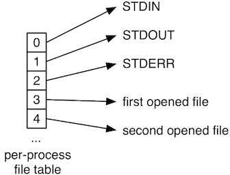
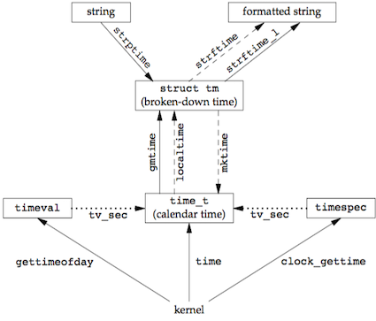
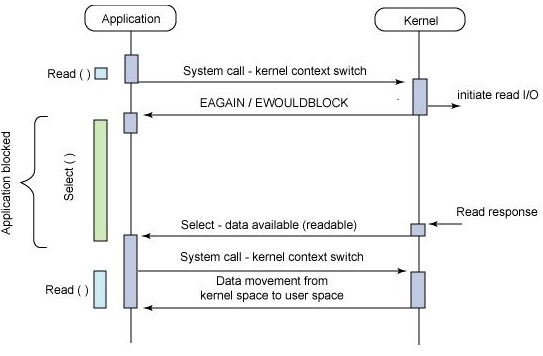

### 3 文件I/O

文件I/O函数包括`open`, `read`, `write`, `lseek`, `close`等。文件I/O经常被称为不带缓冲的I/O(unbuffered I/O)。与此对应的是带缓冲的I/O(buffered I/O)，后面讲的标准I/O属于这一类。

* buffered IO: program structures –> FILE buffer –> kernel buffer –> disk.
* unbuffered I/O: program structures –> kernel buffer –> disk.


当读或写大量小数据时，带缓冲的I/O更占优势；当读或写非常大的数据时，不带缓冲I/O更占优势。


<!--[^1]-->


#### 文件描述符

对于内核⽽⾔，所有打开的⽂件都通过**⽂件描述符**(file descriptor)引⽤。⽂件描述符是⼀个⾮负整数，优先使用当前可用范围内最小值。

* 当打开⼀个现有⽂件或创建⼀个新⽂件时，内核向进程返回⼀个⽂件描述符。
* 当读、写⼀个⽂件时，使⽤`open`或`creat`返回的⽂件描述符标识该⽂件，将其作为参数传送给`read`或`write`。
* UNIX系统shell把⽂件描述符0与进程的标准输⼊关联， ⽂件描述符1与标准输出关联，⽂件描述符2与标准错误关联。




`open`, `close`, `read`, `write`, `dup`, `dup2`的用法见[系统级IO](10 系统级IO.md)。

<!--#### lseek
-->
#### 原子操作

原⼦操作(atomic operation)指的是由多步组成的⼀个操作。如果该操作原⼦地执⾏，则要么执⾏完所有步骤，要么⼀步也不执⾏，不可能只执⾏所有步骤的⼀个⼦集。


如果有多个独立的进程都对同一文件进行追加操作，在定位到文件尾端后(`lseek`)，一个进程的写入(`write`)可能会覆盖另一个进程前面的写入。问题出在逻辑操作"先定位到⽂件尾端，然后写"，它使⽤了两个分开的函数调⽤。解决问题的⽅法是使这两个操作对于其他进程⽽⾔成为⼀个原⼦操作: 在打开⽂件时设置`O_APPEND`标志。

另一个例子是在`open`时使用`O_CREAT`和`O_EXCL`选项创建文件。当同时指定这两个选项，⽽该⽂件又已经存在时，`open`将失败。检查⽂件是否存在和创建⽂件这两个操作是作为⼀个原⼦操作执⾏的。

#### 同步

传统的UNIX系统实现在内核中设有缓冲区⾼速缓存或页⾼速缓存，⼤多数磁盘I/O都通过缓冲区进⾏。当我们向⽂件写⼊数据时，内核通常先将数据复制到缓冲区中，然后排⼊队列，晚些时候再写⼊磁盘。这种⽅式被称为延迟写(delayed write)。

为了保证磁盘上实际⽂件系统与缓冲区中内容的⼀致性，UNIX系统提供了`sync`、`fsync`和`fdatasync`三个函数。

* `sync()`: Allows a process to flush all dirty buffers to disk.
* `fsync(int fd)`: Allows a process to flush all blocks that belong to a specific open file to disk.
* `fdatasync(int fd)`: Very similar to `fsync()`, but doesn't flush the inode block of the file.

通常，称为`update`的系统守护进程周期性地调⽤(⼀般每隔30秒)`sync`函数。这就保证了定期冲洗(flush)内核的块缓冲区。


#### fcntl

`fcntl`(file control)可以改变已经打开文件的属性。

```c
int fcntl(int fd, int cmd, ... /* arg */ );
```

`fcntl`函数有以下5种功能。

* 复制⼀个已有的描述符（cmd=F_DUPFD或 F_DUPFD_CLOEXEC）。
* 获取/设置⽂件描述符标志（cmd=F_GETFD或F_SETFD）。
* 获取/设置⽂件状态标志（cmd=F_GETFL或F_SETFL）。
* 获取/设置异步I/O所有权（cmd=F_GETOWN或 F_SETOWN）。
* 获取/设置记录锁（cmd=F_GETLK、F_SETLK或 F_SETLKW）。

### 4 文件和目录

#### stat

`stat`函数返回与⽂件有关的信息结构：

* `stat(const char *pathname, struct stat *buf)`: retrieve information about the file pointed to by `pathname`.
* `fstat(int fd, struct stat *buf)`: identical  to `stat()`, except that the file about which information is to be retrieved is specified by the file descriptor `fd`.
* `lstat(const char *pathname, struct stat *buf)`: identical to `stat()`, except that if `pathname` is a symbolic link, then it returns  information about the link itself, not the file that it refers to.


`stat`结构的基本形式是：


```c
/* Metadata returned by the stat and fstat functions */
struct stat {
    dev_t     st_dev;         /* ID of device containing file */
    ino_t     st_ino;         /* inode number */
    mode_t    st_mode;        /* file type and mode */
    nlink_t   st_nlink;       /* number of hard links */
    uid_t     st_uid;         /* user ID of owner */
    gid_t     st_gid;         /* group ID of owner */
    dev_t     st_rdev;        /* device ID (if special file) */
    off_t     st_size;        /* total size, in bytes */
    blksize_t st_blksize;     /* blocksize for filesystem I/O */
    blkcnt_t  st_blocks;      /* number of 512B blocks allocated */
};
```

可以直接使用命令`stat`返回文件信息：

```bash
$ stat atexit_demo
  File: ‘atexit_demo’
  Size: 8568      	Blocks: 24         IO Block: 4096   regular file
Device: fd02h/64770d	Inode: 136236      Links: 1
Access: (0775/-rwxrwxr-x)  Uid: ( 1000/  docker)   Gid: ( 1000/  docker)
Context: unconfined_u:object_r:user_home_t:s0
Access: 2017-04-21 23:41:00.840378438 +0800
Modify: 2017-04-21 23:40:50.531535064 +0800
Change: 2017-04-21 23:40:50.531535064 +0800
 Birth: -
```


#### 文件类型

UNIX的文件类型包括如下几种：

* 普通文件(regular file): 包含了某种形式的数据(文本、二进制等)
* 目录文件(directory file): 包含了其他文件的名字以及指向与这些文件有关信息的指针。只有内核可以直接写目录文件
* 块特殊文件(block special file): 提供对设备(如磁盘)带缓冲的访问，每次访问以固定长度为单位进行。
* 字符特殊文件(character special file): 提供对设备(如键盘)不带缓冲的访问，每次访问长度可变。系统中的所有设备要么是字符特殊文件，要么是块特殊文件。详见[IO Systems](12 IO Systems.md)。
* FIFO：用于进程间通信，也称为命名管道(named pipe)
* 套接字(socket): 用于进程间的网络通信。
* 符号链接(symbolic link): 指向另一个文件。


### 5 标准I/O

#### 流和FILE对象

标准I/O库是围绕**流**(stream)进行的。当用标准I/O库打开或创建一个文件时，已经使一个流与一个文件相关联。当打开一个流时，标准I/O函数`fopen`返回一个指向`FILE`对象的指针(**文件指针**)。`FILE`对象包含了标准I/O库为管理该流需要的所有信息，包括⽤于实际I/O的⽂件描述符、指向⽤于该流缓冲区的指针、缓冲区的长度、当前在缓冲区中的字符数以及出错标志等。为了引⽤⼀个流，需将`FILE`指针作为参数传递给每个标准I/O函数。

#### 缓冲

标准I/O库提供缓冲的⽬的是尽可能减少使⽤`read`和`write`调⽤的次数。标准I/O提供了以下3种类型的缓冲。

1. 全缓冲(fullly-buffered)：在填满标准I/O缓冲区后才进⾏实际I/O操作。
    * 对于驻留在磁盘上的⽂件通常是由标准I/O库实施全缓冲的。
    * 缓冲区可由标准I/O例程⾃动地冲洗（例如，当填满⼀个缓冲区时），或者可以调⽤函数`fflush`冲洗⼀个流。<!-- * **冲洗**(flush)意味着将缓冲区中的内容写到磁盘上。 -->
2. ⾏缓冲(line-buffered)：当在输⼊和输出中遇到换⾏符时， 标准I/O库执⾏I/O操作。
    * 当流涉及⼀个终端时(如标准输⼊`stdin`和标准输出`stdout`)，默认使⽤⾏缓冲。
3. 无缓冲(unbuffered): 标准I/O库不对字符进⾏缓冲存储。
    * 标准错误流`stderr`默认是不带缓冲的，这就使得出错信息可以尽快显⽰出来

对任何⼀个给定的流，可以使用`setvbuf`更改缓冲类型：

```c
int setvbuf(FILE *stream, char *buf, int mode, size_t size);
```

也可以使用`setvbuf`的简化版`setbuf`，`setbuf`等价于

```c
void setbuf(FILE *stream, char *buf);
setvbuf(stream, buf, buf ? _IOFBF : _IONBF, BUFSIZ);
```


对一个进程预定义了3个流，并且这3个流可以自动地被进程使用，它们分别是标准输入(`stdin`)、标准输出(`stdout`)和标准错误(`stderr`)。

#### 读和写流

⼀旦打开了流，则可在3种不同类型的⾮格式化I/O中进⾏选择，对其进⾏读、写操作。

1. 每次⼀个字符的I/O。⼀次读或写⼀个字符，如果流是带缓冲的，则标准I/O函数处理所有缓冲。
    * `fgetc(FILE *stream)`  reads  the  next character from `stream` and returns it as an `unsigned char` cast to an `int`, or EOF on end of file or error.
    * `getc(FILE *stream)` is equivalent to `fgetc()` except that it may be implemented as a macro which  evaluates  stream more than once.
    * `getchar(void)` is equivalent to `getc(stdin)`.
    * `fputc`, `getchar`, `putchar`
2. 每次⼀⾏的I/O。如果想要⼀次读或写⼀⾏，则使⽤`fgets`和`fputs`。每⾏都以⼀个换⾏符终⽌。当调⽤`fgets`时，应说明能处理的最⼤⾏长。
    * `fgets(char *s, int size, FILE *stream)`  reads  in  at most one less than `size` characters from `stream` and stores them into the buffer pointed to by `s`. Reading stops after an EOF or a newline.
    *  `gets(char *s)`  reads a line from `stdin` into the buffer pointed to by `s` until either a terminating newline or  EOF.
    * `fputs`, `puts`
3. 直接 I/O。
    * `fread(void *ptr, size_t size, size_t nmemb, FILE *stream)` reads `nmemb` elements of data, each `size` bytes long, from the stream pointed to by `stream`, storing them at the location given by `ptr`.
    * `fwrite(const void *ptr, size_t size, size_t nmemb, FILE *stream)`

=== "拷贝文件"
    ```c
    #define BUFSIZE 1024
    int main(int argc, char **argv){
        FILE *fps, *fpd;
        char buf[BUFSIZE];
        int ch;

        if (argc < 3) {
            fprintf(stderr, "Usage: <src_file> <dest_file>\n");
            exit(0);
        }

        fps = fopen(argv[1], "r");
        if (fps < 0) {
            perror("error open file1 ");
            exit(1);
        }

        fpd = fopen(argv[2], "w");
        if (fpd == NULL) {
            fclose(fps);
            perror("error open file2");
            exit(1);
        }
        /** 使用fgetc实现 */
        while (1) {
            ch = fgetc(fps);
            if (ch == EOF)
                break;
            fputc(ch, fpd);
        }

        /** 使用fgets实现 */
        while (fgets(buf, BUFSIZE, fps) != NULL)
            fputs(buf, fpd);

        /** 使用fread实现 */
        size_t n;
        while ((n = fread(buf, 1, BUFSIZE, fps)) > 0)
            fwrite(buf, 1, n, fpd);


    fclose(fps);
    fclose(fpd);
    exit(0);

        fclose(fps);
        fclose(fpd);
    }
    ```

=== "计算文件大小"
    ```c
    int main(int argc, char **argv) {
        FILE *fd;
        int count = 0;
        if (argc < 2) {
            fprintf(stderr, "Usage: filename\n");
            exit(1);
        }
        fd = fopen(argv[1], "r");
        if (fd == NULL) {
            perror("open file eror");
            exit(0);
        }
        while (fgetc(fd) != EOF) {
            count++;
        }
        printf("一共有%d字符\n", count);
        fclose(fd);
    }
    ```

#### 格式化I/O

* `printf(const char *restrict format, ...)`: 将格式化数据写到标准输出
* `fprintf(FILE *restrict fp, const char *restrict format, ...)`: 将格式化数据写至指定的流
* `dprintf(int fd, const char *restrict format, ...)`： 将格式化数据写至指定的文件描述符
* `sprintf(char *restrict buf, const char *restrict format, ...)`: 将格式化数据写至指定的字符数组

```c
char str[] = "123a456";
printf("%d\n", atoi(str)); // output: 123

int year = 2014, month = 5, day = 13;
char buf[100];
sprintf(buf, "%d-%d-%d", year, month, day);
puts(buf);
exit(0);
```

#### 定位流

* `ftell(FILE *fp)`: 返回文件`fp`的当前位置。
* `fseek(FILE *fp, long offset, int whence)`: 定位到由`whence`指示的位置加上`offset`的位置。
    * `whence`： `SEEK_SET`, `SEEK_CUR`, or `SEEK_END`
* `rewind(FILE *fp)`: 定位到文件首部。


=== "测量文件长度"
    ```c
    FILE *fd;

    if (argc < 2) {
        fprintf(stderr, "Usage: <file_name>");
        exit(1);
    }

    fd = fopen(argv[1], "r");
    int n = fseek(fd, 0, SEEK_END);
    if (n < 0) {
        perror("seek error");
        exit(1);
    }
    printf("FILE LENGTH: %ld", ftell(fd));
    ```
#### 临时文件


### 6 系统数据文件和信息

由UNIX内核提供的基本时间服务是计算⾃协调世界时(Coordinated Universal Time，UTC)公元1970年1⽉1⽇00:00:00这⼀特定时间以来经过的秒数。它以数据类型`time_t`表示，称为日历时间，包括时间和日期。

```c
struct tm {
   int tm_sec;         /* seconds */
   int tm_min;         /* minutes */
   int tm_hour;        /* hours */
   int tm_mday;        /* day of the month */
   int tm_mon;         /* month */
   int tm_year;        /* year */
   int tm_wday;        /* day of the week */
   int tm_yday;        /* day in the year */
   int tm_isdst;       /* daylight saving time */
};
```



### 7 进程环境

#### 进程终止
有8种⽅式使进程终⽌(termination)，其中5种为正常终⽌，它们是：


1. 从`main`返回；
2. 调⽤`exit`；
3. 调⽤`_exit`或`_Exit`；
4. 最后⼀个线程从其启动例程返回；
5. 从最后⼀个线程调⽤`pthread_exit`。

异常终⽌有3种⽅式，它们是：

1. 调⽤`abort`；
2. 接到⼀个信号；
3. 最后⼀个线程对取消请求做出响应。


=== "atexit_demo.c"
    ```c
    #include <stdio.h>
    #include <stdlib.h>
    static void f1(void) {
       puts("f1() is working");
    }
    static void f2(void) {
       puts("f2() is working");
    }
    static void f3(void) {
        puts("f3() is working");
    }

    int main() {
       puts("Begin");
       atexit(f1); // register a function to be called on exit
       atexit(f2);
       atexit(f3);
       puts("End!");
       exit(0);
    }
    ```

=== "output"
    ```bash
    Begin
    End!
    f3() is working
    f2() is working
    f1() is working
    ```
#### 命令行参数

当执⾏⼀个程序时，调⽤`exec`的进程可将命令⾏参数传递给该新程序。


#### 环境表

每个程序都接收到⼀张环境表。与参数表⼀样，环境表也是⼀个字符指针数组，其中每个指针包含⼀个以null结束的C字符串的地址。全局变量`environ`则包含了该指针数组的地址：

```c
#include<stdio.h>
extern char **environ;
int main() {
  int i = 1;
  char *s = *environ;

  for (; s; i++) {
    printf("%s\n", s);
    s = *(environ+i);
  }

  return 0;
}
```

按照惯例，环境由`name = value`这样的字符串组成


#### 存储空间分配


### 8 进程控制

参考[异常控制流](8 异常控制流.md)。


<!--#### 解释器文件

解释器文件(interpreter file)是文本文件，其起始行的形式是`#!pathname[optional-argument]`，例如`#!/bin/bash`-->

### 11 线程

典型的UNIX进程可以看成只有⼀个控制线程：⼀个进程在某⼀时刻只能做⼀件事情。每个线程都包含有表⽰执⾏环境所必需的信息，其中包括进程中标识线程的线程ID、⼀组寄存器值、栈、调度优先级和策略、信号屏蔽字、errno变量以及线程私有数据。⼀个进程的所有信息对该进程的所有线程都是共享的，包括可执⾏程序的代码、程序的全局内存和堆内存、栈以及⽂件描述符。

就像每个进程有⼀个进程ID⼀样，每个线程也有⼀个线程ID。进程ID在整个系统中是唯⼀的，但线程ID不同，线程ID只有在它所属的进程上下⽂中才有意义。线程ID是⽤`pthread_t`数据类型来表⽰的，实现的时候可以⽤⼀个结构来代表`pthread_t`数据类型。

* `pthread_t pthread_self(void)`: 返回调⽤线程的线程ID;
* `int pthread_equal(pthread_t tid1, pthread_t tid2)`：若线程相等，返回⾮0数值；否则，返回0.


#### 线程创建

POSIX线程或pthread来自POSIX.1-2001标准。在POSIX线程(pthread)的情况下，程序开始运⾏时，它是以单进程中的单个控制线程启动的。在创建多个控制线程以前，程序的⾏为与传统的进程并没有什么区别。新增的线程可以通过调⽤`pthread_create`函数创建。

```c
int pthread_create(pthread_t *thread, const pthread_attr_t *attr,
                     void *(*start_routine) (void *), void *arg);
```

* 新创建线程的线程ID会被设置成thread指向的内存单元。
* `attr`参数⽤于定制各种不同的线程属性。
* 新创建的线程从`start_routine`函数的地址开始运⾏
* `arg`是`start_routine`函数的参数

=== "打印线程ID"
    ```c
    static void *func(void *p) {
        printf("Thread %lu is working\n", (unsigned long) pthread_self());
        return NULL;
    }

    int main() {
        pthread_t tid1, tid2;
        puts("Begin!");
        int n = pthread_create(&tid1, NULL,func, NULL );
        int m = pthread_create(&tid2, NULL,func, NULL );
        if (n != 0 || m != 0) {
            fprintf(stderr, "thread create error");
            exit(1);
        }
        // 主线程需要休眠，如果主线程不休眠，它就可能会退 出，
        // 这样新线程还没有机会运⾏，整个进程可能就已经终⽌了
        sleep(1);
        puts("END!");
        exit(0);
    }
    ```

=== "output"
    ```text
    Begin!
    Thread 123145506230272 is working
    Thread 123145505693696 is working
    END!
    ```

=== "使用pthread_join"

    ```c
    static void *func(void *p) {
        printf("Thread %lu is working\n", (unsigned long) pthread_self());
        pthread_exit(NULL);
    }

    int main() {
        pthread_t tid1, tid2;
        puts("Begin!");
        int n = pthread_create(&tid1, NULL,func, NULL );
        int m = pthread_create(&tid2, NULL,func, NULL );
        if (n != 0 || m != 0) {
            fprintf(stderr, "thread create error");
            exit(1);
        }
        pthread_join(tid1, NULL);
        pthread_join(tid2, NULL);
        puts("END!");
        exit(0);
    }
    ```

=== "pthread_clean"

    ```c
    static void cleanup_func(void *p) {
        puts(p);
    }

    static void *func(void *p) {
        puts("Thread is working!");
        pthread_cleanup_push(cleanup_func, "cleanup:1");
        pthread_cleanup_push(cleanup_func, "cleanup:2");
        pthread_cleanup_push(cleanup_func, "cleanup:3");
        puts("push over!");
        pthread_cleanup_pop(1);
        pthread_cleanup_pop(1);
        pthread_cleanup_pop(1);
        pthread_exit(NULL);
    }

    int main() {
        pthread_t tid1, tid2;
        puts("Begin!");

        int err = pthread_create(&tid1, NULL, func, NULL);
        if (err != 0) {
            fprintf(stderr, "thread create error!");
            exit(1);
        }
        pthread_join(tid1, NULL);
        puts("End!");
        exit(0);
    }
    ```

#### 线程终止

单个线程可以通过3种⽅式退出，因此可以在不终⽌整个进程的情况下，停⽌它的控制流。

* 线程可以简单地从启动例程中返回，返回值是线程的退出码。
* 线程可以被同⼀进程中的其他线程取消。
* 线程调⽤`pthread_exit`。
* 调⽤`pthread_join`的线程将⼀直阻塞，直到指定的线程调⽤`pthread_exit`、从启动例程中返回或者被取消。

线程可以通过调⽤`pthread_cancel`函数来请求取消同⼀进程中的其他线程。线程可以选择忽略取消或者控制如何被取消。注意`pthread_cancel`并不等待线程终⽌，它仅仅提出请求。

```c
int pthread_cancel(pthread_t tid);
```


线程可以安排它退出时需要调⽤的线程清理程序(thread cleanup handler)。⼀个线程可以注册多个清理处理程序, 它们的执⾏顺序与注册顺序相反。

```c
void pthread_cleanup_push(void (*rtn)(void *), void *arg);
void pthread_cleanup_pop(int execute);
```


!!! example "质数"

    ```c
    #include <stdio.h>
    #include <stdlib.h>
    #include <unistd.h>
    #include <pthread.h>

    struct thread_arg_list {
        int n;
    };

    void *cal_primer(void *p) {
        int mark = 1;
        int i = ((struct thread_arg_list *) p)->n;
        for (int j = 2; j < i / 2; j++) {
            if (i % j == 0) {
                mark = 0;
                break;
            }
        }
        if (mark == 1)
            printf("%d is a primer\n", i);
        pthread_exit(p);
    }


    /**
     * 利用多线程计算某一个范围内的质数
     */
    int main(int argc, char **argv) {
        if (argc != 3) {
            fprintf(stderr, "Usage: primer start end");
            exit(1);
        }

        int start = atoi(argv[1]);
        int end = atoi(argv[2]);
        if (start < 0 || start > end) {
            fprintf(stderr, "Usage: primer start end, start > end!");
            exit(1);
        }

        pthread_t tid[end - start + 1];
        struct thread_arg_list *p;
        for (int i = start; i <= end; i++) {
            p = malloc(sizeof(*p));
            if (p == NULL) {
                fprintf(stderr, "malloc error");
                exit(1);
            }
            p->n = i;
            int n = pthread_create(&tid[i - start], NULL, cal_primer, p);
            if (n < 0) {
                fprintf(stderr, "thread  create error");
                exit(1);
            }
        }

        void *ptr;
        for (int i = start; i <= end; i++) {
            pthread_join(tid[i - start], ptr);
            free(ptr);
        }

        exit(0);
    }
    ```


#### 线程同步

##### 互斥量

互斥量(mutex)从本质上说是⼀把锁，在访问共享资源前对互斥量进⾏设置(加锁)，在访问完成后释放(解锁)互斥量。

* 对互斥量进⾏加锁以后，任何其他试图再次对互斥量加锁的线程都会被阻塞直到当前线程释放该互斥锁。
* 如果释放互斥量时有⼀个以上的线程阻塞，那么所有该锁上的阻塞线程都会变成可运⾏状态，第⼀个变为运⾏的线程就可以对互斥量加锁，其他线程就会看到互斥量依然是锁着的，只能回去再次等待它重新变为可⽤。
* 在这种⽅式下，每次只有⼀个线程可以向前执⾏。

互斥变量是⽤`pthread_mutex_t`数据类型表⽰的。在使⽤互斥变量以前，必须⾸先对它进⾏初始化，可以把它设置为常量 `PTHREAD_MUTEX_INITIALIZER`（只适⽤于静态分配的互斥量），也可以通过调⽤`pthread_mutex_init`函数进⾏初始化。如果动态分配互斥量(例如，通过调⽤`malloc`函数），在释放内存前需要调⽤`pthread_mutex_destroy`。

```c
int pthread_mutex_init(pthread_mutex_t *mutex, const pthread_mutexattr_t *attr);
int pthread_mutex_destroy(pthread_mutex_t *mutex);
pthread_mutex_t mutex = PTHREAD_MUTEX_INITIALIZER;
```

对互斥量进⾏加锁，需要调⽤`pthread_mutex_lock`。如果互斥量已经上锁，调⽤线程将阻塞直到互斥量被解锁。对互斥量解锁，需要调⽤ `pthread_mutex_unlock`。

```c
int pthread_mutex_lock(pthread_mutex_t *mutex);
int pthread_mutex_trylock(pthread_mutex_t *mutex);
int pthread_mutex_unlock(pthread_mutex_t *mutex);
```

=== "互斥锁"
    ```c
    #include <stdio.h>
    #include <stdlib.h>
    #include <pthread.h>

    #define LINESIZE 1024

    static pthread_mutex_t mut = PTHREAD_MUTEX_INITIALIZER;

    void *add_func(void *p) {
        char buff[LINESIZE];
        char *filepath = (char *) p;
        FILE *fd = fopen(filepath, "r+");
        if (fd == NULL) {
            perror("fopen error");
            exit(1);
        }
        pthread_mutex_lock(&mut);
        fgets(buff, LINESIZE, fd);
        fseek(fd, 0, SEEK_SET);
        fprintf(fd, "%d\n", atoi(buff) + 1);
        fclose(fd);
        pthread_mutex_unlock(&mut);
        pthread_exit(NULL);
    }

    /**
     * 读取文件中的数，加上一定的值
     */
    int main(int argc, char **argv) {
        if (argc < 3) {
            fprintf(stdout, "Usage: add <file> <number>");
            exit(1);
        }
        char *filepath = argv[1];
        int THRNUM = atoi(argv[2]);
        pthread_t tid[THRNUM];
        for (int i= 0; i < THRNUM; i++) {
            int  err = pthread_create(tid + i, NULL, add_func, filepath);
            if (err) {
                fprintf(stderr, "thread create error!");
                exit(1);
            }
        }
        for (int i = 0; i < THRNUM; i++) {
            pthread_join(tid[i], NULL);
        }
        pthread_mutex_destroy(&mut);
        exit(0);
    }
    ```

=== "循环打印abcd"
    ```c
    #include <stdio.h>
    #include <pthread.h>
    #include <stdlib.h>
    #include <unistd.h>


    #define THRNUM 4

    static pthread_mutex_t mut[THRNUM];

    void *thr_func(void *p) {
        int n = (int) p;
        int c = 'a' + n;
        while (1) {
            pthread_mutex_lock(mut + n);
            write(1, &c, 1);
            if (n + 1 == THRNUM) {
                write(1, "\n", 1);
                pthread_mutex_unlock(mut + 0);
            }
            else
                pthread_mutex_unlock(mut + n + 1);
        }
        pthread_exit(NULL);
    }


    /**
     * 多个线程输出abcd
     * @return
     */
    int main() {
        pthread_t tid[THRNUM];
        for (int i = 0; i < THRNUM; i++) {
            pthread_mutex_init(mut + i, NULL);
            pthread_mutex_lock(mut + i);
            int err = pthread_create(tid + i, NULL, thr_func, (void *) i) ;
            if (err) {
                fprintf(stdout, "thread create error!");
                exit(1);
            }
        }
        pthread_mutex_unlock(mut + 0);
         alarm(1); // 发送SIGALRM
        for (int i = 0; i < THRNUM; i++){
            int n =  pthread_join(tid[i], NULL);
            if (n < 0) {
                perror("thread join");
                exit(1);
            }
        }
    }
    ```

=== "任务池"
    ```c
    ...to be continued
    ```


##### 读写锁

读写锁可以有3种状态：读模式下加锁状态，写模式下加锁状态，不加锁状态。⼀次只有⼀个线程可以占有写模式的读写锁，但是多个线程可以同时占有读模式的读写锁。

##### 屏障

**屏障**(barrier)是⽤户协调多个线程并⾏⼯作的同步机制。屏障允许每个线程等待，直到所有的合作线程都到达某⼀点，然后从该点继续执⾏。


### 12 线程控制


### 14 高级I/O

#### 文件锁

<!--
https://www.thegeekstuff.com/2012/04/linux-file-locking-types/
https://gavv.github.io/articles/file-locks/
-->

UNIX支持的文件锁分为建议性锁(advisory lock)和强制锁(mandatory lock)。


* Traditionally, locks are advisory in Unix. They work only when a process ==explicitly==  acquires and releases locks, and are ignored if a process is not aware of locks.
    * BSD locks (`flock`)
    * POSIX record locks (`fcntl`, `lockf`)
    * Open file description locks (`fcntl`)
* Mandatory locking causes the kernel to check every open, read, and write to verify that the calling process isn’t violating a lock on the given file. A mandatory lock is activated for a file when ALL of these conditions are met:
    * The partition was mounted with the `mand` option.
    * The set-group-ID bit is on and group-execute bit is off for the file.
    * A POSIX record lock is acquired.

|  | `flock` | `lockf` | `flock`| `fcntl` |
| --- | --- | --- | --- | --- |
| Portability | widely available | POSIX (XSI) | POSIX (base standard) | Linux 3.15+ |
| Associated with	| File object | [i-node, pid] pair | [i-node, pid] pair | File object |
| Applying to byte range	| no | yes | yes | yes |
| Support exclusive and shared modes | yes | no | yes | yes |
| Atomic mode switch | no | - | yes | yes |


##### flock

https://zhuanlan.zhihu.com/p/25134841

`flock()`只能对整个文件进行上锁。参数`operation`可以使用`LOCK_SH`或`LOCK_EX`常量，分别对应共享锁和排他锁。

```
#include <sys/file.h>
int flock(int fd, int operation);
```


##### `fcntl`记录锁

```c
#include <fcntl.h>
fcntl(int fildes, int cmd, ...);
```

对于`fcntl`记录锁(record locking)，`cmd`是`F_GETLK`、`F_SETLK`或`F_SETLKW`。第三个参数是⼀个指向`flock`结构的指针。

```c
struct flock {
     off_t       l_start;    /* starting offset */
     off_t       l_len;      /* len = 0 means until end of file */
     pid_t       l_pid;      /* lock owner */
     short       l_type;     /* lock type: read/write, etc. */
     short       l_whence;   /* type of l_start */
};
```

在设置或释放⽂件上的⼀把锁时，系统按要求组合或分裂相邻区。 例如，若第100～199字节是加锁的区，需解锁第150字节，则内核将维持两把锁，⼀把⽤于第100～149字节，另⼀把⽤于第151～199字节。下图说明了这种情况下的字节范围锁。


##### 锁的隐含继承和释放

关于记录锁的⾃动继承和释放有3条规则。

* 锁与进程和⽂件两者相关联。这有两重含义：当⼀个进程终⽌时，它所建⽴的锁全部释放；⽆论⼀个描述符何时关闭，该进程通过这⼀描述符引⽤的⽂件上的任何⼀把锁都会释放(这些锁都是该进程设置的)。
* 由`fork`产⽣的⼦进程不继承⽗进程所设置的锁。
* 在执⾏`exec`后，新程序可以继承原执⾏程序的锁。


考虑一个进程，它执行下列语句：


#### 非阻塞IO

简单流程：如果一个程序的自然流程是结构化的
复杂流程：如果一个程序的自然流程不是结构化的

自然流程是人类解决问题的最直接的思路


=== "非阻塞IO-描述"
    ```text
    从设备 tty11 读取输入并输出到 tty12 上，同样从 tyy12 读取输入并输出到 tty11 上。
    ```
=== "非阻塞IO-代码"
    ```c
    #include <stdio.h>
    #include <stdlib.h>
    #include <unistd.h>
    #include <errno.h>
    #include <fcntl.h>


    #define TTY1 "/dev/tty11"
    #define TTY2 "/dev/tty12"
    #define BUFSIZE 4096

    /**
     * 四种状态：读、写、异常、结束
    */
    enum {
        STATE_R = 1,
        STATE_W,
        STATE_Ex,
        STATE_T
    };


    //  状态机
    struct fsm_st {
        int state; // state
        int std; // source file descriptor
        int dfd; // destination file descriptor
        char buf[BUFSIZE]; //buffer
        int pos;  // buf的偏移量
        int len;  // 读取/写入长度
        char *errstr; // 错误消息
    };


    void fsm_driver(struct fsm_st *fsm) {
        int ret;

        switch (fsm->state) {
            case STATE_R:
                fsm->len = read(fsm->std, fsm->buf, BUFSIZE);
                if (fsm->len == 0) {
                    fsm->state = STATE_T;
                } else if (fsm->len < 0) {
                    if (errno == EAGAIN)
                        fsm->state = STATE_R;
                    else
                        fsm->state = STATE_Ex;
                } else {
                    fsm->pos = 0;
                    fsm->state = STATE_W;
                }
                break;
            case STATE_W:
                ret = write(fsm->dfd, fsm->buf + fsm->pos, fsm->len);
                if (ret < 0) {
                    if (errno == EAGAIN)
                        fsm->state = STATE_W;
                    else
                        fsm->state = STATE_Ex;
                } else {
                    fsm->pos += ret;
                    fsm->len -= ret;
                    if (fsm->len == 0)
                        fsm->state = STATE_R;
                    else
                        fsm->state = STATE_W;
                }
                break;
            case STATE_Ex:
                perror(fsm->errstr);
                fsm->state = STATE_T;
                break;
            case STATE_T:
                break;
            default:
                abort();
        }
    }


    void relay(int fd1, int fd2) {
        // 保存之前状态
        int fd1_save = fcntl(fd1, F_GETFL);
        int fd2_save = fcntl(fd2, F_GETFL);

        // 设置成非阻塞
        struct fsm_st fsm12, fsm21; // fsm12: 读左写右，fsm21:读右写左
        fcntl(fd1, F_SETFL, fd1_save | O_NONBLOCK);
        fcntl(fd2, F_SETFL, fd2_save | O_NONBLOCK);

        // 初始化状态机
        fsm12.state = STATE_R;
        fsm12.std = fd1;
        fsm12.dfd = fd2;
        fsm21.state = STATE_R;
        fsm21.std = fd2;
        fsm21.dfd = fd1;

        while (fsm12.state != STATE_T || fsm21.state != STATE_T) {
            // 推进状态机
            fsm_driver(&fsm12);
            fsm_driver(&fsm21);
        }

        // 把状态恢复到之前
        fcntl(fd1, F_SETFL, fd1_save);
        fcntl(fd2, F_SETFL, fd2_save);
    }


    /***
     * 在TTY1, TTY2之间来回传输内容
     * 可以使用sudo chvt 11, sudo chvt 12切换tty
     * @return
     */
    int main() {
        // 模拟用户操作
        int fd1 = open(TTY1, O_RDWR);
        if (fd1 < 0) {
            perror("file open error");
            exit(1);
        }
        write(fd1, "TTY1\n", 5);
        int fd2 = open(TTY2, O_RDWR | O_NONBLOCK);
        if (fd2 < 0) {
            perror("file open error");
            exit(1);
        }
        write(fd1, "TTY2\n", 5);

        relay(fd1, fd2);

        close(fd1);
        close(fd2);

        exit(0);
    }
    ```
#### I/O多路复用

使⽤I/O多路复用(I/O multiplexing)的方法是： 构造一个感兴趣的描述符列表，然后调用一个函数(`select`, `poll`, `epoll`， `kqueue`等)， 直到这些描述符中的⼀个已准备好进⾏I/O时，该函数才返回。在从这些函数返回时，进程会被告知哪些描述符已准备好可以进⾏I/O。

不同的I/O多路复用函数之间主要有可移植性、性能等差别：

* `select`, `poll`广泛使用，`epoll`适用于Linux， `kqueue`适用于Mac OS
* 性能差别 


IO多路复用使用了多路复用器(multiplexor)，具体原理见[计算机系统要素](计算机系统要素.md)。


I/O根据是否阻塞以及是否同步，可以分为以下四类。很显然，I/O多路复用属于阻塞异步I/O。


##### select

> `select()` allow  a program to monitor multiple file descriptors, waiting until one or more of the file descriptors become "ready" for some class of I/O operation (e.g.,  input  possible). A  file  descriptor  is considered ready if it is possible to perform the corresponding I/O operation without blocking.


```c
int select(int nfds, fd_set *readfds, fd_set *writefds,
                  fd_set *exceptfds, struct timeval *timeout);
```

* `nfds` is the highest-numbered file descriptor in any of the three sets, plus 1.
* The `timeout` argument specifies the minimum interval that `select()` should block  waiting  for  a  file descriptor  to  become ready.


select有3个可能的返回值:

* 返回值-1表⽰出错。例如，在所指定的描述符⼀个都没准备好时捕捉到⼀个信号。在此种情况下，⼀个描述符集都不修改。
* 返回值0表⽰没有描述符准备好。若指定的描述符⼀个都没准备好，指定的时间就过了，那么就会发⽣这种情况。此时，所有描述符集都会置0。
* ⼀个正返回值说明了已经准备好的描述符数。该值是3个描述符集中已准备好的描述符数之和，所以如果同⼀描述符已准备好读和写，那么在返回值中会对其计两次数。在这种情况下， 3个描述符集中仍旧打开的位对应于已准备好的描述符。

对于“准备好”的含义要作⼀些更具体的说明。

* 若对读集(`readfds`)中的⼀个描述符进⾏的读操作不会阻塞，则认为此描述符是准备好的。
* 若对写集(`writefds`)中的⼀个描述符进⾏的写操作不会阻塞， 则认为此描述符是准备好的。
* 若对异常条件集(`exceptfds`）中的⼀个描述符有⼀个未决异常条件，则认为此描述符是准备好的。现在，异常条件包括：在⽹络连接上到达带外的数据，或者在处于数据包模式的伪终端上发⽣了某些条件。

`select`的时间线如下所示：



* `EAGAIN` is often raised when performing non-blocking I/O. It means "there is no data available right now, try again later".
* For most systems, `EAGAIN` and `EWOULDBLOCK` will be the same.

```c
void relay(int fd1, int fd2) {
    // select
    fd_set readfds, writefds;
    struct timeval ts;
    ts.tv_sec = 1L;
    ts.tv_usec = 1L;

    // 保存之前状态
    int fd1_save = fcntl(fd1, F_GETFL);
    int fd2_save = fcntl(fd2, F_GETFL);

    // 设置成非阻塞
    struct fsm_st fsm12, fsm21; // fsm12: 读左写右，fsm21:读右写左
    fcntl(fd1, F_SETFL, fd1_save | O_NONBLOCK);
    fcntl(fd2, F_SETFL, fd2_save | O_NONBLOCK);

    // 初始化状态机
    fsm12.state = STATE_R;
    fsm12.std = fd1;
    fsm12.dfd = fd2;
    fsm21.state = STATE_R;
    fsm21.std = fd2;
    fsm21.dfd = fd1;


    while (fsm12.state != STATE_T || fsm21.state != STATE_T) {
        // 布置监视任务
        FD_ZERO(&readfds);
        FD_ZERO(&writefds);

        if (fsm12.state == STATE_R)
            FD_SET(fsm12.std, &readfds);
        if (fsm12.state == STATE_W)
            FD_SET(fsm12.dfd, &writefds);
        if (fsm21.state == STATE_R)
            FD_SET(fsm21.std, &readfds);
        if (fsm21.state == STATE_W)
            FD_SET(fsm21.dfd, &writefds);

        if (fsm12.state < STATE_AUTO && fsm21.state < STATE_AUTO) {
            // 监视
            int n = select(max(fd1, fd2) + 1, &readfds, &writefds,
                NULL, NULL);
            if (n < 0) {
                // A signal was caught
                if (errno == EINTR)
                    continue;
                perror("select");
                exit(1);
            }
        }

        // 查看监视结果
        if (FD_ISSET(fd1, &readfds) || FD_ISSET(fd2,&writefds)
            || fsm12.state > STATE_AUTO)
            fsm_driver(&fsm12);
        if (FD_ISSET(fd2, &readfds) || FD_ISSET(fd1, &writefds)
            || fsm21.state > STATE_AUTO)
            fsm_driver(&fsm21);

        // 把状态恢复到之前
        fcntl(fd1, F_SETFL, fd1_save);
        fcntl(fd2, F_SETFL, fd2_save);
    }
}

```

##### poll


`poll()` performs a similar task to `select()`: it waits for one of a set of file descriptors to become ready to perform I/O.

```c
int poll(struct pollfd *fds, nfds_t nfds, int timeout);
```

The set of file descriptors to be monitored is specified in the `fds` argument, which is  an  array  of
structures of the following form:

```c
struct pollfd {
       int   fd;         /* file descriptor */
       short events;     /* requested events */
       short revents;    /* returned events */
};
```

The caller should specify the number of items in the `fds` array in `nfds`.

The bits that may be set/returned in `events` and `revents` are defined in `<poll.h>`:

| 事件 | 描述 |
| --- | --- |
| 事件 | 描述 |
| POLLIN | 文件描述符可读 |
| POLLPRI | 可以非阻塞的读高优先级的数据 |
| POLLOUT | 文件描述符可写 |
| POLLRDHUP | 流式套接字连接点关闭，或者关闭写半连接。 |
| POLLERR | 已出错 |
| POLLHUP | 已挂断（一般指设备） |
| POLLNVAL | 参数非法: 文件描述符没打开 |

```c
void relay(int fd1, int fd2) {


    // 保存之前状态
    int fd1_save = fcntl(fd1, F_GETFL);
    int fd2_save = fcntl(fd2, F_GETFL);

    // 设置成非阻塞
    struct fsm_st fsm12, fsm21; // fsm12: 读左写右，fsm21:读右写左
    fcntl(fd1, F_SETFL, fd1_save | O_NONBLOCK);
    fcntl(fd2, F_SETFL, fd2_save | O_NONBLOCK);

    // 初始化状态机
    fsm12.state = STATE_R;
    fsm12.std = fd1;
    fsm12.dfd = fd2;
    fsm21.state = STATE_R;
    fsm21.std = fd2;
    fsm21.dfd = fd1;


    // poll
    struct pollfd fds[2];
    nfds_t nfds = 2;   // two state machines
    int timeout  = -1; // infinite timeout
    fds[0].fd = fd1;
    fds[1].fd = fd2;

    while (fsm12.state != STATE_T || fsm21.state != STATE_T) {
        // 布置监视任务
        fds[0].events = 0;
        fds[1].events = 0;
        if (fsm12.state == STATE_R)
            fds[0].events |= POLLIN;
        if (fsm12.state == STATE_W)
            fds[0].events |= POLLOUT;
        if (fsm21.state == STATE_R)
            fds[1].events |= POLLIN;
        if (fsm21.state == STATE_W)
            fds[1].events |= POLLOUT;


        if (fsm12.state < STATE_AUTO && fsm21.state < STATE_AUTO) {
            // 监视
            while(poll(fds, nfds, timeout) < 0) {
                // A signal was caught
                if (errno == EINTR)
                    continue;
                perror("poll");
                exit(1);
            }
        }

        // 查看监视结果
        if (fds[0].revents & POLLIN || fds[1].revents & POLLOUT
                || fsm12.state > STATE_AUTO)
            fsm_driver(&fsm12);
        if (fds[0].revents & POLLOUT || fds[1].revents & POLLIN
                || fsm21.state > STATE_AUTO)
            fsm_driver(&fsm21);

        // 把状态恢复到之前
        fcntl(fd1, F_SETFL, fd1_save);
        fcntl(fd2, F_SETFL, fd2_save);
    }
}
```


##### epoll

<!--TODO： https://medium.com/@copyconstruct/the-method-to-epolls-madness-d9d2d6378642
-->

`epoll` stands for *event poll* and is a Linux specific construct. It allows for a process to monitor multiple file descriptors and get notifications when I/O is possible on them. It allows for both *edge-triggered* as well as *level-triggered* notifications.

*  `epoll_create()` creates an `epoll`  instance  and  returns  a  file  descriptor  referring  to  that instance.
*  Interest  in  particular  file  descriptors  is then registered via `epoll_ctl()`.  The set of file descriptors currently registered on an `epoll` instance is sometimes called an` epoll `set.
*  `epoll_wait()` waits for I/O events, blocking the calling thread if no events are currently  available.


```c
int epoll_create(int size);
int epoll_ctl(int epfd, int op, int fd, struct epoll_event *event);
int epoll_wait(int epfd, struct epoll_event *events,
                int maxevents, int timeout);
```

同样的，改写`select`后的`epoll`版本：

```c
void relay(int fd1, int fd2) {
    // 保存之前状态
    int fd1_save = fcntl(fd1, F_GETFL);
    int fd2_save = fcntl(fd2, F_GETFL);

    // 设置成非阻塞
    struct fsm_st fsm12, fsm21; // fsm12: 读左写右，fsm21:读右写左
    fcntl(fd1, F_SETFL, fd1_save | O_NONBLOCK);
    fcntl(fd2, F_SETFL, fd2_save | O_NONBLOCK);

    // 初始化状态机
    fsm12.state = STATE_R;
    fsm12.std = fd1;
    fsm12.dfd = fd2;
    fsm21.state = STATE_R;
    fsm21.std = fd2;
    fsm21.dfd = fd1;


    // epoll
    int epfd = epoll_create(10);
    if (epfd < 0) {
        perror("epoll create error");
        exit(1);
    }
    struct epoll_event ev;
    ev.events = 0;
    ev.data.fd = fd1;
    if (epoll_ctl(epfd, EPOLL_CTL_ADD, fd1, &ev) < 0) {
        perror("epoll control error");
        exit(1);
    }

    ev.events = 0;
    ev.data.fd = fd2;
    if (epoll_ctl(epfd, EPOLL_CTL_ADD, fd2, &ev) < 0) {
        perror("epoll control error");
        exit(1);
    }

    while (fsm12.state != STATE_T || fsm21.state != STATE_T) {
        // 布置监视任务
        ev.data.fd = fd1;
        ev.events = 0;
        if (fsm12.state == STATE_R)
            ev.events |= EPOLLIN;
        if (fsm21.state == STATE_W)
            ev.events |= EPOLLOUT;
        epoll_ctl(epfd, EPOLL_CTL_MOD, fd1, &ev);

        ev.data.fd = fd2;
        ev.events = 0;
        if (fsm21.state == STATE_R)
            ev.events |= EPOLLIN;
        if (fsm12.state == STATE_W)
            ev.events |= EPOLLOUT;
        epoll_ctl(epfd, EPOLL_CTL_MOD, fd2, &ev);


        if (fsm12.state < STATE_AUTO && fsm21.state < STATE_AUTO) {
            // 监视
            while (epoll_wait(epfd, &ev, 1, -1) < 0) {
                // A signal was caught
                if (errno == EINTR)
                    continue;
                perror("epoll wait error");
                exit(1);
            }
        }

        // 查看监视结果
        if (ev.data.fd == fd1 && (ev.events & EPOLLIN)
            || ev.data.fd == fd2 && (ev.events & EPOLLOUT)
            || fsm12.state > STATE_AUTO)
            fsm_driver(&fsm12);
        if (ev.data.fd == fd1 && (ev.events & EPOLLOUT)
            || ev.data.fd == fd2 && (ev.events & EPOLLIN)
            || fsm21.state > STATE_AUTO)
            fsm_driver(&fsm21);
    }

    // 把状态恢复到之前
    fcntl(fd1, F_SETFL, fd1_save);
    fcntl(fd2, F_SETFL, fd2_save);

    close(epfd);
}
```

#### 内存映射I/O

内存映射I/O(memory-mapped I/O)能将一个磁盘文件映射到内存空间中的一个缓冲区上。于是，当从缓冲区取数据时，就相当于读文件中的相应字节。与此类似，将数据存入缓冲区时，相应字节就自动写入文件。这样，就可以在不使用`read`和`write`的情况下执行I/O。

```c
void *mmap(void *addr, size_t len, int prot, int flags, int fd, off_t offset);
```

> mmap system call causes the pages starting at `addr` and continuing for at most `len` bytes to be mapped from the object described by `fd`, starting at byte offset `offset`.


`prot`参数指定了映射内存的保护要求：

| 宏 | 含义 |
| --- | --- |
| 宏 | 含义 |
| PROT_READ | 映射区可读 |
| PROT_WRITE | 映射区可写 |
| PROT_EXEC | 映射区可执行 |
| PROT_NONE | 映射区不可访问 |


`flag`参数影响映射存储区的多种属性:

* MAP_SHARED: 修改是共享的
* MAP_PRIVATE: 修改是私有的(写时复制)
* MAP_FILE: 从普通文件映射
* MAP_ANONYMOUS： 映射内存与文件无关联

=== "统计文件中某字符的个数"
    ```c
    int main(int argc, char **argv) {
        if (argc < 3) {
            fprintf(stderr, "Usage: %s filename\n char_to_count", argv[0]);
            exit(1);
        }
        int fd = open(argv[1], O_RDONLY);
        if (fd < 0) {
            perror("file open error");
            exit(1);
        }
        struct stat statres;
        if (fstat(fd, &statres) < 0) {
            perror("fstate error");
            exit(1);
        }
        char *str = mmap(NULL, statres.st_size, PROT_READ, MAP_SHARED, fd, 0);
        if (str == MAP_FAILED) {
            perror("map failed");
            exit(1);
        }
        close(fd);
        int count = 0;
        char char_to_count = *(argv[2]);
        for (int i = 0; i < statres.st_size; i++) {
            if (str[i]==char_to_count)
                count++;
        }
        munmap(str, statres.st_size);
        printf("count[%c]=%d", char_to_count, count);
    }
    ```

=== "子进程向父进程发送一个字符串"
    ```c
    #define MAPSIZE 4096
    int main(int argc, char **argv) {
        char *ptr = mmap(NULL, MAPSIZE,
                         PROT_READ | PROT_WRITE, MAP_SHARED | MAP_ANONYMOUS, -1, 0);
        if (ptr == NULL) {
            perror("mmap error");
            exit(1);
        }
        int pid = fork();
        if (pid < 0) {
            perror("fork error");
            munmap(ptr, MAPSIZE);
            exit(1);
        }
        if (pid == 0) {// child process
            strcpy(ptr, "hello");
            munmap(ptr, MAPSIZE);
            exit(0);
        } else {    // parent process
            wait(NULL);
            puts(ptr);
            munmap(ptr, MAPSIZE);
            exit(0);
        }
    }
    ```

### 16 套接字

TCP/IP协议栈使⽤⼤端字节序。对于TCP/IP，地址⽤⽹络字节序来表⽰，所以应⽤程序有时需要在处理器的字节序与⽹络字节序之间转换它们。

对于TCP/IP应⽤程序，有4个⽤来在处理器字节序和⽹络字节序之间实施转换的函数。h表⽰“主机”字节序，n表⽰“⽹络”字节序。l表⽰“长”（即4字节）整 数，s表⽰“短”（即4字节）整数。

* `uint32_t htonl(uint32_t hostint32)`：以⽹络字节序表⽰的32位整数
* `uint16_t htons(uint16_t hostint16)`：以⽹络字节序表⽰的16位整数
* `uint32_t ntohl(uint32_t netint32)`：以主机字节序表⽰的32位整数
* `uint16_t ntohs(uint16_t netint16)`：以主机字节序表⽰的16位整数


对齐

```c
struct msg_st{
     uint8_t name[NAMESIZE];
     uint32_t math;
     uint32_t chinese;
}__attribute__((packed));
```

网络传输的结构体中的成员都是紧凑的，所以不能地址对齐(编译器会自动对齐)，需要在结构体外面增加`__attribute__((packed))`。

=== "自动对齐"
    ```c
    int main(int argc, char **argv){
    	struct {
    	    int i;   // 4 bytes
    	    float f; // 4 bytes
    	    char ch; // 1 bytes
    	} p;
    	printf("%lu", sizeof(p)); // 12 bytes
    	exit(0);
    }
    ```

=== "不对齐"
    ```c
    int main(int argc, char **argv){
    	struct {
    	    int i;   // 4 bytes
    	    float f; // 4 bytes
    	    char ch; // 1 bytes
    	}__attribute__((packed)) p;

    	printf("%lu", sizeof(p)); // 9 bytes
    	exit(0);
    }
    ```


[^1]: http://www.pixelbeat.org/programming/stdio_buffering/
