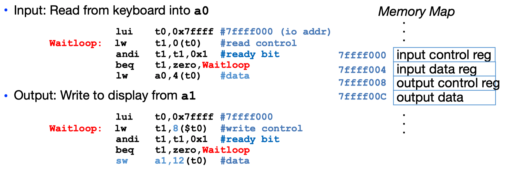

### 1 简介

计算机体系结构中包含的内容：


#### 计算机体系结构中的伟大思想

1.Abstraction(Layers of Representation/Interpretation)


2.Moore’s Law (Designing through trends)

CPU Transistor Counts (1917-2008) & Moore's Law:


3.Principle of Locality (Memory Hierarchy)

Memory Hierarchy effectively creates a large fast cheap memory.


4.Parallelism & Amdahl's law (which limits it)


5.Dependability via Redundancy

Redundancy so that a failing piece doesn’t make the whole system fail. Applies to everything from datacenters to storage to memory to instructors.

* Redundant datacenters so that can lose 1 datacenter but Internet service stays online
*  Redundant computers was Google’s original internal innovation
*  Redundant disks so that can lose 1 disk but not lose data (Redundant Arrays of Independent Disks/RAID)
*  Redundant memory bits so that can lose 1 bit but no data (Error Correcting Code/ECC Memory/"Chipkill" memory)
*  Redundant instructors (I wish... I'd want to call in a "hot spare" if I have to travel!)


### 1 计算机概要与技术

#### 处理器制造

集成电路的制造是从*硅锭*(silicon crystal ingot)开始的，经切片机切成厚度不超过0.1英寸的*晶圆*(wafer)。空白的晶圆经过大约20～40步的加工，产生图样化的晶圆。这些图样化的晶圆由晶圆测试器进行测试，进一步切成芯片。合格芯片被封装起来并且在发布给用户之前经过多次测试。不合格的封装会在最终测试中被发现。晶圆中或是在图样化的几十个步骤中出现一个细微的瑕疵就会使其附近的电路损坏，这些*瑕疵*(defect)使得制成一个完美的晶圆几乎是不可能的。最常见的策略是把晶圆切成许多独立的晶圆，即*芯片*(die，或者更正式的chip)，而只淘汰那些有瑕疵的芯片。当芯片尺寸增大时，集成电路的价格会快速上升，因为成品率和晶圆中芯片的总数都下降了。


#### 性能

就像飞机一样，可以用不同指标例如巡航速度、乘客吞吐量来定义飞机的性能。*响应时间*(response time)、*吞吐率*(thoughput)可以作为计算机的性能度量标准：

* **响应时间**：也叫^^执行时间^^(execution time)，^^墙上时钟时间^^(wall clock time), ^^时钟时间^^(clock time)是计算机完成某任务所需的总时间，包括硬盘访问、内存访问、I/O活动、操作系统开销和CPU执行时间等。
* **吞吐率**：单位时间内完成的任务数量。

一个程序的**CPU执行时间**(CPU execution time)，简称CPU时间，表示在CPU上花费的时间，而不包括等待I/O或运行其他程序的时间。需要注意的是，用户所感受的是程序的响应时间，而不是CPU时间。CPU时间包括用于用户程序的CPU时间(用户CPU时间)和操作系统为用户服务花去的CPU时间(系统CPU时间)。

https://serverfault.com/questions/48455/what-are-the-differences-between-wall-clock-time-user-time-and-cpu-time

几乎所有计算机都用时钟来驱动硬件中发生的各种时间。时钟间隔的时间称为**时钟周期**(clock cycle或cycle)，其倒数为**时钟频率**(clock rate)。

$$\text{一个程序的CPU执行时间} = \text{一个程序的CPU时钟周期数} \times \text{时钟周期时间}$$

如果考虑程序中的指令数，一个程序需要的时钟周期数为：

$$\text{一个程序的CPU时钟周期数} = \text{程序的指令数} \times \text{每条指令的平均时钟周期数}$$

其中每条指令的平均时钟周期数被称为**CPI**(clock cycle per instruction)。

经典的CPU性能公式用指令数(instruction count)、CPI和时钟周期时间来表示：

$$\text{CPU时间} = \text{指令数} \times \text{CPI} \times \text{时钟周期时间}$$


!!! note "外频/倍频"
    
    由于CPU频率大幅提升，内存频率和CPU频率差距越来越大(见下面memory hierarchy)。Intel在80486中引入了倍频(cpu ratio)：内存依旧与系统总线(system bus)保持同样的频率，而CPU主频却不同。
    
    CPU主频 = 外频(系统总线频率) * 倍频 

    


#### 功耗墙


现在CPU功耗已经达到了极限，无法再冷却下来。占统治地位的集成电路技术是CMOS(互补型金属氧化半导体)，其主要的能耗来源是在晶体管开关过程中产生的能耗，即晶体管的状态从0翻转到1或从1翻转到0消耗的能量。这个动态能耗取决于每个晶体管的负载电容和工作电压：

$$能耗 \propto 1/2 \times 负载电容\times 电压^2 $$

每个晶体管需要的功耗是一个翻转需要的能耗和开关频率的乘积：

$$功耗 \propto 1/2 \times 负载电容\times 电压^2 \times{开关频率}$$

开关频率是时钟频率的函数，负载电容是连接到输出上的晶体管数量和工艺的函数，该函数决定了导线和晶体管的电容。每次工艺更新换代都会降低电压，所以虽然20多年来时钟频率增长了1000倍，但是功耗只增长了30倍。


随着芯片制程进步，晶体管越来越小。这意味着单位面积内可以有更多的晶体管，也就是更强的性能。并且随着晶体管变小，晶体管所需的能耗也降低了。


### 3 算术运算
### 4 处理器

#### Logic Design

Hardware of a processor, such as the RISC-V, is an example of a Synchronous Digital System.

Synchronous:
 All operations coordinated by a central clock
##### Switches

Switches is Basic Element of Physical Implementations

##### CMOS

Modern digital systems designed in CMOS
MOS: Metal-Oxide on Semiconductor
C for complementary: normally-open and normally-closed switches

MOS transistors act as voltage-controlled switches


https://zhuanlan.zhihu.com/p/38533084


#### 流水线


**流水线**(pipeling)是一种实现多条指令重叠执行的技术。洗衣店就使用了流水线，清洗、烘干、折叠、收拾这些步骤是重叠执行的。如果所有的步骤所需的时间一样，并且有足够的工作可做，那么流水线得到的速度提高倍数等于流水线中步骤的数目。处理器采用流水线方式执行指令，通常一个MIPS指令包括如下5个处理步骤：

* Instruction Fetch: 取指令，PC+4： 指令存储器、加法器
* Reg Read: 读寄存器、指令译码：寄存器读、译码器
* ALU: 执行操作或计算地址：立即数扩展、运算单元（ALU）
* Memory : 读数据存储器：数据存储器
* Register Write: 将结果写回寄存器：寄存器写


流水线例子：


流水线提高了吞吐率，但不能提高执行一条指令所花费的真正的时间(**指令延迟**，instruction latency)。

#### 冒险和阻塞

指令之间往往不是独立的，有些指令会用到其他指令的计算结果。出现下一个时钟周期中下一条指令不能执行的情况称为**冒险**(hazard)。冒险分为多种：

* **结构冒险**(structural hazard): 因缺乏硬件支持而导致指令不能在预定的时钟周期内执行
    * e.g.所需的硬件部件正在为之前的指令工作，例如假如只有一个存储器，指令1的DM和指令3的IM不能同时执行
    * 
    * 解决方法：在指令3和指令4之间插入一条空指令，或者将指令存储器和数据存储器相互独立，写寄存器和读寄存器分别在时钟周期的前后半段执行
    
* **数据冒险**(data hazard): 因无法提供指令执行所需数据而导致指令不能在预定的时钟周期内执行的情况
    *  e.g. 第二条、第三条指令在读取寄存器时，第一次指令还没有将数据写入寄存器
    * 
    * 解决方法：
        * 流水线停顿 
        * 
        * 前向传递：不等写回寄存器，就将产生的结果直接传送到当前周期需要结果的功能单元
        * 

* **控制冒险**(control hazard)，也称为分支冒险(branch hazard): 执行流取决于前面的指令


#### 指令级并行

指令间的并行性称为**指令级并行**(instruction-level parallelism)。有两种方法可以增加潜在的指令级并行程度：

* 增加流水线深度以重叠更多的指令。更多的操作被重叠，有更多的并行性被挖掘出来。
* **多发射**(multiple issue): 单时钟周期内发射多条指令。通过复制计算机内部部件的数量，使得每个流水级可以启动多条指令。类似于用多台洗衣机和烘干机替代原来的单台洗衣机和烘干机，雇佣更多的洗衣工来折叠、收拾衣服。

实现一个多发射处理器主要有两种方式，其区别是将主要工作分给编译器来做，还是硬件来做：

* **静态多发射**(static multiple issue): 决策是在执行前的编译阶段做出的
* **动态多发射**(dynamic multiple issue): 决策是由处理器在执行阶段做出的

动态多发射处理器(也称为**超标量处理器**,superscalar)使用动态流水线调度(dynamic pipeline scheduling)选择某个时钟周期内将执行的指令(指令重排序)，以避免冒险和阻塞。

Superscalar Processor

* Replicate pipeline stages ⇒ multiple pipelines
* Start multiple instructions per clock cycle
* "Out-of-Order” execution: Reorder instructions dynamically in hardware to reduce impact of hazards


[^7]


### 5 memory hierarchy

CPU和内存之间的性能差别变得越来越大，以每年50%的速率增大：


Big Idea: Memory Hierarchy： Principle of locality + memory hierarchy presents programmer with ≈ as much memory as is available in the cheapest technology at the ≈ speed offered by the fastest technology


##### write policy

Store instructions write to memory, changing values. Need to make sure cache and memory have same values on writes: 2 policies


1. **Write-Through Policy**(直写): write cache and write through the cache to memory
    
    * Every write eventually gets to memory
    * Too slow, so include Write Buffer to allow processor to continue once data in Buffer
    * Buffer updates memory in parallel to processor

2. **Write-Back Policy**(回写): write only to cache and then write cache block back to memory when evict block from cache

    * Writes collected in cache, only single write to memory per block
    * Include bit to see if wrote to block or not, and then only write back if bit is set
    * Called “Dirty” bit (writing makes it “dirty”)


Real World Caches:


* Intel Xeon E7 v3 (Haswell EX)
    * Each core, 32kB 4-way associative L1 instruction cache, 64B block size
    * Each core, 32 kB L1, 8-way associative write-back data cache
    * Each core, 256kB 8-way associative write-back L2 cache
    * Common cache, 45MB 16-way associative unified L3 cache (2.5MB per core)


#### cache miss

* **Compulsory**: A miss that occurs on first load
    * An infinitely large cache would still incur the miss
* **Capacity**: A miss that occurs because the cache isn't big enough
    * An infinitely large cache would not miss
* **Conflict**: A miss that occurs because the associativity doesn't allow the items to be stored
    * A fully associative cache of the same size would not miss

CPI/Miss Rates/DRAM Access 


##### Memory mapped I/O

“Memory mapped I/O”: Device control/data registers mapped to CPU address space


##### Polling

Processor reads from Control Register in loop

* Waiting for device to set Ready bit in Control reg (0 --> 1) 
* Indicates “data available” or “ready to accept data”

Processor then loads from (input) or writes to (output) data register

* I/O device resets control register bit (1 --> 0)

polling example 



 Polling wastes processor resources, Akin to waiting at the door for guests to show up

##### virtual memory
Problem：Supervisor mode alone is not sufficient to fully isolate applications from each other or from the OS
     * Application could overwrite another application’s memory.
     * Typically programs start at some fixed address, e.g. 0x8FFFFFFF
     * Also, may want to address more memory than we actually have

SOLUTION:  **Virtual Memory** - Gives each process the illusion of a full memory address space that it has completely for itself

##### Why?

What do we need virtual memory for ?

* Protection: several users (processes), each with their private address space and one or more shared address spaces
    * 
* Demand Paging(按需调页): Provides the ability to run programs larger than the primary memory
* Adding Disks to Memory Hierarchy
* Simplifying Memory for Apps
    * User-space applications should think they own all of memory
    * 


address translation


!!! note "Bytes, Words, Blocks, Pages"

    Bytes, Words, Blocks, Pages are all just different ways of looking at memory!
    
    


Address Translation:


##### Interrupts

Problems with polling:

* Wasteful to have processor spend most of its time “spin-­‐waiting” for I/O to be ready
* Would like an unplanned procedure call that would be invoked only when I/O device is ready

Solution: use exception mechanism to help I/O. Interrupt program when I/O ready, return when done with data transfer.


Trap Handling in 5-Stage Pipeline:


!!! note "Interrupt/Exception/Trap"

    1. **Interrupt** – caused by an event external to current running program
        * E.g., key press, disk I/O
        * Asynchronous to current program
        * Can handle interrupt on any convenient instruction
        * “Whenever it’s convenient, just don’t wait too long”
    2. **Exception** – caused by some event during execution of one instruction of current running program 
        * E.g., divide by zero, bus error, illegal instruction
        * Synchronous
            * Must handle exception precisely on instruction that causes exception
            * "Drop whatever you are doing and act now"
    3. **Trap** – action of servicing interrupt or exception by hardware jump to “interrupt or trap handler” code

##### DMA v.s. PIO


Programmed I/O(PIO): CPU execs lw/sw instructions for all data movement to/from devices
Direct Memory Access (DMA): Allows I/O devices to directly read/write main memory

Operation of a DMA Transfer:


### 6 parallelism

Two basic ways to accelerate:

* multiprogramming 多道程序
    * run multiple independent programming in parallel
    * The OS runs multiple applications at the same time，but not really (unless you have a core per process)
    * Switches between processes very quickly

    * [^2]

!!! note "multiprogramming v.s. multiprocessing"
    
    multiprogramming(多道程序)与multiprocessing(多重处理)的对比：
    
    


* parallel computing
    * run one program faster
    * hard 

The Five Kinds of Parallelism: 

* Request Level Parallelism 请求并行
    * Google & warehouse scale computers 
* Instruction Level Parallelism 指令并行
    * Pipelining: Superscalar, out-of-order execution, branch prediction
* (Fine Grain) Data Level Parallelism: 细粒度数据并行
    * SIMD instructions, graphics cards
* (Coarse Grain) Data/Task Level Parallelism: 粗粒度数据并行
    * Map/Reduce: Hadoop and Spark
* Thread Level Parallelism: 线程并行
    * Multicore systems, OpenMP, Go

#### Flynn's Taxonomy

**Flynn's taxonomy**(费林分类法) distinguishes multi-processor computer architectures according to how they can be classified along the two independent dimensions of Instruction Stream and Data Stream. Each of these dimensions can have only one of two possible states: Single or Multiple [^3].


SIMD and MIMD are currently the most common parallelism in architectures – usually both in same system!


##### SISD

Single-Instruction/Single-Data Stream (SISD)


##### SIMD

Single-Instruction/Multiple-Data Stream (SIMD or “sim-dee”)： 
 
 * aka high-level data parallelism: specialized function units, for handling lock-step calculations involving arrays
 * Best suited for specialized problems characterized by a high degree of regularity, such as graphics/image processing.
 * e.g., Intel SIMD instruction extensions or NVIDIA Graphics Processing Unit (GPU)

 


##### MIMD


Multiple-Instruction/Multiple-Data Streams(MIMD or “mim-dee”)

* Multiple Instruction: Every processor may be executing a different instruction stream
* Multiple Data: Every processor may be working with a different data stream
* Examples: most current supercomputers, networked parallel computer clusters and "grids", multi-processor SMP computers, multi-core PCs.

 
 

 
##### MISD

Multiple-Instruction/Single-Data Stream

* Multiple Instruction: Each processing unit operates on the data independently via separate instruction streams.

 
 

#### Amdahl's law

Amdahl's Law states that potential program speedup is defined by the fraction of code (P) that can be parallelized:

speedup = $\frac{1}{1-p}$

Introducing the number of processors performing the parallel fraction of work, the relationship can be modeled by:

speedup = $\frac{1}{\frac{P}{N} + S}$

where $P$ = parallel fraction, $N$ = number of processors and $S$ = serial fraction.


To get good speed up on a parallel processor while keeping the problem size fixed is harder than getting speedup by increasing the size of the problem

* **Strong scaling**(强比例缩放): 
    * when speed up can be achieved on a parallel processor without increasing the size of the problem
    * speedup = $\frac{1}{\frac{P}{N} + S}$
* **Weak scaling**(弱比例缩放): 
    * when speedup is achieved on a parallel processor by increasing the size of the problem proportionally to the increase in the number of processors
    * speedup = $s + p* N$

!!! Question "Amdahl定律不适用于并行计算机？"
    
    如果使用弱比例缩放：不是在相同的数据集上将速度提高1000倍(N-->1000N)，而是在可比较时间内将计算量提高1000倍。对于这种做法，由于程序中顺序执行的比例是常数，与问题输入的规模无关，而其余部分则是完全并行的-- 因此使用1000个处理器使仍然为线性增长。Amdahl定律显然适用于并行处理器。


**Load balancing** is an important factor: every processor doing same amount of work
    - just one unit with twice the load of others cuts speedup almost in half


Only path to performance is parallelism

* Clock rates flat or declining
* SIMD: 2X width every 3-4 years
    * 128b wide now, 256b 2011, 512b in 2014, 1024b in 2018?
* MIMD: Add 2 cores every 2 years: 2, 4, 6, 8, 10, …


#### Data-Level Parallelism

**Data-Level Parallelism**: executing one operation on multiple data streams

* e.g. multiplying a coefficient vector by a data vector (e.g. in filtering)
    * $y[i] := c[i] \times x[i], 0 \le i \lt n$

##### SIMD

SIMD (vector) mode


!!! example "Intel SIMD"

    To improve performance, Intel’s SIMD instructions
    
    * Fetch one instruction, do the work of multiple instructions
    
    
    

    Intel x86 SIMD Evolution:
    
    


    Intel SIMD Data Types:
    
    

    Example: SIMD Array Processing
    
    ```c
    for each 4 members in array
    {
        load 4 members to the SSE register
        calculate 4 square roots in one operation
        store the 4 results from the register to memory
    }
    ```

##### vector architecture


#### Thread-level parallelism

**Thread**: sequence of instructions, with own program counter and processor state (e.g., register file)


##### Multithreading

* Multithreading => Better Utilization 
* Multicore => Duplicate Processors
* Modern machines do both

Transition to Multicore:


Multiprocessor Execution Model

* Each processor has its own PC and executes an independent stream of instructions (MIMD)
* Difficult processors can access the same memory space


* fine-grained multithreading 细粒度多线程
    * 在每条指令执行后都进行线程切换
    * 优点：同时隐藏由长阻塞和短阻塞引起的吞吐量缺失，当一个线程阻塞时可以执行其他线程的指令
    * 缺点：降低了单个线程的执行速度
* coarse-grained multithreading 粗粒度多线程
    * switching between threads only after significant events, such as a last-level cache miss.
    * 优点：不会降低单个线程的执行速度
    * 缺点：隐藏吞吐量损失的能力受限，特别是短阻塞 -- 由于当阻塞发生时，必须清空或冻结流水线

##### hyper-threading

Hyper-Threading(超线程), also known as Simultaneous Multi-Threading(SMT, 同步多线程), a variation on hardware multithreading: Logical CPUs > Physical CPUs


超线程(hpyer-threading)技术允许一个物理处理器并行执行两个分别的代码流(称为线程)，从而实现线程级并行。通常在单线程执行中，只用到了35%的执行资源，所以为了提高其利用率，超线程技术并行执行两个线程，指令吞吐率至少可以提高30%。


在上电和初始化之后，每个逻辑处理器可以被分别独立地暂停、中断或直接执行特定的线程，而与芯片上另一个逻辑处理器无关。逻辑处理器共享执行资源，包括执行引擎、缓存、系统总线接口和固件。

超线程运行机制：

* Run multiple threads at the same time per core
* Each thread has own architectural state (PC, Registers, etc.)
* Share resources (cache, instruction unit, execution units)
* Improves Core CPI (clock ticks per instruction)
* May degrade Thread CPI (Utilization/Bandwidth v. Latency)

!!! note "超线程 v.s. 多核"

    超线程与多核处理器的区别：
    
    * 多核处理器复制执行资源
    * 超线程技术共享资源，提高硬件使用率
    
    


多种并行方法下的资源利用率：

* a superscalar (超标量)
* A superscalar with fine-grained multithreading (细粒度多线程)
* A superscalar with coarse-grained multithreading (粗粒度多线程)
* A superscalar with multiprocessing (多进程/多重处理)
* A superscalar with simultaneous multithreading (超线程)


    
    

    


##### OpenMP

Languages Supporting Parallel Programming:

| ActorScript  | Concurrent Pascal  | JoCaml    | Orc              |
|--------------|--------------------|-----------|------------------|
| Ada          | Concurrent ML      | Join      | Oz               |
| Afnix        | Concurrent Haskell | Java      | Pict             |
| Alef         | Curry              | Joule     | Reia             |
| Alice        | CUDA               | Joyce     | SALSA            |
| APL          | E                  | LabVIEW   | Scala            |
| Axum         | Eiffel             | Limbo     | SISAL            |
| Chapel       | Erlang             | Linda     | SR               |
| Cilk         | Fortan 90          | MultiLisp | Stackless Python |
| Clean        | Go                 | Modula-3  | SuperPascal      |
| Clojure      | Io                 | Occam     | VHDL             |
| Concurrent C | Janus              | occam-π   | XC               |

Number of choices is indication of

* No universal solution: Needs are very problem specific
    * E.g., Scientific computing/machine learning (matrix multiply)
    * Webserver: handle many unrelated requests simultaneously
    * Input / output: it’s all happening simultaneously!
* Specialized languages for different tasks


**OpenMP**(open multiprocessing) is a language extension used for *multi-threaded, shared-memory parallelism*

* Portable
* Standardized
* Easy to compile: `cc –fopenmp name.c`


OpenMP Programming Model:


#### Warehouse Scale Computer
Warehouse-Scale Computers(WSCs)

* Ample Parallelism
    * Request-level Parallelism(请求级别并行): ex) Web search
    * Data-level Parallelism: ex) Image classifier training
* Scale and its Opportunities/Problems
    * Scale of economy: low per-unit cost 
    * Cloud computing: rent computing power with low costs
    * High # of failures
        * ex) 4 disks/server, annual failure rate: 4%    --> WSC of 50,000 servers: 1 disk fail/hour

data warehouse computer architecture:


WSC Storage Hierarchy:


More challenging than software for single computers!

* Latency, bandwidth --> Performance
    - Independent data set within an array
* Locality of access within sever or rack
    - High failure rate --> Reliability, Availability
    - Preventing failures is expensive
    - Cope with failures gracefully
* Varying workloads --> Availability
    - Scale up and down gracefully

##### PUE

A widely used, simple metric to evaluate the efficiency of a data center or a WSC is called *power utilization effectiveness* (or **PUE**):

PUE = Total facility power/IT equipment power


##### Request-level Parallelism

* Hundreds of thousands of requests per sec
* Computation easily partitioned across different requests and even within a request 


##### Data-level Parallelism on WSC

* Supports data-level parallelism across multiple machines
* MapReduce & scalable file systems
    * e.g. Training CNNs with images across multiple disks


### 7 Dependability via Redundancy

The ability to determine that something is wrong is often the key to redundancy: **Error detection** is generally a necessary prerequisite to **error correction**.

* Spatial Redundancy – replicated data or check information or hardware to handle hard and soft (transient) failures
* Temporal Redundancy – redundancy in time (retry) to handle soft (transient) failures

#### Dependability Measures

**可靠性**(Reliability)是一个系统或模块能够持续提供用户需求的服务的度量，即开始使用到失效的时间间隔。**可用性**(Availability)是指系统正常工作时间在连续两次服务中断间隔时间中所占的比例。

* Reliability: Mean Time To Failure (平均无故障时间，MTTF)
    * Service interruption: Mean Time To Repair (平均维修时间，MTTR)
    * Mean time between failures (失效间隔平均时间，MTBF)
    * MTBF = MTTF + MTTR
* Availability = MTTF / (MTTF + MTTR)
    * number of 9s of availability per year(每年中可用性的9的数量)
        * 1个9: 90% --> 36.5天的维修时间/年
        * 3个9: 99.9% --> 526分钟的维修时间/年
        * 5个9: 99.999% --> 5.26分钟的维修时间/年


Bathtub Curve(浴盆曲线): [参考](https://www.itl.nist.gov/div898/handbook/apr/section1/apr124.htm)


* Brand new devices may fail
* Old devices fail
* Random failure in between

#### Error Detection

存储器系统会产生错误：accidentally flipped-bits


* "Hard" errors can occur when circuits permanently fail
    * Repair
* "Soft" errors occur occasionally when cells are struck by alpha particles or other environmental upsets but does not degrade the circuit functionality.
    * Correction


**错误检测编码**(error detection code)能够检测出数据中的错误，但是不能对错误位置进行精确定位，不能纠正错误。**奇偶校验码**(parity code)可以用来进行错误检测: 当一个字写入存储器时，奇偶校验位也被写入(1代表奇数，0代表偶数)，使存储的字拥有偶校验(even parity)；当读取数据时，校验码也被读出进行检测，如果计算出的校验码与保存的不符，则发生错误。


##### ECC

奇偶校验码不能纠正错误，使用**纠错码**(Error Correction Code)可以做到检错的同时又能纠错。

Set parity bits to create even parity for each group

* A byte of data: 10011010
* Create the coded word, leaving spaces for the parity bits:
    * _ _ 1 _ 0 0 1 _ 1 0 1 0
    * 1 2 3 4 5 6 7 8 9 a b c – bit position
* Calculate the parity bits
    * Position 1 checks bits 1,3,5,7,9,11
    * Position 2 checks bits 2,3,6,7,10,11
    * Position 4 checks bits 4,5,6,7,12
    * Position 8 checks bits 8,9,10,11,12
* Final code word: 011100101010


##### CRC

CRC error detection method treats packet of data to be transmitted as a large polynomial[^5].

Transmitter: 

* Using polynomial arithmetic, divides polynomial by a given generating polynomial. 
* Quotient is discarded
* Remainder is “attached” to the end of message

Receiver:

* divides the message and remainder by same generating polynomial
* If a remainder not equal to zero results --> error during transmission


#### RAID

Disk array: Replace Small Number of Large Disks with Large Number of Small Disks! (1988 Disks)


PROBLEM: But MTTF goes through the roof: If 1 disk as MTTF of 50k hours, 70 disks will have a MTTF of ~700 hours!!!

SOLUTION: RAID: Redundant Arrays of (Inexpensive) Disks

* RAID 0: simply spreading the data across multiple disks, not actually RAID
* RAID 1: each disk is fully duplicated onto its “mirror”
* RAID 3: Parity Disk


[^2]: https://www.geeksforgeeks.org/difference-between-multitasking-multithreading-and-multiprocessing/
[^3]: https://computing.llnl.gov/tutorials/parallel_comp/
[^4]: http://dada.cs.washington.edu/smt/ 
[^5]: https://www.slideshare.net/saikrishnatanguturu/computer-networks-34379994
[^7]: https://computationstructures.org/lectures/parallel/parallel.html
